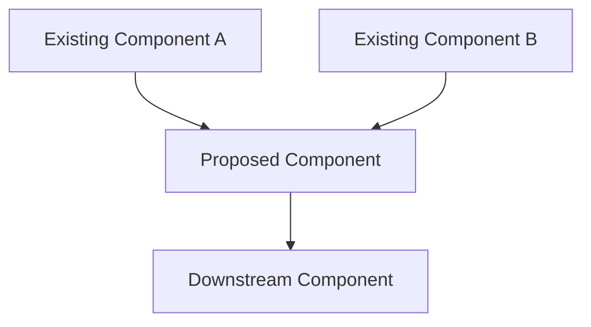
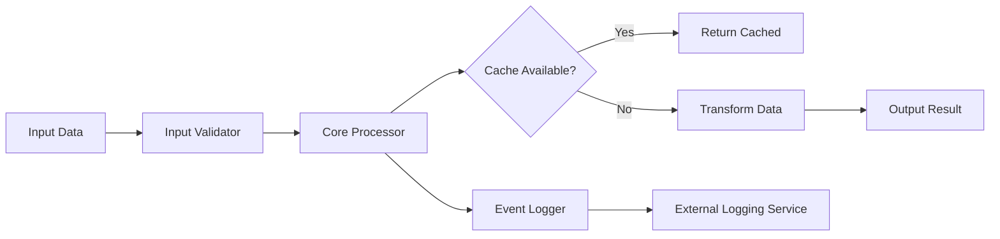
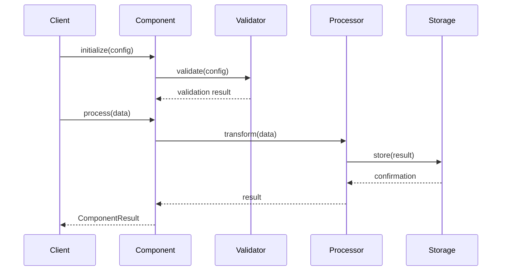

# Component Proposal: [Component Name]

> **Status**: Proposed | Draft | Under Review | Approved | Rejected
> **Author**: [Your Name/Team]
> **Date**: [YYYY-MM-DD]
> **Related Issue**: [Link to GitHub issue if applicable]

## Overview

### Purpose
[1-2 sentence description of what this component does and why it's needed]

### Problem Statement
[Describe the specific problem this component solves. What pain points does it address?]

### Scope
**In Scope:**
- [Feature/capability 1]
- [Feature/capability 2]
- [Feature/capability 3]

**Out of Scope:**
- [What this component will NOT do]
- [Future considerations]

### Relationship to Existing Components
[Describe how this component fits into the existing architecture]



## Type Definitions

### Core Types

```typescript
/**
 * Main configuration type for [Component Name]
 */
export type ComponentConfig = {
  /** Unique identifier for the component instance */
  id: string;

  /** Component-specific settings */
  settings: ComponentSettings;

  /** Optional callback handlers */
  handlers?: ComponentHandlers;
}

/**
 * Settings interface for component behavior
 */
export interface ComponentSettings {
  /** Enable/disable feature X */
  enableFeatureX: boolean;

  /** Timeout in milliseconds */
  timeout?: number;

  /** Additional options */
  options?: Record<string, unknown>;
}

/**
 * Event handlers for component lifecycle
 */
export type ComponentHandlers = {
  onSuccess?: (result: ComponentResult) => void;
  onError?: (error: Error) => void;
  onComplete?: () => void;
}

/**
 * Result type returned by the component
 */
export type ComponentResult = {
  /** Indicates success or failure */
  success: boolean;

  /** Result data payload */
  data: unknown;

  /** Metadata about the operation */
  metadata: {
    duration: number;
    timestamp: string;
  };
}
```

### Input/Output Types

| Type | Purpose | Required | Default |
|------|---------|----------|---------|
| `ComponentConfig` | Primary configuration | Yes | N/A |
| `ComponentSettings` | Behavioral settings | Yes | N/A |
| `ComponentHandlers` | Event callbacks | No | `undefined` |
| `ComponentResult` | Operation result | N/A (return type) | N/A |

## Architecture

### Component Diagram



### Data Flow



### Integration Points

| Integration Point | Component | Direction | Protocol |
|-------------------|-----------|-----------|----------|
| Input | `@slaops/client` | Inbound | Function call |
| Output | `@slaops/lib` | Outbound | Event emission |
| Storage | External DB | Bidirectional | HTTP/REST |
| Logging | `@slaops/core` | Outbound | Internal API |

## API Specification

### Exported Classes

```typescript
/**
 * Main component class
 */
export class ComponentName {
  constructor(config: ComponentConfig);

  /**
   * Initialize the component with configuration
   * @param config - Component configuration
   * @returns Promise that resolves when initialization is complete
   */
  initialize(config: ComponentConfig): Promise<void>;

  /**
   * Process data through the component
   * @param data - Input data to process
   * @returns Promise resolving to ComponentResult
   */
  process(data: unknown): Promise<ComponentResult>;

  /**
   * Clean up resources and shut down
   */
  shutdown(): Promise<void>;
}
```

### Exported Functions

```typescript
/**
 * Factory function to create component instance
 */
export function createComponent(
  config: ComponentConfig
): ComponentName;

/**
 * Utility function for validation
 */
export function validateInput(
  data: unknown
): data is ValidInputType;

/**
 * Helper function for common operations
 */
export function transformData(
  input: InputType,
  options?: TransformOptions
): OutputType;
```

### Usage Examples

#### Basic Usage

```typescript
import { createComponent } from '@slaops/new-component';

// Create and initialize
const component = createComponent({
  id: 'my-component-1',
  settings: {
    enableFeatureX: true,
    timeout: 5000,
  },
});

await component.initialize();

// Process data
const result = await component.process({
  /* input data */
});

console.log(result.success); // true
```

#### Advanced Usage with Handlers

```typescript
import { ComponentName } from '@slaops/new-component';

const component = new ComponentName({
  id: 'advanced-component',
  settings: {
    enableFeatureX: true,
  },
  handlers: {
    onSuccess: (result) => {
      console.log('Processing succeeded:', result);
    },
    onError: (error) => {
      console.error('Processing failed:', error);
    },
  },
});

await component.initialize();
await component.process(data);
await component.shutdown();
```

## Data Structures

### Configuration Schema

```json
{
  "id": "component-instance-1",
  "settings": {
    "enableFeatureX": true,
    "timeout": 5000,
    "options": {
      "retries": 3,
      "backoff": "exponential"
    }
  },
  "handlers": {
    "onSuccess": "[Function]",
    "onError": "[Function]"
  }
}
```

### Result Schema

```json
{
  "success": true,
  "data": {
    "processedItems": 150,
    "details": {
      "cached": 50,
      "transformed": 100
    }
  },
  "metadata": {
    "duration": 1234,
    "timestamp": "2024-11-16T10:30:00Z"
  }
}
```

### Field Specifications

| Field | Type | Required | Description | Validation |
|-------|------|----------|-------------|------------|
| `id` | string | Yes | Unique identifier | Non-empty, alphanumeric |
| `settings.enableFeatureX` | boolean | Yes | Toggle for feature X | true/false |
| `settings.timeout` | number | No | Timeout in ms | &gt; 0, &lt; 30000 |
| `settings.options` | object | No | Additional options | Valid JSON object |
| `handlers.onSuccess` | function | No | Success callback | Valid function |
| `handlers.onError` | function | No | Error callback | Valid function |

## Dependencies

### Internal Dependencies

| Package | Version | Purpose | Required |
|---------|---------|---------|----------|
| `@slaops/core` | `*` | Core types and utilities | Yes |
| `@slaops/lib` | `*` | Shared utilities | Yes |
| `@slaops/client` | `*` | Client integration | No |

### External Dependencies

| Package | Version | Purpose | License |
|---------|---------|---------|---------|
| `axios` | `^1.6.0` | HTTP client | MIT |
| `zod` | `^3.22.0` | Schema validation | MIT |
| `fast-json-stable-stringify` | `^2.1.0` | JSON serialization | MIT |

### Dependency Graph

```mermaid
graph TD
    Core[@slaops/core] --> NewComponent[@slaops/new-component]
    Lib[@slaops/lib] --> NewComponent
    Client[@slaops/client] -.optional.-> NewComponent

    Axios[axios] --> NewComponent
    Zod[zod] --> NewComponent
```

## Implementation Details

### Key Algorithms

#### Data Processing Algorithm

```text
FUNCTION process(data):
  // Step 1: Validate input
  IF NOT validateInput(data):
    THROW ValidationError

  // Step 2: Check cache
  cacheKey = generateCacheKey(data)
  IF cache.has(cacheKey):
    RETURN cache.get(cacheKey)

  // Step 3: Transform data
  transformed = transformData(data, settings.options)

  // Step 4: Process transformed data
  result = {
    success: true,
    data: transformed,
    metadata: {
      duration: calculateDuration(),
      timestamp: getCurrentTimestamp()
    }
  }

  // Step 5: Cache result
  cache.set(cacheKey, result)

  // Step 6: Emit events
  IF handlers.onSuccess:
    handlers.onSuccess(result)

  RETURN result
```

### Edge Cases

| Case | Condition | Handling | Expected Outcome |
|------|-----------|----------|------------------|
| Null input | `data === null` | Throw `ValidationError` | Error with message |
| Timeout exceeded | `duration > settings.timeout` | Abort and return partial | Partial result + warning |
| Cache miss | No cached entry | Process normally | Fresh result |
| Invalid config | Missing required fields | Throw at initialization | Initialization fails |
| Network error | External service down | Retry with backoff | Success or final error |

### Error Handling

```typescript
export class ComponentError extends Error {
  constructor(
    message: string,
    public code: string,
    public details?: unknown
  ) {
    super(message);
    this.name = 'ComponentError';
  }
}

// Error codes
export const ErrorCodes = {
  VALIDATION_FAILED: 'VALIDATION_FAILED',
  PROCESSING_FAILED: 'PROCESSING_FAILED',
  TIMEOUT: 'TIMEOUT',
  NETWORK_ERROR: 'NETWORK_ERROR',
} as const;
```

### Performance Considerations

- **Caching**: LRU cache with configurable max size (default: 1000 entries)
- **Memory**: Estimated 50MB for typical workload (10k items)
- **Latency**: Target < 100ms for cached, < 500ms for non-cached
- **Throughput**: Target 1000 requests/second

## Integration Guide

### Installation

```bash
# Using pnpm (recommended)
pnpm add @slaops/new-component

# Using npm
npm install @slaops/new-component

# Using yarn
yarn add @slaops/new-component
```

### Configuration Options

| Option | Type | Default | Description |
|--------|------|---------|-------------|
| `id` | string | (required) | Unique component identifier |
| `enableFeatureX` | boolean | `false` | Enable experimental feature X |
| `timeout` | number | `10000` | Request timeout in milliseconds |
| `maxRetries` | number | `3` | Maximum retry attempts |
| `cacheSize` | number | `1000` | Maximum cache entries |
| `logLevel` | string | `'info'` | Logging verbosity |

### Environment Variables

| Variable | Required | Default | Description |
|----------|----------|---------|-------------|
| `COMPONENT_ENDPOINT` | No | `'http://localhost:3000'` | API endpoint URL |
| `COMPONENT_API_KEY` | Yes | N/A | Authentication key |
| `COMPONENT_TIMEOUT` | No | `10000` | Global timeout override |

### Migration Guide

If replacing an existing component:

```typescript
// OLD APPROACH
import { OldComponent } from '@slaops/old';
const old = new OldComponent(config);

// NEW APPROACH
import { createComponent } from '@slaops/new-component';
const component = createComponent({
  id: config.id,
  settings: {
    enableFeatureX: config.featureX,
    timeout: config.timeout,
  },
});
```

## Testing Strategy

### Unit Tests

| Test Case | Input | Expected Output | Priority |
|-----------|-------|-----------------|----------|
| Valid configuration | Complete config object | Component initialized | High |
| Missing required field | Config without `id` | Throw error | High |
| Successful processing | Valid data | `{ success: true, ... }` | High |
| Invalid input | `null` data | Throw `ValidationError` | High |
| Timeout handling | Long-running operation | Abort with timeout error | Medium |
| Cache hit | Previously processed data | Cached result | Medium |
| Cache miss | New data | Fresh result | Medium |
| Handler invocation | Valid result | Handlers called correctly | Low |

### Integration Tests

- Test with `@slaops/client` integration
- Test with external API endpoint
- Test error recovery scenarios
- Test concurrent requests handling

### Performance Tests

- Benchmark processing 10k items
- Memory leak detection (long-running scenarios)
- Cache effectiveness measurement
- Concurrent request load testing

### Test Coverage Target

- **Unit tests**: 90%+ coverage
- **Integration tests**: Critical paths covered
- **E2E tests**: At least 1 full workflow

## Build Configuration

### Package Configuration

```json
{
  "name": "@slaops/new-component",
  "version": "0.1.0",
  "type": "module",
  "main": "./dist/index.cjs",
  "module": "./dist/index.js",
  "types": "./dist/index.d.ts",
  "exports": {
    ".": {
      "import": "./dist/index.js",
      "require": "./dist/index.cjs",
      "types": "./dist/index.d.ts"
    }
  }
}
```

### Build Script

```bash
# Using tsup
tsup src/index.ts --format esm,cjs --dts --clean
```

### Build Order

If this component depends on other workspace packages:

```mermaid
graph LR
    A[@slaops/core] --> B[@slaops/lib]
    B --> C[@slaops/new-component]
```

Build order: `core` → `lib` → `new-component`

## Documentation Requirements

### Required Documentation

- [ ] README.md with quickstart guide
- [ ] API reference (auto-generated from TSDoc)
- [ ] Usage examples in docs site
- [ ] Migration guide (if replacing existing)
- [ ] CHANGELOG.md

### Code Documentation

- [ ] TSDoc comments on all exported types
- [ ] TSDoc comments on all public methods
- [ ] Inline comments for complex logic
- [ ] Usage examples in JSDoc

## Rollout Plan

### Phase 1: Development (Week 1-2)
- [ ] Implement core functionality
- [ ] Write unit tests
- [ ] Internal code review

### Phase 2: Testing (Week 3)
- [ ] Integration testing
- [ ] Performance testing
- [ ] Documentation review

### Phase 3: Beta (Week 4)
- [ ] Deploy to staging
- [ ] Limited beta testing
- [ ] Gather feedback

### Phase 4: Release (Week 5)
- [ ] Production deployment
- [ ] Documentation publish
- [ ] Announcement

## Open Questions

- [ ] Question 1: [Specific question that needs answering]
- [ ] Question 2: [Technical decision pending review]
- [ ] Question 3: [Clarification needed on requirements]

## Alternatives Considered

### Alternative 1: [Name]
**Pros:**
- [Advantage 1]
- [Advantage 2]

**Cons:**
- [Disadvantage 1]
- [Disadvantage 2]

**Why not chosen:** [Reason]

### Alternative 2: [Name]
**Pros:**
- [Advantage 1]

**Cons:**
- [Disadvantage 1]

**Why not chosen:** [Reason]

## References

- [Related documentation link]
- [External specification or RFC]
- [Similar implementations in other projects]
- [Relevant GitHub issues]

## Approval

- [ ] Technical Lead: _______________
- [ ] Architect: _______________
- [ ] Product Owner: _______________
- [ ] Date Approved: _______________

---

**Template Version**: 1.0
**Last Updated**: 2024-11-16
