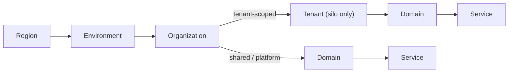

# Derrops Guide to Naming Conventions and Segregation

:::tip[Implementation]
The conventions described in this guide are implemented as a TypeScript library in the [`@derrops-conventions`](https://github.com/derrops/derrops-platform/tree/main/packages/derrops-conventions) package. See the [cheatsheet](/blog/derrops-naming-sheet) for a per-service quick reference.
:::

I've been meaning to make this guide, having worked at a SAAS from the very get-go, I've now got to live with some good and some bad decisions. It's been very hard to pinpoint why the naming conventions have lead to complexity. And overtime I realized that with engineering, you often make decisions based on the tradeoffs, but ultimately you do optimize for something. If you don't figure out what that something should be, you end having a solution which is not optimized for the problem you are trying to solve.

Living with a SAAS for many years now start to finish, what I ended up finding that these conventions are more important than I initially thought, and have ramifications in many different areas:

| Area              | Description                                                                                                       | Justification                                                                                                                               |
| ----------------- | ----------------------------------------------------------------------------------------------------------------- | ------------------------------------------------------------------------------------------------------------------------------------------- |
| _Cost_            | Ability to optimize, track, and control spend across environments, services, or resources.                        | Consistent naming and segregation make it easier to accurately allocate and monitor resource usage by environment, service, or team.        |
| _Security_        | How easily you can enforce and audit security boundaries and practices.                                           | Segregation and clear naming provide obvious boundaries for applying Least Privilege, monitoring access, and investigating incidents.       |
| _Complexity_      | The overhead and cognitive load of understanding and managing environments and resources.                         | Predictable conventions reduce ambiguity and make it simpler for everyone to locate, manage, and reason about resources.                    |
| _Maintainability_ | How straightforward it is to update, refactor, or scale your environments and naming conventions.                 | Uniform conventions mean changes can be made systematically, minimizing the risk of errors and excessive rework.                            |
| _Scalability_     | Ability to grow the number of services, accounts, or environments without hitting convention or collision issues. | Good conventions prevent collisions and manual workarounds as your organization and environments scale.                                     |
| _Usability_       | How easy naming and segregation is for engineers and consumers to work with daily.                                | Easy-to-understand resource names speed up onboarding and reduce misconfiguration by new and experienced engineers alike.                   |
| _Performance_     | Influence of structure/naming on ability to optimize for latency, throughput, or efficiency.                      | Logical segregation enables more effective resource grouping, which can positively impact locality, caching, or policy-based optimizations. |
| _Reliability_     | Impact on operational stability, incident response, and minimizing blast radius of issues.                        | Separation by environment/service/domain helps contain failures and allows more targeted incident response.                                 |
| _Availability_    | Affect on uptime or redundancy due to naming/segregation conventions.                                             | Clear segregation facilitates independent deployments and failover, increasing uptime and resilience.                                       |
| _Compliance_      | Helps enforce regulatory, audit, and governance requirements more easily.                                         | Accurate, well-segregated naming enables easier reporting, automated policy enforcement, and audit compliance.                              |

These areas can all be condensed into the following guiding principals

# Guiding Principles

## 1. Naming Consistency Principle

**Definition:**  
A given resource should have the _same name_ in every environment—whether it’s `dev`, `prod`, or any other. For example, a resource called `user-service` should be named `user-service` in all environments, rather than `user-service-dev` or `user-service-prod`. Environment must be represented by namespace isolation, not naming convention.

**Why it matters:**  
Consistent resource names dramatically simplify the process of grouping, querying, and managing deployment instances across various tools and platforms. It helps reduce cognitive load and operational complexity, especially as your infrastructure grows.

:::note
Globally unique name, such as with an s3 bucket, it can be that another customer on AWS takes the name of an S3 bucket that you had planned. One solution to this is including a random id within the name. But in general I've found this scenario rare, and losing predictability in the name which can lead to negative outcomes
:::

:::note
Global services such as IAM which are global also may cause conflicts if you were to have more than 1 environment in an account **Prefer Account per Environment if Possible**
:::

---

## 2. Naming Stability Principle

**Definition:**  
Prioritize naming conventions that minimize how often resource names need to change over the lifetime of your systems. Choose prefixes or structures for your names that are unlikely to require revision as your organization and requirements evolve.

**Why it matters:**  
Stable naming reduces refactoring, lowers risk of errors, and leads to smoother automation and scaling. The fewer changes needed, the more reliable and maintainable your environment will be in the long run.
You'll also find that following this principal results in a better security posture, more on that later.

# Segregation Strategy

Segregation needs to be done in a strategic way. Resources segregated differently can lead to drastically different outcomes. Following a consistent pattern for `Segregation and Naming Conventions` can lead ot many different benefits:

- To avoid naming collisions
- To reduce complexity by not adding unnecessary naming conventions to resources.
- To make it easy to group resources across environments together. This is useful in filtering duplicates for security findings, as having different names for the same resources adds complexity to the queries needed
- Easier to automate as resources are easier to target across different environments as they are named in a predictable way.
- Within an environment, segregating services and organizations sharing an environment increases your security posture, as the prefixes can be used to scope access to resources and create access boundaries

## Account Segregation

How you segregate your account will determine your name space, and therefore will affect your naming conventions. When creating accounts, modern patters would be to have 1 per region and environment, but there may be cases where you take a different approach again because of other factors related to: (*Cost&, *Compliance*, *Security\*, etc).
But do challenge this decision if you do not segregate, as there is now especially strong multi-account support in Cloud Providers such as AWS.

> In general the more you segregate, the less likely you'll have naming collisions.

| Segment     | Name       | Description                                                                                                                        |
| ----------- | ---------- | ---------------------------------------------------------------------------------------------------------------------------------- |
| Region      | `{region}` | If you don't segregate your Account by region, you will need to have `{region}` in the name of the resource to avoid collisions.   |
| Environment | `{env}`    | If you don't segregate your Account by environment, you will need to have `{env}` in the name of the resource to avoid collisions. |

:::tip
Operationally if `Deployment Instances` have different names, it can create severe complexity when trying to groups those instances together in different DevOps tools and products. I've experienced this first hand when sifting through findings in AWS Security Hub. Just when you find a way within a given tool to group these resources and solve this, as your organization grows and adopts new tools you find yourself being faced with this issue again and again for every tool you use.
:::

:::note
Consider comparing 2 x Lambda functions `foobar`, in 2 different environments `dev` and `prod`.
If the Deployment Instances have different names, your query will need to have an OR clause to include both, `foobar-dev` or `foobar-prod` and then also have the group by environment anyway. Whereas if they have the same name, there is no need for a clause on the name. Excluding environment reduces the mental load in many different scenarios.
:::

## Prefixing

### Segregation Hierarchy

Within an org, there are two distinct namespace types. Resources are either **tenant-scoped** (belonging to a specific tenant's isolated infrastructure) or **shared/platform** (owned by the org itself, serving all tenants or internal operations). These follow different paths through the hierarchy:



Shared/platform resources follow the standard `/{org}/{domain}/{service}/{key}` path with no tenant segment. Tenant-scoped resources insert `{tenant}` between `{org}` and `{domain}`. These are different namespaces within the same org — there is no ambiguity because the presence or absence of a valid tenant ID in that position distinguishes them.

:::note
`{tenant}` only appears in the hierarchy when using a **silo tenancy model** (per-tenant isolated infrastructure). In a **pool model** (shared infrastructure, application-level isolation), tenant does not appear in resource names — it lives in data partition keys or application-level identifiers only.
:::

### Prefix Structure

Structuring your names correctly is key to the success of your naming conventions.

If your config store is **NOT** located in the same namespace as the resource, you will have to have `{env}` in your naming conventions. It's challenging where to put `{env}`, as there are tradeoffs
Also note if your config store is **NOT** in the same `{region}`, then you will need to have `{region}` in your naming conventions.

## Segment Definitions

| Segment       | Example               | Description                                                                                                                                                                                                                                                                                                                                                                                                                                                                                                                                                                                                                                                                                                                                            |
| ------------- | --------------------- | ------------------------------------------------------------------------------------------------------------------------------------------------------------------------------------------------------------------------------------------------------------------------------------------------------------------------------------------------------------------------------------------------------------------------------------------------------------------------------------------------------------------------------------------------------------------------------------------------------------------------------------------------------------------------------------------------------------------------------------------------------ |
| `{region}`    | ap-southeast-2        | _(Optional if platform will be multi-region)_ The region of the deployment. This may be required if you are not going to segregate your regions by accounts, then there will be conflicts as some services are global (AWS IAM) or share the same namespace (such as S3 Buckets which must be unique across all regions). Deciding to have different accounts for different regions mitigates this issue, but this decision can sometimes be taking other factors into account than this guide. Note this is the Datacenter Region (e.g. ap-southeast-2), not the country itself.                                                                                                                                                                      |
| `{env}`       | dev                   | _(Only if Required)_ The deployment environment. Only required in the prefix, when the config key lives in a different namespace than the resource accessing it. If your config is stored in the same account or namespace as the resource, this segment is redundant and should be omitted. However if a globally unique name is required, such as with an s3 bucket, this this will be required in the prefix.                                                                                                                                                                                                                                                                                                                                       |
| `{org}`       | acme                  | The top-level organizational boundary. Provides hard namespace isolation. Chosen to be stable and long-lived—changes are rare and treated as a migration event.                                                                                                                                                                                                                                                                                                                                                                                                                                                                                                                                                                                        |
| `{tenant}`    | t-a3f8b2              | _(Silo model only)_ An opaque, stable identifier for an isolated tenant. Represents a deployment scope boundary within the org's infrastructure. Always an **ID**, never a human-readable name — see [Multi-Tenancy](#multi-tenancy) below.                                                                                                                                                                                                                                                                                                                                                                                                                                                                                                            |
| `{domain}`    | payments              | A bounded business or technical capability that can be owned and reasoned about independently. More stable than a team name, more meaningful than a platform label.                                                                                                                                                                                                                                                                                                                                                                                                                                                                                                                                                                                    |
| `{service}`   | checkout-api          | The concrete, deployable unit within a domain. Specific enough to be unambiguous, broad enough to own multiple configuration values beneath it.                                                                                                                                                                                                                                                                                                                                                                                                                                                                                                                                                                                                        |
| `{partition}` | 2024/01/15/14         | _(Optional — data partitioning only)_ A runtime-determined subdivision used to group high-volume data into discrete, filterable sets. Most common in data storage contexts such as S3 log or event data. `{partition}` is the **only** segment permitted to contain internal hierarchical delimiters — a single partition can represent multiple levels of granularity (e.g. `{year}/{month}/{day}/{hour}`), each of which remains a valid, queryable prefix boundary. All other segments must be flat and contain no internal delimiters. Not applicable to config stores or resource naming.                                                                                                                                                         |
| `{key}`       | stripe-webhook-secret | The final, addressable artifact. Everything above it is context and namespace — `{key}` is the specific thing being referenced. The form varies by system: a config parameter name (`stripe-webhook-secret`), a filename (`transactions.json`), or an image tag (`1.2.3`) — but the concept is always the same: it uniquely identifies the artifact within its namespace. A new segment is only warranted when it creates a meaningful operational boundary — a prefix you would independently query. System-generated uniqueness suffixes (e.g. sequence numbers appended by parallel writers like Kinesis Firehose or Spark) do not qualify; they carry no business meaning and are simply part of `{key}`, but do not make up part of the identity. |

## Segment Order

It is sometimes said:

> Good architecture makes change easy. Bad architecture makes change hard.

Therefore in this decision we should optimize for making `Change Easy`, which would dictate the

> stability should decrease left to right in a prefix

- Changing leftmost segments causes the greatest disruption.
- Renaming service only affects its subtree.

Therefore it makes sense the order of the segments should be the most stable to the least stable:

## Segment Stability

| Segment       | Question                      | Stability             | Scope Boundary                   | Stability                                                                                                                                        |
| ------------- | ----------------------------- | --------------------- | -------------------------------- | ------------------------------------------------------------------------------------------------------------------------------------------------ |
| `{region}`    | **Where** in the world?       | Extremely High        | Infrastructure locality boundary | for all intensive purposes will never change                                                                                                     |
| `{env}`       | **Which** deployment stage?   | Extremely High        | Deployment lifecycle boundary    | for all intensive purposes will never change                                                                                                     |
| `{org}`       | **Who** owns the resource?    | Very High             | Ownership boundary               | changes almost never, unless re-org                                                                                                              |
| `{tenant}`    | **Which** isolated tenant?    | High _(Silo only)_    | Tenant deployment boundary       | stable for the lifetime of the tenant; removal = offboarding event. Use opaque ID, not name.                                                     |
| `{domain}`    | **What** business capability? | High                  | Capability boundary              | changes rarely, capabilities outlive teams, only if domain is modelled differently and refactored                                                |
| `{service}`   | **Which** deployable unit?    | Medium                | Deployment unit boundary         | changes occasionally, deployable units get renamed, split or merged                                                                              |
| `{partition}` | **How** is data subdivided?   | Very Low _(Optional)_ | Data partitioning boundary       | changes constantly; new values generated at runtime (e.g. a new date partition every day). Only relevant for data storage — omit everywhere else |
| `{key}`       | **What** configuration value? | Low                   | Configuration/value boundary     | changes most frequently                                                                                                                          |

### Why region and env precede org

Region and env might appear to be optional modifiers — in the preferred account-segregated case they are dropped entirely. But when they do appear, it is because the name must function across a global or cross-account namespace where the physical and lifecycle boundaries are not already provided structurally. In that context, region and env are not describing the resource — they are _scoping_ it: in this physical location, at this lifecycle stage, owned by this org.

The hierarchy flows from physical space to logical identity:

- `{region}` — **where** in the world (infrastructure locality)
- `{env}` — **which** lifecycle stage (deployment boundary)
- `{org}` — **who** owns it (logical identity)

This mirrors how AWS constructs global resource identity. When a name must be unique across the entire AWS global namespace — an S3 bucket, a CloudFront alias — the broadest physical scoping dimensions come first. A bucket named `ap-southeast-2--prod--acme--payments--...` is unambiguous without any other context: it tells you exactly which physical, lifecycle, and organisational boundary it belongs to, in that order.

There is also a practical asymmetry in cardinality: the set of AWS regions is bounded and fixed; the set of deployment environments is small and bounded. They make cheap, maximally-discriminating prefixes. Org names are stable, but they carry business semantics — scoping with infrastructure dimensions first pushes the org identifier deeper into the hierarchy where it belongs.

When the surrounding system already provides the region and env boundary — an AWS account (SSM, IAM), the S3 bucket name — those segments are redundant within the path and are omitted. `{org}` leads because it is the leftmost _required_ segment within that context. This is why SSM parameters, S3 object keys, and IAM paths all start at `{org}` directly: the namespace they live in already encodes the physical and lifecycle scope.

### Fully Qualified Examples

| Example                                     | Value                                                                   |
| ------------------------------------------- | ----------------------------------------------------------------------- |
| Hierarchical (config stores)                | `/ap-southeast-2/prod/acme/payments/checkout-api/stripe-webhook-secret` |
| Compound kebab-case (resource names)        | `/ap-southeast-2/prod/acme/payments/checkout-api/stripe-webhook-secret` |
| Account-segregated (preferred):             | `acme--payments--checkout-api--stripe-webhook-secret`                   |
| Data storage with partition (S3 object key) | `acme/payments/checkout-api/2024-01-15/transactions.json`               |

### Delimiters

Now that we have segments, and their order, we need to decide on the delimiters to use.
Here are some possible candidates evaluated over different resource types.
You'll see that the `-` is most supported. `_` is a strong candidate but fails when it comes to host names and S3 bucket names.

**Possible Candidates for Delimiters:**
| Delimiter | Hostname | AWS Stack Name (CloudFormation) | URL Path | S3 Bucket Name | Safe Across ALL? | Notes |
| ------------------ | -------- | ------------------------------- | ------------- | ---------------------------- | ---------------- | --------------------------------------------------- |
| `-` hyphen | ✅ Yes | ✅ Yes | ✅ Yes | ✅ Yes | ⭐ Yes (BEST) | Universal standard. Recommended everywhere. |
| `_` underscore | ❌ No | ✅ Yes | ✅ Yes | ❌ No | ❌ No | Breaks hostname and S3 bucket compatibility |
| `.` dot | ✅ Yes | ✅ Yes | ✅ Yes | ✅ Yes (with caveats) | ⚠️ Conditional | Breaks TLS wildcard matching, avoid in bucket names |
| `/` slash | ❌ No | ❌ No | ✅ Yes | ❌ No (delimiter only in key) | ❌ No | Only valid as URL path separator |
| space | ❌ No | ❌ No | ❌ Encoded | ❌ No | ❌ No | Never use |
| `--` double hyphen | ✅ Yes | ✅ Yes | ✅ Yes | ✅ Yes | ⭐ Yes | Common and safe variant |

There are different types of delimiters. Sometimes we are representing differences between the different segments of the prefix, other times we are representing differences between the different words with the same segment.
Therefore we need a delimiter for each case.
As `-` is the only supported delimiter for all resource types, including another is not ideal because it will reduce the resources types which can follow that convention. Instead the `--` is used to delimit between the different segments of the prefix, and a `-` is used to delimit between the different words with the same segment.

| Naming Convention     | Priority | Resource Type | Delimiter | Word Delimiter | Description                                                                                                           | Example                              |
| --------------------- | -------- | ------------- | --------- | -------------- | --------------------------------------------------------------------------------------------------------------------- | ------------------------------------ |
| _hierarchical-case_   | 1        | Config Keys   | `/`       | `-`            | Hierarchical naming convention using a path-style namespace, useful for configuration keys.                           | `/acme/store/checkout/api-key`       |
| _compound kebab-case_ | 2        | Resource IDs  | `--`      | `-`            | Kebab-case is URL and code friendly; more acceptable than underscores for most services, especially for resource IDs. | `acme--store--checkout--api-feature` |

- Often `1` is not possible as a name (for example IAC solutions such as AWS Cloudformation)
- `-` is preferred over `_` as it is more URL friendly (can appear in the host name where as underscore cannot).
- `--` whilst this doesn't look the most pleasing to the eye, it is more URL friendly and distinguishes between the hierarchial delimiters and word delimiters.
- other tools will not use `--` as a delimiter, so using it as a delimiter in the prefix for a key will not be compatible with other tools.

### Native Delimiters

:::note
If a resource already has native support for a delimiter, it should be used instead of the `--` delimiter, such as `/` in AWS S3, for storing objects. Otherwise you would lose functionality such as using the `prefix` to filter objects in a bucket.
:::

:::note
An exception to this rule might be when you plan on centralizing data collection, and you want all data to be stored in a single location. You may want to preemptively segregate the data in each environment already, even though there will be only 1 segment, to simplify the sync operation.
:::

:::note
We will assume going forward there is only 1 region, so there is no need for segregation by region, but if there wasn't, region would need to be included in the prefix
:::

**Full example:**

1.  `/{org}/{domain}/{service}/{key}` => `/acme/payments/checkout-api/stripe-webhook-secret`
2.  `{org}--{domain}--{service}--{key}` => `acme--payments--checkout-api--stripe-webhook-secret`

## Rational for Convention

#### Every prefix is a meaningful operational boundary

**Account-segregated (preferred) — config store:**

| Prefix                                              | Boundary   | Example Operation                                   |
| --------------------------------------------------- | ---------- | --------------------------------------------------- |
| `/acme/*`                                           | Entire org | Audit all config across the org                     |
| `/acme/payments/*`                                  | Domain     | Grant the payments team read access to their config |
| `/acme/payments/checkout-api/*`                     | Service    | Fetch all config for a service on startup           |
| `/acme/payments/checkout-api/stripe-webhook-secret` | Value      | Read a specific secret                              |

**Account-segregated — data storage with partition (e.g. S3 log data):**

| Prefix                                                             | Boundary          | Example Operation                            |
| ------------------------------------------------------------------ | ----------------- | -------------------------------------------- |
| `acme/`                                                            | Entire org        | Replicate all org data to a central bucket   |
| `acme/payments/`                                                   | Domain            | Process all events owned by payments         |
| `acme/payments/checkout-api/`                                      | Service           | Backfill or reprocess all logs for a service |
| `acme/payments/checkout-api/2024/`                                 | Partition — year  | Archive or aggregate a full year of data     |
| `acme/payments/checkout-api/2024/01/`                              | Partition — month | Load a month's data into a warehouse         |
| `acme/payments/checkout-api/2024/01/15/`                           | Partition — day   | Replay a day's events or run a daily job     |
| `acme/payments/checkout-api/2024/01/15/14/`                        | Partition — hour  | Download all log data for a specific hour    |
| `acme/payments/checkout-api/2024/01/15/14/transactions-00001.json` | Value             | Fetch a specific log file                    |

**Non-account-segregated — env and region included:**

| Prefix                                                                  | Boundary    | Example Operation                          |
| ----------------------------------------------------------------------- | ----------- | ------------------------------------------ |
| `/ap-southeast-2/*`                                                     | Region      | List all resources in a region             |
| `/ap-southeast-2/prod/*`                                                | Environment | Audit all production config                |
| `/ap-southeast-2/prod/acme/*`                                           | Org         | Fetch all org config in that env           |
| `/ap-southeast-2/prod/acme/payments/*`                                  | Domain      | Grant payments access to their prod config |
| `/ap-southeast-2/prod/acme/payments/checkout-api/*`                     | Service     | Fetch all config for a service on startup  |
| `/ap-southeast-2/prod/acme/payments/checkout-api/stripe-webhook-secret` | Value       | Read a specific secret                     |

## Segment Definitions

### Region

The region identifies the physical or logical infrastructure region where the deployment instance resides.

Examples:

- ap-southeast-2
- us-east-1
- eu-west-1

### Org

The org identifies the top-level organizational boundary. Which department owns the resource.
:::note
Not the team itself as teams can change more frequently than the org itself, otherwise this becomes too unstable to use as a namespace boundary.
:::

### Domain

- Encodes business capability rather than org structure — capabilities are far more stable than teams or products over time
- Well understood in modern engineering culture thanks to DDD, Team Topologies, and microservices discourse
- Naturally guides correct usage — engineers intuitively know whether something belongs to payments or identity
- Aligns with how most mature orgs already think about their architecture, even if they don't use the word

### Service

The service represents the concrete deployable unit. This is the actual runtime component which is typically the primary identity engineers interact with..

Examples:

- checkout-api
- auth-service
- webhook-worker
- billing-scheduler

Deployment Units could be in the form of:

- Lambda function
- Microservice

## Key

The key identifies a specific configuration value, secret, resource, or parameter belonging to a service.
Represents the exact value being referenced.
Everything to the left provides context.

- Created
- Deleted
- Renamed
- Rotated

:::note
Optional: This principal, when dogmatically applied may mean that you segregate data in an environment, even when there will only be 1 segment, to simplify the sync operation to a central location later.
As the end destination will need to be segmented, but the source data not necessarily.
But by segregating the data in the source we achieve this principle.

This contradicts another principle in guiding how to segregate data, which would say if you only were going to have 1 segment, you should not segregate the data in the first place. But if you can see the future, and you know that you are going to combine data together, then you are best off already pre-paring for this scenario so it doesn't hit you later.
:::

## Multi-Tenancy

In a multi-tenant SaaS, a **customer** is the business entity purchasing your service. A customer may own one or more **tenants** — isolated deployment or data units. At the infrastructure level, the resource granularity is the tenant, not the customer. `{customer}` must never appear in resource naming; only `{tenant}` is relevant.

### Tenancy Models

| Model    | Description                                                                                             | `{tenant}` in resource names?                                 |
| -------- | ------------------------------------------------------------------------------------------------------- | ------------------------------------------------------------- |
| **Silo** | Each tenant gets isolated infrastructure (dedicated account, VPC, or resource set)                      | ✅ Yes — tenant is a namespace boundary                       |
| **Pool** | Tenants share infrastructure; isolation is application-level (row-level security, partition keys, etc.) | ❌ No — tenant appears only in data keys or application logic |

Most SaaS products start pool and move toward silo for high-value or compliance-sensitive tenants. Your naming convention should accommodate the silo case when it arises.

### Why an Opaque ID, Not a Human-Readable Name

Using a predictable tenant name (e.g., `bigcorp`) in a globally unique namespace (S3 bucket, CloudFront alias, ACM certificate) creates a **namespace squatting vulnerability**: a bad actor who learns your naming convention can pre-register `ap-southeast-2--prod--acme--bigcorp--data` before you onboard that tenant, causing your provisioning to fail.

Using an opaque tenant ID mitigates this:

| Concern                      | Slug `bigcorp`                   | Opaque ID `t-a3f8b2` |
| ---------------------------- | -------------------------------- | -------------------- |
| Squattable                   | ✅ Predictable from company name | ❌ Not guessable     |
| Stable if tenant rebrands    | ❌ Must rename all resources     | ✅ ID is unchanged   |
| Reveals business information | ✅ Competitor intel              | ❌ Opaque            |
| Usable in all resource types | ✅                               | ✅                   |

:::tip
Keep a **tenant registry** (e.g., DynamoDB or SSM) that maps tenant IDs to human-readable names. Engineers work with the registry, infrastructure uses the ID. This separates operational clarity from naming stability.
:::

:::note
For account-scoped resources (where the account is already the uniqueness boundary), a human-readable slug is lower risk — the account itself prevents external squatting. However, using the opaque ID consistently everywhere removes the need for this distinction and simplifies conventions.
:::

### ID Format

Tenant IDs should be:

- **Short** — long enough to avoid collisions within your tenant population; a 6–8 character alphanumeric suffix is sufficient for most SaaS businesses
- **Non-sequential** — sequential IDs (t-000001) reveal tenant count and order to any observer
- **Stable** — generated once at tenant creation and never changed
- **Lowercase alphanumeric with a typed prefix** — e.g., `t-a3f8b2`, avoiding characters that break naming conventions

Avoid UUIDs in resource names — they are 36 characters and make names unwieldy. Generate a short ID at onboarding and store the mapping.

### Placement Decision: Tenant-First vs Tenant-Second-Last

The position of `{tenant}` in the hierarchy is a fundamental architectural decision. It is not just a naming preference — it encodes the relationship between tenant and service, determines which operational queries are expressible as a single prefix, and shapes your IAM security model.

Two placements are viable:

| Placement              | Structure                                  | Architectural meaning                                                                             |
| ---------------------- | ------------------------------------------ | ------------------------------------------------------------------------------------------------- |
| **Tenant-first**       | `/{org}/{tenant}/{domain}/{service}/{key}` | Tenant _contains_ service instances. Each tenant has its own isolated deployment of each service. |
| **Tenant-second-last** | `/{org}/{domain}/{service}/{tenant}/{key}` | Service _contains_ tenant data. One shared deployment partitions data by tenant.                  |

---

#### Tenant-First: `/{org}/{tenant}/{domain}/{service}/{key}`

The org's namespace splits into two tracks — resources belong to either a specific tenant or the shared platform:

**Tenant-scoped resources** (silo model):

```
/{org}/{tenant}/{domain}/{service}/{key}
/acme/t-a3f8b2/payments/checkout-api/stripe-webhook-secret
```

**Shared/platform resources** (no tenant segment):

```
/{org}/{domain}/{service}/{key}
/acme/platform/billing-aggregator/stripe-api-key
/acme/identity/auth-service/jwt-public-key
```

Compound kebab equivalents:

```
acme--t-a3f8b2--payments--checkout-api--stripe-webhook-secret   (tenant-scoped)
acme--platform--billing-aggregator--stripe-api-key              (shared)
```

**What you gain:**

| Query                                | Prefix                                                               |
| ------------------------------------ | -------------------------------------------------------------------- |
| Everything for tenant X              | `/acme/t-a3f8b2/*`                                                   |
| All payments config for tenant X     | `/acme/t-a3f8b2/payments/*`                                          |
| All checkout-api config for tenant X | `/acme/t-a3f8b2/payments/checkout-api/*`                             |
| All shared/platform resources        | `/acme/platform/*`                                                   |
| IAM scope to tenant X                | Single prefix condition: `arn:aws:ssm:*:*:parameter/acme/t-a3f8b2/*` |
| Offboard tenant X                    | Delete one prefix tree                                               |

The primary operational axis in a silo is the tenant. Provisioning, billing, incident response, and offboarding all start with "for tenant X". Tenant-first makes every one of those a single prefix operation.

**What you lose:**

Cross-tenant prefix queries are not possible. A billing aggregator cannot express "all checkout-api transactions across all tenants" as a single prefix. It must enumerate tenants from a registry and assume a role per tenant.

**The security framing:**

This constraint is intentional in a silo architecture. A wildcard across the tenant position — `/acme/*/payments/*` — would silently grant access to every current and future tenant onboarded. Making this impossible as a prefix forces cross-tenant access to be explicit, enumerated, and auditable:

```
billing-aggregator assumes role → /acme/t-a3f8b2/* → reads tenant A
billing-aggregator assumes role → /acme/t-9c1d44/* → reads tenant B
```

Each assumption is separately logged. No future tenant is silently included. The naming convention enforces the right model by making the wrong model inexpressible.

**Push vs Pull: the architectural pattern that resolves the constraint**

The cross-tenant constraint only bites if cross-tenant services are designed to _pull_ data from tenant namespaces. Well-designed silo systems avoid this by inverting the flow: tenant services _push_ data to a shared aggregation layer, and cross-tenant services read from there.

**Pull model** — the aggregator reaches into tenant namespaces:

```
billing-aggregator → pulls from /acme/t-a3f8b2/payments/checkout-api/billing-events
billing-aggregator → pulls from /acme/t-9c1d44/payments/checkout-api/billing-events
billing-aggregator → pulls from /acme/t-ff1234/payments/checkout-api/billing-events
```

This requires the aggregator to have read permissions into every tenant namespace. It must enumerate tenants, assume roles, and query each independently. It also means the aggregator has broad access into tenant data — a cross-tenant permission that grows with every new tenant onboarded. Beyond the operational friction, this design means **the billing service is crossing tenant boundaries**, which is the violation that silo isolation is meant to prevent.

**Push model** — each tenant's service publishes outward to a shared bus:

```
/acme/t-a3f8b2/payments/checkout-api  →  publishes billing event  →  shared EventBridge bus
/acme/t-9c1d44/payments/checkout-api  →  publishes billing event  →  shared EventBridge bus
/acme/t-ff1234/payments/checkout-api  →  publishes billing event  →  shared EventBridge bus

billing-aggregator  →  reads from shared EventBridge bus (no tenant namespace access needed)
```

The billing aggregator lives in the shared/platform namespace and has permissions only to the shared bus. It never touches a tenant namespace. Each tenant's service pushes only its own data — it does not need cross-tenant permissions either. Tenant isolation is preserved in both directions.

This is why the push model is architecturally superior beyond just resolving the naming tension: it means no service ever needs cross-tenant read access. The data flows out of tenants; nothing flows in from outside.

| Aspect                              | Pull model                                    | Push model                                 |
| ----------------------------------- | --------------------------------------------- | ------------------------------------------ |
| Aggregator permissions              | Read access into every tenant namespace       | Read access to shared bus only             |
| Tenant boundary                     | Aggregator crosses it                         | Tenant boundary intact                     |
| New tenant onboarding               | Must grant aggregator access to new namespace | New tenant publishes to same shared bus    |
| Audit trail                         | Aggregator access logged per tenant           | Each tenant's outbound publish logged      |
| Compatible with tenant-first naming | Requires role enumeration                     | ✅ No cross-tenant namespace access needed |

The push model also means the inability to wildcard tenant namespaces is not a practical constraint — the aggregator simply has no reason to query them.

**When pull is unavoidable:**

Some cross-tenant operations are genuinely pull-based by nature and cannot be redesigned as push:

- Compliance scanning of resource configurations (reading IAM policies, bucket policies, etc.) — the scanner must inspect what exists, not what tenants choose to emit
- Security auditing that cannot rely on tenant-generated events (since a compromised tenant might suppress them)
- Operational tooling that reads current state rather than subscribing to change events

For these cases, explicit role assumption per tenant is the correct pattern, and the operational overhead is justified. The key distinction is that these are _exceptional_ access patterns — administrative and auditing operations — not the everyday data flow of the system.

**Customer-scoped aggregation across multiple tenants:**

A customer may own multiple tenants — for example, a single enterprise customer with separate tenants for different regions or business units. When that customer needs aggregated reporting across all their tenants, the challenge is producing a customer-scoped view without pulling from individual tenant namespaces.

The solution follows directly from the push model. The customer→tenant relationship is maintained in a **tenant registry** (not the naming convention — `{customer}` never appears in resource names). When a tenant's service pushes events to the shared aggregation layer, it enriches each event with both `tenant_id` and `customer_id` as metadata:

```
checkout-api (t-a3f8b2, customer: c-xk9p) → publishes → {tenant_id: t-a3f8b2, customer_id: c-xk9p, ...}
checkout-api (t-9c1d44, customer: c-xk9p) → publishes → {tenant_id: t-9c1d44, customer_id: c-xk9p, ...}

reporting-service → shared layer, filter by customer_id=c-xk9p → aggregated view across both tenants
```

The reporting service reads from the shared aggregation layer only. It never touches a tenant namespace. The customer-to-tenant mapping is resolved via the registry at query time — the reporting service looks up which tenants belong to `c-xk9p` and filters accordingly.

If the shared layer is a data lake (S3), partition by customer _and_ tenant in the object key so that prefix filtering is available at both levels:

```
acme/analytics/billing-events/c-xk9p/t-a3f8b2/2024/01/15/events.json
acme/analytics/billing-events/c-xk9p/t-9c1d44/2024/01/15/events.json
```

| Prefix                                                       | Scope                                            |
| ------------------------------------------------------------ | ------------------------------------------------ |
| `acme/analytics/billing-events/c-xk9p/*`                     | All events across all of this customer's tenants |
| `acme/analytics/billing-events/c-xk9p/t-a3f8b2/*`            | Events scoped to one specific tenant             |
| `acme/analytics/billing-events/c-xk9p/t-a3f8b2/2024/01/15/*` | That tenant's events for a given day             |

Both customer-scoped and tenant-scoped queries are prefix operations against the shared layer. No tenant namespace access is required at any point.

:::note
`{customer}` appearing in the shared data lake's object key path is not a violation of the naming convention — the convention applies to infrastructure resource names (S3 bucket names, Lambda functions, IAM roles, etc.), not to the object keys within a shared data store. Object key paths follow their own data partitioning logic and are not subject to the same naming rules as infrastructure identifiers.
:::

The key separation of concerns:

- **Tenant registry** holds the customer→tenant mapping. It is the source of truth.
- **Infrastructure naming** uses `{tenant}` only. `{customer}` never appears in resource names.
- **Event metadata** carries both `tenant_id` and `customer_id`, enabling filtering at either level in the shared layer.
- **Shared data lake partitioning** may include `{customer}` in its object key path as a data partition, not an infrastructure identifier.

**When the constraint becomes a real problem:**

If services _regularly_ need direct wildcard access into tenant namespaces — and the pull pattern cannot be replaced with push — tenant-first creates genuine operational friction. At scale (hundreds or thousands of tenants), tenant enumeration for every cross-tenant operation is heavy and fragile.

This is a signal: the architecture may be closer to a hybrid or pool model than a true silo, and the naming convention is surfacing a design tension that exists in the architecture itself.

---

#### Tenant-Second-Last: `/{org}/{domain}/{service}/{tenant}/{key}`

**What you gain:**

| Query                                      | Prefix                          |
| ------------------------------------------ | ------------------------------- |
| All checkout-api config across all tenants | `/acme/payments/checkout-api/*` |
| All payments config across all tenants     | `/acme/payments/*`              |
| IAM scope to a service across all tenants  | Single prefix condition         |

Cross-tenant operations are efficient and expressible as prefix queries. Services that span tenants can be granted broad access without enumerating every tenant.

**What you lose:**

| Operation                  | Impact                                                                |
| -------------------------- | --------------------------------------------------------------------- |
| "Everything for tenant X"  | Not a single prefix — must enumerate every domain/service combination |
| IAM scope to tenant X only | Must list every `/{org}/{domain}/{service}/t-a3f8b2/` path            |
| Offboard tenant X          | Delete entries scattered across every domain and service subtree      |
| Per-tenant IAM boundaries  | Cannot prevent cross-tenant access via prefix wildcard                |

**The security regression — and how ABAC resolves it:**

An IAM policy granting `/acme/payments/checkout-api/*` implicitly covers all tenants — present and future. There is no way to express "this role can access one specific tenant's checkout-api config" using a prefix alone. Per-tenant scoping requires explicitly listing every service path for that tenant, which defeats the purpose of the hierarchy.

This regression is resolved when using tag-based isolation (ABAC) — see [Tag-Based Tenant Isolation](#tag-based-tenant-isolation-abac) below.

**What it actually encodes:**

Tenant-second-last says "a service contains tenant data" — one shared deployment that partitions by tenant. This is the pool model. If you find yourself drawn to this placement, it is worth asking whether you are running a silo at all, or a pool model with isolated infrastructure. The naming choice should match the architecture.

---

#### Decision Guide

| Signal from your architecture                                                             | Recommended placement                                                                           |
| ----------------------------------------------------------------------------------------- | ----------------------------------------------------------------------------------------------- |
| You need per-tenant IAM isolation AND natural cross-tenant prefix queries                 | **Tenant-second-last + ABAC tags** (recommended — see [ABAC](#tag-based-tenant-isolation-abac)) |
| Services in your stack don't reliably support `aws:ResourceTag` conditions                | **Tenant-first**                                                                                |
| You cannot guarantee tenant tags are applied at provisioning time                         | **Tenant-first**                                                                                |
| Primary operations are per-tenant (provision, offboard, bill, debug one tenant at a time) | **Tenant-first** or ABAC                                                                        |
| Cross-tenant services consume from shared aggregation layers, not tenant namespaces       | **Tenant-first** — the constraint doesn't apply in practice                                     |
| Cross-tenant services regularly pull directly from tenant namespaces at scale             | **Tenant-second-last** (or invest in a shared aggregation layer first)                          |
| Services are the primary organizational unit; tenants are data partitions within them     | **Tenant-second-last** — this is pool, not silo                                                 |

If you genuinely need both — per-tenant IAM scoping _and_ efficient cross-tenant namespace queries — neither placement fully satisfies you without ABAC. See below.

---

### Tag-Based Tenant Isolation (ABAC)

#### Naming is organisational. Tags are the security boundary.

A resource name tells you which tenant a resource belongs to. It does not prevent a different tenant's IAM principal from accessing it. If a Lambda execution role has `dynamodb:GetItem` on `arn:aws:dynamodb:*:*:table/acme--payments--checkout-api--*`, it can read any tenant's table — regardless of whether the table name contains `t-a3f8b2` or `t-9c1d44`. The name is a label, not a lock.

Resource tag conditions on IAM policies are AWS's equivalent of **Row Level Security** in a relational database. In PostgreSQL, RLS filters rows at the engine layer so one user's query can never return another user's rows, even with a `SELECT *`. In AWS, `aws:ResourceTag/tenant` conditions filter access at the IAM evaluation layer so one tenant's principal can never receive a grant on another tenant's resource, even if the policy's `Resource` ARN matches both.

The complete enforcement pattern has three steps:

1. **Name it** — the convention produces a unique name per tenant, making resources individually addressable.
2. **Tag it** — at provisioning time, apply the `tenant` tag to every tenant-scoped resource via `.applyTags()`. A resource without its tag is unprotected.
3. **Enforce it** — IAM policies carry a `Condition` that checks `aws:ResourceTag/tenant` against the caller's session tag. No condition = no isolation, regardless of what the name says.

The tenant-first vs tenant-second-last tension is a false dilemma. Both placements tie the security boundary to the naming hierarchy. AWS IAM conditions decouple them entirely.

**How it works:**

Tag every tenant-scoped resource at provisioning time with a `tenant` tag:

```
{ "tenant": "t-a3f8b2" }
```

IAM policies then enforce the boundary via a condition rather than a prefix:

```json
{
  "Version": "2012-10-17",
  "Statement": [
    {
      "Effect": "Allow",
      "Action": ["dynamodb:GetItem", "dynamodb:PutItem", "dynamodb:Query"],
      "Resource": "arn:aws:dynamodb:*:*:table/acme--payments--checkout-api--*",
      "Condition": {
        "StringEquals": { "dynamodb:ResourceTag/tenant": "t-a3f8b2" }
      }
    }
  ]
}
```

The `Resource` ARN uses a wildcard that spans all tenants. The `Condition` narrows access to only the resources carrying that tenant's tag — regardless of where `{tenant}` sits in the name. Even if the wildcard accidentally matched a resource for a different tenant, the tag condition blocks access at the IAM evaluation layer.

**What this unlocks:**

Tenant can move to second-last position (`/{org}/{domain}/{service}/{tenant}/{key}`) — right of `service`, where it belongs under the stability principle. Tenants are provisioned and offboarded at runtime; they are less stable than org, domain, or service. The stability principle says this, the naming hierarchy should say this too.

| Operation                              | With ABAC (tenant-second-last)                  |
| -------------------------------------- | ----------------------------------------------- |
| Cross-tenant prefix query              | ✅ `/acme/payments/checkout-api/*`              |
| Per-tenant IAM isolation               | ✅ `aws:ResourceTag/tenant` condition           |
| Offboard tenant (delete all resources) | Enumerate by `tenant` tag, not by prefix        |
| New tenant onboarding                  | Tag resources correctly — no IAM policy changes |

**What's required — and what breaks if you skip it:**

Tags must be applied **atomically at provisioning time**, not added as an afterthought. A resource that exists even briefly without its `tenant` tag is unprotected — any IAM principal whose policy matches the ARN wildcard can access it until the tag is applied. This is the same risk as a database table that exists without an RLS policy attached.

The library's `.tagKeys('tenant')` and `.policy()` make this a deploy-time guarantee rather than an operational discipline:

```typescript
const tenantConvention = orgConvention
  .with({ tenant: tenantId })
  .tagKeys('org', 'domain', 'service', 'tenant')
  .policy(
    (tags) => Boolean(tags['tenant']),
    'tenant tag is required on all tenant-scoped resources',
  )
```

If `.tags()` is called on this instance and `tenant` is somehow absent, it throws before any resource is tagged. In CDK stacks, that means a synthesis error before any resource is deployed.

The complete three-step usage in a CDK stack:

```typescript
// Step 1 — name it
const tableName = tenantConvention.name({ type: 'dynamoDb', key: 'orders' })
// → 'acme--payments--checkout-api--t-a3f8b2--orders'

// Step 2 — tag it atomically at provisioning
const table = new dynamodb.Table(this, 'OrdersTable', {
  tableName,
  // ... table config
})
tenantConvention.applyTags((k, v) => Tags.of(table).add(k, v))
// Applies: { tenant: 't-a3f8b2', domain: 'payments', service: 'checkout-api', ... }

// Step 3 — enforce it via IAM condition
// The tenantConvention.staticPolicy() generates the policy with the tag condition automatically.
// Without the condition, step 1 and 2 alone provide zero cross-tenant protection.
```

**IAM policy generation with ABAC:**

When the convention instance already has `tenant` set, `.withTenantAbac()` reads it automatically — no need to repeat the value:

```typescript
const tenantConvention = orgConvention.with({ tenant: 't-a3f8b2' })

const policy = tenantConvention
  .staticPolicy()
  .include('dynamoDb', { key: 'orders' }, { permissions: 'readWrite' })
  .include('ssmParam', { key: 'api-key' }, { permissions: 'read' })
  .withTenantAbac() // reads tenant from convention defaults
  .buildPolicy()
```

To override for a specific call: `.withTenantAbac('t-explicit')`.

**Handling exceptions (S3 buckets):**

S3 bucket names are globally unique and require tenant in the name for hard namespace isolation (preventing squatting). With ABAC as the default, use `.moveSegment()` to create a scoped override for S3 without affecting the parent convention:

```typescript
// ABAC default: tenant second-last
const svc = org.with({ domain: 'payments', service: 'checkout', tenant: 't-a3f8b2' })

// S3 exception: tenant before domain for global uniqueness
const s3Bucket = svc
  .with({})
  .moveSegment('tenant', 'domain')
  .name({ type: 's3Bucket', key: 'data' })
// → 'ap-southeast-2--prod--acme--t-a3f8b2--payments--checkout--data'

// All other resources: ABAC positioning
const table = svc.name({ type: 'dynamoDb', key: 'orders' })
// → 'acme--payments--checkout--t-a3f8b2--orders'
```

`.with({})` creates an immutable derivative — `moveSegment` on it does not affect `svc`.

**AWS service compatibility:**

| Service             | Condition key                 | ABAC support                                                                                                    |
| ------------------- | ----------------------------- | --------------------------------------------------------------------------------------------------------------- |
| DynamoDB            | `dynamodb:ResourceTag/tenant` | ✅                                                                                                              |
| Lambda              | `lambda:ResourceTag/tenant`   | ✅                                                                                                              |
| SSM Parameter Store | `ssm:ResourceTag/tenant`      | ✅                                                                                                              |
| SQS                 | `sqs:ResourceTag/tenant`      | ✅                                                                                                              |
| SNS                 | `aws:ResourceTag/tenant`      | ✅                                                                                                              |
| Kinesis             | `kinesis:ResourceTag/tenant`  | ✅                                                                                                              |
| EventBridge         | `events:ResourceTag/tenant`   | ✅                                                                                                              |
| RDS                 | `rds:ResourceTag/tenant`      | ✅                                                                                                              |
| ElastiCache         | `aws:ResourceTag/tenant`      | ✅                                                                                                              |
| ECS / EC2           | `ecs:ResourceTag/tenant`      | ✅                                                                                                              |
| S3 bucket           | `aws:ResourceTag/tenant`      | ⚠️ Bucket-level condition support is limited — use per-tenant bucket naming (see above) for hard silo isolation |
| IAM                 | —                             | ❌ IAM resources do not support `ResourceTag` conditions on themselves — continue using tenant-first IAM paths  |
| CloudFormation      | —                             | ❌ Stack resources do not support `ResourceTag` conditions                                                      |

For IAM paths and CloudFormation stacks, tenant-first placement remains appropriate even when ABAC is used for all other resource types.

---

### Pool Model: Tenant in Data Keys Only

In the pool model, tenant isolation is enforced at the application or data layer. The tenant identifier belongs in partition keys and application-level data — not in resource names. The full resource namespace follows the standard `/{org}/{domain}/{service}/{key}` path:

| Layer                             | Where tenant appears                                    |
| --------------------------------- | ------------------------------------------------------- |
| S3 object key                     | `acme/payments/checkout-api/t-a3f8b2/transactions.json` |
| DynamoDB partition key            | `PK: TENANT#t-a3f8b2`                                   |
| SSM (if per-tenant config needed) | `/acme/payments/checkout-api/t-a3f8b2/feature-flags`    |
| Resource names                    | Never                                                   |

**The pool model still requires tag-based enforcement for cross-tenant protection.** Omitting tenant from resource names does not mean you can omit it from your IAM policies. A pool DynamoDB table shared by all tenants must still carry an `aws:ResourceTag/tenant` condition if per-tenant IAM isolation is required — otherwise any Lambda execution role with access to the table can query any tenant's rows.

In practice, pool model deployments often rely entirely on application-layer isolation (the application itself enforces which tenant ID it queries for). This is equivalent to a database with no RLS enabled — the application is the only guard. That is acceptable for lower-risk data, but should be a deliberate architectural decision, not an omission. For sensitive data in a pool model, tag the shared resource with a `data-classification` tag (e.g. `{ "data-classification": "tenant-data" }`) and use it to scope audit trails and access reviews even when per-tenant IAM conditions are not in play.

## TypeScript Implementation

The [`@derrops-conventions`](https://github.com/derrops/derrops-platform/tree/main/packages/derrops-conventions) package encodes every convention described in this guide into a composable TypeScript builder. Rather than manually concatenating strings — and hoping each team member remembers the delimiter rules — you configure a `DerropsConventions` instance once and call `.name()`.

### Composable instances and defaults propagation

The builder is designed around the idea that naming context flows down through your application. Set org-level defaults at startup, derive a scoped instance per domain, then derive again per service. Each `with()` call creates an immutable child — mutations to the child never affect the parent.

```typescript
// Root instance — org-wide defaults
const conventions = new DerropsConventions({ org: 'acme', region: 'ap-southeast-2', env: 'prod' })

// Domain-scoped instance
const payments = conventions.with({ domain: 'payments' })

// Service-scoped instance with a default resource type
const checkoutSsm = payments.with({ service: 'checkout-api', type: 'ssmParam' })

// type is now optional — defaults to ssmParam
checkoutSsm.name({ key: 'stripe-webhook-secret' })
// → '/acme/payments/checkout-api/stripe-webhook-secret'

// Override for a single call
checkoutSsm.name({ type: 'lambdaFunction', key: 'webhook-handler' })
// → 'acme--payments--checkout-api--webhook-handler'
```

### Type-safe segment constraints

Convention violations are typically caught at runtime, long after the resource was created. The library's constraint helpers move those errors to compile time:

```typescript
const naming = new DerropsConventions({ org: 'acme' })
  .domain(['payments', 'identity', 'platform'])
  .service(['checkout-api', 'auth-service'])
  .env(['prod', 'dev', 'staging'])

// TypeScript error — 'billing' is not in the domain list
naming.name({ type: 'lambdaFunction', domain: 'billing', service: 'checkout-api' })

// TypeScript error — 'preprod' is not in the env list
naming.name({ type: 's3Bucket', env: 'preprod', key: 'data' })
```

No runtime validation occurs — these are compile-time phantom types. The constraint narrows the accepted union without adding overhead.

### Automatic suffixes

Some resource types require a fixed suffix that is part of the AWS naming spec. The library appends these automatically:

```typescript
naming.name({ type: 'sqsFifoQueue', key: 'events' })
// → 'acme--payments--checkout-api--events.fifo'   (not 'events.fifo' manually added)

naming.name({ type: 'dynamoDbGsi', key: 'by-user' })
// → 'acme--payments--checkout-api--by-user--gsi'

naming.name({ type: 'sqsDlq', key: 'events' })
// → 'acme--payments--checkout-api--events--dlq'

naming.name({ type: 'ec2ElasticIp' })
// → 'acme--payments--checkout-api--eip'  (no key needed — fixed suffix encodes it)
```

### Org-wide vs domain-scoped resources

Not every resource belongs to a single domain. WAF Web ACLs, API Gateway REST APIs, and Service Catalog portfolios often serve the entire org or span multiple domains. These types still work correctly with the library — simply omit the domain (and service) segments:

```typescript
// Org-wide WAF ACL — no domain or service
naming.name({ type: 'wafWebAcl', org: 'acme' })
// → 'acme--waf'

// Service Catalog portfolio — org/domain boundary, no service
naming.name({ type: 'serviceCatalogPortfolio', org: 'acme', domain: 'platform' })
// → 'acme--platform--portfolio'
```

All segments are optional — if a value is not supplied (neither as a default nor as a call-time override), it is omitted from the output.

## Tagging (Suggestions)

### Tagging Env

Many would argue that you need to tag every resource with what environment it lives in. I would argue that if you are segregating environments by accounts, then tags are redundant. Tagging resources would then violate the DRY Do Not Repeat Yourself principle, and add to overhead in needing more unnecessary tagging policies. Whilst it's fairly easy to tag resources you manage, sometimes tools or other entities manage resources in your account and it can be problematic to tag them.

`Account` itself is a stronger way (than tagging) to group resources across an environment together, as an `Account` is an actual **container** for resources, and not just a **label**. It's easier to make mistakes and not tag a resource for some amount of time, cause cost allocation calculations to be incorrect, whereas usage by `Account` is always accurate.

If there is some other need to tag resources, such as for security or compliance or because of a tool or service you are using.
Then have the `Account` the source of truth and perform batch tagging as needed. This will reduce the _Maintainability_.

### Enforced tagging with the library

The library makes the "tag everything" guideline enforceable rather than advisory. Tags are generated alongside names from the same segment values — no manual duplication:

```typescript
const naming = new DerropsConventions({ org: 'acme', domain: 'payments', service: 'checkout-api' })

naming.tags()
// → { domain: 'payments', service: 'checkout-api' }

// Expand to all four canonical tags
naming.tagKeys('org', 'domain', 'service', 'environment').tags({ env: 'prod' })
// → { org: 'acme', domain: 'payments', service: 'checkout-api', environment: 'prod' }
```

Custom tags and enforcement policies can be layered on:

```typescript
naming
  // Compute extra tags from the segment values
  .tagRule((segments) => ({
    sensitive: String(segments.env === 'prod' && segments.domain === 'auth'),
    'cost-center': costCenterMap[segments.domain ?? ''],
  }))

  // Augment with dynamic values after the segment tags are resolved
  .tagAugment((tags) => ({
    'last-deployed': new Date().toISOString(),
    'resource-id': `${tags['domain']}/${tags['service']}`,
  }))

  // Enforce policies — throw if violated
  .policy(
    (tags) => 'cost-center' in tags && Boolean(tags['cost-center']),
    'cost-center tag is required',
  )
  .policy((tags) => Boolean(tags['service']), 'service tag must not be empty')

  // Apply prefix and casing for platform-specific key formats
  .tagPrefix('derrops:')
```

The pipeline order is: built-in segment tags → `tagRule()` → `tagAugment()` → limit validation → `policy()`. Tag rules receive the segment values; augmentors receive the accumulated tag dict. This separation of concerns means rules that depend on identity ("which domain is this?") are separate from rules that depend on the resolved tag state ("does this tag have a value?").

# Concrete Examples:

For the naming convention we don't want to have the `{env}` and `{region}` because of the `Naming Consistency Principle`.
But because of uniqueness constraints within a namespace this is not always possible. See uniqueness constraints below:

### Uniqueness Constraints

| Service            | Scope Boundary                             | region | env | Example                 |
| ------------------ | ------------------------------------------ | ------ | --- | ----------------------- |
| Global Namespace   | Globally Unique across all Namespaces      | ✅     | ✅  | AWS S3 Bucket           |
| Global Service     | Unique in all Regions within a Namespace   | ✅     | ❌  | IAM Role Name           |
| Regional Namespace | Unique in a Region within a Scope Boundary | ❌     | ❌  | RDS Instance Identifier |

### Concrete Example

| Resource Type                 | Scope      | Global? | Physical Name                                                      | `{region}` required | `{env}` required | Rationale                                                          |
| ----------------------------- | ---------- | ------- | ------------------------------------------------------------------ | ------------------- | ---------------- | ------------------------------------------------------------------ |
| S3 Bucket                     | Global     | ✅      | ap-southeast-2--prod--acme--payments--checkout-api--backup-storage | ✅                  | ✅               | Must be globally unique                                            |
| Route53 Hosted Zone           | Global     | ✅      | prod.acme.com                                                      | ❌                  | ✅               | Each env account is delegated its own subdomain of the apex domain |
| Route53 Record                | Zone scope | ✅      | checkout-api.prod.acme.com                                         | ❌                  | ✅               | DNS global namespace                                               |
| CloudFront Distribution Alias | Global     | ✅      | checkout-api.prod.acme.com                                         | ❌                  | ✅               | Global DNS namespace                                               |
| ACM Certificate Domain        | Global     | ✅      | checkout-api.prod.acme.com                                         | ❌                  | ✅               | Global DNS namespace                                               |
| S3 Static Website             | Global     | ✅      | prod.acme-checkout-api                                             | ✅                  | ✅               | Global namespace                                                   |

# Following Native Hierarchies

Many systems have their own built-in hierarchical constructs — path delimiters, subdomain delegation, namespace scoping. When a system already provides a hierarchy, map your naming segments onto it rather than encoding structure into flat compound names.

> **If the system provides a hierarchy, use it. Don't fight it.**

The same logical segments (`{org}`, `{env}`, `{domain}`, `{service}`, `{key}`) apply regardless of the system — only the direction, delimiter, and order may differ. Mapping onto native hierarchies preserves the system's built-in ability to filter, delegate, and scope by prefix or level.

## Why Use Native Hierarchies?

Native hierarchies provide critical operational benefits that flat compound names cannot:

1. **Prefix Filtering & Querying** - Systems like S3, SSM, and CloudWatch Logs support prefix-based queries, enabling you to fetch all resources for an org, domain, or service in a single operation
2. **Permission Scoping** - IAM and other RBAC systems can grant access via path prefixes, enabling least-privilege access without listing every resource
3. **Console Organization** - AWS console and CLI tools can drill-down and organize resources hierarchically, improving usability
4. **Operational Boundaries** - Each prefix level becomes a meaningful operational boundary for automation, monitoring, and access control

## Priority Decision: Native Hierarchy vs. Compound Naming

**When naming a resource, follow this priority:**

1. **Does the service support native hierarchy?** → Use the native hierarchy with its delimiter (`/`, `.`, `:`, etc.)
2. **No native hierarchy?** → Use compound kebab-case with `--` segment delimiters and `-` word delimiters

**Example - CloudWatch Metrics (Critical Pattern):**

CloudWatch Metrics have THREE naming components, each serving a distinct purpose:

| Component       | What Goes Here                             | Delimiter       | Example                                                 | Purpose                                                                      |
| --------------- | ------------------------------------------ | --------------- | ------------------------------------------------------- | ---------------------------------------------------------------------------- |
| **Namespace**   | `{org}/{domain}` ONLY                      | `/`             | `acme/payments`                                         | Organize metrics by business capability; enables filtering by domain         |
| **Dimensions**  | `service={service}` + operational metadata | Key-value pairs | `service=checkout-api` (env via account, NOT dimension) | Enable cross-service queries; query "all services in payments with high CPU" |
| **Metric Name** | Specific metric being measured             | `-` for words   | `request-count`, `error-rate`, `latency-p99`            | Identify what is being measured                                              |

❌ WRONG: Encoding service in namespace → Namespace: `acme/payments/checkout-api`, Metric: `request-count`

- Problem: Cannot query across services ("show me high CPU for ALL services in payments")
- You'd need separate queries for each service

✅ RIGHT: Service as a dimension → Namespace: `acme/payments`, Dimension: `service=checkout-api`, Metric: `request-count`

- **Env handling (account-segregated, RECOMMENDED):** Each account's metrics are naturally isolated; no `env` dimension needed
  - Prod account metrics: `acme/payments` namespace, `service=checkout-api` dimension
  - Dev account metrics: `acme/payments` namespace, `service=checkout-api` dimension
  - Permission boundary = AWS account; queries automatically scoped by account access
- **Env handling (if NOT account-segregated):** Add `env` dimension for isolation
  - Both environments in same account: `service=checkout-api,env=prod` vs `service=checkout-api,env=dev`
  - But you must manage IAM permissions to prevent cross-env visibility
- **Result:** Maximize query utility (cross-service queries) while maintaining permission boundaries

## Services with Native Hierarchies

| Service             | Hierarchy Type         | Delimiter                         | Benefit                                                                                      | Example                                                          |
| ------------------- | ---------------------- | --------------------------------- | -------------------------------------------------------------------------------------------- | ---------------------------------------------------------------- |
| S3 Object Keys      | Path-based             | `/`                               | Prefix filtering, object organization                                                        | `acme/payments/checkout-api/schema.sql`                          |
| SSM Parameter Store | Path-based             | `/`                               | GetParametersByPath queries, IAM path scoping                                                | `/acme/payments/checkout-api/stripe-key`                         |
| Secrets Manager     | Path-based             | `/`                               | Organized secrets, prefix filtering                                                          | `acme/payments/checkout-api/db-password`                         |
| IAM Paths           | Path-based             | `/`                               | Permission scoping, least privilege                                                          | `/acme/payments/checkout-api/`                                   |
| ECR                 | Path-based             | `/`                               | Repository organization                                                                      | `acme/payments/checkout-api`                                     |
| CloudWatch Logs     | Path-based             | `/`                               | Log group filtering and organization                                                         | `/acme/payments/checkout-api/logs`                               |
| CloudWatch Metrics  | Namespace + Dimensions | `/` (namespace), key-value (dims) | Namespace: `acme/payments`; Dimension: `service=checkout-api`; enables cross-service queries | `acme/payments` (namespace) + `service=checkout-api` (dimension) |
| OpenSearch          | Index patterns         | `/`                               | Time-series index organization                                                               | `acme/payments/checkout-api/transactions/2024-01-15`             |
| Route53 DNS         | Subdomain              | `.`                               | Zone delegation, DNS hierarchy                                                               | `checkout-api.payments.acme.com`                                 |
| Kafka               | Topic dots             | `.`                               | Topic organization and consumer scoping                                                      | `acme.payments.checkout-api.events`                              |

---

## DNS

DNS naming is a special case where the hierarchy is reversed compared to prefix-based naming conventions.

Prefix-based systems grow **left → right**:

```
/{org}/{domain}/{service}
```

DNS grows **right → left**:

```
{service}.{env}.{org}.com
```

Both represent the same logical hierarchy in opposite directions.

### Core Principle

> DNS names must preserve the same logical hierarchy as prefixes, but in reverse order.

| Prefix                        | DNS Equivalent                   |
| ----------------------------- | -------------------------------- |
| `/acme/payments/checkout-api` | `checkout-api.payments.acme.com` |
| `/acme/identity/auth-service` | `auth-service.identity.acme.com` |
| `/acme/portal/web`            | `web.portal.acme.com`            |

Hierarchy equivalence:

| Logical Level | Prefix       | DNS                            |
| ------------- | ------------ | ------------------------------ |
| Org           | acme         | acme.com                       |
| Domain        | payments     | payments.acme.com              |
| Service       | checkout-api | checkout-api.payments.acme.com |

### Environment Inclusion

Environment appears in DNS between the service and the org:

```
{service}.{env}.{org}.com
```

Each environment account is delegated its own subdomain of the apex domain:

```
checkout-api.prod.acme.com   (prod account owns prod.acme.com)
checkout-api.dev.acme.com    (dev account owns dev.acme.com)
```

The apex domain (`acme.com`) is managed in a central network or DNS account. Each environment account is delegated a subdomain (`prod.acme.com`, `dev.acme.com`), giving that account full ownership and autonomy over its DNS records. This mirrors how account segregation provides namespace isolation — the subdomain **is** the account's namespace in DNS.

Any new service deployed into an account is automatically under that account's subdomain, with no coordination required at the apex level.

Alternative (apex zone per account, no env in DNS):

```
checkout-api.payments.acme.com
```

Same name exists independently in each environment account. Env isolation is provided entirely by the account boundary with no qualifier in the URL.

### Route53 Hosted Zone Strategy

Preferred:

The apex domain (`acme.com`) is managed in a central account. Each environment account is delegated its own subdomain via NS record delegation:

```
prod.acme.com   (prod account)
dev.acme.com    (dev account)
uat.acme.com    (uat account)
```

Services are then addressed as `{service}.{env}.{org}.com`:

```
checkout-api.prod.acme.com
```

Each account has full autonomy over its subdomain. Adding a new service or record requires no changes to the central apex zone. The apex zone only needs to be updated when a new environment account is onboarded.

Alternative (apex zone per account):

```
acme.com
```

Environment isolation is provided entirely by the account boundary. No env qualifier appears in DNS.

### Summary

| Prefix Convention            | DNS Convention               |
| ---------------------------- | ---------------------------- |
| `{org}/{domain}/{service}`   | `{service}.{env}.{apex}`     |
| Hierarchy grows left → right | Hierarchy grows right → left |
| Namespace via account        | Namespace via env subdomain  |
| Logical identity preserved   | Logical identity preserved   |

DNS is not an exception to the naming convention — it is the same hierarchy represented in reverse due to DNS delegation design.

### The `apex` segment and `.apexMapping()`

The `{org}` segment (e.g. `acme`) is the internal identifier used in resource names, IAM paths, and tags. For DNS, the correct root is the registered domain the organisation has purchased — `acme.com`, `acme.io`, etc. These are not always the same string, and the purchased domain is never a tag.

The library provides a dedicated `apex` segment for DNS resource types (`route53HostedZone`, `route53Record`, `route53PrivateRecord`, `cloudFrontAlias`, `acmCertificate`). Set it on the convention instance and DNS names automatically become valid FQDNs. All other resource types ignore `apex` entirely.

**Simple case — `apex` is the full zone for this deployment:**

```typescript
// Dev convention — apex already encodes the env qualifier
const devConventions = new DerropsConventions({
  org: 'acme',
  apex: 'dev.acme.com',
  env: 'dev',
}).with({ domain: 'payments', service: 'checkout-api' })

// Prod convention — no env qualifier in the zone
const prodConventions = new DerropsConventions({
  org: 'acme',
  apex: 'acme.com',
  env: 'prod',
}).with({ domain: 'payments', service: 'checkout-api' })

devConventions.name({ type: 'route53HostedZone' }) // → 'dev.acme.com'
prodConventions.name({ type: 'route53HostedZone' }) // → 'acme.com'
devConventions.name({ type: 'route53Record' }) // → 'checkout-api.dev.acme.com'
prodConventions.name({ type: 'route53Record' }) // → 'checkout-api.acme.com'

// Non-DNS types are unaffected
devConventions.name({ type: 'lambdaFunction', key: 'handler' })
// → 'acme--payments--checkout-api--handler'
```

**Dynamic case — `.apexMapping()` derives the zone from segments at naming time:**

Production domains often drop the env qualifier entirely, or use a custom subdomain pattern that varies by environment. `.apexMapping()` handles this without needing separate convention instances:

```typescript
const conventions = new DerropsConventions({ org: 'acme', apex: 'acme.com', env: 'dev' })
  // prod → 'acme.com', all others → '{env}.acme.com'
  .apexMapping((s) => (s.env === 'prod' ? s.apex! : `${s.env}.${s.apex}`))
  .with({ domain: 'payments', service: 'checkout-api' })

conventions.name({ type: 'route53HostedZone' }) // → 'dev.acme.com'
conventions.with({ env: 'prod' }).name({ type: 'route53HostedZone' }) // → 'acme.com'
conventions.with({ env: 'staging' }).name({ type: 'route53Record' }) // → 'checkout-api.staging.acme.com'
```

Custom subdomain patterns are equally straightforward:

```typescript
// prod → 'app.acme.com', others → 'app-{env}.acme.com'
conventions.apexMapping((s) => (s.env === 'prod' ? `app.${s.apex}` : `app-${s.env}.${s.apex}`))
// dev:  route53HostedZone → 'app-dev.acme.com'
// prod: route53HostedZone → 'app.acme.com'
```

The mapping is inherited by all derived instances via `.with()` and can be overridden per-instance without affecting the parent. It only runs when `apex` appears in the resource type's segment list — non-DNS types are never affected.

`apex` is never included in tag output by default — it is a naming-only segment.

### Multi-Region and Multi-Locale DNS

When operating in more than one region or country, you face a structural question before the env-qualification question: which base domain does this deployment even belong to?

#### The two modes

**Mode A — one purchased domain per locale**

You buy `acme.com` (US/EU) and `acme.com.au` (Australia). The domain itself encodes the locale at the TLD level. Within each domain, env is a subdomain:

```
prod.acme.com          dev.acme.com
prod.acme.com.au       dev.acme.com.au
```

**Mode B — single domain, region as subdomain**

You only buy `acme.com`. The Australian deployment lives at `au.acme.com` — a subdomain of your single purchased domain:

```
acme.com               dev.acme.com
au.acme.com            dev.au.acme.com
```

The hosted-zone hierarchy mirrors account-level NS delegation: `acme.com` (central) → `au.acme.com` (AU accounts) → `dev.au.acme.com` (dev in AU) → `checkout-api.dev.au.acme.com` (service record).

Mode B costs less (one domain registration) and is simpler to manage. Mode A gives you country-code TLDs that users and regulators often expect for local presence, and provides hard DNS isolation at the apex level.

#### `apexZones()` — central region-to-domain mapping

Whichever mode you choose, the region-to-zone lookup should be defined once, centrally. `.apexZones()` takes an inverted map of `{ domain → [regions] }` and resolves the right base domain from the instance's `region` segment at naming time:

```typescript
const conventions = new DerropsConventions({ org: 'acme', region: 'us-east-1', env: 'prod' })
  .apexZones({
    'acme.com': ['us-east-1', 'us-west-2', 'eu-west-1'],
    'acme.com.au': ['ap-southeast-2'], // Mode A
    // 'au.acme.com': ['ap-southeast-2'],       // Mode B alternative
  })
  // env qualification composes on top — runs after zone lookup resolves s.apex
  .apexMapping((s) => (s.env === 'prod' ? s.apex! : `${s.env}.${s.apex}`))
  .with({ domain: 'payments', service: 'checkout-api' })

// us-east-1, prod
conventions.name({ type: 'route53HostedZone' }) // → 'acme.com'
conventions.name({ type: 'route53Record' }) // → 'checkout-api.acme.com'

// ap-southeast-2, prod
conventions.with({ region: 'ap-southeast-2' }).name({ type: 'route53HostedZone' }) // → 'acme.com.au'
conventions.with({ region: 'ap-southeast-2' }).name({ type: 'route53Record' }) // → 'checkout-api.acme.com.au'

// ap-southeast-2, dev (env qualification runs on the resolved zone)
conventions.with({ region: 'ap-southeast-2', env: 'dev' }).name({ type: 'route53HostedZone' }) // → 'dev.acme.com.au'
conventions.with({ region: 'ap-southeast-2', env: 'dev' }).name({ type: 'route53Record' }) // → 'checkout-api.dev.acme.com.au'
```

Non-DNS resource types (`lambdaFunction`, `s3Bucket`, etc.) are completely unaffected — `apexZones` and `apexMapping` only run when `apex` appears in the resource type's segment list.

#### Comparison

|                       | Mode A: domain per locale              | Mode B: single domain              |
| --------------------- | -------------------------------------- | ---------------------------------- |
| Example               | `acme.com` + `acme.com.au`             | `acme.com` only, `au.acme.com`     |
| Domain registrations  | One per locale                         | One                                |
| TLD authority         | Country-code TLD per region            | Subdomain of a single TLD          |
| NS delegation         | Per-locale, at registrar level         | Per-locale, within your own DNS    |
| Local presence signal | Strong (`.com.au` is AU)               | Weaker (subdomain)                 |
| Regulatory fit        | Better for country-specific compliance | Depends on jurisdiction            |
| Zone isolation        | Hard (separate apex per locale)        | Soft (subdomain under shared apex) |

---

## AWS SSM Parameter Store

SSM Parameter Store uses `/` as a native path delimiter and supports `GetParametersByPath` to fetch all parameters under a given prefix. Use it directly as the segment delimiter — it is the hierarchical naming convention with no translation required.

```
/{org}/{domain}/{service}/{key}
/acme/payments/checkout-api/stripe-webhook-secret
```

Every prefix is a valid, queryable operational boundary:

| Path                                                | Meaning                               |
| --------------------------------------------------- | ------------------------------------- |
| `/acme/*`                                           | All parameters for the org            |
| `/acme/payments/*`                                  | All parameters owned by payments      |
| `/acme/payments/checkout-api/*`                     | All parameters for a specific service |
| `/acme/payments/checkout-api/stripe-webhook-secret` | A specific value                      |

:::tip
IAM policies can scope access using path prefixes. A role for `checkout-api` can be granted access to only `/acme/payments/checkout-api/*`, with no wildcard bleed into sibling services or domains.
:::

If the Parameter Store is **not** account-segregated by environment, `{env}` precedes `{org}` — the deployment boundary scopes the ownership boundary:

```
/{env}/{org}/{domain}/{service}/{key}
/prod/acme/payments/checkout-api/stripe-webhook-secret
```

If also not segregated by region:

```
/{region}/{env}/{org}/{domain}/{service}/{key}
/ap-southeast-2/prod/acme/payments/checkout-api/stripe-webhook-secret
```

---

## AWS S3 Object Keys

S3 object keys use `/` as a logical prefix delimiter. `ListObjectsV2` accepts a `Prefix` parameter, making it efficient to list or process objects scoped to any segment boundary.

For most resources (e.g. application artefacts, backups), the standard hierarchy applies:

```
{org}/{domain}/{service}/{key}
acme/payments/checkout-api/schema-v3.sql
```

When storing high-volume data such as logs or events — where output is continuous and needs to be queried or processed in discrete chunks — add `{partition}` before `{key}`:

```
{org}/{domain}/{service}/{partition}/{key}
acme/payments/checkout-api/2024/01/15/14/transactions-00001.json
```

In this context `{key}` is the filename — the same segment, just a different form. `{partition}` groups many such `{key}` values into a queryable set.

`{partition}` is the **only** segment permitted to contain internal hierarchical delimiters. This allows a partition to span multiple levels of granularity within a single logical segment — for example, time-series log data is commonly partitioned as `{year}/{month}/{day}/{hour}`. Every sub-level of the partition remains a valid prefix boundary. All other segments must be flat.

Prefix boundaries remain meaningful at every level, including within the partition itself:

| Prefix                                                             | Scope                                                                  |
| ------------------------------------------------------------------ | ---------------------------------------------------------------------- |
| `acme/`                                                            | All objects for the org                                                |
| `acme/payments/`                                                   | All objects owned by payments                                          |
| `acme/payments/checkout-api/`                                      | All objects for a specific service                                     |
| `acme/payments/checkout-api/2024/`                                 | All log data for a given year                                          |
| `acme/payments/checkout-api/2024/01/`                              | All log data for a given month                                         |
| `acme/payments/checkout-api/2024/01/15/`                           | All log data for a given day                                           |
| `acme/payments/checkout-api/2024/01/15/14/`                        | All log data for a specific hour — download or replay that time window |
| `acme/payments/checkout-api/2024/01/15/14/transactions-00001.json` | A specific log file                                                    |

:::note
S3 bucket names are globally unique and require `{env}` and often `{region}` in the bucket name itself (see Concrete Examples above). But within the bucket, object key paths start at `{org}` directly — the bucket name already encodes the region and environment, so those segments are redundant inside it. The bucket itself is the physical and lifecycle boundary; below it, only logical identity remains.
:::

### Cross-Account Sync: Account ID as First Segment

When objects from multiple accounts are replicated to a central bucket — a logging aggregation, compliance archive, or analytics store — the AWS account ID becomes the first segment of the object key in the destination bucket. A bucket policy using `${aws:PrincipalAccount}` ensures each source account can only write to its own prefix:

```json
{
  "Effect": "Allow",
  "Principal": "*",
  "Action": "s3:PutObject",
  "Resource": "arn:aws:s3:::central-logs/${aws:PrincipalAccount}/*",
  "Condition": {
    "StringEquals": { "aws:PrincipalOrgID": "o-xxxxxxxxxx" }
  }
}
```

`${aws:PrincipalAccount}` is an IAM policy variable that resolves to the caller's account ID at request evaluation time — distinct from the CloudFormation pseudo-parameter `${AWS::AccountId}`, which resolves to the deploying account at synthesis time and produces a static value. A source account with ID `123456789012` can call `PutObject`, but the `Resource` ARN only matches keys under the `123456789012/` prefix. Even with `PutObject` granted, writing to another account's prefix is blocked at IAM evaluation — the account ID in the key path is the enforcement mechanism.

Object key structure in the central destination bucket:

```
{accountId}/{org}/{domain}/{service}/{partition}/{key}
123456789012/acme/payments/checkout-api/2024/01/15/events-00001.json
987654321098/acme/payments/checkout-api/2024/01/15/events-00001.json
```

`{accountId}` precedes `{org}` here — not because it is logically superior in the naming hierarchy, but because it is the security principal the bucket policy can verify at IAM evaluation time. The org name is a label; the account ID is the verifiable identity. Without this prefix, a misconfigured or compromised account could overwrite another account's objects in the shared destination bucket.

| Prefix                                                | Scope                                    |
| ----------------------------------------------------- | ---------------------------------------- |
| `123456789012/`                                       | All objects synced from the prod account |
| `123456789012/acme/`                                  | All org data from the prod account       |
| `123456789012/acme/payments/`                         | All payments data from the prod account  |
| `123456789012/acme/payments/checkout-api/`            | All service data from the prod account   |
| `123456789012/acme/payments/checkout-api/2024/01/15/` | One day's data from the prod account     |

:::note
In the source bucket — within the originating account — objects follow the standard `{org}/{domain}/{service}/...` hierarchy without an account ID prefix. The account ID segment is only required in the central destination bucket where multiple accounts write to the same namespace and the bucket policy must be able to scope writes per account.
:::

#### Using the library

The `@derrops-conventions` library supports this through `.insertSegment(key, value, position)`. Custom segments are not part of the standard `Segments` interface — they are registered separately and participate in `name()` and `s3Prefix()` but are never emitted by `tags()`, since they are infrastructure identifiers, not ownership labels.

**Setting up the central-bucket convention:**

```typescript
const svcConvention = new DerropsConventions({
  org: 'acme',
  domain: 'payments',
  service: 'checkout-api',
})

const sourceAccountId = '123456789012'

// Source bucket (within the originating account) — standard key, no account prefix
const partition = DerropsConventions.datePartition(new Date(), 'hour')
const sourceKey = svcConvention.name({ type: 's3LogKey', partition, key: 'events-00001.json' })
// → 'acme/payments/checkout-api/2024/01/15/14/events-00001.json'

// Central destination bucket — account ID always first (index 0)
const centralConvention = svcConvention.with({}).insertSegmentAt('accountId', sourceAccountId, 0)

centralConvention.name({ type: 's3LogKey', partition, key: 'events-00001.json' })
// → '123456789012/acme/payments/checkout-api/2024/01/15/14/events-00001.json'

centralConvention.s3Prefix({ date: new Date(), granularity: 'hour' })
// → '123456789012/acme/payments/checkout-api/2024/01/15/14/'

centralConvention.s3Prefix()
// → '123456789012/acme/payments/checkout-api/'
```

Two methods are available depending on whether you know the absolute position or need to place relative to a known segment:

| Method                                         | When to use                                      | Example                                            |
| ---------------------------------------------- | ------------------------------------------------ | -------------------------------------------------- |
| `.insertSegmentAt(key, value, index)`          | Position is known absolutely — e.g. always first | `.insertSegmentAt('accountId', id, 0)`             |
| `.insertSegment(key, value, { before/after })` | Position is relative to an anchor segment        | `.insertSegment('tier', 'gold', { after: 'org' })` |

Index is clamped to `[0, order.length]`, so `0` always means first regardless of current order length.

**Tags are unaffected:**

```typescript
centralConvention.tagKeys('org', 'domain', 'service').tags()
// → { org: 'acme', domain: 'payments', service: 'checkout-api' }
// accountId does not appear — it is an infrastructure identity, not an ownership tag
```

**Propagation through `.with()`:**

```typescript
// The custom segment propagates to child instances
const billingConvention = centralConvention.with({ service: 'billing-api' })
billingConvention.s3Prefix()
// → '123456789012/acme/payments/billing-api/'
```

### Tenant in S3: Bucket Name vs Object Key Prefix

In a multi-tenant system, the correct placement of `{tenant}` in S3 depends on your isolation requirements. There are two distinct scenarios:

**Scenario A — Shared bucket, tenant isolation via object key prefix (Pool model)**

A single bucket holds data for all tenants. Tenant is encoded as part of the object key path. This is simpler to operate but provides weaker isolation (a misconfigured IAM policy can expose cross-tenant data).

```
Bucket:  acme--payments--checkout-api--data
Key:     t-a3f8b2/events/2024/01/15/transactions.json
         t-9c1d44/events/2024/01/15/transactions.json
```

IAM scoping per tenant is achievable via `s3:prefix` conditions:

```json
"Condition": { "StringLike": { "s3:prefix": "t-a3f8b2/*" } }
```

Use when: tenants share the same data schema, compliance requirements allow shared storage, and cost or operational complexity of per-tenant buckets is prohibitive.

**Scenario B — Dedicated bucket per tenant (Silo model)**

Each tenant gets their own bucket. `{tenant}` appears in the bucket name. Because S3 bucket names are globally unique, use an **opaque tenant ID**, not a human-readable name, to prevent namespace squatting.

```
Bucket:  ap-southeast-2--prod--acme--t-a3f8b2--payments--checkout-api--data
Key:     events/2024/01/15/transactions.json
```

The bucket name itself is the tenant boundary; object keys do not need to repeat the tenant ID.

Use when: tenants require hard storage isolation (compliance mandates, contractual requirements), per-tenant encryption keys (KMS key per bucket), or independent access logging and audit trails.

**Comparison:**

| Concern                  | Shared Bucket (Pool)                 | Dedicated Bucket (Silo)            |
| ------------------------ | ------------------------------------ | ---------------------------------- |
| Storage isolation        | Application-enforced (IAM prefix)    | Hard boundary (separate bucket)    |
| Namespace squatting risk | Low (bucket name has no tenant)      | Mitigated by opaque tenant ID      |
| Ops overhead             | Low                                  | High (bucket lifecycle per tenant) |
| Compliance suitability   | Depends on requirements              | Stronger isolation guarantees      |
| Encryption               | Shared KMS key                       | Independent KMS key per tenant     |
| Cost visibility          | Requires tagging or prefix reporting | Native per-bucket cost tracking    |

---

## AWS IAM Paths

IAM roles, users, groups, and policies support an optional `/path/` prefix that can be used to organise resources and scope access via IAM policy conditions (`iam:ResourceTag` or path-based conditions).

:::note
IAM is a global service scoped to an AWS account — region does not apply to IAM resource names, and environment isolation is provided by account segregation. IAM paths therefore start at `{org}` directly, the same as the account-segregated case for all other resource types.
:::

```
/{org}/{domain}/{service}/
/acme/payments/checkout-api/
```

A policy granting cross-service access to everything under payments:

```json
"Resource": "arn:aws:iam::*:role/acme/payments/*"
```

| IAM Path                        | Scope                            |
| ------------------------------- | -------------------------------- |
| `/acme/*`                       | All roles in the org             |
| `/acme/payments/*`              | All roles owned by payments      |
| `/acme/payments/checkout-api/*` | All roles for a specific service |

---

## Container Image Registries

Container registries such as ECR, Docker Hub, and GHCR use a `{registry}/{namespace}/{image}:{tag}` structure. Map org and domain onto the namespace hierarchy, with the image tag serving as `{key}`:

```
{registry}/{org}/{domain}/{service}:{key}
```

The `:` is the native delimiter for the tag in image references — the same role `/` plays in path hierarchies. `{key}` here is the image tag (e.g. `1.2.3`): the final identifier that specifies exactly which artifact is being pulled.

Examples:

| Registry   | Example                                                                           |
| ---------- | --------------------------------------------------------------------------------- |
| ECR        | `123456789.dkr.ecr.ap-southeast-2.amazonaws.com/acme/payments/checkout-api:1.2.3` |
| Docker Hub | `docker.io/acme/checkout-api:1.2.3`                                               |
| GHCR       | `ghcr.io/acme/checkout-api:1.2.3`                                                 |

`{key}` encodes the version, not the environment. Environment is determined by which account pulls and runs the image, not by the image reference itself.

**Cross cutting secrets/config**
:::info
Sometimes there will be cross cutting secrets/config which do not belong to any one particular domain, service or organization. Such as if the organization has purchased a service to be used by 2 different orgs. If this configuration cannot be definitively assigned to one or the other, then it should be stored in a cross cutting location, and permissions will need to be explicitly granted, rather than relying on prefix conventions.
:::

**Logical Name vs Physical Name**

Logical Name:
checkout-api

Physical Deployment Instance:
Account: prod
Region: ap-southeast-2
Name: checkout-api

Fully Qualified Identity:
ap-southeast-2/prod/checkout-api

Name remains constant. Namespace varies.

**Deployment Instance**

A Deployment Instance is a concrete runtime instantiation of a logical resource within a specific namespace.

Example:

Logical Resource: checkout-api

Deployment Instances:

- Account: dev → checkout-api
- Account: prod → checkout-api
- Account: uat → checkout-api

All share the same logical name but exist in different namespaces.
