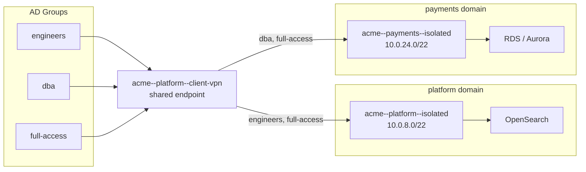

# Derrops Network Topology: Partitioning a VPC with the Naming Convention

:::tip[Implementation]
The types and topology generation methods described in this post are implemented in the [`@derrops-conventions`](https://github.com/derrops/derrops-platform/tree/main/packages/derrops-conventions) package.
:::

The naming convention for AWS network resources is not just about aesthetics. When the resource name itself encodes the network boundary it lives at, you gain a property that is hard to get any other way: you can read a CloudTrail log, a VPC flow log, or an AWS Config rule and immediately understand _which layer of your network_ a resource belongs to, without consulting a wiki.

This post describes how to partition a VPC following the Derrops convention, why the three-layer stability model matters for operational simplicity, and how to generate all required resource names from the convention without writing strings by hand.

## The stability principle applied to networks

Every AWS network resource has a provisioning lifecycle. Some are created once and forgotten. Others are created whenever a new business domain is added. Others are created and modified continuously as services are deployed and updated.

The naming convention encodes this directly:

```
Layer     Segments       Lifecycle                      Resources
────────  ─────────────  ─────────────────────────────  ──────────────────────────────────
Org       org            Provisioned once per account   VPC, Transit Gateway
Domain    org+domain     Added when a domain expands    Subnets, NACL, Route Tables, TGW Attachment
Service   org+domain+    Deployed per service release   Security Groups, ALBs, Target Groups
          service
```

Resource names stop including segments that are more volatile than the resource itself. A VPC is an org boundary — its name only carries `{org}`. A subnet is a domain boundary — its name carries `{org}--{domain}`. A security group controls service-level access — its name carries `{org}--{domain}--{service}--{purpose}`.

This means that `subnet` and `networkAcl` intentionally **do not include `service`** in their naming. Subnets do not belong to services — services sit inside subnets. Enforcing this at the naming layer makes the topology self-documenting.

## The four-level boundary model

```
AWS Resource        Naming layer   Example name                        What it controls
──────────────────  ─────────────  ──────────────────────────────────  ─────────────────────────────
VPC                 Org            acme                                 Inter-org isolation
Subnet              Domain         acme--payments--private--1a          Intra-org domain segmentation
Network ACL         Domain         acme--payments                 Inter-domain traffic rules
Security Group      Service        acme--payments--checkout-api--web    Inter-service access rules
```

### How to read a resource name

`acme--payments--private--1a` parses as:

- `acme` — the org VPC this subnet lives in
- `payments` — the domain whose workloads run here
- `private` — the tier (private = NAT egress, no direct inbound)
- `1a` — availability zone ap-southeast-2**a**

No lookup. The name is the topology.

## Subnet IP allocation strategy

The hardest practical problem in VPC design is CIDR block sizing: too small and you run out of IPs as services scale; too large and you waste address space that is increasingly scarce in RFC 1918 ranges.

### The sizing hierarchy

Start from the VPC CIDR and divide down:

```
VPC:           10.0.0.0/16    → 65,536 addresses
  Domain:      /20             → 4,096 addresses per domain (16 domains per VPC)
    Tier:      /22             → 1,024 addresses per tier per domain
      AZ:      /24             → 256 addresses per AZ
```

Each domain gets a `/20` block. Within the domain, each tier (private, public, isolated) gets a `/22`. Each AZ slice within a tier gets a `/24`.

```
Domain     Tier       AZ   CIDR           Range
─────────  ─────────  ──   ─────────────  ───────────────────────
payments   private    1a   10.0.0.0/24    10.0.0.0 – 10.0.0.255
payments   private    1b   10.0.1.0/24    10.0.1.0 – 10.0.1.255
payments   private    1c   10.0.2.0/24    10.0.2.0 – 10.0.2.255
payments   public     1a   10.0.4.0/24    10.0.4.0 – 10.0.4.255
payments   public     1b   10.0.5.0/24    …
payments   public     1c   10.0.6.0/24    …
payments   isolated   1a   10.0.8.0/24    …
payments   isolated   1b   10.0.9.0/24    …
payments   isolated   1c   10.0.10.0/24   …
identity   private    1a   10.0.16.0/24   …  (next /20 block)
```

A `/24` gives you 256 addresses, of which AWS reserves 5, leaving 251 usable. In ECS/Fargate terms each task consumes one IP, so a `/24` can support up to ~250 concurrent tasks in that tier for that domain in that AZ. Across three AZs, that is ~750 tasks — sufficient for most microservices at moderate scale.

### When a domain needs more IPs

The `/20` per domain design leaves 7 address blocks unused within each tier's `/22` (three `/24`s used, five remaining). If a domain exceeds 250 concurrent tasks per AZ:

1. **First option — expand within the /22.** Add a second `/24` from the unused blocks. The naming convention handles this: `acme--payments--private--1a` is the first; the next would be provisioned as an additional subnet alongside it (same name prefix, AWS assigns the CIDR at provision time).

2. **Second option — widen the tier to /21.** Doubles the AZ subnet to a `/23` (510 usable IPs). Requires re-provisioning subnets, which is disruptive. Plan for this at domain bootstrap if a domain is expected to run stateful services at scale (Aurora, OpenSearch, Redis clusters that consume IPs differently from Lambda or Fargate).

3. **Third option — secondary CIDR.** AWS allows associating a secondary CIDR block with a VPC. Assign `/16` blocks from a secondary range (e.g. `100.64.0.0/10` from the Carrier-Grade NAT range, which is RFC 6598 and widely used for VPC secondary CIDRs). This is the cleanest path for orgs that are genuinely running out of primary RFC 1918 space.

### The key rule

**Allocate domains in contiguous `/20` blocks starting from the VPC base.** This keeps the address plan readable and makes NACL rules expressible as CIDR summaries (`10.0.0.0/20` for payments, `10.0.16.0/20` for identity) rather than enumerating individual subnets. NACL rules that express inter-domain access as CIDR block allows/denies mirror the naming convention hierarchy.

## The access/permissions distinction

Network resource naming encodes **reachability** — can packets physically flow? It does not encode **authorization** — are they permitted to do anything useful once they arrive?

```
Layer              Mechanism              Question answered
─────────────────  ─────────────────────  ──────────────────────────────────
Subnet + NACL      Network ACL rules      Can packets leave domain A and enter domain B?
Security group     Ingress/egress rules   Can service X send packets to service Y?
IAM policy         Resource tag condition Are those packets authorized to read/write data?
```

All three layers are required for multi-tenant SaaS. Network reachability without IAM conditions is like an unlocked door — traffic can flow but the resource still needs to authorize the caller. See [Tag-Based Tenant Isolation (ABAC)](/blog/derrops-conventions#tag-based-tenant-isolation-abac) for the IAM layer.

## CDK usage — the three provisioning layers

The `DerropsConventions` package generates all names from the convention. No string interpolation.

### Org layer — provisioned once in the account bootstrap stack

```typescript
import * as ec2 from 'aws-cdk-lib/aws-ec2'
import { DerropsConventions } from '@derrops-conventions'

const orgConvention = new DerropsConventions({ org: 'acme' })
const orgLayer = orgConvention.orgNetworkLayer()
// → { vpc: 'acme', transitGateway: 'acme--tgw' }

const vpc = new ec2.CfnVPC(this, 'OrgVpc', {
  cidrBlock: '10.0.0.0/16',
  tags: [{ key: 'Name', value: orgLayer.vpc }], // 'acme'
})

const tgw = new ec2.CfnTransitGateway(this, 'OrgTgw', {
  tags: [{ key: 'Name', value: orgLayer.transitGateway }], // 'acme--tgw'
})
```

### Domain layer — provisioned when a domain is added

```typescript
const domainConvention = orgConvention.with({ domain: 'payments' })
const domainLayer = domainConvention.domainNetworkLayer(['1a', '1b', '1c'])

// Subnets
const azs = ['1a', '1b', '1c']
const privateCidrs = ['10.0.0.0/24', '10.0.1.0/24', '10.0.2.0/24']

domainLayer.subnets['private']!.forEach((name, i) => {
  new ec2.CfnSubnet(this, `PrivateSubnet${azs[i]}`, {
    vpcId: vpc.ref,
    cidrBlock: privateCidrs[i]!,
    availabilityZone: `ap-southeast-2${azs[i]}`,
    tags: [{ key: 'Name', value: name }],  // 'acme--payments--private--1a', ...
  })
})

// NACL — inter-domain boundary control
new ec2.CfnNetworkAcl(this, 'DomainNacl', {
  vpcId: vpc.ref,
  tags: [{ key: 'Name', value: domainLayer.nacl }],  // 'acme--payments'
})

// TGW attachment — connects domain VPC to org hub
new ec2.CfnTransitGatewayAttachment(this, 'TgwAttach', {
  transitGatewayId: tgw.ref,
  vpcId: vpc.ref,
  subnetIds: privateCidrs.map((_, i) => /* private subnet IDs */),
  tags: [{ key: 'Name', value: domainLayer.tgwAttachment }],  // 'acme--payments'
})
```

### Service layer — provisioned with each service deployment

```typescript
const serviceConvention = domainConvention.with({ service: 'checkout-api' })
const serviceLayer = serviceConvention.serviceNetworkLayer(['web', 'db'])

const webSg = new ec2.SecurityGroup(this, 'WebSg', {
  securityGroupName: serviceLayer.securityGroups['web']!, // 'acme--payments--checkout-api--web'
  vpc: ec2.Vpc.fromLookup(this, 'Vpc', { vpcName: orgLayer.vpc }),
  description: 'HTTP/HTTPS inbound for checkout-api',
})
webSg.addIngressRule(ec2.Peer.anyIpv4(), ec2.Port.tcp(443))

const dbSg = new ec2.SecurityGroup(this, 'DbSg', {
  securityGroupName: serviceLayer.securityGroups['db']!, // 'acme--payments--checkout-api--db'
  vpc: ec2.Vpc.fromLookup(this, 'Vpc', { vpcName: orgLayer.vpc }),
  description: 'PostgreSQL inbound from checkout-api',
})
dbSg.addIngressRule(webSg, ec2.Port.tcp(5432))
```

## Employee VPN access control

When an employee connects via AWS Client VPN, they enter the org VPC. The question is: once inside, what can they reach?

### How Client VPN isolates users — and what it cannot do

All users connecting through the same endpoint share the **same endpoint security group**. The SG sits on the endpoint's Elastic Network Interface (ENI), not on the individual session. From the perspective of any target resource, every connected employee's traffic arrives from the same source SG. **Security group rules cannot differentiate between individual users on a shared endpoint.**

The correct per-group mechanism is **Client VPN Authorization Rules**:

```
Authorization Rule: AD/Cognito group  →  destination CIDR block
```

AWS evaluates these rules at connection time. An employee in the `search-only` group who tries to reach the RDS subnet CIDR has their packets dropped at the VPN layer — no traffic reaches the RDS security group at all.

### Resource-level access control: the domain placement problem

The natural question is: "I want group A to reach OpenSearch but not RDS, and group B to reach both — how?"

Authorization rules are CIDR-based, not resource-based. If OpenSearch and RDS sit in the **same subnet**, no authorization rule can tell them apart. The solution is structural: **place resources that need different access profiles in different domain subnets**.

The naming convention makes this concrete. Each domain gets a `/20` CIDR block and its own isolated subnet tier:

```
Resource      Domain     Subnet name                    CIDR (example)
──────────    ─────────  ─────────────────────────────  ──────────────
OpenSearch    platform   acme--platform--isolated--1a   10.0.8.0/24
RDS / Aurora  payments   acme--payments--isolated--1a   10.0.24.0/24
App services  payments   acme--payments--private--1a    10.0.16.0/24
```

With resources in different domain subnets, authorization rules can now express exactly what each group can reach:

```
AD group      → Subnet name                 → CIDR          → Can reach
────────────  ──────────────────────────    ─────────────   ─────────────────────────
engineers     acme--platform--isolated      10.0.8.0/22     OpenSearch only
dba           acme--payments--isolated      10.0.24.0/22    RDS only
full-access   both of the above             both CIDRs      OpenSearch + RDS
developers    acme--payments--private       10.0.16.0/22    App services only
all-staff     entire VPC                    10.0.0.0/16     Everything
```

The arrow labels in the diagram below show which groups hold an authorization rule for each subnet — absence from an arrow means that group's traffic is dropped at the VPN layer before reaching the resource's security group:



`engineers` appears only on the arrow to the platform isolated subnet — they can reach OpenSearch, but their packets to `10.0.24.0/22` are dropped at the VPN layer before reaching the RDS security group. `dba` is the inverse. `full-access` appears on both arrows.

A group with access to `acme--payments--isolated` CIDR can reach RDS. A group without it cannot — the VPN layer drops the packets before they reach the RDS security group.

### Convention-named authorization rules in CDK

The authorization rule's `description` field is the only human-readable identifier. Use the subnet name from the convention as the description so audit logs and Config snapshots reference readable names rather than raw CIDRs:

```typescript
const platform = new DerropsConventions({ org: 'acme', domain: 'platform' })
const payments = new DerropsConventions({ org: 'acme', domain: 'payments' })

// Subnet names derived from convention — pair with your CIDR allocation table
const CIDR: Record<string, string> = {
  [platform.with({ domain: 'platform' }).name({ type: 'subnet', kind: 'isolated' })]: '10.0.8.0/22',
  [payments.name({ type: 'subnet', kind: 'isolated' })]: '10.0.24.0/22',
  [payments.name({ type: 'subnet', kind: 'private' })]: '10.0.16.0/22',
}

// Authorization rules — description = convention subnet name, CIDR from allocation table
const rules = [
  { group: 'engineers-group-id', subnet: 'acme--platform--isolated' }, // OpenSearch only
  { group: 'dba-group-id', subnet: 'acme--payments--isolated' }, // RDS only
  { group: 'developers-group-id', subnet: 'acme--payments--private' }, // App services only
]

for (const { group, subnet } of rules) {
  endpoint.addAuthorizationRule(`${group} → ${subnet}`, {
    cidr: CIDR[subnet]!,
    groupId: group,
  })
}

// full-access group gets two rules (one per subnet)
endpoint.addAuthorizationRule('full-access → acme--platform--isolated', {
  cidr: CIDR['acme--platform--isolated']!,
  groupId: 'full-access-group-id',
})
endpoint.addAuthorizationRule('full-access → acme--payments--isolated', {
  cidr: CIDR['acme--payments--isolated']!,
  groupId: 'full-access-group-id',
})
```

### The endpoint SG — one per org, coarse allow

The endpoint SG itself is a broad allow — authorization rules do the real work:

```typescript
const vpnSg = new ec2.SecurityGroup(this, 'VpnEndpointSg', {
  securityGroupName: platform.with({ service: 'client-vpn' }).name({
    type: 'ec2SecurityGroup',
    purpose: 'all',
  }), // → 'acme--platform--client-vpn--all'
  vpc,
  description: 'Client VPN endpoint — authorization rules restrict per-group destinations',
})
vpnSg.addEgressRule(ec2.Peer.ipv4('10.0.0.0/16'), ec2.Port.allTraffic())

const endpoint = new ec2.ClientVpnEndpoint(this, 'VpnEndpoint', {
  cidr: '172.16.0.0/22', // VPN client IP pool, outside VPC CIDR
  serverCertificateArn: '...',
  vpc,
  securityGroups: [vpnSg], // shared by ALL connected users
  splitTunnel: true, // only VPC traffic routes through VPN
})
```

:::tip[Domain placement is access policy]
The choice of which domain a resource lives in is not just organisational — it determines which VPN groups can reach it. Put OpenSearch in `platform` and RDS in `payments` and you get two independently addressable CIDR blocks with zero extra infrastructure cost. One endpoint, CIDR-based rules, full resource-level differentiation.
:::

## Cross-org patterns — VPC peering vs Transit Gateway

```typescript
// VPC peering — point-to-point, two-org scenario
orgConvention.name({ type: 'vpcPeering', target: 'globex' })
// → 'acme--globex--peer'

// Transit Gateway — hub-and-spoke, three or more orgs
orgConvention.orgNetworkLayer().transitGateway
// → 'acme--tgw'
```

VPC peering connections grow as O(n²) — with 5 orgs, you need 10 peering connections. Transit Gateway grows as O(n) attachments. Use peering only for two-org point-to-point. Use TGW as soon as you have three or more.

---

_Further reading: [Derrops Guide to Naming Conventions](/blog/derrops-conventions) · [AWS Resource Naming Cheatsheet](/blog/derrops-naming-sheet)_
