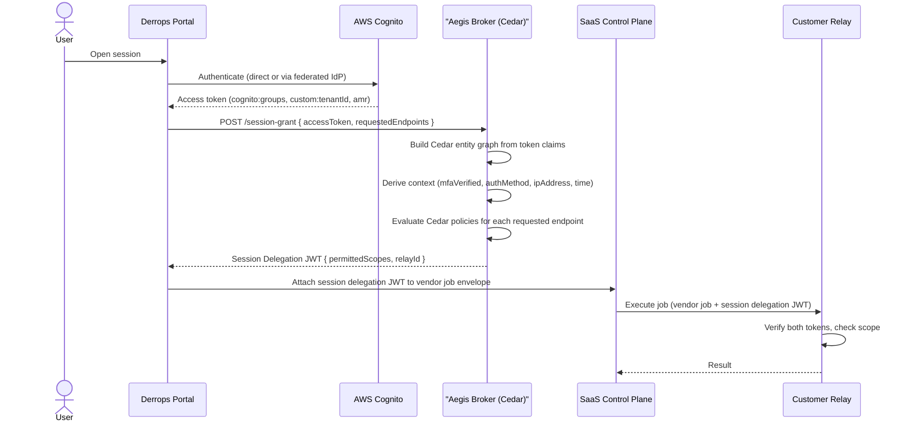

# Aegis — Cedar Policy Authorization Design

This document describes how [Cedar Policy](https://www.cedarpolicy.com) is used as the pluggable policy engine inside the Aegis Broker to determine what a given user is allowed to do through the Derrops relay.

Related documents:

- [Aegis Token Broker Design](./aegis-token-broker-design) — session delegation model, JWT flow, and dual-authorization model
- [Cloud Relay Security](./cloud-relay-security) — authentication methods between Relay and control plane
- [Network Topology](./network-topology) — runtime component separation

---

## Why Cedar Policy

Aegis's core design goal is that the **customer, not the Derrops platform, is the final authority for what APIs may be called**. The Aegis Broker was designed with a pluggable policy engine; Cedar Policy is the recommended implementation for that slot.

Cedar fits this problem well for three reasons:

| Property                   | Why it matters for Aegis                                                                                                                                                             |
| -------------------------- | ------------------------------------------------------------------------------------------------------------------------------------------------------------------------------------ |
| **Expressive but bounded** | Cedar can encode RBAC, ABAC, time bounds, and environment constraints without becoming Turing-complete. Policies are analyzable — you can formally prove what is and is not allowed. |
| **Auditable**              | Every policy is a human-readable Cedar document. Customers can version-control, review, and audit policies alongside their infrastructure code.                                      |
| **Separation of concerns** | Authorization logic lives in Cedar policy files, not in application code. Aegis evaluates them; it does not embed them. This matches the customer-owned-policy model.                |
| **Default deny**           | Cedar denies everything unless a `permit` policy explicitly matches. No accidental access.                                                                                           |
| **Schema-validated**       | Cedar schemas define the entity types and allowed actions. Policies are validated against the schema before they are deployed, catching errors early.                                |

---

## Core Concepts: The PARC Model Applied to Aegis

Cedar authorization is structured around four elements: **Principal**, **Action**, **Resource**, and **Context** (PARC). Every Aegis authorization question maps onto this model.

```
Is this Principal allowed to perform this Action on this Resource given this Context?
```

| PARC element  | Aegis mapping                                        | Example                                                     |
| ------------- | ---------------------------------------------------- | ----------------------------------------------------------- |
| **Principal** | Authenticated Cognito user or group                  | `User::"sub:a1b2c3d4"`, `UserGroup::"platform-engineers"`   |
| **Action**    | HTTP method of the relayed request                   | `Action::"httpGet"`, `Action::"httpPost"`                   |
| **Resource**  | The OpenAPI endpoint being targeted                  | `ApiEndpoint::"listOrders"`, `ApiHost::"payments.internal"` |
| **Context**   | Session-time data from the Cognito token and request | `{ mfaVerified: true, ipAddress: "10.0.0.5", ... }`         |

---

## Entity Model

### Principal hierarchy

```
UserGroup (e.g. "platform-engineers")
  └── User (e.g. "sub:a1b2c3d4-...")
```

Users are assigned to one or more `UserGroup` entities. Policies can target individual users or entire groups. Group membership is populated from `cognito:groups` in the Cognito access token.

The `User` entity ID is always the Cognito `sub` (a stable UUID), never the username or email, which can change.

```cedar
entity User in [UserGroup] {
  // Cognito access token claims
  sub:           String,  // Cognito UUID — stable, immutable identifier
  username:      String,  // Cognito username (may be email or IdP-prefixed)
  email:         String,
  emailVerified: Bool,
  tenantId:      String,  // mapped from custom:tenantId
  isFederated:   Bool,    // true when authenticated via an external IdP
  idpProvider:   String,  // "COGNITO" | "Okta" | "AzureAD" | "Google" | etc.

  // OpenID Connect claims — sourced from the Cognito ID token or UserPool attributes.
  // Aegis must be passed both the access token and ID token (or call Cognito GetUser)
  // for these to be populated. Omit attributes that are not available in your Cognito config.
  locale:          String,  // OIDC locale, e.g. "en-AU", "en-US"
  phoneVerified:   Bool,    // OIDC phone_number_verified
  updatedAt:       String,  // OIDC updated_at (profile last modified) as ISO 8601 UTC string
};

entity UserGroup {
  displayName: String,
};
```

### Action hierarchy

Actions map directly onto HTTP methods. This keeps policies readable in OpenAPI terms — a policy author who knows HTTP knows what each action means.

```
callApi                  // parent: matches any HTTP method
  ├── callApiRead        // parent: GET, HEAD, OPTIONS
  │   ├── httpGet
  │   ├── httpHead
  │   └── httpOptions
  └── callApiWrite       // parent: POST, PUT, PATCH, DELETE
      ├── httpPost
      ├── httpPut
      ├── httpPatch
      └── httpDelete
```

```cedar
action callApi;

action callApiRead    in [callApi];
action callApiWrite   in [callApi];

action httpGet        in [callApiRead];
action httpHead       in [callApiRead];
action httpOptions    in [callApiRead];

action httpPost       in [callApiWrite];
action httpPut        in [callApiWrite];
action httpPatch      in [callApiWrite];
action httpDelete     in [callApiWrite];
```

Granting `callApiRead` covers `httpGet`, `httpHead`, and `httpOptions`. Granting `callApi` covers everything.

### Resource hierarchy

Resources reflect the OpenAPI structure of the target service.

```
ApiEnvironment (e.g. "prod", "staging")
  └── ApiHost (e.g. "payments.internal")
       └── ApiEndpoint (e.g. operationId "listOrders" — GET /v1/orders/{id})
```

`ApiEndpoint` is keyed by OpenAPI `operationId`. The HTTP method and path are stored as attributes for use in policy conditions.

```cedar
entity ApiEnvironment {
  name: String,      // "prod" | "staging" | "dev"
};

entity ApiHost in [ApiEnvironment] {
  hostname: String,
  internal: Bool,
};

entity ApiEndpoint in [ApiHost] {
  operationId:  String,        // OpenAPI operationId, e.g. "listOrders"
  method:       String,        // HTTP method: "GET" | "POST" | ...
  pathPattern:  String,        // URL path pattern: "/v1/orders/{id}"
  tags:         Set<String>,   // OpenAPI operation tags, e.g. {"billing", "read-only"}
};
```

### Context

Context carries data that is scoped to the session grant request — values that are not fixed user attributes but vary per authentication or per request.

```typescript
// Context shape passed to Cedar at session grant time
{
  // Authentication
  mfaVerified:  true,                  // true if amr contains "mfa" (see notes below)
  authMethod:   "SOFTWARE_TOTP",       // derived from amr: "SOFTWARE_TOTP" | "HARDWARE_TOTP" | "PASSWORD" | "EXTERNAL_IDP"
  authTime:     "2026-04-04T08:00:00Z", // when the Cognito token was issued (auth_time claim)

  // JWT standard claims — sourced directly from the Cognito access token
  tokenAud:              "1a2b3c4d5e6f7g8h9i0j",  // aud / client_id — the Cognito app client the token was issued for
  tokenIat:              "2026-04-04T09:00:00Z",    // iat (issued-at) as ISO 8601 UTC string
  tokenNbf:              "2026-04-04T09:00:00Z",    // nbf (not-before) as ISO 8601 UTC string; omit if not present in token
  tokenAgeSeconds:       720,                         // computed: (sessionGrantTime − iat) in seconds — how old is this token?
  tokenExpiresInSeconds: 3280,                        // computed: (exp − sessionGrantTime) in seconds — how long until expiry?

  // Network
  ipAddress:    "10.0.0.5",           // originating IP — Cedar evaluates CIDR ranges via ip().isInRange()

  // Request
  time:         "2026-04-04T09:12:00Z", // wall-clock time of the session grant
  timeOfDayHour: 9,                     // UTC hour (0–23) computed from time — used for business-hours policies
  relayId:      "relay-01",            // which relay the session will use
  environment:  "prod",                // target environment
}
```

**MFA note for federated users**: Cognito's `amr` claim only reflects MFA steps performed _within Cognito_. When a user authenticates via an external IdP, Cognito sets `amr: ["external-provider"]` regardless of whether the IdP enforced MFA. If MFA assurance from the external IdP is required, the IdP must pass a custom claim (e.g. `custom:mfaVerified`) through the Cognito attribute mapping, and Aegis must read that attribute rather than relying solely on `amr`.

---

## Mapping Cognito Tokens to Cedar Entities

Aegis receives the Cognito access token on the `/session-grant` request and translates its claims into a Cedar entity graph.

### Cognito claim → Cedar attribute mapping

| Cognito token claim                  | Cedar target                                  | Notes                                                        |
| ------------------------------------ | --------------------------------------------- | ------------------------------------------------------------ |
| `sub`                                | `User` entity ID + `User.sub`                 | Stable UUID, never changes                                   |
| `cognito:username` / `username`      | `User.username`                               | Falls back to `sub` if absent                                |
| `email`                              | `User.email`                                  | —                                                            |
| `email_verified`                     | `User.emailVerified`                          | —                                                            |
| `custom:tenantId`                    | `User.tenantId`                               | Must be configured in Cognito user pool                      |
| `cognito:groups`                     | `User` parents → `UserGroup` entities         | One `UserGroup` entity per group                             |
| `identities[0].providerName`         | `User.idpProvider`                            | Only for federated users; set to `"COGNITO"` for direct auth |
| `amr` contains `"external-provider"` | `User.isFederated = true`                     | —                                                            |
| `amr`                                | `context.mfaVerified`, `context.authMethod`   | `"mfa"` → verified; `"software_totp"` → `SOFTWARE_TOTP`      |
| `auth_time`                          | `context.authTime`                            | Epoch → ISO 8601 UTC                                         |
| `iat`                                | `context.tokenIat`, `context.tokenAgeSeconds` | —                                                            |
| `exp`                                | `context.tokenExpiresInSeconds`               | —                                                            |
| `nbf`                                | `context.tokenNbf`                            | Falls back to `iat` if absent                                |
| `client_id` / `aud`                  | `context.tokenAud`                            | Cognito access tokens use `client_id`                        |
| `locale`                             | `User.locale`                                 | Optional OIDC claim                                          |
| `phone_number_verified`              | `User.phoneVerified`                          | Optional OIDC claim                                          |
| `updated_at`                         | `User.updatedAt`                              | Optional OIDC claim                                          |

### Scenario A: Direct Cognito authentication (with MFA)

```typescript
// Cognito access token claims
{
  "sub":              "a1b2c3d4-e5f6-7890-abcd-ef1234567890",
  "iss":              "https://cognito-idp.ap-southeast-2.amazonaws.com/ap-southeast-2_XXXXXX",
  "token_use":        "access",
  "client_id":        "...",
  "username":         "alice@acme.com",
  "cognito:groups":   ["platform-engineers", "billing-viewers"],
  "email":            "alice@acme.com",
  "email_verified":   true,
  "custom:tenantId":  "acme-corp",
  "amr":              ["mfa", "software_totp"],
  "auth_time":        1743746400,
  "exp":              1743750000,
  "iat":              1743746400
}

// Translated Cedar entities
[
  {
    "uid": { "type": "User", "id": "a1b2c3d4-e5f6-7890-abcd-ef1234567890" },
    "attrs": {
      "sub":          "a1b2c3d4-e5f6-7890-abcd-ef1234567890",
      "username":     "alice@acme.com",
      "email":        "alice@acme.com",
      "emailVerified": true,
      "tenantId":     "acme-corp",
      "isFederated":  false,
      "idpProvider":  "COGNITO"
    },
    "parents": [
      { "type": "UserGroup", "id": "platform-engineers" },
      { "type": "UserGroup", "id": "billing-viewers" }
    ]
  }
]

// Derived context
{
  "mfaVerified":  true,
  "authMethod":   "SOFTWARE_TOTP",
  "authTime":     "2026-04-04T08:00:00Z"
}
```

### Scenario B: Direct Cognito authentication (no MFA)

```typescript
// Cognito access token claims (MFA not configured or not required)
{
  "sub":             "a1b2c3d4-e5f6-7890-abcd-ef1234567890",
  "username":        "alice@acme.com",
  "cognito:groups":  ["analysts"],
  "email":           "alice@acme.com",
  "email_verified":  true,
  "custom:tenantId": "acme-corp",
  "amr":             ["pwd"],           // password only — no MFA step
  "auth_time":       1743746400
}

// Derived context
{
  "mfaVerified":  false,
  "authMethod":   "PASSWORD",
  "authTime":     "2026-04-04T08:00:00Z"
}
```

### Scenario C: Federated authentication via external IdP (e.g. Okta SAML)

```typescript
// Cognito access token claims for a federated user
{
  "sub":             "a1b2c3d4-e5f6-7890-abcd-ef1234567890",  // Cognito UUID, stable
  "username":        "OktaSSO_alice@acme.com",                 // prefixed with provider name
  "cognito:groups":  ["platform-engineers"],
  "email":           "alice@acme.com",                         // mapped from SAML attribute
  "email_verified":  true,
  "custom:tenantId": "acme-corp",
  "amr":             ["external-provider"],                    // no Cognito-level MFA
  "identities":      "[{\"userId\":\"alice@acme.com\",\"providerName\":\"OktaSSO\",\"providerType\":\"SAML\",\"primary\":true}]"
}

// Translated Cedar entities
[
  {
    "uid": { "type": "User", "id": "a1b2c3d4-e5f6-7890-abcd-ef1234567890" },
    "attrs": {
      "sub":          "a1b2c3d4-e5f6-7890-abcd-ef1234567890",
      "username":     "OktaSSO_alice@acme.com",
      "email":        "alice@acme.com",
      "emailVerified": true,
      "tenantId":     "acme-corp",
      "isFederated":  true,
      "idpProvider":  "OktaSSO"
    },
    "parents": [
      { "type": "UserGroup", "id": "platform-engineers" }
    ]
  }
]

// Derived context
// mfaVerified is false unless the IdP passes custom:mfaVerified = "true"
// as a mapped Cognito attribute — Cognito cannot observe the IdP's own MFA enforcement
{
  "mfaVerified":  false,
  "authMethod":   "EXTERNAL_IDP",
  "authTime":     "2026-04-04T08:00:00Z"
}
```

Cedar's parent/child entity traversal means a policy written for `UserGroup::"platform-engineers"` automatically applies to all members — no per-user policy duplication.

---

## Cedar Schema (Aegis Domain)

```json
{
  "AegisNamespace": {
    "entityTypes": {
      "User": {
        "memberOfTypes": ["UserGroup"],
        "shape": {
          "type": "Record",
          "attributes": {
            "sub": { "type": "String" },
            "username": { "type": "String" },
            "email": { "type": "String" },
            "emailVerified": { "type": "Boolean" },
            "tenantId": { "type": "String" },
            "isFederated": { "type": "Boolean" },
            "idpProvider": { "type": "String" }
          }
        }
      },
      "UserGroup": {
        "shape": {
          "type": "Record",
          "attributes": {
            "displayName": { "type": "String" }
          }
        }
      },
      "ApiEnvironment": {
        "shape": {
          "type": "Record",
          "attributes": {
            "name": { "type": "String" }
          }
        }
      },
      "ApiHost": {
        "memberOfTypes": ["ApiEnvironment"],
        "shape": {
          "type": "Record",
          "attributes": {
            "hostname": { "type": "String" },
            "internal": { "type": "Boolean" }
          }
        }
      },
      "ApiEndpoint": {
        "memberOfTypes": ["ApiHost"],
        "shape": {
          "type": "Record",
          "attributes": {
            "operationId": { "type": "String" },
            "method": { "type": "String" },
            "pathPattern": { "type": "String" },
            "tags": { "type": "Set", "element": { "type": "String" } }
          }
        }
      }
    },
    "actions": {
      "callApi": {
        "appliesTo": {
          "principalTypes": ["User", "UserGroup"],
          "resourceTypes": ["ApiEndpoint", "ApiHost", "ApiEnvironment"]
        }
      },
      "callApiRead": {
        "memberOf": [{ "id": "callApi", "type": "Action" }],
        "appliesTo": {
          "principalTypes": ["User", "UserGroup"],
          "resourceTypes": ["ApiEndpoint", "ApiHost", "ApiEnvironment"]
        }
      },
      "callApiWrite": {
        "memberOf": [{ "id": "callApi", "type": "Action" }],
        "appliesTo": {
          "principalTypes": ["User", "UserGroup"],
          "resourceTypes": ["ApiEndpoint", "ApiHost", "ApiEnvironment"]
        }
      },
      "httpGet": {
        "memberOf": [{ "id": "callApiRead", "type": "Action" }],
        "appliesTo": {
          "principalTypes": ["User", "UserGroup"],
          "resourceTypes": ["ApiEndpoint", "ApiHost", "ApiEnvironment"]
        }
      },
      "httpHead": {
        "memberOf": [{ "id": "callApiRead", "type": "Action" }],
        "appliesTo": {
          "principalTypes": ["User", "UserGroup"],
          "resourceTypes": ["ApiEndpoint", "ApiHost", "ApiEnvironment"]
        }
      },
      "httpOptions": {
        "memberOf": [{ "id": "callApiRead", "type": "Action" }],
        "appliesTo": {
          "principalTypes": ["User", "UserGroup"],
          "resourceTypes": ["ApiEndpoint", "ApiHost", "ApiEnvironment"]
        }
      },
      "httpPost": {
        "memberOf": [{ "id": "callApiWrite", "type": "Action" }],
        "appliesTo": {
          "principalTypes": ["User", "UserGroup"],
          "resourceTypes": ["ApiEndpoint", "ApiHost", "ApiEnvironment"]
        }
      },
      "httpPut": {
        "memberOf": [{ "id": "callApiWrite", "type": "Action" }],
        "appliesTo": {
          "principalTypes": ["User", "UserGroup"],
          "resourceTypes": ["ApiEndpoint", "ApiHost", "ApiEnvironment"]
        }
      },
      "httpPatch": {
        "memberOf": [{ "id": "callApiWrite", "type": "Action" }],
        "appliesTo": {
          "principalTypes": ["User", "UserGroup"],
          "resourceTypes": ["ApiEndpoint", "ApiHost", "ApiEnvironment"]
        }
      },
      "httpDelete": {
        "memberOf": [{ "id": "callApiWrite", "type": "Action" }],
        "appliesTo": {
          "principalTypes": ["User", "UserGroup"],
          "resourceTypes": ["ApiEndpoint", "ApiHost", "ApiEnvironment"]
        }
      }
    }
  }
}
```

---

## Example Policies

### 1. Read-only access — HTTP GET only

Allow analysts to call GET on all staging APIs. `httpGet` is a child of `callApiRead` which is a child of `callApi` — no write actions are covered.

```cedar
permit (
  principal in UserGroup::"analysts",
  action == Action::"httpGet",
  resource in ApiEnvironment::"staging"
);
```

To allow all safe read methods (GET, HEAD, OPTIONS), grant the parent action instead:

```cedar
permit (
  principal in UserGroup::"analysts",
  action in Action::"callApiRead",
  resource in ApiEnvironment::"staging"
);
```

### 2. Read and write access

Grant the `callApi` parent action to cover all HTTP methods. Scoped to a specific host.

```cedar
permit (
  principal in UserGroup::"platform-engineers",
  action in Action::"callApi",
  resource in ApiHost::"payments.internal"
);
```

To be more explicit, you can permit read and write separately and combine policies. Cedar evaluates the full policy set and grants access if any permit matches and no forbid matches.

```cedar
// Permit reads on all prod APIs
permit (
  principal in UserGroup::"platform-engineers",
  action in Action::"callApiRead",
  resource in ApiEnvironment::"prod"
);

// Permit writes only on the orders service
permit (
  principal in UserGroup::"platform-engineers",
  action in Action::"callApiWrite",
  resource in ApiHost::"orders.internal"
);
```

### 3. IP whitelisting

Cedar's built-in `ip()` extension supports CIDR range matching natively. `context.ipAddress` is passed as a string and Cedar evaluates the range check itself — no pre-computation needed.

```cedar
// Single CIDR range
permit (
  principal in UserGroup::"external-contractors",
  action in Action::"callApiRead",
  resource in ApiEnvironment::"staging"
) when {
  ip(context.ipAddress).isInRange(ip("10.0.0.0/8"))
};
```

Multiple allowed ranges with `||`:

```cedar
// Allow two corporate CIDR blocks
permit (
  principal in UserGroup::"external-contractors",
  action in Action::"callApiRead",
  resource in ApiEnvironment::"staging"
) when {
  ip(context.ipAddress).isInRange(ip("10.0.0.0/8")) ||
  ip(context.ipAddress).isInRange(ip("192.168.1.0/24"))
};
```

Exact IP match (a /32 range) when a single address is needed:

```cedar
permit (
  principal in UserGroup::"external-contractors",
  action in Action::"callApiRead",
  resource in ApiEnvironment::"staging"
) when {
  ip(context.ipAddress).isInRange(ip("203.0.113.42/32"))
};
```

### 4. Time-bounded access — access until a specific deadline

Grant temporary access that expires at a fixed point (e.g. granted until 13:00 AEST on 5 April 2026, which is 03:00 UTC). `context.time` is an ISO 8601 string compared lexicographically; this works correctly for UTC timestamps in this format.

```cedar
permit (
  principal == User::"a1b2c3d4-e5f6-7890-abcd-ef1234567890",
  action in Action::"callApi",
  resource in ApiEnvironment::"prod"
) when {
  context.time <= "2026-04-05T03:00:00Z"
};
```

For recurring time windows such as business-hours-only access:

```cedar
permit (
  principal in UserGroup::"on-call",
  action in Action::"callApi",
  resource in ApiEnvironment::"prod"
) when {
  context.timeOfDayHour >= 8 &&
  context.timeOfDayHour < 18
};
```

`timeOfDayHour` (0–23, UTC) is computed by Aegis from `context.time` and passed in context, since Cedar's datetime extensions do not expose `.hour` directly on an ISO string.

### 5. Group-based access

Policies targeting `UserGroup` automatically apply to all members, regardless of whether the user authenticated via Cognito directly or via a federated IdP — as long as Cognito's `cognito:groups` claim contains the group.

```cedar
// Allow the support group read-only access to customer data endpoints
permit (
  principal in UserGroup::"customer-support",
  action in Action::"callApiRead",
  resource in ApiHost::"crm.internal"
);

// Deny the same group access to billing endpoints, even if another policy permits it
forbid (
  principal in UserGroup::"customer-support",
  action,
  resource
) when {
  resource.tags.contains("billing")
};
```

`forbid` always wins over `permit`, regardless of evaluation order.

### 6. Access rule using the user's email address

Target a specific user by email when you cannot or do not want to manage a dedicated group. Useful for one-off access grants.

```cedar
// Grant a specific user temporary write access by email attribute
permit (
  principal,
  action in Action::"callApiWrite",
  resource in ApiHost::"payments.internal"
) when {
  principal.email == "alice@acme.com"
};
```

To grant access to all users from a specific domain:

```cedar
permit (
  principal,
  action in Action::"callApiRead",
  resource in ApiEnvironment::"staging"
) when {
  principal.email.endsWith("@acme.com") &&
  principal.emailVerified == true
};
```

**Note**: Prefer group-based policies for operational access. Email-based rules are useful for exceptions or time-limited grants. The `emailVerified` guard prevents unverified addresses from matching.

### 7. Access to a specific absolute path

Match on `resource.pathPattern` to allow access to one exact URL path without granting access to any parent host or environment.

```cedar
// Allow reads only on /v1/health — nothing else on that host
permit (
  principal in UserGroup::"monitoring",
  action in Action::"callApiRead",
  resource
) when {
  resource.pathPattern == "/v1/health"
};
```

This is useful when you want to grant a narrow entitlement (e.g. a health-check endpoint) without opening up the broader host or environment hierarchy.

### 8. Access to a specific HTTP resource by operationId

`ApiEndpoint` entities are keyed by OpenAPI `operationId`. Targeting a single endpoint directly is the most precise grant possible — it matches exactly one operation regardless of which host or environment it belongs to.

```cedar
// Allow only the listOrders operation — GET /v1/orders/{id}
permit (
  principal in UserGroup::"order-viewers",
  action == Action::"httpGet",
  resource == ApiEndpoint::"listOrders"
);
```

Combine multiple specific operations without opening up the whole host:

```cedar
// Read order details and download invoices, nothing else
permit (
  principal in UserGroup::"finance-read",
  action == Action::"httpGet",
  resource == ApiEndpoint::"getOrder"
);

permit (
  principal in UserGroup::"finance-read",
  action == Action::"httpGet",
  resource == ApiEndpoint::"downloadInvoice"
);
```

### 9. Deny all destructive operations globally

A `forbid` that applies to the entire principal and resource space is a safe baseline to add alongside broader `permit` policies. It cannot be overridden by any `permit`.

```cedar
// No one may call DELETE on any resource, ever
forbid (
  principal,
  action == Action::"httpDelete",
  resource
);
```

Apply the same pattern to a specific tag to protect sensitive data regardless of who is asking:

```cedar
// No writes to PII-tagged endpoints from any principal
forbid (
  principal,
  action in Action::"callApiWrite",
  resource
) when {
  resource.tags.contains("pii")
};
```

### 10. Tenant isolation — users can only reach their own tenant's resources

Each `ApiEndpoint` can carry a tenant tag. Combined with the `tenantId` attribute on the `User` entity (mapped from Cognito's `custom:tenantId`), you can enforce that users never cross tenant boundaries even if they share the same Cognito user pool.

```cedar
// User may only call endpoints tagged with their own tenantId
permit (
  principal,
  action in Action::"callApi",
  resource
) when {
  resource.tags.contains(principal.tenantId)
};
```

---

## OpenAPI Examples

These examples treat the OpenAPI specification as the source of truth for what `ApiEndpoint` entities exist and what attributes they carry. The entity model is extended to include parameter metadata from the spec so that policies can reference the shape of an operation, not just its identity.

### Extended ApiEndpoint schema for OpenAPI metadata

The base `ApiEndpoint` entity is augmented with parameter information extracted from the OpenAPI spec at entity-build time. These are **spec-time** attributes — they describe the structure of the operation as defined in the spec, not the runtime values of any particular request.

```cedar
entity ApiEndpoint in [ApiHost] {
  operationId:    String,        // OpenAPI operationId, e.g. "getOrderById"
  method:         String,        // HTTP method: "GET" | "POST" | ...
  pathPattern:    String,        // URL path template: "/v1/orders/{orderId}"
  tags:           Set<String>,   // OpenAPI operation tags, e.g. {"orders", "read-only"}
  pathParams:     Set<String>,   // path parameter names, e.g. {"orderId", "customerId"}
  queryParams:    Set<String>,   // query parameter names, e.g. {"limit", "offset", "filter"}
  requiredParams: Set<String>,   // parameter names marked required in the spec
  deprecated:     Bool,          // true if the operation is marked deprecated in the spec
};
```

**Runtime parameter values are not available to Cedar.** Cedar evaluates at session grant time — before any specific request is made — so it can only see the parameter names and flags from the spec, not the values a caller will supply at runtime. Parameter-value enforcement (e.g. "the caller may only supply their own `customerId`") must be handled by the relay after session grant.

### OAS-1. Grant access by operationId

The most precise grant. Targets one specific operation regardless of host, environment, or path.

```cedar
// Allow read of a specific order
permit (
  principal in UserGroup::"order-viewers",
  action == Action::"httpGet",
  resource == ApiEndpoint::"getOrderById"
);
```

Multiple operationIds for a curated surface area. Each `permit` is independent; Cedar grants if any matches.

```cedar
// Curated read surface for the finance team — only these three operations
permit (
  principal in UserGroup::"finance-read",
  action == Action::"httpGet",
  resource == ApiEndpoint::"listInvoices"
);

permit (
  principal in UserGroup::"finance-read",
  action == Action::"httpGet",
  resource == ApiEndpoint::"getInvoiceById"
);

permit (
  principal in UserGroup::"finance-read",
  action == Action::"httpGet",
  resource == ApiEndpoint::"downloadInvoicePdf"
);
```

### OAS-2. Grant access by OpenAPI tag

OpenAPI tags group related operations by concern. Cedar can match on any tag in the set. This is the preferred approach when you want to grant access to a logical capability (e.g. "all read-only billing operations") without enumerating every operationId.

```cedar
// Allow access to all operations tagged "reporting"
permit (
  principal in UserGroup::"analysts",
  action in Action::"callApiRead",
  resource in ApiHost::"analytics.internal"
) when {
  resource.tags.contains("reporting")
};
```

Require all tags in the set (AND semantics using chained `.contains()`):

```cedar
// Only operations tagged both "orders" AND "read-only"
permit (
  principal in UserGroup::"order-support",
  action in Action::"callApiRead",
  resource in ApiHost::"orders.internal"
) when {
  resource.tags.contains("orders") &&
  resource.tags.contains("read-only")
};
```

Deny any operation tagged `internal` to external principals, regardless of other permits:

```cedar
forbid (
  principal in UserGroup::"external-contractors",
  action,
  resource
) when {
  resource.tags.contains("internal")
};
```

### OAS-3. Grant access based on path parameters present in the spec

`pathParams` lists the parameter names in the operation's URL template (e.g. `/v1/customers/{customerId}` → `pathParams: {"customerId"}`). Policies can use this to distinguish resource-scoped operations (which require a specific ID) from collection operations (which do not).

```cedar
// Only allow access to endpoints that are scoped to a specific customer ID —
// not collection endpoints like GET /v1/customers that list all customers
permit (
  principal in UserGroup::"customer-service",
  action in Action::"callApiRead",
  resource in ApiHost::"crm.internal"
) when {
  resource.pathParams.contains("customerId")
};
```

Conversely, block collection endpoints for a group:

```cedar
// Prevent analytics users from calling unscoped collection endpoints
forbid (
  principal in UserGroup::"analytics-service",
  action in Action::"callApiRead",
  resource in ApiHost::"crm.internal"
) when {
  !resource.pathParams.contains("customerId")
};
```

### OAS-4. Grant access based on query parameters in the spec

`queryParams` lists query string parameter names defined in the spec. This is useful when certain query capabilities (e.g. a `filter` or `export` parameter) should be restricted.

```cedar
// Allow access only to endpoints that do NOT expose a bulk export parameter
permit (
  principal in UserGroup::"read-users",
  action in Action::"callApiRead",
  resource in ApiHost::"data.internal"
) when {
  !resource.queryParams.contains("export")
};
```

Grant access only to paginated endpoints (those that declare `limit` and `offset`):

```cedar
permit (
  principal in UserGroup::"reporting-service",
  action in Action::"callApiRead",
  resource in ApiHost::"analytics.internal"
) when {
  resource.queryParams.contains("limit") &&
  resource.queryParams.contains("offset")
};
```

### OAS-5. Block deprecated operations

Prevent new principals or groups from calling operations marked deprecated in the spec. Existing permits for other groups are unaffected.

```cedar
// No new access to deprecated endpoints for contractors
forbid (
  principal in UserGroup::"external-contractors",
  action,
  resource
) when {
  resource.deprecated == true
};
```

### OAS-6. Method + pathPattern combination

When you do not have an operationId (e.g. the spec uses path-only routing), combine the HTTP action with an exact or prefix path match on the resource attribute.

```cedar
// Allow GET on exactly /v1/orders — not any child path
permit (
  principal in UserGroup::"order-viewers",
  action == Action::"httpGet",
  resource in ApiHost::"orders.internal"
) when {
  resource.pathPattern == "/v1/orders"
};
```

Prefix match for a versioned namespace:

```cedar
// Allow all reads under the /v2/ path tree
permit (
  principal in UserGroup::"v2-beta-users",
  action in Action::"callApiRead",
  resource in ApiHost::"orders.internal"
) when {
  resource.pathPattern.startsWith("/v2/")
};
```

### OAS-7. Require required parameters to be present

`requiredParams` mirrors the OpenAPI `required: true` flag on parameters. A policy can use this to ensure that only operations that enforce a required scope parameter (e.g. `tenantId`) are accessible — blocking any operation that accepts requests without it.

```cedar
// Only allow operations that require tenantId — endpoints without it
// could inadvertently expose cross-tenant data
permit (
  principal in UserGroup::"saas-operators",
  action in Action::"callApi",
  resource in ApiHost::"admin.internal"
) when {
  resource.requiredParams.contains("tenantId")
};
```

### Note on runtime parameter values

Cedar cannot evaluate the **values** that a caller supplies for parameters at runtime (e.g. whether the `customerId` in the URL matches the calling user's own ID). Cedar evaluates once at session grant time against the structure of the spec, not against live request data.

For runtime parameter-value enforcement:

| Requirement                                                | Where to enforce                                          |
| ---------------------------------------------------------- | --------------------------------------------------------- |
| Path param value matches user's own ID                     | Relay — inspect the resolved URL on each request          |
| Query param value within an allowed set                    | Relay — validate query string on each request             |
| Request body field constraints                             | Relay — inspect body on each request                      |
| Endpoint shape restrictions (param names present/absent)   | Cedar — use `pathParams`, `queryParams`, `requiredParams` |
| Endpoint identity restrictions (operationId, tags, method) | Cedar — use direct entity matching or `when` conditions   |

The session delegation JWT encodes which endpoints are permitted. The relay enforces the scope and, if the customer has configured relay-level parameter guards, validates runtime values against those rules on every execution.

---

## JWT Claim and OpenID Connect Examples

These examples use the JWT standard claims (`aud`, `iat`, `nbf`, `exp`) and OpenID Connect claims (`email_verified`, `locale`, `phone_number_verified`) to express session-quality and identity-assurance policies. JWT claims are carried in context (they are per-session values); OpenID claims are on the `User` entity (they are per-user values sourced from the ID token or Cognito UserPool).

### JWT-1. Audience restriction — only tokens for a specific app client

The `aud` claim in a Cognito access token is the Cognito app client ID (`client_id`) for which the token was issued. Policies can use this to ensure that only tokens minted for the correct portal client are accepted — preventing tokens issued for a dev or third-party client from being used against production resources.

```cedar
// Only permit session grants carrying a token issued to the production portal client
permit (
  principal in UserGroup::"platform-engineers",
  action in Action::"callApi",
  resource in ApiEnvironment::"prod"
) when {
  context.tokenAud == "1a2b3c4d5e6f7g8h9i0j"
};
```

Hard block: tokens from the dev app client can never reach production, regardless of other permits.

```cedar
forbid (
  principal,
  action,
  resource in ApiEnvironment::"prod"
) when {
  context.tokenAud == "dev-portal-client-abc123"
};
```

### JWT-2. Token freshness — require a recently issued token for sensitive writes (iat)

`context.tokenAgeSeconds` is computed by Aegis as `(sessionGrantTime − iat)` in seconds. Requiring a fresh token ensures the user performed an active authentication recently, not just that they have a valid but old session token.

```cedar
// Write operations on prod require the token to have been issued within the last 10 minutes
permit (
  principal in UserGroup::"finance-ops",
  action in Action::"callApiWrite",
  resource in ApiEnvironment::"prod"
) when {
  context.mfaVerified == true &&
  context.tokenAgeSeconds <= 600
};
```

A common pairing: reads are permitted for any valid token age, writes require a fresh one.

```cedar
// Reads — any valid session
permit (
  principal in UserGroup::"finance-ops",
  action in Action::"callApiRead",
  resource in ApiEnvironment::"prod"
);

// Writes — fresh token (issued within 15 minutes) AND MFA
permit (
  principal in UserGroup::"finance-ops",
  action in Action::"callApiWrite",
  resource in ApiEnvironment::"prod"
) when {
  context.tokenAgeSeconds <= 900 &&
  context.mfaVerified == true
};
```

### JWT-3. Not-before enforcement (nbf)

A token with an `nbf` claim must not be used before that time. Aegis's JWT library validates this, but a Cedar policy can add a belt-and-suspenders guard — useful when Aegis is configured to be lenient on clock skew but you want strict enforcement for a particular resource.

```cedar
// Deny any session grant where the token's nbf has not yet passed
forbid (
  principal,
  action,
  resource in ApiEnvironment::"prod"
) when {
  context.time < context.tokenNbf
};
```

`nbf` is not always present in Cognito tokens. Aegis should set `tokenNbf` to `tokenIat` when the claim is absent so the condition remains safe.

### JWT-4. Token expiry proximity — deny short-lived sessions (exp)

`context.tokenExpiresInSeconds` is computed by Aegis as `(exp − sessionGrantTime)`. A near-expiry token produces a session delegation JWT that will outlive the Cognito token, which can be undesirable for long-running relay jobs. Deny the session grant if the Cognito token is about to expire so the user is prompted to re-authenticate first.

```cedar
// Deny session grant if the Cognito token expires in less than 5 minutes —
// force re-authentication before starting a relay session
forbid (
  principal,
  action,
  resource
) when {
  context.tokenExpiresInSeconds < 300
};
```

### JWT-5. Issued-at window — detect replayed or backdated tokens (iat)

Enforce that tokens were not issued before a policy-defined cutoff. Useful after a security incident to invalidate all sessions predating a known point in time without revoking individual tokens.

```cedar
// Reject any token issued before the post-incident cutoff (2026-04-04T06:00:00Z)
// All tokens from before the incident response window are treated as compromised
forbid (
  principal,
  action,
  resource
) when {
  context.tokenIat < "2026-04-04T06:00:00Z"
};
```

Because `tokenIat` is an ISO 8601 UTC string, lexicographic comparison is correct for well-formed timestamps.

---

### OIDC-1. Email verified — block unverified addresses from sensitive resources

`emailVerified` is a stable User entity attribute. Policies can require it for write access without affecting users whose email has been verified.

```cedar
// Writes require a verified email address
permit (
  principal in UserGroup::"engineers",
  action in Action::"callApiWrite",
  resource in ApiEnvironment::"prod"
) when {
  principal.emailVerified == true
};
```

Or as a hard deny for any principal with an unverified email on sensitive endpoints:

```cedar
forbid (
  principal,
  action in Action::"callApiWrite",
  resource
) when {
  principal.emailVerified == false
};
```

### OIDC-2. Locale / data-residency access control

`locale` is sourced from the OIDC `locale` claim in the Cognito ID token. It can be used to enforce data-residency rules — for example, ensuring that users in certain regions can only access endpoints tagged for their region's data.

```cedar
// Only Australian-locale users may access AU data residency endpoints
permit (
  principal,
  action in Action::"callApiRead",
  resource in ApiHost::"data-au.internal"
) when {
  principal.locale == "en-AU"
};
```

Deny non-AU users from reaching AU-tagged endpoints regardless of other permits:

```cedar
forbid (
  principal,
  action,
  resource
) when {
  resource.tags.contains("data-residency-AU") &&
  principal.locale != "en-AU"
};
```

### OIDC-3. Phone verification — require verified phone for high-assurance operations

`phoneVerified` is sourced from the OIDC `phone_number_verified` claim. Used when an operation requires two verified contact methods (email + phone) rather than just MFA.

```cedar
// High-value write endpoints require both MFA and a verified phone number
permit (
  principal in UserGroup::"finance-ops",
  action in Action::"callApiWrite",
  resource in ApiHost::"payments.internal"
) when {
  context.mfaVerified == true &&
  principal.emailVerified == true &&
  principal.phoneVerified == true
};
```

### OIDC-4. Profile staleness — block access if user profile has not been updated recently (updated_at)

`updatedAt` is sourced from the OIDC `updated_at` claim. Useful for enforcing periodic profile review — for example, requiring that users re-confirm their profile details annually before accessing sensitive resources.

```cedar
// Profile must have been updated within the last year (2025-04-04 for a 2026-04-04 session)
permit (
  principal in UserGroup::"regulated-users",
  action in Action::"callApi",
  resource in ApiEnvironment::"prod"
) when {
  principal.updatedAt >= "2025-04-04T00:00:00Z"
};
```

---

## Advanced Examples

These examples combine multiple conditions and involve less common but important enterprise scenarios.

### A. MFA escalation — reads without MFA, writes require MFA

A common enterprise pattern: allow read access for any authenticated session, but require MFA for any state-changing operation.

```cedar
// Reads permitted for any authenticated session
permit (
  principal in UserGroup::"engineers",
  action in Action::"callApiRead",
  resource in ApiEnvironment::"prod"
);

// Writes require MFA — the same group gets write only when MFA was completed
permit (
  principal in UserGroup::"engineers",
  action in Action::"callApiWrite",
  resource in ApiEnvironment::"prod"
) when {
  context.mfaVerified == true
};
```

A user without MFA gets reads granted and writes denied. Adding MFA to their session lifts the restriction at the next session grant — no policy change required.

### B. Break-glass emergency access

Audited, time-limited, MFA-gated access to production for on-call engineers. The narrow expiry window (`context.time`) ensures the grant expires automatically without requiring manual policy removal.

```cedar
// Break-glass: full prod access, MFA required, valid only for a 4-hour window
permit (
  principal in UserGroup::"on-call-engineers",
  action in Action::"callApi",
  resource in ApiEnvironment::"prod"
) when {
  context.mfaVerified == true &&
  context.time >= "2026-04-05T02:00:00Z" &&
  context.time <= "2026-04-05T06:00:00Z"
};
```

In practice the timestamp window is generated by an incident tooling system and deployed as a short-lived policy file. Aegis re-evaluates it on next session grant; existing sessions are unaffected until they expire.

### C. Contractor sandbox — multiple constraints combined

Contractors get a tightly constrained access profile: staging only, read-only, business hours, approved corporate IP range, and must connect through the DMZ relay. Every condition must hold simultaneously.

```cedar
permit (
  principal in UserGroup::"external-contractors",
  action in Action::"callApiRead",
  resource in ApiEnvironment::"staging"
) when {
  ip(context.ipAddress).isInRange(ip("203.0.113.0/24")) &&
  context.relayId == "relay-dmz-01" &&
  context.timeOfDayHour >= 9 &&
  context.timeOfDayHour < 17 &&
  context.mfaVerified == true
};
```

Any single condition failing causes Cedar to deny. No individual condition can be satisfied out of order.

### D. Federated users restricted to non-production environments

Federated IdP users (e.g. partner company staff) can reach staging but never production. Direct Cognito users are unaffected by this policy.

```cedar
forbid (
  principal,
  action,
  resource in ApiEnvironment::"prod"
) when {
  principal.isFederated == true
};
```

Pair with a permit for staging to give those users a working access profile:

```cedar
permit (
  principal in UserGroup::"partner-staff",
  action in Action::"callApiRead",
  resource in ApiEnvironment::"staging"
) when {
  principal.isFederated == true
};
```

### E. Deployment window — writes only during change control hours

Allow engineers to perform write operations only within the approved change control window. Outside this window they retain read access.

```cedar
// Reads always permitted for engineers
permit (
  principal in UserGroup::"platform-engineers",
  action in Action::"callApiRead",
  resource in ApiEnvironment::"prod"
);

// Writes gated to Tuesday 02:00–04:00 UTC change window
permit (
  principal in UserGroup::"platform-engineers",
  action in Action::"callApiWrite",
  resource in ApiEnvironment::"prod"
) when {
  context.mfaVerified == true &&
  context.time >= "2026-04-07T02:00:00Z" &&
  context.time <= "2026-04-07T04:00:00Z"
};
```

### F. Sensitive endpoint protection — layered guards on a single operation

A financial write operation (`createRefund`) requires MFA, a known IP, and must originate from a named relay. All three must hold.

```cedar
// createRefund requires MFA + IP allowlist + named relay
permit (
  principal in UserGroup::"finance-ops",
  action == Action::"httpPost",
  resource == ApiEndpoint::"createRefund"
) when {
  context.mfaVerified == true &&
  ip(context.ipAddress).isInRange(ip("10.10.0.0/16")) &&
  context.relayId == "relay-finance-01"
};

// Deny createRefund to everyone else, including finance-ops via any other path
forbid (
  principal,
  action == Action::"httpPost",
  resource == ApiEndpoint::"createRefund"
) unless {
  context.mfaVerified == true &&
  ip(context.ipAddress).isInRange(ip("10.10.0.0/16")) &&
  context.relayId == "relay-finance-01"
};
```

The `forbid ... unless { ... }` form (Cedar's `unless` clause) inverts the condition: the forbid applies when the conditions are _not_ met, making it a belt-and-suspenders guard that blocks any principal who does not satisfy all three requirements — including future groups that might inadvertently be granted broader access.

### G. Read-only access scoped to a specific path prefix

When an entire API host is too broad but granting individual operationIds is too granular, match on a path prefix. Because Cedar has no glob operator, the prefix is checked with `startsWith()`.

```cedar
// Allow reads on any endpoint whose path starts with /v1/reports/
permit (
  principal in UserGroup::"reporting-service",
  action in Action::"callApiRead",
  resource in ApiHost::"analytics.internal"
) when {
  resource.pathPattern.startsWith("/v1/reports/")
};
```

---

## Decision Logic

Cedar's authorization decision is **default deny** with explicit forbid override:

```
1. Evaluate all policies in the policy set against the request.
2. If ANY forbid policy matches → DENY (final, cannot be overridden).
3. If at least one permit policy matches AND no forbid matches → ALLOW.
4. If no permit policy matches → DENY (default).
```

This maps cleanly onto Aegis's trust model: unless a customer-authored policy explicitly grants access, the session delegation JWT will not include that endpoint in its scope.

---

## Integration with Aegis Session Grant Flow

Cedar evaluation happens **once at session grant time**, not per-request. This is consistent with the Aegis design principle that Aegis must not be in the hot path of every relay request.



### Session grant request

```typescript
// POST /session-grant
{
  accessToken: "<Cognito access JWT>",
  requestedEndpoints: [
    { host: "payments.internal", method: "GET",  path: "/v1/orders/{id}",  operationId: "getOrder" },
    { host: "payments.internal", method: "POST", path: "/v1/refunds",       operationId: "createRefund" },
  ],
  relayId:     "relay-01",
  environment: "prod",
  ipAddress:   "10.0.0.5"
}
```

### Cedar evaluation per endpoint

For each requested endpoint Aegis constructs one Cedar query. The action is derived from the HTTP method.

```typescript
// Cedar query for GET /v1/orders/{id}
{
  principal: { type: "User", id: "a1b2c3d4-e5f6-7890-abcd-ef1234567890" },
  action:    { type: "Action", id: "httpGet" },
  resource:  { type: "ApiEndpoint", id: "getOrder" },
  context: {
    // Authentication
    mfaVerified:           true,
    authMethod:            "SOFTWARE_TOTP",
    authTime:              "2026-04-04T08:00:00Z",
    // JWT claims
    tokenAud:              "1a2b3c4d5e6f7g8h9i0j",
    tokenIat:              "2026-04-04T09:00:00Z",
    tokenNbf:              "2026-04-04T09:00:00Z",
    tokenAgeSeconds:       720,
    tokenExpiresInSeconds: 3280,
    // Network
    ipAddress:             "10.0.0.5",
    // Request
    time:                  "2026-04-04T09:12:00Z",
    timeOfDayHour:         9,
    relayId:               "relay-01",
    environment:           "prod"
  }
}
```

Cedar returns `Allow` or `Deny` plus the IDs of the determining policies. Aegis collects the permitted endpoints and encodes them into the session delegation JWT scope.

### Session delegation JWT scope

Only endpoints for which Cedar returned `Allow` are included:

```json
{
  "sub": "a1b2c3d4-e5f6-7890-abcd-ef1234567890",
  "iss": "https://aegis.acme.internal",
  "exp": 1743757200,
  "relayId": "relay-01",
  "environment": "prod",
  "permittedScopes": [
    {
      "host": "payments.internal",
      "method": "GET",
      "path": "/v1/orders/{id}",
      "operationId": "getOrder"
    }
  ]
}
```

The `POST /v1/refunds` endpoint was denied (no matching permit) and is absent. The Relay enforces this scope on every execution — if a vendor job requests an endpoint not listed in the JWT, the Relay rejects it regardless of the vendor job's own claims.

### Entitlements returned to the portal

```typescript
// POST /session-grant response
{
  sessionJwt: "<signed session delegation JWT>",
  permittedScopes: [
    { host: "payments.internal", method: "GET", path: "/v1/orders/{id}", operationId: "getOrder" }
  ],
  deniedScopes: [
    {
      host: "payments.internal", method: "POST", path: "/v1/refunds", operationId: "createRefund",
      reason: "no matching permit policy"
    }
  ]
}
```

---

## Policy Deployment and Management

### Policy storage

Customer Cedar policies are stored as plain `.cedar` files alongside the Aegis deployment. They are versioned in the customer's own repository and deployed via their CI/CD pipeline.

The directory Aegis reads from is controlled by the `CEDAR_POLICIES_DIR` environment variable (default: `./policies` relative to the process working directory). Aegis loads:

- `<CEDAR_POLICIES_DIR>/schema.json` — required; contains the AegisNamespace entity model
- `<CEDAR_POLICIES_DIR>/*.cedar` — all `.cedar` files in the directory (non-recursive)

```
<CEDAR_POLICIES_DIR>/       # e.g. ./policies or /etc/aegis/policies
├── schema.json             # Cedar schema — REQUIRED
├── platform-engineers.cedar
├── analysts.cedar
├── external-contractors.cedar
└── deny-billing-contractors.cedar
```

The Aegis source repository ships `policies/examples/` with reference policy files and a copy of the schema. Customers copy policies they want to activate from `examples/` to their configured policies directory and customise them.

**Cedar SDK**: Aegis uses `@cedar-policy/cedar-wasm` (the official AWS Cedar WebAssembly SDK) for policy evaluation. The schema is passed as a parsed JSON object (not text) so Cedar reads it in JSON schema format rather than Cedar text schema format.

### Schema validation

Cedar validates all policies against `schema.json` at startup. Policies that reference entity types or attributes not present in the schema are rejected before Aegis serves any traffic.

The schema defines a `AegisContext` common type that enumerates every context attribute Aegis provides at evaluation time. This ensures policies that reference context attributes are validated against the expected shape at load time.

### Policy set lifecycle

| Event          | Action                                                                     |
| -------------- | -------------------------------------------------------------------------- |
| Policy added   | Deploy new `.cedar` file; restart Aegis to reload                          |
| Policy updated | Replace `.cedar` file; restart Aegis to reload                             |
| Policy removed | Delete `.cedar` file; restart Aegis to reload                              |
| Schema change  | Update `schema.json`; restart Aegis — all policies re-validated at startup |

**Hot-reload**: Aegis loads policies once at startup. Policy changes require a restart. File watching may be added in a future stage.

If `CEDAR_POLICIES_DIR` does not exist or contains no `.cedar` files, Cedar's default-deny behaviour applies — no session grants will succeed until policies are deployed.

Existing session delegation JWTs are not revoked when policies change — they remain valid until expiry. Customers requiring immediate revocation should use short JWT expiry windows (e.g. 15–60 minutes).

---

## Security Properties

| Property                      | Guarantee                                                                                                                                                                    |
| ----------------------------- | ---------------------------------------------------------------------------------------------------------------------------------------------------------------------------- |
| **Default deny**              | A user with no matching `permit` policy cannot access any endpoint.                                                                                                          |
| **Explicit deny wins**        | A `forbid` policy always overrides any `permit` on the same resource, regardless of evaluation order.                                                                        |
| **Stable principal identity** | Principals are keyed by Cognito `sub` (UUID), not email or username, so renames and IdP migrations do not accidentally grant or revoke access.                               |
| **Scope binding**             | The Relay enforces the session delegation JWT scope on every execution. Cedar's decision at session grant time is the source of truth for that scope.                        |
| **No vendor bypass**          | The Derrops control plane cannot expand or forge session delegation JWTs — it holds whatever Aegis issued, and the Relay validates the Aegis signature independently.        |
| **Auditability**              | Every `permit` or `forbid` decision identifies the determining Cedar policy by ID. Aegis logs include policy IDs alongside session grant decisions, enabling forensic audit. |
| **Schema safety**             | Cedar validates policies against the schema before any traffic is served. Type errors in policies are caught at deploy time, not runtime.                                    |

---

## Related Documents

- [Aegis Token Broker Design](./aegis-token-broker-design) — session delegation model, dual-authorization design, and JWT structure
- [Cloud Relay Security](./cloud-relay-security) — authentication methods between Relay and SaaS control plane
- [Network Topology](./network-topology) — why Relay and Aegis are separate runtime components
- [Multi-Tenancy](../infrastructure/multi-tenancy) — per-tenant IAM and data isolation; Cedar operates at the user-within-tenant level
