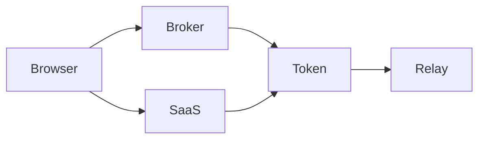
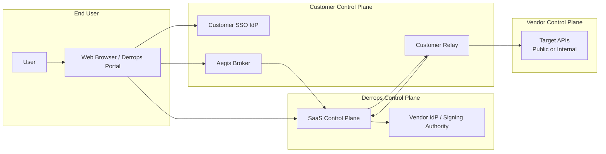
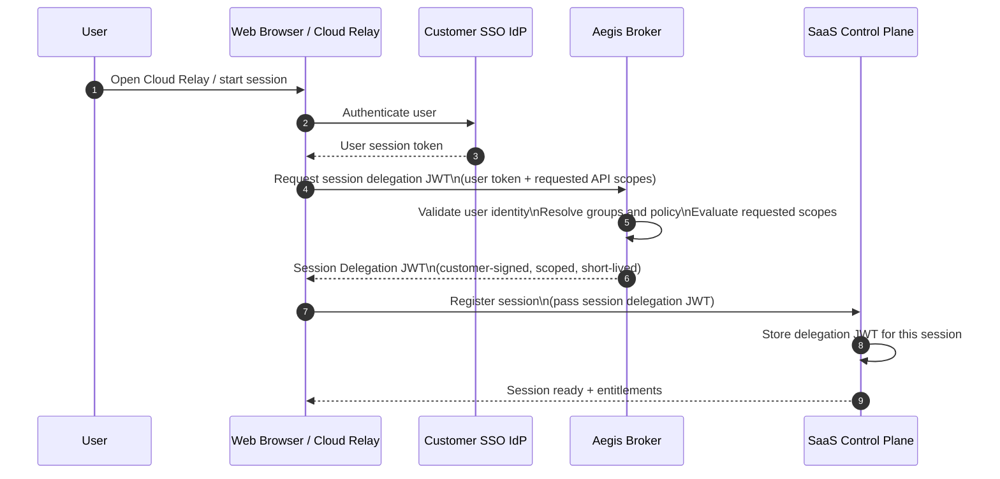
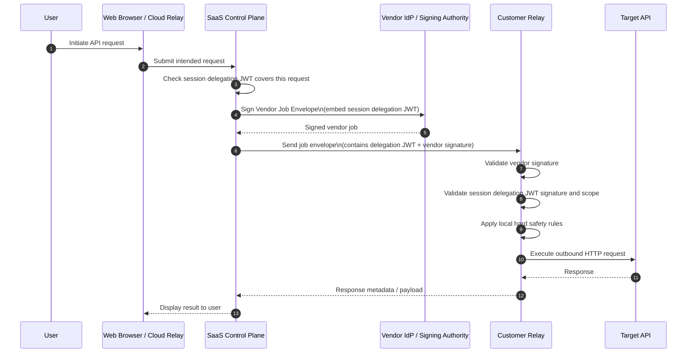
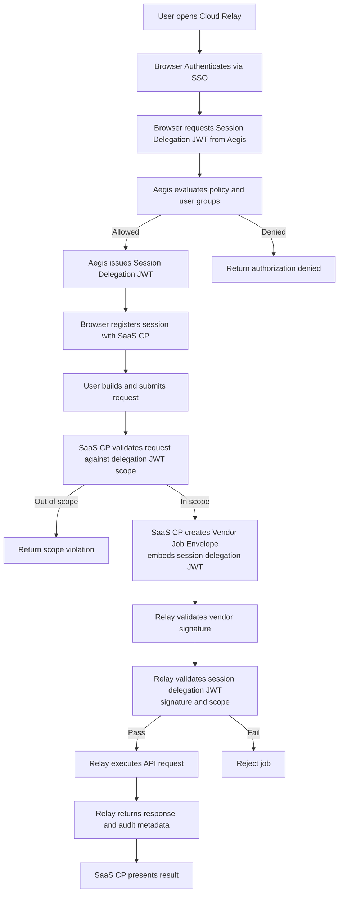
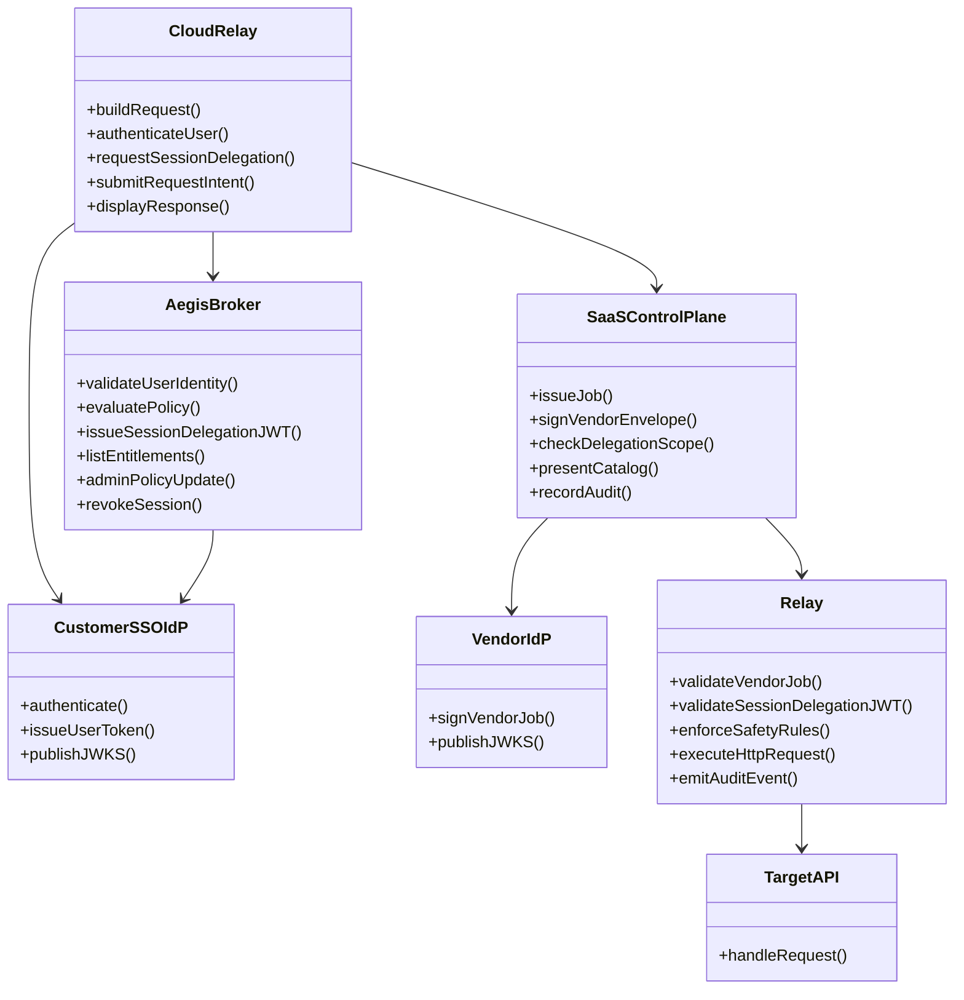
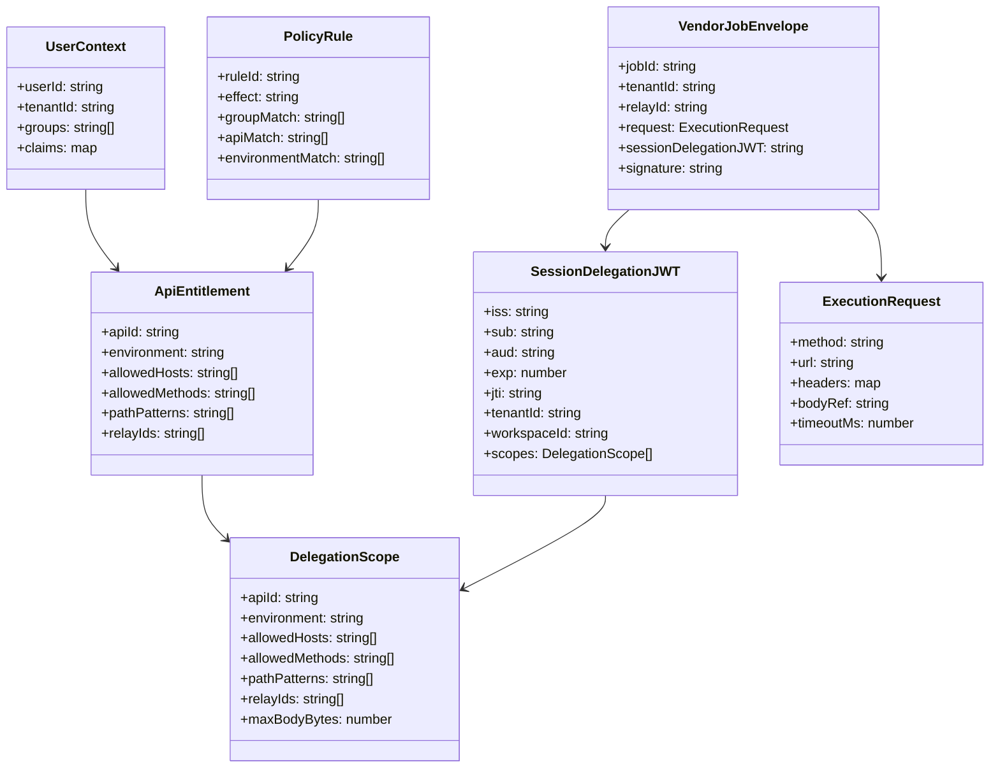
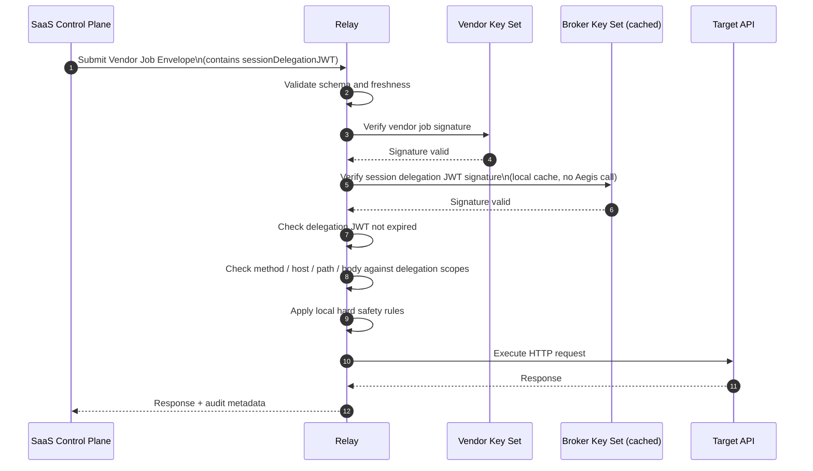
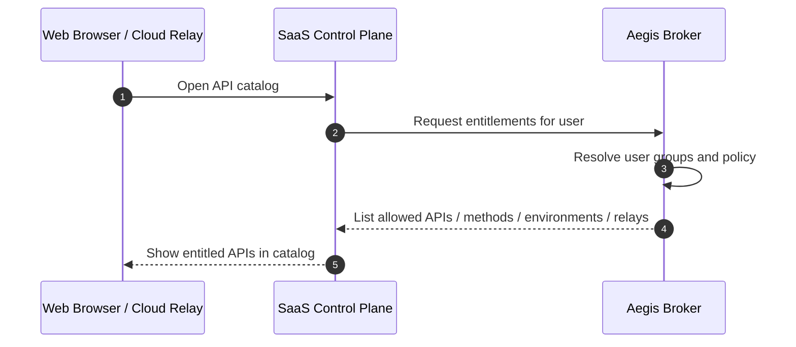

# Aegis Token Broker Design

```
Relay = execution engine + network boundary
```

1. a vendor job from your control plane
2. a customer-issued session delegation grant that your control plane cannot mint or expand

Security Model

:::important
SaaS control plane is not sufficient, by itself, to make the customer relay do work.
:::

What you want is a model where your SaaS control plane is not sufficient, by itself, to make the customer relay do work.

That means the relay should require two independent approvals — but enforced at **session grant time**, not per-request:

# Broker as a customer-controlled authorization service

- OpenAPI spec
- simple deploy (Docker)
- pluggable policy
- optional integration with their IdP



# Aegis Broker Design

## Broker | Relay Token Service Design

**Suggested service name:** **Aegis Broker**

Alternative names:

- Relay Authorization Service
- Execution Grant Broker
- API Entitlement Broker
- TrustBridge Broker

`Aegis Broker` works well because it suggests protection, guardrails, and policy enforcement between the SaaS control plane and the customer-hosted relay.

---

## 1. Purpose

Aegis Broker is a customer-controlled authorization and session delegation service used with a customer-hosted Relay. It integrates with the customer identity provider (SSO / IdP), evaluates customer policy at session start, issues a **session delegation JWT** to the SaaS control plane, and allows the Relay to verify that any request within that session was authorized by both:

1. the **vendor SaaS control plane**, and
2. the **customer-controlled broker** (via the session delegation JWT embedded in every relay job).

This prevents the SaaS control plane from unilaterally causing arbitrary executions through the customer Relay without a customer-issued session grant, while avoiding a per-request Aegis round trip.

---

## 2. Why per-request relay tokens are infeasible

Per-request relay tokens (issuing a new token from Aegis for every single API call) create unacceptable latency and a synchronous dependency on Aegis availability in the hot path of every user interaction:

| Problem                                            | Impact                                                 |
| -------------------------------------------------- | ------------------------------------------------------ |
| Aegis call added to every request                  | Doubles round trips for interactive use                |
| Aegis becomes a single point of failure            | Any Aegis downtime blocks all API calls                |
| High-frequency exploratory use                     | User firing multiple requests in sequence is throttled |
| No meaningful security gain for session-bound work | The user already authenticated at session start        |

The dual-authorization model is preserved by issuing the session delegation JWT **once at session start**, embedding it in every vendor job, and having the Relay verify it. Aegis is in the critical path once per session, not once per request.

---

## 3. Goals

### Primary goals

- Allow a browser-based HTTP client to execute requests without direct browser-to-target CORS dependency.
- Ensure the customer, not the Derrops platform, is the final authority for what APIs may be called.
- Support customer-hosted execution for internal and external APIs.
- Prevent the SaaS control plane from issuing relay jobs without a valid customer session grant.
- Support enterprise SSO and group-based authorization.
- Return entitlements to the main platform so users can see what APIs they can access.
- Avoid per-request Aegis round trips in the interactive request path.

### Non-goals

- The Broker is not intended to be a general API gateway.
- The Broker does not perform the outbound HTTP request itself.
- The browser must not hold downstream API secrets.
- The vendor SaaS control plane should not hold customer downstream API secrets.

---

## 4. Key terms

### Cloud Relay

The browser-based HTTP client UI used by the end user.

### SaaS Control Plane

Vendor-hosted platform responsible for UI orchestration, request modeling, API catalog, auditing, and signed job issuance.

### SSO IdP

Customer identity provider used to authenticate the user.

### Aegis Broker

Customer-controlled authorization and session delegation service.

### Relay

Customer-hosted execution component that performs the outbound HTTP request to the target API.

### Vendor IdP

Vendor identity / trust issuer used by the SaaS control plane to sign vendor job envelopes.

### Session Delegation JWT

A customer-issued short-lived grant issued by Aegis to the SaaS control plane at session start. Covers a set of API scopes, environments, and relay IDs for the authenticated user. Embedded in every vendor job envelope so the Relay can verify customer authorization without calling Aegis per request.

### Vendor Job Envelope

A vendor-signed job payload carrying the request intent and the session delegation JWT.

---

## 5. High-level architecture



---

## 6. Trust model

The Relay only executes a request when all of the following are true:

1. The **Vendor Job Envelope** is valid and signed by the vendor.
2. The **Session Delegation JWT** embedded in the job is valid and signed by the customer Broker.
3. The requested operation is within the session delegation JWT scope.
4. The Relay's local safety controls also allow it.

This creates a **dual-authorization model**:

- **Vendor approval**: request came through the official platform.
- **Customer approval**: SaaS control plane holds a valid customer-issued session grant.

Neither side can independently force execution. The session delegation JWT is issued at session start by Aegis and is opaque to the SaaS control plane — it cannot mint or expand its own grants.

---

## 7. Deployment model

### Recommended enterprise deployment

- **Cloud Relay** runs in the browser.
- **SaaS Control Plane** runs in vendor infrastructure.
- **Aegis Broker** runs in customer infrastructure.
- **Relay** runs in customer infrastructure.
- **SSO IdP** is customer-controlled.
- **Vendor IdP / signing authority** is vendor-controlled.

### Broker runtime options

- Lambda + API Gateway
- ECS / Kubernetes service
- Internal VM / container service
- Existing enterprise middleware service

### Broker UI options

The Broker should be designed **service-first**. UI is optional.

Supported operating models:

1. **Service-only**
   - policy via config / database / GitOps
   - group mapping managed externally
2. **Service + admin UI**
   - delegated admin
   - API entitlements management
   - access visibility
3. **Hybrid**
   - policy managed in customer systems
   - Broker exposes only APIs and entitlement lookup

---

## 8. End-to-end request flow

### 8.1 Session start (once per session)



### 8.2 Per-request execution (N times per session, no Aegis round trip)



---

## 9. Flow diagram



---

## 10. Broker responsibilities

### Identity responsibilities

- validate user identity context from customer SSO at session start
- resolve user groups / roles / claims
- map user to workspace or environment entitlements

### Authorization responsibilities

- evaluate whether the user may access a given set of APIs, environments, and methods
- issue short-lived Session Delegation JWTs scoped to the user's entitlements
- return user entitlements to the SaaS control plane
- revoke active sessions if required (via JWT expiry or a revocation list)

### Administrative responsibilities

- expose entitlement APIs
- optionally expose admin APIs / UI for policy management
- optionally sync or map a global API catalog into local entitlements

---

## 11. Relay responsibilities

- validate vendor job signature
- validate session delegation JWT signature
- enforce delegation JWT scope constraints
- enforce hard local safety rules
- execute outbound HTTP request
- use customer-owned downstream credentials
- produce audit events and execution logs

---

## 12. Why the Broker exists

Without the Broker, the SaaS control plane could sign jobs continuously and the Relay would have no independent customer approval mechanism.

The Broker exists so that:

- the customer controls authorization policy
- the customer signs the session delegation JWT at session start
- the Relay enforces customer limits on every execution without calling Aegis per request
- entitlements can be surfaced back into the SaaS platform

Aegis is in the **critical path once per session**, not once per request. The session delegation JWT carries the customer's approval into every job the SaaS CP creates for that session.

---

## 13. Broker UI and admin model

### Should the Broker have a UI?

**Optional, but useful.**

For many enterprises, first approval is easier if the Broker is only a service with configuration-driven policy.

A UI becomes useful when the customer wants:

- delegated admin
- self-service onboarding of APIs
- group-to-API mapping
- environment-specific visibility
- approval workflows

### Recommended rollout

#### Phase 1

- service-only Broker
- config or DB-backed policy
- entitlement APIs
- no mandatory UI

#### Phase 2

- optional admin UI
- policy editor
- entitlement management
- sync with main platform catalog

---

## 14. Main platform integration for API catalog visibility

The SaaS control plane should remain the **global catalog and user experience layer**.

The Broker should remain the **local authorization oracle**.

### Recommended split

#### SaaS Control Plane

- global API directory
- search / discovery
- request builder UI
- execution history
- audit views
- entitlement-aware presentation

#### Broker

- session delegation grant issuance
- final local authorization decision at session start
- user entitlement resolution
- mapping of customer groups to APIs / environments / methods / paths

### Example integration

At session start, the platform receives the delegation JWT and can show:

- APIs available to the user
- environments they may use
- methods / paths allowed
- denial reasons where appropriate

During the session, the platform checks each request against the cached delegation JWT scope without contacting Aegis again.

---

## 15. Architecture diagram



---

## 16. Domain model / class diagram



---

## 17. Authorization patterns

### Pattern A (recommended): Browser authenticates with Aegis directly at session start

1. Browser authenticates user with customer SSO.
2. Browser requests Session Delegation JWT from Aegis (user token + requested scopes).
3. Aegis validates identity, evaluates policy, issues session delegation JWT.
4. Browser passes delegation JWT to SaaS control plane to register the session.
5. SaaS CP embeds delegation JWT in every vendor job for the session — no further Aegis calls.

**Recommended default** for enterprise deployments. Aegis has direct proof of user identity. The SaaS control plane cannot fabricate or extend delegation JWTs.

### Pattern B: Control plane requests session delegation on behalf of user

1. Browser authenticates user with customer SSO.
2. Browser submits request intent to SaaS control plane with user identity proof.
3. SaaS control plane calls Aegis on behalf of the user to get a session delegation JWT.
4. Aegis validates user context and issues JWT.
5. SaaS CP embeds delegation JWT in vendor jobs.

Simpler browser flow (Aegis does not need to be CORS-accessible), but weakens non-repudiation — Aegis trusts Derrops to faithfully relay user identity.

---

## 18. Relay API contract

### 18.1 Submit execution job

**Endpoint**

```http
POST /v1/jobs/execute
```

**Headers**

```http
Content-Type: application/json
Authorization: Bearer <vendor-control-plane-token>
X-Vendor-Signature: <optional detached signature>
X-Request-Id: <uuid>
```

**Request body**

```json
{
  "jobId": "job_01JX...",
  "tenantId": "westpac-uat",
  "workspaceId": "payments-team",
  "relayId": "relay-westpac-uat-01",
  "submittedAt": "2026-03-22T10:00:00Z",
  "expiresAt": "2026-03-22T10:01:00Z",
  "request": {
    "method": "POST",
    "url": "https://api.partner.com/v1/payments",
    "headers": {
      "content-type": "application/json",
      "accept": "application/json"
    },
    "body": {
      "encoding": "utf-8",
      "contentType": "application/json",
      "content": "{\"amount\":100}"
    },
    "timeoutMs": 15000,
    "followRedirects": false
  },
  "sessionDelegationJWT": "<customer-signed-jwt>",
  "vendorJobSignature": "<vendor-signed-jws>"
}
```

**Response**

```json
{
  "jobId": "job_01JX...",
  "status": "SUCCEEDED",
  "response": {
    "statusCode": 200,
    "headers": {
      "content-type": "application/json"
    },
    "body": "{\"status\":\"ok\"}",
    "durationMs": 423
  },
  "audit": {
    "decision": "ALLOW",
    "ruleId": "payments-uat-post",
    "sessionDelegationJti": "7db3d2af-...",
    "vendorJobId": "job_01JX..."
  }
}
```

### 18.2 Get job status

```http
GET /v1/jobs/{jobId}
```

### 18.3 Health endpoint

```http
GET /v1/health
```

### 18.4 Relay metadata / capabilities

```http
GET /v1/capabilities
```

Example response:

```json
{
  "relayId": "relay-westpac-uat-01",
  "status": "ONLINE",
  "version": "1.2.0",
  "supports": {
    "mTLS": true,
    "http2": true,
    "websocket": false,
    "streaming": true
  }
}
```

---

## 19. Broker API contract

### 19.1 Issue session delegation JWT

```http
POST /v1/sessions
```

**Request**

```json
{
  "tenantId": "westpac-uat",
  "userToken": "<customer-sso-id-token>",
  "requestedScopes": [
    {
      "apiId": "partner-payments",
      "environment": "uat",
      "relayId": "relay-westpac-uat-01"
    },
    {
      "apiId": "customer-profile",
      "environment": "uat",
      "relayId": "relay-westpac-uat-01"
    }
  ]
}
```

**Response**

```json
{
  "sessionDelegationJWT": "<customer-signed-jwt>",
  "expiresAt": "2026-03-22T10:30:00Z",
  "grantedScopes": [
    {
      "apiId": "partner-payments",
      "environment": "uat",
      "allowedMethods": ["GET", "POST"],
      "pathPatterns": ["/v1/payments/*"],
      "relayIds": ["relay-westpac-uat-01"],
      "maxBodyBytes": 262144
    },
    {
      "apiId": "customer-profile",
      "environment": "uat",
      "allowedMethods": ["GET"],
      "pathPatterns": ["/v2/profile/*"],
      "relayIds": ["relay-westpac-uat-01"]
    }
  ],
  "deniedScopes": []
}
```

### 19.2 Revoke session

```http
DELETE /v1/sessions/{jti}
```

### 19.3 List user entitlements

```http
GET /v1/entitlements?tenantId=westpac-uat&userId=derrick@example.com
```

**Response**

```json
{
  "tenantId": "westpac-uat",
  "userId": "derrick@example.com",
  "apis": [
    {
      "apiId": "partner-payments",
      "displayName": "Partner Payments API",
      "environments": ["sandbox", "uat"],
      "allowedMethods": ["GET", "POST"],
      "pathPatterns": ["/v1/payments/*"],
      "relayIds": ["relay-westpac-uat-01"]
    },
    {
      "apiId": "customer-profile",
      "displayName": "Customer Profile API",
      "environments": ["uat"],
      "allowedMethods": ["GET"],
      "pathPatterns": ["/v2/profile/*"],
      "relayIds": ["relay-westpac-uat-01"]
    }
  ]
}
```

### 19.4 Admin policy APIs

#### Upsert policy rule

```http
PUT /v1/admin/policies/{policyId}
```

#### Get policies

```http
GET /v1/admin/policies
```

#### Test decision

```http
POST /v1/admin/policy-decisions/test
```

---

## 20. Job payload format

The Vendor Job Envelope should be explicit, auditable, and signed. The session delegation JWT replaces per-request relay tokens.

### Canonical job format

```json
{
  "jobId": "job_01JX...",
  "version": "2.0",
  "tenantId": "westpac-uat",
  "workspaceId": "payments-team",
  "relayId": "relay-westpac-uat-01",
  "user": {
    "userId": "derrick@example.com",
    "displayName": "Derrick Futschik"
  },
  "request": {
    "method": "POST",
    "url": "https://api.partner.com/v1/payments",
    "headers": {
      "content-type": "application/json",
      "accept": "application/json"
    },
    "body": {
      "contentType": "application/json",
      "encoding": "utf-8",
      "content": "{\"amount\":100}"
    },
    "timeoutMs": 15000,
    "followRedirects": false,
    "maxResponseBodyBytes": 1048576
  },
  "sessionDelegationJWT": "<customer-signed-jwt>",
  "submittedAt": "2026-03-22T10:00:00Z",
  "expiresAt": "2026-03-22T10:01:00Z",
  "trace": {
    "requestId": "6c7b8408-...",
    "correlationId": "6c7b8408-..."
  },
  "vendorJobSignature": "<vendor-signed-jws>"
}
```

### Design notes

- `jobId` is unique per execution.
- `relayId` binds the request to a specific Relay.
- `sessionDelegationJWT` is opaque to the SaaS control plane except for transport — it cannot mint or extend it.
- `expiresAt` keeps jobs short-lived even when the session delegation JWT is longer-lived.
- `vendorJobSignature` protects request integrity.
- `trace` supports auditability.
- **No per-request Aegis call** — the Relay verifies the delegation JWT locally against Broker's published key set.

---

## 21. Session Delegation JWT format

### Suggested JWT claims

```json
{
  "iss": "https://broker.customer.example",
  "sub": "derrick@example.com",
  "aud": "derrops-control-plane",
  "iat": 1774068000,
  "exp": 1774069800,
  "jti": "7db3d2af-0f90-44b2-b98e-6f17f5f9a1df",
  "tenantId": "westpac-uat",
  "workspaceId": "payments-team",
  "scopes": [
    {
      "apiId": "partner-payments",
      "environment": "uat",
      "relayIds": ["relay-westpac-uat-01"],
      "allowedHosts": ["api.partner.com"],
      "allowedMethods": ["GET", "POST"],
      "pathPatterns": ["/v1/payments/*"],
      "maxBodyBytes": 262144
    },
    {
      "apiId": "customer-profile",
      "environment": "uat",
      "relayIds": ["relay-westpac-uat-01"],
      "allowedHosts": ["api.internal.westpac.com"],
      "allowedMethods": ["GET"],
      "pathPatterns": ["/v2/profile/*"],
      "maxBodyBytes": 65536
    }
  ]
}
```

### Recommended properties

- TTL of 15–60 minutes (session-length, not request-length)
- `jti` for session revocation lookups
- audience bound to the SaaS control plane (not the Relay directly)
- scoped to specific APIs, environments, relay IDs
- the Relay validates the JWT against Broker's published JWKS without calling Aegis

---

## 22. Validation flow step-by-step

### Step 1: Receive job

Relay receives `POST /v1/jobs/execute`.

### Step 2: Validate job envelope shape

Check schema, required fields, and version.

### Step 3: Validate job freshness

Reject if:

- `expiresAt` is in the past
- job timestamp outside tolerated skew

### Step 4: Validate vendor signature

Verify the `vendorJobSignature` using the vendor trust key set.

Checks:

- signature valid
- issuer trusted
- relay ID matches this Relay
- tenant binding valid
- job payload not tampered with

### Step 5: Validate Session Delegation JWT signature

Verify `sessionDelegationJWT` using Broker / customer trust key set (fetched from Broker's JWKS endpoint at startup, cached with TTL rotation).

Checks:

- signature valid
- issuer trusted
- token not expired
- token issued for correct tenant / workspace

### Step 6: Session revocation check (optional)

If the customer configures revocation, check the `jti` against Broker's revocation list. For most deployments, short TTL (15–30 min) makes this optional.

### Step 7: Validate request against delegation JWT scopes

Compare the requested execution against the scopes in the delegation JWT:

- method allowed for this apiId
- host allowed
- path allowed
- body size within limit
- relay ID is in the allowed relay list
- redirect behavior allowed

### Step 8: Apply Relay local hard safety rules

These rules are non-bypassable.

Examples:

- block localhost
- block private / loopback / link-local IPs unless explicitly allowed for private relay mode
- block metadata endpoints
- enforce protocol and port restrictions
- strip dangerous headers

### Step 9: Resolve destination and perform safety checks

Resolve DNS if required and evaluate destination safety based on local configuration.

### Step 10: Attach customer-managed downstream credentials

Relay injects the credential mode configured for this target:

- API key
- OAuth client credential token
- mTLS certificate
- internal service identity

### Step 11: Execute outbound HTTP request

Relay sends the request to the target API.

### Step 12: Capture response and audit event

Record:

- status code
- duration
- response size
- allow / deny decision
- matching policy scope
- session delegation JWT `jti`

### Step 13: Return result

Send the response back to the SaaS control plane for presentation to the browser.

---

## 23. Detailed validation sequence diagram



---

## 24. Entitlement discovery flow



---

## 25. Policy model

### Recommended coarse-to-fine approach

#### Coarse access

Managed through customer IdP groups, such as:

- `payments-read`
- `payments-write`
- `uat-users`
- `prod-approvers`

#### Fine-grained access

Managed in Broker policy, such as:

- allowed API IDs
- allowed environments
- allowed methods
- allowed path patterns
- allowed Relay IDs
- max body size
- time windows
- session TTL

### Example policy rule

```json
{
  "policyId": "payments-uat-post",
  "groups": ["payments-write", "uat-users"],
  "apiId": "partner-payments",
  "environment": "uat",
  "relayIds": ["relay-westpac-uat-01"],
  "allowedHosts": ["api.partner.com"],
  "allowedMethods": ["POST"],
  "pathPatterns": ["/v1/payments/*"],
  "maxBodyBytes": 262144,
  "sessionTtlSeconds": 1800
}
```

---

## 26. Suggested admin UI capabilities

If an admin UI is later added, recommended capabilities are:

- view APIs known from the global catalog
- map customer groups to APIs / environments
- assign Relay IDs to environments
- define path / method constraints
- test policy decisions
- inspect denied requests
- revoke active sessions
- rotate Broker signing keys
- view Relay health and version

---

## 27. Security recommendations

- Use short-to-medium TTL session delegation JWTs (15–60 minutes).
- Broker signing keys published via JWKS and cached by the Relay at startup.
- Rotate JWKS keys on a schedule; Relay re-fetches on key ID miss.
- Bind session delegation JWT to tenant and workspace.
- Keep downstream credentials only in the Relay.
- Treat Relay safety rules as immutable local controls.
- Use signed job envelopes rather than unsigned requests.
- Log metadata by default, not raw secrets or bodies.
- Separate global catalog visibility from local execution permission.
- Support session revocation via `jti` list for high-security tenants.

---

## 28. Recommended product positioning

### Main platform

- global API catalog
- search and discovery
- browser request builder
- execution history
- audit and reporting
- user experience and workflow

### Aegis Broker

- customer authorization authority
- session delegation grant issuer
- entitlement provider
- JWKS publisher for Relay validation
- optional admin policy plane

### Relay

- execution engine
- credential holder
- network boundary
- policy enforcement point
- validates delegation JWT locally (no Aegis call per request)

---

## 29. Final recommendation

Use **Aegis Broker** as the customer-controlled authorization and session delegation service, paired with a customer-hosted Relay.

The dual-authorization model is preserved: neither the SaaS control plane nor the Relay can act without a valid customer-issued session delegation JWT. Aegis is in the critical path **once per session**, not once per request.

This design gives:

- strong enterprise trust boundaries
- customer control over authorization
- no per-request Aegis latency in the interactive request path
- browser usability without target-side CORS dependency
- clean separation between vendor control plane and customer execution plane
- a path to rich entitlement-aware catalog UX in the main platform
- session revocation capability for high-security tenants

---

## 30. Module Structure

Aegis Broker is a standalone **NestJS application** managed as a **git subtree** at `apps-aegis/` in the monorepo — the same workflow used for `apps/derrops-portal/` and `apps/derrops-cloud-relay/`. It is independently deployable into customer environments and may eventually be open-sourced.

The structure mirrors `apps/derrops-cloud-relay/`: a cloud-agnostic `app/` core plus cloud-specific sub-packages for implementations that depend on a particular cloud provider.

```
apps/derrops-aegis/
├── app/                              # NestJS core — cloud-agnostic, env-var config only
│   └── src/
│       ├── identity/
│       │   ├── identity-provider.ts           # IdentityProvider interface + error types
│       │   ├── identity-provider-registry.ts  # Registry + factory
│       │   └── oidc-identity-provider.ts      # Built-in: generic OIDC/OAuth2
│       ├── policy/
│       │   ├── policy-store.ts                # PolicyStore interface
│       │   ├── policy-store-registry.ts
│       │   ├── in-process-policy-store.ts     # Built-in: JSON rules (file or env-embedded)
│       │   └── opa-policy-store.ts            # Built-in: Open Policy Agent (HTTP sidecar)
│       ├── session/
│       │   ├── session-store.ts               # SessionStore interface (revocation list)
│       │   ├── session-store-registry.ts
│       │   └── in-memory-session-store.ts     # Built-in: dev / single-node
│       ├── signing/
│       │   ├── signing-key-provider.ts        # SigningKeyProvider interface + JWKS
│       │   ├── signing-key-provider-registry.ts
│       │   └── local-signing-key-provider.ts  # Built-in: local RSA keypair (Docker/dev)
│       ├── entitlements/
│       │   ├── entitlement-store.ts           # EntitlementStore interface
│       │   ├── entitlement-store-registry.ts
│       │   └── static-entitlement-store.ts    # Built-in: config-file / env-embedded JSON
│       ├── broker/
│       │   ├── broker.controller.ts           # POST /v1/sessions, DELETE /v1/sessions/:jti
│       │   └── broker.service.ts              # Session issuance + revocation orchestration
│       ├── entitlements/
│       │   └── entitlements.controller.ts     # GET /v1/entitlements
│       ├── admin/
│       │   └── admin.controller.ts            # Policy CRUD + POST /v1/admin/policy-decisions/test
│       ├── health/
│       │   └── health.controller.ts           # GET /v1/health, GET /v1/capabilities
│       ├── jwks/
│       │   └── jwks.controller.ts             # GET /.well-known/jwks.json
│       ├── broker.module.ts                   # NestJS root module — wires all sub-modules
│       └── aegis-app.ts                       # createAegisApp() factory
│
├── app-aws/                          # AWS-specific implementations
│   └── src/
│       ├── session/
│       │   └── dynamo-session-store.ts        # DynamoDB-backed revocation list
│       └── signing/
│           └── kms-signing-key-provider.ts    # AWS KMS asymmetric key (RS256 / ES256)
│
├── app-azure/                        # Azure-specific implementations
│   └── src/
│       ├── session/
│       │   └── cosmos-session-store.ts        # Cosmos DB revocation list
│       └── signing/
│           └── azure-keyvault-signing-provider.ts
│
├── app-cp/                           # GCP-specific implementations
│   └── src/
│       ├── session/
│       │   └── firestore-session-store.ts
│       └── signing/
│           └── gcp-kms-signing-provider.ts
│
├── infra/                            # Self-contained deployment infrastructure
│   ├── aws/                          # AWS CDK stack — standalone, no derrops-infra dependency
│   │   ├── bin/
│   │   │   └── cdk.ts               # CDK app entry point
│   │   ├── lib/
│   │   │   └── aegis-stack.ts       # AegisStack: Lambda/ECS, API Gateway, KMS key
│   │   ├── cdk.json
│   │   └── package.json             # Standalone CDK package
│   ├── azure/                        # Bicep / ARM — Azure Container Apps + Key Vault
│   └── gcp/                          # Terraform — Cloud Run + Cloud KMS
│
├── Dockerfile                        # Cloud-agnostic container build
└── docker-compose.yml                # Local / VM deployment with env-var config
```

### Design principles

- **Cloud-agnostic core**: `app/` has no AWS/Azure/GCP SDK dependencies. It uses only environment variables and the pluggable interfaces below.
- **No `@derrops/config` dependency**: all configuration is via environment variables so customers can deploy without the monorepo's shared config module.
- **Self-contained infrastructure**: `infra/` at the root of `apps/derrops-aegis` ships all deployment templates needed to run Aegis. There is no dependency on `packages/derrops-infra` (which is private to the Derrops platform and is never distributed to customers). A customer deploys by running `cd infra/aws && cdk deploy` — no private Derrops packages required.
- **Parallel to `apps/derrops-cloud-relay/`**: same directory conventions, same registry/factory pattern, same `infra/` layout at the package root, same deployment model.

---

## 31. Pluggable Service Interfaces

Aegis defines five pluggable service interfaces — one for each concern that a customer may want to replace with their own implementation. Every interface follows the same pattern:

1. Interface defined in `app/src/<domain>/`
2. A typed error class (`XxxError`) with a `code` discriminant
3. A `XxxRegistry` with a `register(name, factory)` / `create(env)` pair
4. Built-in implementations self-register in their package entry point
5. Customers register custom implementations before calling `createAegisApp()`

---

### 31.1 `IdentityProvider`

Validates a user token from the customer's SSO at session start and resolves group membership / claims. Called once per session during `POST /v1/sessions`.

```typescript
// app/src/identity/identity-provider.ts

export type VerifiedUserContext = {
  /** Stable unique identifier for the user (e.g. sub claim). */
  userId: string
  /** Primary email address. */
  email: string
  /** Group or role names resolved from the IdP (used by PolicyStore evaluation). */
  groups: string[]
  /** All raw claims from the verified token, for use by custom policy implementations. */
  claims: Record<string, unknown>
}

export class IdentityProviderError extends Error {
  constructor(
    message: string,
    public readonly code:
      | 'TOKEN_INVALID' // Signature invalid, malformed, or wrong issuer
      | 'TOKEN_EXPIRED' // Token has passed its exp claim
      | 'USER_NOT_FOUND' // Token valid but user cannot be resolved
      | 'PROVIDER_UNAVAILABLE', // IdP JWKS or userinfo endpoint unreachable
    public readonly provider: string,
  ) {
    super(message)
    this.name = 'IdentityProviderError'
  }
}

export interface IdentityProvider {
  /**
   * Verify a user token (typically an OIDC ID token or access token) and
   * return the resolved user context including groups.
   *
   * @throws IdentityProviderError on any verification failure.
   */
  verifyUserToken(token: string): Promise<VerifiedUserContext>

  /**
   * Optional: fetch the current group membership for a user independently
   * of token claims. Useful when group membership changes more frequently
   * than token issuance (e.g. just-in-time group provisioning).
   */
  listGroups?(userId: string): Promise<string[]>
}
```

**Built-in implementations:**

| `AEGIS_IDENTITY_PROVIDER` | Package | Description                                                                                                        |
| ------------------------- | ------- | ------------------------------------------------------------------------------------------------------------------ |
| `oidc`                    | `app/`  | Generic OIDC/OAuth2 — fetches JWKS from `AEGIS_OIDC_ISSUER/.well-known/jwks.json`, verifies signature and audience |

**Customer-extensible**: Okta, Azure AD, PingFederate, custom SAML bridge — implement `IdentityProvider` and register as `'saml'`, `'okta'`, etc.

---

### 31.2 `PolicyStore`

Evaluates whether a verified user context should be granted the requested delegation scopes, and by how much. Also exposes admin APIs for managing rules and testing decisions.

```typescript
// app/src/policy/policy-store.ts

export type RequestedScope = {
  apiId: string
  environment: string
  relayId: string
}

export type GrantedScope = RequestedScope & {
  allowedHosts: string[]
  allowedMethods: string[]
  pathPatterns: string[]
  maxBodyBytes: number
  sessionTtlSeconds: number
}

export type PolicyDecision = {
  grantedScopes: GrantedScope[]
  /** Scopes from the request that were denied, with the reason. */
  deniedScopes: Array<{ scope: RequestedScope; reason: string }>
}

export class PolicyStoreError extends Error {
  constructor(
    message: string,
    public readonly code: 'EVALUATION_FAILED' | 'STORE_UNAVAILABLE' | 'RULE_CONFLICT',
  ) {
    super(message)
    this.name = 'PolicyStoreError'
  }
}

export interface PolicyStore {
  /**
   * Evaluate whether the user may be granted the requested scopes.
   * Returns granted and denied scopes with reasons.
   */
  evaluate(userCtx: VerifiedUserContext, requestedScopes: RequestedScope[]): Promise<PolicyDecision>

  /** Upsert a policy rule. Used by the admin API. */
  upsertRule(rule: PolicyRule): Promise<void>

  /** List all policy rules. */
  listRules(): Promise<PolicyRule[]>

  /**
   * Dry-run an evaluation against a hypothetical user context.
   * Used by POST /v1/admin/policy-decisions/test.
   */
  testDecision(
    userCtx: VerifiedUserContext,
    requestedScopes: RequestedScope[],
  ): Promise<PolicyDecision>
}
```

**Built-in implementations:**

| `AEGIS_POLICY_STORE` | Package | Description                                                                                                                                                             |
| -------------------- | ------- | ----------------------------------------------------------------------------------------------------------------------------------------------------------------------- |
| `in-process`         | `app/`  | JSON rules loaded from `AEGIS_POLICY_FILE` or `AEGIS_POLICY_JSON` env var at startup. Read-only at runtime (restart to reload).                                         |
| `opa`                | `app/`  | Delegates evaluation to an Open Policy Agent HTTP sidecar via `AEGIS_OPA_URL`. Rule management APIs pass through to OPA's REST API. Suitable for GitOps-managed policy. |

**Customer-extensible**: database-backed rules, Cedar policy engine, custom enterprise policy service.

---

### 31.3 `SessionStore`

Persists active session JTIs and supports revocation. Aegis issues a `jti` with every session delegation JWT — this store enables `DELETE /v1/sessions/{jti}` and `isRevoked` checks by the Relay.

Short-TTL deployments (≤ 15 min) may use `in-memory` without needing a persistent store.

```typescript
// app/src/session/session-store.ts

export type SessionMetadata = {
  tenantId: string
  userId: string
  workspaceId: string
  grantedScopeCount: number
}

export type SessionRecord = {
  jti: string
  expiresAt: Date
  revokedAt?: Date
  metadata: SessionMetadata
}

export class SessionStoreError extends Error {
  constructor(
    message: string,
    public readonly code: 'NOT_FOUND' | 'ALREADY_REVOKED' | 'STORE_UNAVAILABLE',
  ) {
    super(message)
    this.name = 'SessionStoreError'
  }
}

export interface SessionStore {
  /** Persist a newly issued session delegation JWT by its JTI. */
  save(jti: string, expiresAt: Date, metadata: SessionMetadata): Promise<void>

  /**
   * Mark a session as revoked.
   * @throws SessionStoreError with code 'NOT_FOUND' if JTI is unknown.
   * @throws SessionStoreError with code 'ALREADY_REVOKED' if already revoked.
   */
  revoke(jti: string): Promise<void>

  /**
   * Check whether a session has been explicitly revoked.
   * Returns false for unknown JTIs (expired entries may be purged).
   */
  isRevoked(jti: string): Promise<boolean>

  /**
   * Optional: list active (non-expired, non-revoked) sessions for a tenant.
   * Used by admin tooling. Implementations that do not support listing
   * (e.g. in-memory) may return null.
   */
  listActive?(tenantId: string): Promise<SessionRecord[] | null>
}
```

**Built-in implementations:**

| `AEGIS_SESSION_STORE` | Package      | Description                                                                                                         |
| --------------------- | ------------ | ------------------------------------------------------------------------------------------------------------------- |
| `in-memory`           | `app/`       | Process-local Map — clears on restart. Suitable for dev and single-instance Docker deployments with short JWT TTLs. |
| `dynamo`              | `app-aws/`   | DynamoDB table with TTL — auto-purges expired entries. IAM role auth.                                               |
| `cosmos`              | `app-azure/` | Azure Cosmos DB with TTL. Managed identity auth.                                                                    |
| `firestore`           | `app-cp/`    | GCP Firestore with TTL. Workload Identity auth.                                                                     |

**Customer-extensible**: Redis (`ioredis`), PostgreSQL, custom enterprise session service.

---

### 31.4 `SigningKeyProvider`

Provides the asymmetric signing key used to mint session delegation JWTs and publishes the corresponding JWKS for the Relay to validate those JWTs locally. This is the most security-critical interface — in production, the private key should never leave the HSM/KMS.

```typescript
// app/src/signing/signing-key-provider.ts

export type JsonWebKeySet = {
  keys: JsonWebKey[]
}

export class SigningKeyProviderError extends Error {
  constructor(
    message: string,
    public readonly code:
      | 'KEY_UNAVAILABLE' // KMS/vault unreachable
      | 'SIGNING_FAILED' // Key exists but signing operation failed
      | 'KEY_NOT_FOUND', // Key ID not found in provider
  ) {
    super(message)
    this.name = 'SigningKeyProviderError'
  }
}

export interface SigningKeyProvider {
  /**
   * Sign a JWT payload and return the compact serialised JWT string.
   * The implementation is responsible for setting `kid`, `alg`, `iat`, and `exp`
   * in the JOSE header and embedding them consistently with getPublicJwks().
   *
   * @throws SigningKeyProviderError on any signing failure.
   */
  sign(payload: Record<string, unknown>): Promise<string>

  /**
   * Return the public JWKS for all active signing keys.
   * Served at GET /.well-known/jwks.json for the Relay to cache at startup
   * and re-fetch on key ID miss.
   */
  getPublicJwks(): Promise<JsonWebKeySet>

  /**
   * Optional: trigger a key rotation. Implementations that manage rotation
   * externally (e.g. KMS automatic rotation schedules) may leave this unimplemented.
   * When implemented, the new key should appear in getPublicJwks() immediately
   * and the old key should remain for at least one JWT TTL period.
   */
  rotateKeys?(): Promise<void>
}
```

**Built-in implementations:**

| `AEGIS_SIGNING_KEY_PROVIDER` | Package      | Description                                                                                                       |
| ---------------------------- | ------------ | ----------------------------------------------------------------------------------------------------------------- |
| `local`                      | `app/`       | RSA-2048 keypair from `AEGIS_LOCAL_PRIVATE_KEY_PEM` (base64 PEM). For Docker/dev only — key is in process memory. |
| `kms`                        | `app-aws/`   | AWS KMS asymmetric key (RS256 or ES256). Private key never leaves KMS. Key ID via `AEGIS_KMS_KEY_ID`.             |
| `azure-keyvault`             | `app-azure/` | Azure Key Vault key. Managed identity auth. Key ID via `AEGIS_AZURE_KEY_VAULT_KEY_ID`.                            |
| `gcp-kms`                    | `app-cp/`    | GCP Cloud KMS asymmetric signing key. Workload Identity auth.                                                     |

---

### 31.5 `EntitlementStore`

Stores the group-to-API entitlement mappings that determine which APIs a user may request access to. This feeds both `PolicyStore.evaluate()` (to intersect user groups against allowed scopes) and the `GET /v1/entitlements` endpoint (to surface what a user can access in the portal catalog).

```typescript
// app/src/entitlements/entitlement-store.ts

export type EntitlementRule = {
  ruleId: string
  /** IdP group names this rule applies to. */
  groups: string[]
  apiId: string
  environment: string
  relayIds: string[]
  allowedHosts: string[]
  allowedMethods: string[]
  pathPatterns: string[]
  maxBodyBytes: number
  sessionTtlSeconds: number
}

export type ApiEntitlement = {
  apiId: string
  displayName?: string
  environments: string[]
  allowedMethods: string[]
  pathPatterns: string[]
  relayIds: string[]
}

export class EntitlementStoreError extends Error {
  constructor(
    message: string,
    public readonly code: 'NOT_FOUND' | 'STORE_UNAVAILABLE' | 'CONFLICT',
  ) {
    super(message)
    this.name = 'EntitlementStoreError'
  }
}

export interface EntitlementStore {
  /**
   * Return all entitlements for a user, derived by intersecting the user's
   * groups with stored rules. Used by PolicyStore and the entitlements API.
   */
  getEntitlementsForUser(tenantId: string, userCtx: VerifiedUserContext): Promise<ApiEntitlement[]>

  /**
   * Return all raw entitlement rules for a tenant.
   * Used by the admin API and for displaying the full policy set.
   */
  listEntitlements(tenantId: string): Promise<EntitlementRule[]>

  /**
   * Upsert an entitlement rule. Implementations backed by a read-only source
   * (e.g. static file) should throw EntitlementStoreError with code 'CONFLICT'.
   */
  upsertEntitlement(tenantId: string, rule: EntitlementRule): Promise<void>
}
```

**Built-in implementations:**

| `AEGIS_ENTITLEMENT_STORE` | Package | Description                                                                                                                                                                 |
| ------------------------- | ------- | --------------------------------------------------------------------------------------------------------------------------------------------------------------------------- |
| `static`                  | `app/`  | JSON rules loaded from `AEGIS_ENTITLEMENT_FILE` or `AEGIS_ENTITLEMENT_JSON` at startup. Read-only at runtime — restart to reload. Suitable for GitOps-managed entitlements. |

**Customer-extensible**: database-backed (PostgreSQL, DynamoDB), synced from the main SaaS platform API catalog, managed via the optional admin UI.

---

## 32. Registry and Factory Pattern

Every interface uses the same registry/factory pattern — identical in structure to `SecretStoreRegistry` in `apps/derrops-cloud-relay/`.

```typescript
// app/src/identity/identity-provider-registry.ts (example — pattern is identical for all 5 interfaces)

/** A factory receives the process environment and returns a configured implementation. */
export type IdentityProviderFactory = (env: NodeJS.ProcessEnv) => IdentityProvider

export class IdentityProviderRegistry {
  private readonly registry = new Map<string, IdentityProviderFactory>()

  /** Register a named factory. Throws if the name is already registered. */
  register(name: string, factory: IdentityProviderFactory): void {
    if (this.registry.has(name)) {
      throw new Error(`IdentityProvider '${name}' is already registered`)
    }
    this.registry.set(name, factory)
  }

  /**
   * Instantiate the active implementation from AEGIS_IDENTITY_PROVIDER.
   * Throws if the name is not registered.
   */
  create(env: NodeJS.ProcessEnv): IdentityProvider {
    const name = env.AEGIS_IDENTITY_PROVIDER
    if (!name) throw new Error('AEGIS_IDENTITY_PROVIDER is not set')
    const factory = this.registry.get(name)
    if (!factory) throw new Error(`No IdentityProvider registered for '${name}'`)
    return factory(env)
  }
}

export const identityProviderRegistry = new IdentityProviderRegistry()
```

The five singleton registries exported from `app/`:

```typescript
export { identityProviderRegistry } // AEGIS_IDENTITY_PROVIDER
export { policyStoreRegistry } // AEGIS_POLICY_STORE
export { sessionStoreRegistry } // AEGIS_SESSION_STORE
export { signingKeyProviderRegistry } // AEGIS_SIGNING_KEY_PROVIDER
export { entitlementStoreRegistry } // AEGIS_ENTITLEMENT_STORE
```

Built-in implementations self-register in their package entry points:

```typescript
// app/src/index.ts — built-in registrations
identityProviderRegistry.register('oidc', (env) => new OidcIdentityProvider(env))
policyStoreRegistry.register('in-process', (env) => new InProcessPolicyStore(env))
policyStoreRegistry.register('opa', (env) => new OpaPolicyStore(env))
sessionStoreRegistry.register('in-memory', () => new InMemorySessionStore())
signingKeyProviderRegistry.register('local', (env) => new LocalSigningKeyProvider(env))
entitlementStoreRegistry.register('static', (env) => new StaticEntitlementStore(env))

// app-aws/src/index.ts
sessionStoreRegistry.register('dynamo', (env) => new DynamoSessionStore(env))
signingKeyProviderRegistry.register('kms', (env) => new KmsSigningKeyProvider(env))

// app-azure/src/index.ts
sessionStoreRegistry.register('cosmos', (env) => new CosmosSessionStore(env))
signingKeyProviderRegistry.register(
  'azure-keyvault',
  (env) => new AzureKeyVaultSigningProvider(env),
)

// app-cp/src/index.ts
sessionStoreRegistry.register('firestore', (env) => new FirestoreSessionStore(env))
signingKeyProviderRegistry.register('gcp-kms', (env) => new GcpKmsSigningProvider(env))
```

---

## 33. Bringing Your Own Implementation

Customers who need a backend not provided out of the box register their implementation before `createAegisApp()`. This applies to all five interfaces.

```typescript
// customer-aegis/src/main.ts

import { createAegisApp, sessionStoreRegistry, policyStoreRegistry } from '@derrops/aegis'

import { RedisSessionStore } from './redis-session-store'
import { CyberArkPolicyStore } from './cyberark-policy-store'

// Register custom implementations before bootstrap.
// AEGIS_SESSION_STORE=redis and AEGIS_POLICY_STORE=cyberark must be set in env.
sessionStoreRegistry.register(
  'redis',
  (env) =>
    new RedisSessionStore({
      url: env.REDIS_URL!,
      tlsCert: env.REDIS_TLS_CERT,
    }),
)

policyStoreRegistry.register(
  'cyberark',
  (env) =>
    new CyberArkPolicyStore({
      baseUrl: env.CYBERARK_BASE_URL!,
      appId: env.CYBERARK_APP_ID!,
    }),
)

const app = await createAegisApp()
await app.listen(process.env.PORT ?? 3001)
```

A custom `SessionStore` only needs to implement the interface — no other Aegis internals are required:

```typescript
// customer-aegis/src/redis-session-store.ts

import { SessionStore, SessionMetadata, SessionRecord, SessionStoreError } from '@derrops/aegis'
import { createClient } from 'redis'

export class RedisSessionStore implements SessionStore {
  private client = createClient({ url: this.config.url })

  constructor(private readonly config: { url: string; tlsCert?: string }) {}

  async save(jti: string, expiresAt: Date, metadata: SessionMetadata): Promise<void> {
    const ttlSeconds = Math.floor((expiresAt.getTime() - Date.now()) / 1000)
    await this.client.setEx(`session:${jti}`, ttlSeconds, JSON.stringify({ expiresAt, metadata }))
  }

  async revoke(jti: string): Promise<void> {
    const existing = await this.client.get(`session:${jti}`)
    if (!existing) throw new SessionStoreError(`Session ${jti} not found`, 'NOT_FOUND')
    await this.client.setEx(`revoked:${jti}`, 86400, '1') // keep revocation marker for 24 h
    await this.client.del(`session:${jti}`)
  }

  async isRevoked(jti: string): Promise<boolean> {
    return (await this.client.exists(`revoked:${jti}`)) === 1
  }

  async listActive(tenantId: string): Promise<SessionRecord[] | null> {
    return null // not implemented — returns null to indicate unsupported
  }
}
```

---

## 34. NestJS Application Bootstrap

`createAegisApp()` handles module wiring and reads all registries to instantiate the active implementations. It is the single entry point whether running as Docker, Lambda, or any other runtime.

```typescript
// app/src/aegis-app.ts

import { NestFactory } from '@nestjs/core'
import { BrokerModule } from './broker.module'
import {
  identityProviderRegistry,
  policyStoreRegistry,
  sessionStoreRegistry,
  signingKeyProviderRegistry,
  entitlementStoreRegistry,
} from './index'

/**
 * Bootstrap the Aegis application.
 *
 * Call registries' register() methods before this to inject custom implementations.
 * Uses environment variables exclusively for configuration.
 */
export async function createAegisApp() {
  const env = process.env

  // Instantiate all pluggable services from the registries.
  // Each create() call reads its AEGIS_* env var to select the right factory.
  const services = {
    identityProvider: identityProviderRegistry.create(env),
    policyStore: policyStoreRegistry.create(env),
    sessionStore: sessionStoreRegistry.create(env),
    signingKeyProvider: signingKeyProviderRegistry.create(env),
    entitlementStore: entitlementStoreRegistry.create(env),
  }

  const app = await NestFactory.create(BrokerModule.forRoot(services))

  app.setGlobalPrefix('v1')
  // ValidationPipe, exception filters, logging middleware wired here

  return app
}
```

`BrokerModule.forRoot(services)` uses NestJS dynamic modules to inject all services as providers, keeping the core module testable with mock implementations:

```typescript
// app/src/broker.module.ts

@Module({})
export class BrokerModule {
  static forRoot(services: AegisServices): DynamicModule {
    return {
      module: BrokerModule,
      providers: [
        { provide: IDENTITY_PROVIDER, useValue: services.identityProvider },
        { provide: POLICY_STORE, useValue: services.policyStore },
        { provide: SESSION_STORE, useValue: services.sessionStore },
        { provide: SIGNING_KEY_PROVIDER, useValue: services.signingKeyProvider },
        { provide: ENTITLEMENT_STORE, useValue: services.entitlementStore },
        BrokerService,
        SessionService,
      ],
      controllers: [
        BrokerController,
        EntitlementsController,
        AdminController,
        HealthController,
        JwksController,
      ],
    }
  }
}
```

---

## 35. JWKS Endpoint

Aegis exposes `GET /.well-known/jwks.json` served by `JwksController` via `SigningKeyProvider.getPublicJwks()`. This is the endpoint the Relay fetches at startup to cache the public key set for local JWT validation — no Aegis round trip per request.

Key rotation behaviour:

- When `rotateKeys()` is called (manually or on a schedule), the new key ID appears in the JWKS immediately.
- The old key ID must remain in the JWKS for at least one full JWT TTL period so in-flight sessions remain verifiable.
- The Relay re-fetches JWKS when it encounters an unknown `kid` in an incoming JWT header, picking up new keys without a restart.

```typescript
// app/src/jwks/jwks.controller.ts

@Controller()
export class JwksController {
  constructor(
    @Inject(SIGNING_KEY_PROVIDER)
    private readonly signingKeyProvider: SigningKeyProvider,
  ) {}

  @Get('.well-known/jwks.json')
  async getJwks(): Promise<JsonWebKeySet> {
    return this.signingKeyProvider.getPublicJwks()
  }
}
```

---

## 36. Deployment Model

All deployment templates live in `infra/` at the root of `apps/derrops-aegis`. There is no dependency on `packages/derrops-infra` or any other private Derrops package.

| Method                         | Infrastructure                  | Sub-package              | Notes                                                                                              |
| ------------------------------ | ------------------------------- | ------------------------ | -------------------------------------------------------------------------------------------------- |
| **Docker**                     | `docker-compose.yml` (root)     | `app/` + chosen `app-*/` | `docker run` with env vars. Use Docker Compose to add Redis/Postgres for session store if needed.  |
| **Lambda + API Gateway (AWS)** | `infra/aws/` CDK stack          | `app-aws/`               | Cold start acceptable — Aegis is in the critical path once per session, not per request.           |
| **ECS / Fargate (AWS)**        | `infra/aws/` CDK stack          | `app-aws/`               | Preferred for high-availability enterprise AWS deployments. Persistent session store via DynamoDB. |
| **Kubernetes**                 | Customer-managed Helm/manifests | any `app/`               | `app/` with optional OPA sidecar pod for policy. Suitable for multi-cloud and on-premises.         |
| **Azure Container Apps**       | `infra/azure/` Bicep            | `app-azure/`             | Cosmos DB session store + Key Vault signing key.                                                   |
| **GCP Cloud Run**              | `infra/gcp/` Terraform          | `app-cp/`                | Firestore session store + Cloud KMS signing key.                                                   |

### Self-hosting on AWS (quick start)

```bash
cd apps/derrops-aegis/infra/aws
npm install
cdk bootstrap   # once per account/region
cdk deploy
```

No Derrops private packages, no `packages/derrops-infra`, no Amplify dependency. All configuration is passed as environment variables to the deployed function or container.

---

## 37. Environment Variables

All configuration is via environment variables. No `@derrops/config` dependency.

| Variable                      | Required        | Description                                                              |
| ----------------------------- | --------------- | ------------------------------------------------------------------------ |
| `AEGIS_IDENTITY_PROVIDER`     | Yes             | IdP adapter: `oidc`, or custom registered name                           |
| `AEGIS_OIDC_ISSUER`           | If `oidc`       | OIDC issuer URL — JWKS fetched from `{issuer}/.well-known/jwks.json`     |
| `AEGIS_OIDC_AUDIENCE`         | If `oidc`       | Expected `aud` claim in the user token                                   |
| `AEGIS_POLICY_STORE`          | Yes             | Policy backend: `in-process`, `opa`, or custom                           |
| `AEGIS_POLICY_FILE`           | If `in-process` | Absolute path to JSON policy rules file                                  |
| `AEGIS_POLICY_JSON`           | If `in-process` | Inline JSON policy rules (alternative to file — useful in Lambda)        |
| `AEGIS_OPA_URL`               | If `opa`        | Base URL of the OPA HTTP API (e.g. `http://localhost:8181`)              |
| `AEGIS_SESSION_STORE`         | Yes             | Session backend: `in-memory`, `dynamo`, `cosmos`, `firestore`, or custom |
| `AEGIS_DYNAMO_TABLE`          | If `dynamo`     | DynamoDB table name for session records                                  |
| `AEGIS_SIGNING_KEY_PROVIDER`  | Yes             | Signing backend: `local`, `kms`, `azure-keyvault`, `gcp-kms`             |
| `AEGIS_LOCAL_PRIVATE_KEY_PEM` | If `local`      | RSA private key as base64-encoded PEM. Dev/Docker only.                  |
| `AEGIS_KMS_KEY_ID`            | If `kms`        | AWS KMS key ID or ARN for the asymmetric signing key                     |
| `AEGIS_ENTITLEMENT_STORE`     | Yes             | Entitlement backend: `static`, or custom                                 |
| `AEGIS_ENTITLEMENT_FILE`      | If `static`     | Absolute path to JSON entitlement rules file                             |
| `AEGIS_ENTITLEMENT_JSON`      | If `static`     | Inline JSON entitlement rules (alternative to file)                      |
| `AEGIS_JWT_ISSUER`            | Yes             | `iss` claim written into every session delegation JWT                    |
| `AEGIS_JWT_AUDIENCE`          | Yes             | `aud` claim — typically the SaaS control plane identifier                |
| `AEGIS_JWT_TTL_SECONDS`       | No              | Session delegation JWT lifetime. Default: `1800` (30 min)                |
| `AEGIS_LOG_LEVEL`             | No              | `debug`, `info`, `warn`, `error`. Default: `info`                        |
| `PORT`                        | No              | HTTP port. Default: `3001`                                               |

---

**Last Updated**: 2026-03-24

---

## Implementation status

### Implemented (2026-03-24) — `apps/derrops-aegis`

- [x] `POST /v1/session` — session delegation JWT issuance — `SessionController` + `SessionService`
- [x] `DELETE /v1/session/:jti` — in-memory session revocation — `SessionController.revoke`
- [x] `GET /v1/entitlement` — config-driven entitlement lookup — `EntitlementController` + `EntitlementService`
- [x] `GET /.well-known/jwks.json` — JWKS publishing — `JwksController` + `SigningKeyService`
- [x] `SigningKeyService` — loads ES256 key from `AEGIS_SIGNING_KEY` (JWK JSON) or generates ephemeral key for development
- [x] `ALLOWED_RELAY_IDS` config allowlist — `SessionService` rejects delegation JWT requests for relay IDs not in the allowlist
- [x] Relay-scoped `scopes[].relayIds` in issued delegation JWTs — each granted scope carries the requested relay UUID
- [x] IdP token validation — validates `userToken` against `CUSTOMER_IDP_JWKS_URL` (skipped in dev if unset)
- [x] Platform registration handshake — `RegistrationService.onModuleInit` calls `POST <DERROPS_PLATFORM_URL>/cloud-relay/aegis/register` at startup if `DERROPS_REGISTRATION_TOKEN` is set
- [x] Lambda handler — `src/lambda.ts` via `@codegenie/serverless-express`

### Deferred

- [ ] `GET /v1/health` + `GET /v1/capabilities` — health and metadata endpoints
- [ ] `IdentityProvider` interface + OIDC built-in implementation (currently inline in `SessionService`)
- [ ] `PolicyStore` interface + in-process JSON and OPA built-in implementations (currently config-driven only)
- [ ] `SessionStore` interface + persistent implementation (currently in-memory; revocations lost on restart)
- [ ] `EntitlementStore` interface (currently derived from `ALLOWED_RELAY_IDS` only)
- [ ] Cloud-specific implementations: `dynamo`, `kms`, `cosmos`, `azure-keyvault`, `gcp-kms`, `firestore`
- [ ] `infra/aws`, `infra/azure`, `infra/gcp` self-contained deployment stacks
- [ ] `Dockerfile` + `docker-compose.yml`
- [ ] Admin policy APIs (`PUT /v1/admin/policies`, `GET /v1/admin/policies`, `POST /v1/admin/policy-decisions/test`)
      **Status**: Draft — updated with module structure, pluggable service interfaces, registry/factory pattern, deployment model, and NestJS bootstrap details
