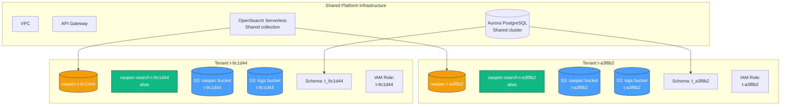

# Multi-Tenancy — Infrastructure Design

> **Audience**: Platform engineers working on Derrops infrastructure and backend services.
> For the customer-facing overview see [Multi-Tenancy (Docs)](/docs/multi-tenancy).

This document defines the full per-tenant resource model, IaC provisioning pattern, access control layering, and naming conventions used to isolate tenants within the Derrops platform.

Related design documents:

- [Conventions](./conventions) — domain registry, required AWS tags, and CDK enforcement
- [OpenAPI Index Access Pattern](../openapi-indexer/openapi-index-access-pattern) — two-tier OASpec index, alias lifecycle, and enrichment hot path
- [Derrops Naming Conventions](/blog/derrops-conventions) — segregation strategy and segment stability principles
- [AWS Resource Naming Cheatsheet](/blog/derrops-naming-sheet) — per-service naming reference

---

## Tenancy Model

Derrops uses the **pool model** at the infrastructure layer: shared resources (VPC, Aurora cluster, OpenSearch Serverless collection, API Gateway) serve all tenants. Per-tenant isolation is enforced through:

- **Dedicated S3 buckets** — one per tenant per domain (OASpec, logs)
- **Dedicated OpenSearch indices** — one per tenant, inside the shared collection
- **Scoped IAM roles** — one per tenant, with resource-level policies
- **Database schema isolation** — one schema per tenant within the shared Aurora cluster
- **Application-layer partition keys** — `tenantId` on all shared DynamoDB tables and Aurora tables



---

## Tenant ID

Every tenant is assigned an opaque, stable ID at onboarding:

```
t-{6-char lowercase alphanumeric}

Examples:  t-a3f8b2   t-9c1d44   t-ff12ab
```

| Constraint     | Rule                                                              |
| -------------- | ----------------------------------------------------------------- |
| Prefix         | `t-` typed prefix                                                 |
| Body           | 6 chars, randomly generated, lowercase alphanumeric               |
| Sequential     | Never — reveals tenant count                                      |
| Human-readable | Never — prevents namespace squatting in globally-unique resources |
| Mutable        | Never — stable for the lifetime of the tenant                     |

The **`derrops`** tenant ID is reserved for platform-owned resources (e.g., the managed OASpec catalogue). It is not generated; it is a hard-coded constant in `@derrops/config`:

```typescript
config['opensearch.oaspec.derrops-tenant-id'] // = "derrops"
```

A **tenant registry** table in Aurora maps tenant IDs to customer accounts and display names. Engineers use the registry; infrastructure uses only the ID.

---

## Per-Tenant Resource Catalogue

All resources below are provisioned by the `TenantConstruct` CDK construct. Nothing is created manually.

### S3 Buckets

Each tenant gets two dedicated S3 buckets. Bucket names follow the Derrops compound kebab-case convention with `{region}` and `{env}` for globally-unique names:

| Bucket         | Name pattern                                                   | Example                                                      |
| -------------- | -------------------------------------------------------------- | ------------------------------------------------------------ |
| OASpec storage | `{region}--{env}--derrops--{tenantId}--oaspec--storage--specs` | `us-east-1--prod--derrops--t-a3f8b2--oaspec--storage--specs` |
| Log archive    | `{region}--{env}--derrops--{tenantId}--logging--storage--logs` | `us-east-1--prod--derrops--t-a3f8b2--logging--storage--logs` |

See [OASpec Bucket (Docs)](/docs/oaspec-bucket) for the full bucket naming reference including the global Derrops-managed bucket.

S3 bucket policies restrict access to the tenant's scoped IAM role only. No cross-tenant bucket access is permitted at the bucket-policy level.

### OpenSearch

| Resource             | Pattern                    | Notes                                                                                                                  |
| -------------------- | -------------------------- | ---------------------------------------------------------------------------------------------------------------------- |
| Private OASpec index | `oaspec-{tenantId}`        | Lazily created on first private spec upload                                                                            |
| Search alias         | `oaspec-search-{tenantId}` | Created at onboarding, pointing to `oaspec-derrops` only; updated on first private upload to include the private index |

See [OpenAPI Index Access Pattern](../openapi-indexer/openapi-index-access-pattern) for the full two-tier search design and alias lifecycle.

### Aurora (PostgreSQL)

| Resource | Pattern                    | Example    |
| -------- | -------------------------- | ---------- |
| Schema   | `t_{tenantId_underscored}` | `t_a3f8b2` |

Hyphens in the tenant ID are replaced with underscores to satisfy SQL identifier rules. Row-level `tenant_id` columns on all cross-tenant tables provide an application-layer secondary check.

### DynamoDB (shared tables)

No dedicated tables. Tenant scoping is via composite partition keys:

| Table                   | Partition key format |
| ----------------------- | -------------------- |
| OASpec enrichment cache | `{tenantId}:{host}`  |

### IAM

| Resource              | Pattern                                    | Example                                  |
| --------------------- | ------------------------------------------ | ---------------------------------------- |
| Tenant execution role | `derrops--platform--api--{tenantId}--role` | `derrops--platform--api--t-a3f8b2--role` |

Role permissions (granted at provisioning time):

- `s3:*` on OASpec bucket ARN
- `s3:GetObject` on log archive bucket ARN
- OpenSearch `aoss:ReadDocument`, `aoss:WriteDocument` on `oaspec-{tenantId}` index
- OpenSearch `aoss:ReadDocument` on `oaspec-derrops` index
- OpenSearch `aoss:ReadDocument` on alias `oaspec-search-{tenantId}`

---

## TenantConstruct (CDK)

`packages/derrops-infra/lib/constructs/tenant-construct.ts`

Provisions the complete per-tenant resource set from a single `tenantId` input. Tags every child resource via `Tags.of(this)` per [Conventions](./conventions).

```typescript
interface TenantConstructProps {
  tenantId: string // e.g. "t-a3f8b2"
  env: string // e.g. "prod"
  region: string // e.g. "us-east-1"
  opensearchCollection: opensearchserverless.CfnCollection
  vpc: ec2.IVpc
}

new TenantConstruct(this, `Tenant-${tenantId}`, {
  tenantId,
  env: config['app.env'],
  region: config['app.region'],
  opensearchCollection,
  vpc,
})
```

The construct is instantiated once per tenant at stack synth time. New tenants are added by adding a new `TenantConstruct` call in the tenant stack and running `cdk deploy`.

### Tenant lifecycle

| Event                       | IaC action                  | Notes                                                                                                                                  |
| --------------------------- | --------------------------- | -------------------------------------------------------------------------------------------------------------------------------------- |
| Onboarding                  | `TenantConstruct` deployed  | Both S3 buckets, IAM role, and `oaspec-search-{tenantId}` alias created (pointing to `oaspec-derrops` only)                            |
| First private OASpec upload | Indexer Lambda runs lazily  | `oaspec-{tenantId}` index created; alias updated to include it                                                                         |
| Offboarding                 | `TenantConstruct` destroyed | S3 buckets deleted (with versioned object cleanup Lambda), OpenSearch index and alias deleted, IAM role deleted, Aurora schema dropped |

---

## Access Control Layers

Three independent layers each enforce tenant isolation. A bypass of any one layer is caught by the others.

| Layer           | Mechanism                                                                                                                               | Enforced by                 |
| --------------- | --------------------------------------------------------------------------------------------------------------------------------------- | --------------------------- |
| **Network**     | Private subnets; security groups restrict service-to-service traffic                                                                    | CDK VPC/SG stack            |
| **AWS IAM**     | Per-tenant scoped role; resource-level policies on S3 buckets and OpenSearch indices; `aws:ResourceTag/derrops:tenant-id` IAM condition | CDK TenantConstruct         |
| **Application** | `tenantId` validated on every API request (JWT claim); `WHERE tenant_id = ?` on all Aurora queries; DynamoDB partition key prefix       | NestJS middleware + TypeORM |

The IAM condition key pattern that ties IAM to tagging:

```json
{
  "Condition": {
    "StringEquals": {
      "aws:ResourceTag/derrops:tenant-id": "${aws:PrincipalTag/derrops:tenant-id}"
    }
  }
}
```

This allows a single managed policy to enforce tenant isolation across all tagged resources without per-tenant policy documents.

---

## Naming Reference (Derrops-specific)

Full resource naming summary applying the [Derrops compound kebab-case convention](/blog/derrops-naming-sheet):

| Resource                  | Pattern                                                        | Example                                                      |
| ------------------------- | -------------------------------------------------------------- | ------------------------------------------------------------ |
| OASpec S3 bucket          | `{region}--{env}--derrops--{tenantId}--oaspec--storage--specs` | `us-east-1--prod--derrops--t-a3f8b2--oaspec--storage--specs` |
| Logs S3 bucket            | `{region}--{env}--derrops--{tenantId}--logging--storage--logs` | `us-east-1--prod--derrops--t-a3f8b2--logging--storage--logs` |
| OpenSearch index          | `oaspec-{tenantId}`                                            | `oaspec-t-a3f8b2`                                            |
| OpenSearch alias          | `oaspec-search-{tenantId}`                                     | `oaspec-search-t-a3f8b2`                                     |
| IAM role                  | `derrops--platform--api--{tenantId}--role`                     | `derrops--platform--api--t-a3f8b2--role`                     |
| Aurora schema             | `t_{tenantId_underscored}`                                     | `t_a3f8b2`                                                   |
| DynamoDB partition prefix | `{tenantId}:`                                                  | `t-a3f8b2:`                                                  |
| CloudFormation stack      | `derrops--platform--tenant--{tenantId}--stack`                 | `derrops--platform--tenant--t-a3f8b2--stack`                 |

`{tenantId}` is always positioned after `{org}` in resource names (tenant-first silo hierarchy). It never appears in shared-infrastructure resource names.

---

## Related Documents

- [Conventions](./conventions) — domain registry, required tags, CDK enforcement, cost allocation, and security use cases
- [OpenAPI Index Access Pattern](../openapi-indexer/openapi-index-access-pattern) — two-tier OASpec index, alias lifecycle, enrichment hot path
- [OASpec Bucket (Docs)](/docs/oaspec-bucket) — S3 bucket naming reference including the global Derrops-managed bucket
- [Derrops Naming Conventions](/blog/derrops-conventions) — foundational naming and segregation principles
- [AWS Resource Naming Cheatsheet](/blog/derrops-naming-sheet) — per-service naming patterns
