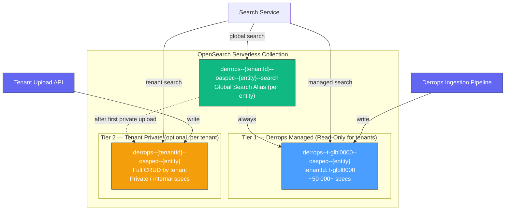
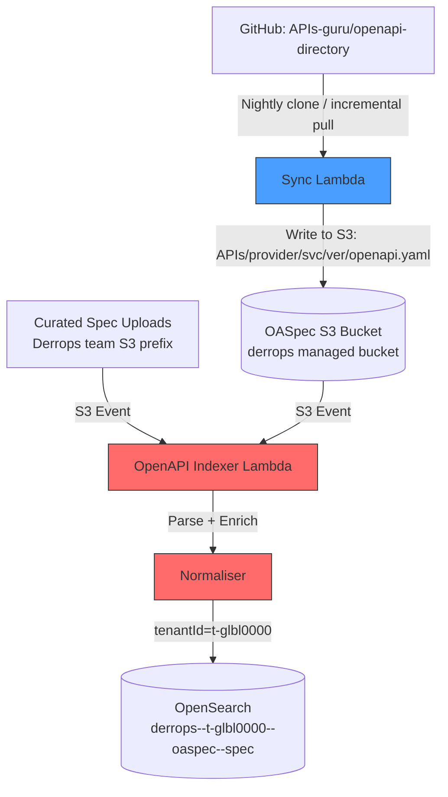

:::info Updated
Search alias strategy expanded — all five entity indices now have `--search` aliases. Three named search modes replace the prior single-alias pattern.
:::

# Design: OpenAPI Index Access Pattern

> **Status**: Draft
> **Author**: Derrick
> **Date**: 2026-03-30
> **Related Design**: [OpenAPI Indexer Overview](./index.md), [OpenSearch Indices](./opensearch-indices)

## Overview

This document defines the multi-tenant OpenAPI index architecture: how OpenAPI specifications are stored, organised, and accessed across the two-tier index model — the Derrops managed public index and per-tenant private indices.

### Goals

- Tenants can search a rich, curated catalogue of well-known APIs without managing it themselves (read-only)
- Tenants can maintain private OASpec definitions (e.g., internal APIs not in the public directory) that take precedence during enrichment
- Derrops is modelled as a first-class tenant internally; the managed index is just a tenant index with `tenantId = t-glbl0000`
- Search across both tiers is transparent: callers get a merged, deduplicated result set

---

## Two-Tier Index Architecture



### Tier 1 — Derrops Managed Index (`derrops--t-glbl0000--oaspec--spec` and siblings)

| Property         | Value                                                         |
| ---------------- | ------------------------------------------------------------- |
| Index name       | `derrops--t-glbl0000--oaspec--{entity}` (one per entity type) |
| Owner `tenantId` | `t-glbl0000` (the platform's global tenant)                   |
| Write access     | Derrops internal pipeline only                                |
| Read access      | All authenticated tenants                                     |
| Primary source   | APIs-guru/openapi-directory + curated additions               |
| Update cadence   | Nightly sync + on-demand trigger                              |

The Derrops platform is itself modelled as a tenant (`tenantId = "t-glbl0000"`). This means:

- All existing multi-tenant access-control, indexing, and search machinery works unchanged
- The managed index is just an ordinary tenant index that happens to be populated automatically and is read-only to other tenants
- Future platform tenants (e.g., `stripe`, `github` as verified providers) follow the same pattern

### Tier 2 — Tenant Private Index (`derrops--{tenantId}--oaspec--{entity}`)

| Property         | Value                                                         |
| ---------------- | ------------------------------------------------------------- |
| Index name       | `derrops--{tenantId}--oaspec--{entity}` (one per entity type) |
| Owner `tenantId` | The specific tenant                                           |
| Write access     | That tenant only                                              |
| Read access      | That tenant only                                              |
| Primary source   | Tenant-uploaded OASpecs                                       |
| Provisioning     | Created on first tenant upload (lazy)                         |

Tenant private indices are optional. A tenant with no private index falls back entirely to Tier 1.

---

## Index and Alias Naming Convention

### Physical indices

Following the [Derrops naming conventions](/blog/derrops-naming-sheet) silo pattern:

```
derrops--{tenantId}--oaspec--{entity}
```

Entity types: `spec`, `server`, `operation`, `param`, `model`

Examples:

- `derrops--t-glbl0000--oaspec--spec` — Derrops managed public catalogue (spec index)
- `derrops--t-acme0001--oaspec--spec` — ACME's private spec index
- `derrops--t-acme0001--oaspec--operation` — ACME's operation index

`tenantId` is always the opaque `t-<8 alphanum>` format (e.g. `t-acme0001`). The `derrops--{tenantId}--oaspec--` prefix namespaces all OASpec indices in the OpenSearch collection.

### Search aliases — all five entity types

Each tenant gets **five search aliases** — one per entity type — each using the `--search` suffix:

```
derrops--{tenantId}--oaspec--{entity}--search
```

The five aliases for tenant `t-acme0001`:

| Alias                                            | Initial backing indices                  | After first private upload                 |
| ------------------------------------------------ | ---------------------------------------- | ------------------------------------------ |
| `derrops--t-acme0001--oaspec--spec--search`      | `derrops--t-glbl0000--oaspec--spec`      | + `derrops--t-acme0001--oaspec--spec`      |
| `derrops--t-acme0001--oaspec--server--search`    | `derrops--t-glbl0000--oaspec--server`    | + `derrops--t-acme0001--oaspec--server`    |
| `derrops--t-acme0001--oaspec--operation--search` | `derrops--t-glbl0000--oaspec--operation` | + `derrops--t-acme0001--oaspec--operation` |
| `derrops--t-acme0001--oaspec--param--search`     | `derrops--t-glbl0000--oaspec--param`     | + `derrops--t-acme0001--oaspec--param`     |
| `derrops--t-acme0001--oaspec--model--search`     | `derrops--t-glbl0000--oaspec--model`     | + `derrops--t-acme0001--oaspec--model`     |

All five aliases are created on tenant onboarding, initially pointing only at the global tier. When a tenant uploads their first private spec, all five aliases are updated in a single `POST /_aliases` bulk action to add the tenant's private indices.

---

## Search Modes

Three named search modes are used consistently across the platform. Every query in [Search Design](./search-design) specifies which mode it uses.

### Global Search

**Target:** `derrops--{tenantId}--oaspec--{entity}--search` (alias)

Searches both the current tenant's private index **and** the `t-glbl0000` managed index. Used whenever platform-managed APIs must be visible alongside tenant-private APIs — the common case for discovery and enrichment.

```
GET /derrops--{tenantId}--oaspec--{entity}--search/_search
{
  "query": { ... },
  "indices_boost": [
    { "derrops--{tenantId}--oaspec--{entity}": 2.0 },
    { "derrops--t-glbl0000--oaspec--{entity}": 1.0 }
  ]
}
```

Tenant-private documents are boosted so they win over global matches when content overlaps (e.g., a tenant's internal version of a public API). The service has no conditional logic for "does this tenant have a private index?" — the alias encodes that entirely.

### Tenant Search

**Target:** `derrops--{tenantId}--oaspec--{entity}` (direct index)

Searches only the current tenant's private index. Used when global catalogue data is irrelevant — listing a tenant's own API versions, version management operations, stats.

### Managed Search

**Target:** `derrops--t-glbl0000--oaspec--{entity}` (direct index)

Searches only the Derrops managed catalogue. Used by the wizard's catalogue browse step and the platform stats sync job. No tenant context is required.

---

## Search Resolution Order

Within Global Search, when tenant and managed documents overlap (same API, different versions or overrides), the resolution order is:

```
1. Tenant private index  (derrops--{tenantId}--oaspec--{entity})   — highest precedence
2. Derrops managed index  (derrops--t-glbl0000--oaspec--{entity})   — fallback
```

**Why tenant-first?** Tenants may want to override or extend a public spec (e.g., a private staging variant of a public API, or a spec with additional internal routes). The private definition wins.

---

## Document Schema

Both tiers share the same five-index schema defined in [OpenSearch Indices](./opensearch-indices). Every document in every index carries:

- `tenantId` — `"t-glbl0000"` for managed specs; the tenant's own ID for private specs
- `latest: boolean` — exactly one document per `apiId` per index is `true`

There is no `visibility` field. Access control is enforced at the index level (IAM data access policies), not at the document level. A tenant can read their own indices and the global indices; they cannot read other tenants' indices regardless of query.

---

## Derrops Managed Index — Ingestion Component

### Sources

| Source                                                                        | Format                           | Priority      |
| ----------------------------------------------------------------------------- | -------------------------------- | ------------- |
| [APIs-guru/openapi-directory](https://github.com/APIs-guru/openapi-directory) | Structured directory (YAML/JSON) | Primary       |
| Official provider portals (Stripe, Twilio, AWS, etc.)                         | Provider-published specs         | Secondary     |
| Curated internal additions                                                    | Manual upload by Derrops team    | Supplementary |

### Ingestion Pipeline



### Sync Lambda — APIs-guru Sync

Triggered on a nightly schedule (and manually via SNS). Responsibilities:

1. **Fetch** the APIs-guru directory (shallow clone or tarball download from GitHub)
2. **Diff** against last known commit SHA stored in SSM Parameter Store
3. **Upload** changed/new specs to the Derrops-managed OASpec bucket (`{region}--{env}--derrops--t-glbl0000--oaspec--storage--specs`) under `APIs/{provider}/{service}/{version}/openapi.yaml`
4. **Delete** removed specs from S3 (triggers indexer delete via S3 event)
5. **Update** the last-sync commit SHA in SSM

The Derrops platform's managed OASpec bucket follows the same naming convention as tenant buckets, using the reserved `t-glbl0000` tenant ID in the bucket name. See [Multi-Tenancy (Infrastructure Design)](../infrastructure/multi-tenancy#s3-buckets).

### Indexer Lambda — Document Enrichment for Derrops Tier

The existing OpenAPI Indexer Lambda processes S3 events. For the `t-glbl0000/` prefix it sets:

```typescript
{
  tenantId: 't-glbl0000',
  // targetIndex: 'derrops--t-glbl0000--oaspec--spec'  (resolved from tenantId)
}
```

No other changes to the indexer are required — `tenantId` is injected by the S3 key prefix resolver and is sufficient to determine the target index.

### Deduplication and Versioning

- Document ID: `{provider}/{serviceName}/{version}` — same as existing convention, scoped within each index
- On re-index (spec updated upstream), the existing document is replaced via `index` (upsert) with the same ID
- Version history is not retained in OpenSearch; S3 object versions serve as the audit trail

---

## Tenant Private Index — Management

### Write Path

Tenants upload OASpecs via the Derrops Portal or REST API:

```
POST /v1/oaspecs
Content-Type: application/json
X-Tenant-Id: {tenantId}

{ "spec": "<OpenAPI YAML or JSON>" }
```

The upload handler:

1. Validates the spec (OpenAPI 3.x only; Swagger 2.0 converted upstream)
2. Writes the spec to the tenant's dedicated OASpec S3 bucket (`{region}--{env}--derrops--{tenantId}--oaspec--storage--specs`) under `APIs/{provider}/{service}/{version}/openapi.yaml`
3. S3 event triggers the shared Indexer Lambda
4. Indexer sets `tenantId = caller's tenantId`, target index `derrops--{tenantId}--oaspec--spec`

Each tenant has a dedicated S3 bucket for their specs — there is no shared bucket with tenant-prefixed keys. See [Multi-Tenancy (Infrastructure Design)](../infrastructure/multi-tenancy#s3-buckets) for the full bucket naming conventions.

### Lazy Index and Alias Provisioning

On tenant onboarding, the platform creates the five `--search` aliases pointing only at the global tier:

```json
POST /_aliases
{
  "actions": [
    { "add": { "index": "derrops--t-glbl0000--oaspec--spec",      "alias": "derrops--{tenantId}--oaspec--spec--search" } },
    { "add": { "index": "derrops--t-glbl0000--oaspec--server",    "alias": "derrops--{tenantId}--oaspec--server--search" } },
    { "add": { "index": "derrops--t-glbl0000--oaspec--operation", "alias": "derrops--{tenantId}--oaspec--operation--search" } },
    { "add": { "index": "derrops--t-glbl0000--oaspec--param",     "alias": "derrops--{tenantId}--oaspec--param--search" } },
    { "add": { "index": "derrops--t-glbl0000--oaspec--model",     "alias": "derrops--{tenantId}--oaspec--model--search" } }
  ]
}
```

On the tenant's first private spec write, the Indexer creates the five private indices and expands all five aliases in a single operation:

```json
POST /_aliases
{
  "actions": [
    { "add": { "index": "derrops--{tenantId}--oaspec--spec",      "alias": "derrops--{tenantId}--oaspec--spec--search" } },
    { "add": { "index": "derrops--{tenantId}--oaspec--server",    "alias": "derrops--{tenantId}--oaspec--server--search" } },
    { "add": { "index": "derrops--{tenantId}--oaspec--operation", "alias": "derrops--{tenantId}--oaspec--operation--search" } },
    { "add": { "index": "derrops--{tenantId}--oaspec--param",     "alias": "derrops--{tenantId}--oaspec--param--search" } },
    { "add": { "index": "derrops--{tenantId}--oaspec--model",     "alias": "derrops--{tenantId}--oaspec--model--search" } }
  ]
}
```

After this, each alias points to both `derrops--{tenantId}--oaspec--{entity}` and `derrops--t-glbl0000--oaspec--{entity}`. No further alias changes are needed. The search service is unaffected — it continues to query `derrops--{tenantId}--oaspec--{entity}--search` identically.

### Delete Path

```
DELETE /v1/oaspecs/{provider}/{service}/{version}
```

Removes from both S3 and OpenSearch. The S3 delete triggers an indexer event that issues an OpenSearch `delete` for the document ID.

---

## Access Control Summary

The table below uses `{entity}` as shorthand for any of the five entity types (`spec`, `server`, `operation`, `param`, `model`).

| Actor                                  | `derrops--t-glbl0000--oaspec--{entity}` | `derrops--{tenantId}--oaspec--{entity}` | `derrops--{tenantId}--oaspec--{entity}--search` (alias) |
| -------------------------------------- | --------------------------------------- | --------------------------------------- | ------------------------------------------------------- |
| Derrops ingestion pipeline             | Read + Write                            | —                                       | —                                                       |
| Tenant (own)                           | Read-only                               | Read + Write                            | Read (resolves to both)                                 |
| Tenant (other)                         | Read-only                               | No access                               | No access                                               |
| Derrops platform services (enrichment) | Read                                    | Read                                    | Read (global search)                                    |

OpenSearch index-level permissions are enforced via AWS IAM data access policies on the OpenSearch Serverless collection. Each tenant's Lambda execution role is granted:

- Read access to all `derrops--t-glbl0000--oaspec--{entity}` indices
- Read + Write access to all `derrops--{tenantId}--oaspec--{entity}` indices (own tenant only)
- Read access to all `derrops--{tenantId}--oaspec--{entity}--search` aliases

Alias permissions are separate from index permissions in OpenSearch Serverless — both must be explicitly granted.

---

## Enrichment Integration

During log enrichment (the hot path), enrichment uses **Global Search** — it must match both tenant-private and platform-managed APIs:

1. Incoming HTTP request arrives at the relay
2. Enrichment service extracts the `host` / base URL
3. **Global Search** against `derrops--{tenantId}--oaspec--server--search` to find a matching server by `hostShape` (includes both tenant-private and platform-managed servers)
4. Best matching server is resolved; `specId` is retrieved
5. **Global Search** against `derrops--{tenantId}--oaspec--operation--search` to match method + path
6. Matched operation is attached to the log event
7. DynamoDB cache stores `{tenantId}:{hostShape} → {specId, serverIndex}` for sub-millisecond repeat lookups (TTL: 5 min)

The DynamoDB cache key includes `tenantId` to prevent cross-tenant cache pollution. See [Search Design — Enrichment Lookup](./search-design#enrichment-lookup-hot-path) for the full sequence.

---

## Configuration Properties

The following config keys will be added to `packages/derrops-config/src/config.ts`:

```typescript
/** Global tenant ID for the Derrops-managed public catalogue */
'opensearch.oaspec.global-tenant-id': 't-glbl0000',

/** Boost factor applied to tenant private index in global search */
'opensearch.oaspec.tenant-boost': 2.0,

/** DynamoDB cache TTL for host→specId mappings (seconds) */
'dynamodb.oaspec-cache.ttl-seconds': 300,
```

Derived names (see `opensearch-indices.md` for the helper functions):

```typescript
// Physical index
function oaspecIndex(tenantId: string, entity: string): string {
  return `derrops--${tenantId}--oaspec--${entity}`
}

// Global search alias (tenant + managed)
function oaspecSearchAlias(tenantId: string, entity: string): string {
  return `derrops--${tenantId}--oaspec--${entity}--search`
}
```

---

## Open Questions

1. **Index per tenant vs. shared index with tenant filter** — This design uses a dedicated index per tenant for access-control simplicity and OpenSearch IAM alignment. A shared index with a `tenantId` filter field is an alternative but complicates row-level access control in Serverless. Decision: dedicated index per tenant.

2. **Global tenantId format** — Using the reserved ID `"t-glbl0000"` (same `t-<8 alphanum>` format as all tenant IDs) for the managed catalogue. This is a built-in tenant that cannot be claimed by external tenants.

3. **Curated additions beyond APIs-guru** — The design leaves a `curated/` S3 prefix open for the Derrops team to manually upload specs (e.g., AWS service specs, internal Derrops API). These are treated identically to APIs-guru specs in the pipeline.

4. **APIs-guru sync frequency** — The APIs-guru directory receives infrequent updates (weekly/monthly cadence for most providers). A nightly sync is sufficient and avoids GitHub rate-limit issues.

---

## Related Documents

- [OpenAPI Directory Indexer](./openapi-directory-indexer) — The existing single-index indexer this design extends
- [Multi-Tenancy (Infrastructure Design)](../infrastructure/multi-tenancy) — TenantConstruct, dedicated S3 buckets, IAM scoping, tenant lifecycle
- [Conventions](../infrastructure/conventions) — Required AWS tags for all tenant resources
- [Multi-Tenancy (Docs)](/docs/multi-tenancy) — Customer-facing overview of data isolation and dedicated resources
- [OASpec Bucket (Docs)](/docs/oaspec-bucket) — Bucket naming reference
- DynamoDB cache rationale: use DynamoDB only for ultra-fast, latency-sensitive lookups in the enrichment hot path (sub-millisecond repeat host→specId lookups)
