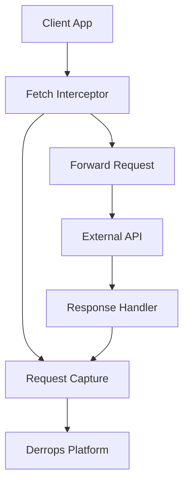
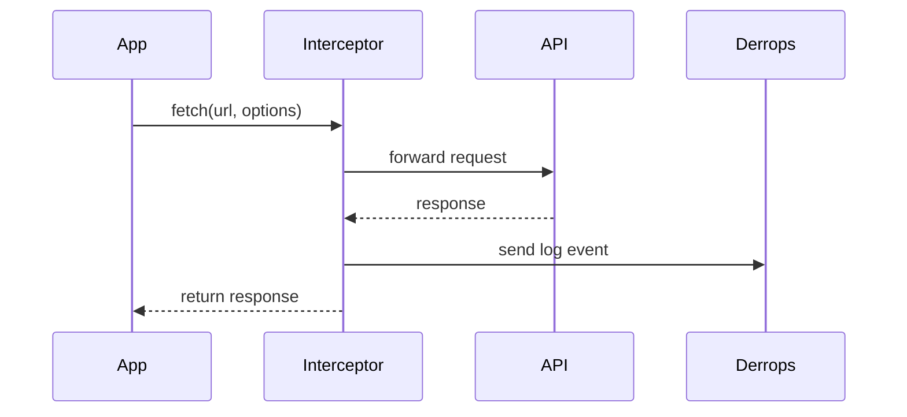

# Component Proposal Standard

This guide explains the standard process for proposing new software components in the Derrops platform.

## Overview

When proposing a new component, package, or significant feature for the Derrops platform, use the **Component Proposal Template** to ensure comprehensive documentation and facilitate review.

### Why Use This Standard?

- **Consistency**: All proposals follow the same structure, making them easier to review
- **Completeness**: The template ensures all critical aspects are addressed
- **Communication**: Clear proposals accelerate decision-making and reduce back-and-forth
- **Documentation**: Approved proposals serve as foundational documentation for implementation
- **Architecture**: Forces consideration of integration, dependencies, and design trade-offs

## When to Use the Template

Use the component proposal template for:

✅ **New packages** in the monorepo (e.g., a new client connector for fetch API)
✅ **Major features** that cross multiple packages
✅ **Architectural changes** that affect multiple components
✅ **Public APIs** that will be consumed by external users
✅ **Breaking changes** to existing components

You might skip the full template for:

❌ Bug fixes that don't change the API
❌ Documentation updates
❌ Minor refactoring within a single file
❌ Configuration changes

## Template Location

The template is located in the repository root:

```
/COMPONENT_PROPOSAL_TEMPLATE.md
```

View the template: [COMPONENT_PROPOSAL_TEMPLATE.md](https://github.com/derrickfutschik/derrops-platform/blob/main/COMPONENT_PROPOSAL_TEMPLATE.md)

Copy this file to start your proposal:

```bash
cp COMPONENT_PROPOSAL_TEMPLATE.md apps/derrops-docs/docs/proposals/my-new-component.md
```

**See a complete example**: [Example Component Proposal - Metrics Aggregator](./example-component-proposal.md)

## Template Sections Explained

### 1. Overview

**Purpose**: Provide a high-level understanding of the component.

**What to include:**

- 1-2 sentence description
- The specific problem being solved
- Scope boundaries (what's included and excluded)
- How it relates to existing components

**Example:**

```markdown
### Purpose

A client connector for the native Fetch API that enables automatic request/response capture for web browsers and modern Node.js applications.

### Problem Statement

Current client connectors (Axios) don't support environments that use the native Fetch API, limiting adoption in browser-based applications and modern Node.js projects using native fetch.
```

### 2. Type Definitions

**Purpose**: Define the component's TypeScript contract.

**What to include:**

- All exported types and interfaces
- JSDoc comments for each type
- Input/output types table
- Configuration types

**Best practices:**

- Use TypeScript, not plain JavaScript
- Include JSDoc comments with `@param`, `@returns`, etc.
- Define types before showing usage
- Use composition for complex types

**Example from Derrops:**

```typescript
/**
 * Configuration for the Derrops Fetch client
 */
export type FetchClientConfig = {
  /** Derrops API endpoint */
  endpoint: string

  /** Optional API key for authentication */
  apiKey?: string

  /** Project identifier */
  projectId: string

  /** Headers to redact from logs */
  redactHeaders?: Array<string | RegExp>
}
```

### 3. Architecture

**Purpose**: Visualize component structure and data flow.

**What to include:**

- Mermaid component diagrams
- Sequence diagrams for data flow
- Integration points table
- Component relationships

**Diagram types to use:**

#### Component Diagram



#### Sequence Diagram



### 4. API Specification

**Purpose**: Document the public interface developers will use.

**What to include:**

- Exported classes with method signatures
- Exported functions
- Usage examples (basic and advanced)
- TypeScript types as self-documentation

**Best practices:**

- Show actual code, not pseudocode
- Include both simple and complex examples
- Document all parameters with JSDoc
- Show common patterns and use cases

**Example structure:**

```typescript
// 1. Class definition
export class ComponentName {
  constructor(config: ComponentConfig)
  initialize(): Promise<void>
  process(data: unknown): Promise<Result>
}

// 2. Factory functions
export function createComponent(config: ComponentConfig): ComponentName

// 3. Usage examples
// Basic usage
const component = createComponent({
  /* config */
})

// Advanced usage
const component = new ComponentName({
  // detailed config
})
```

### 5. Data Structures

**Purpose**: Show actual data formats used by the component.

**What to include:**

- JSON schema examples
- Field specification tables
- Validation rules
- Example payloads

**Field table format:**

| Field     | Type   | Required | Description       | Validation              |
| --------- | ------ | -------- | ----------------- | ----------------------- |
| `id`      | string | Yes      | Unique identifier | Non-empty, alphanumeric |
| `timeout` | number | No       | Timeout in ms     | > 0, < 30000            |

**JSON example with comments:**

```json
{
  "id": "component-1",
  "settings": {
    "enabled": true,
    "timeout": 5000
  }
}
```

### 6. Dependencies

**Purpose**: Identify all package dependencies and their relationships.

**What to include:**

- Internal workspace dependencies (other @derrops packages)
- External npm dependencies
- Dependency graph visualization
- Version requirements

**Best practices:**

- Minimize external dependencies
- Use workspace protocol (`*`) for internal deps
- Justify each dependency
- Check license compatibility

**Example table:**

| Package            | Version  | Purpose     | License |
| ------------------ | -------- | ----------- | ------- |
| `axios`            | `^1.6.0` | HTTP client | MIT     |
| `@derrops/private` | `*`      | Core types  | MIT     |

### 7. Implementation Details

**Purpose**: Describe algorithms, edge cases, and technical approach.

**What to include:**

- Key algorithms in pseudocode
- Edge cases table
- Error handling strategy
- Performance considerations

**Pseudocode format:**

```pseudocode
FUNCTION processRequest(request):
  // Step 1: Validate
  IF NOT isValid(request):
    THROW ValidationError

  // Step 2: Transform
  transformed = transform(request)

  // Step 3: Return
  RETURN transformed
```

**Edge cases table:**

| Case       | Condition            | Handling    | Expected Outcome  |
| ---------- | -------------------- | ----------- | ----------------- |
| Null input | `data === null`      | Throw error | `ValidationError` |
| Timeout    | `duration > timeout` | Abort       | Partial result    |

### 8. Integration Guide

**Purpose**: Help developers install and use the component.

**What to include:**

- Installation commands
- Configuration options table
- Environment variables
- Migration guide (if replacing existing component)

**Configuration table:**

| Option     | Type   | Default    | Description           |
| ---------- | ------ | ---------- | --------------------- |
| `endpoint` | string | (required) | API endpoint URL      |
| `timeout`  | number | `10000`    | Request timeout in ms |

### 9. Testing Strategy

**Purpose**: Define test coverage and acceptance criteria.

**What to include:**

- Unit test cases table
- Integration test scenarios
- Performance test criteria
- Coverage targets

**Test cases table:**

| Test Case     | Input               | Expected Output       | Priority |
| ------------- | ------------------- | --------------------- | -------- |
| Valid config  | Complete config     | Initialized component | High     |
| Missing field | Config without `id` | Throw error           | High     |
| Timeout       | Long operation      | Timeout error         | Medium   |

**Coverage targets:**

- Unit tests: 90%+
- Integration tests: Critical paths
- E2E tests: At least 1 full workflow

### 10. Additional Sections

**Build Configuration**: Specify package.json settings, build scripts, and build order

**Documentation Requirements**: List what docs must be created

**Rollout Plan**: Phased deployment approach with timelines

**Open Questions**: Track unresolved issues that need decisions

**Alternatives Considered**: Document why other approaches weren't chosen

**Approval**: Sign-off section for stakeholders

## Best Practices

### Writing Effective Proposals

#### 1. Start with the Problem

Always begin by clearly stating the problem being solved. A good proposal answers:

- What pain point does this address?
- Who experiences this problem?
- What's the impact of not solving it?

#### 2. Use Diagrams Liberally

Mermaid diagrams are invaluable for:

- Component relationships (`graph TD` or `graph LR`)
- Data flow (`sequenceDiagram`)
- State machines (`stateDiagram-v2`)
- Entity relationships (`erDiagram`)

#### 3. Show, Don't Just Tell

Include concrete examples:

- ✅ Show actual TypeScript code
- ✅ Include JSON examples
- ✅ Provide usage snippets
- ❌ Don't just describe in prose

#### 4. Think About Dependencies

Consider:

- Can we minimize external dependencies?
- Are there lighter alternatives?
- What's the dependency size impact?
- Are all dependencies actively maintained?

#### 5. Plan for Testing

Define tests upfront:

- Unit tests for core logic
- Integration tests for interactions
- Performance benchmarks if relevant
- Error scenarios and edge cases

#### 6. Consider the Developer Experience

Think about:

- Is the API intuitive?
- Are error messages helpful?
- Is configuration straightforward?
- Can it be used with minimal setup?

### Common Pitfalls to Avoid

❌ **Too vague**: "A service to handle data processing"
✅ **Specific**: "A streaming JSON parser that processes API responses incrementally to reduce memory usage by 80% for large payloads"

❌ **Scope creep**: Trying to solve every related problem
✅ **Focused**: Clear boundaries on what's in and out of scope

❌ **Missing diagrams**: Walls of text describing architecture
✅ **Visual**: Mermaid diagrams showing structure and flow

❌ **No examples**: Just type definitions
✅ **Practical**: Real code showing how to use it

❌ **Ignoring alternatives**: Only showing one approach
✅ **Considered**: Explaining why other options weren't chosen

## Proposal Workflow

### 1. Draft Phase

1. Copy the template
2. Fill in all sections
3. Create diagrams
4. Write code examples
5. Self-review for completeness

### 2. Review Phase

1. Share with team members
2. Present in design review meeting
3. Gather feedback
4. Address open questions
5. Iterate on design

### 3. Approval Phase

1. Get stakeholder sign-offs
2. Update status to "Approved"
3. Create GitHub issue/project
4. Plan implementation timeline

### 4. Implementation Phase

1. Use proposal as specification
2. Keep proposal updated if design changes
3. Reference proposal in code comments
4. Update docs when complete

### 5. Post-Implementation

1. Mark proposal as "Implemented"
2. Link to actual code
3. Document any deviations from proposal
4. Update changelog

## Integration with Derrops Monorepo

### Monorepo Considerations

When proposing components for the Derrops monorepo:

#### Package Placement

- **packages/**: Shared libraries and client connectors
- **apps/**: Platform applications (docs, portal)

#### Build Order

Respect the dependency hierarchy:

```
@derrops/private → @derrops/public → @derrops/client → specific clients
```

#### Package Naming

Follow the convention:

- Internal shared: `@derrops/package-name` (private)
- Published libs: `@derrops/package-name` (public)
- Client connectors: `derrops-client-{library}-{platform}`

#### TypeScript Configuration

- Extend from `tsconfig.base.json`
- Use project references for type checking
- Ensure strict mode is enabled

#### Build Configuration

Standard setup for libraries:

```json
{
  "scripts": {
    "build": "tsup src/index.ts --format esm,cjs --dts --clean",
    "dev": "tsup src/index.ts --format esm,cjs --dts --watch",
    "test": "vitest"
  }
}
```

### Version Management

For published packages:

- Follow semantic versioning (semver)
- Update CHANGELOG.md
- Coordinate version bumps across dependencies

## Examples from Derrops

### Example 1: Axios Client Connector

The `derrops-client-nodejs-axios` package is a good example of a well-structured component:

**Clear purpose**: Axios interceptor for Node.js applications

**Type definitions**:

```typescript
export type AxiosClientConfig = {
  endpoint: string
  apiKey?: string
  projectId: string
  redactHeaders?: Array<string | RegExp>
  includeRequestBody?: boolean
  includeResponseBody?: boolean
}
```

**Simple API**:

```typescript
export function attachDerropsInterceptor(
  axiosInstance: AxiosInstance,
  config: AxiosClientConfig,
): void
```

**Minimal dependencies**: Only `@derrops/private` and `@derrops/client`

### Example 2: Core Types Package

The `@derrops/private` package demonstrates:

**Foundation pattern**: Base types used across all packages

**Zero external dependencies**: Pure TypeScript types

**Clear exports**: Well-organized type definitions

**JSDoc comments**: Every type is documented

## Tools and Resources

### Mermaid Diagram Resources

- [Mermaid Live Editor](https://mermaid.live/) - Test diagrams
- [Mermaid Documentation](https://mermaid.js.org/) - Syntax reference
- [Docusaurus Mermaid](https://docusaurus.io/docs/markdown-features/diagrams) - Integration guide

### TypeScript Tools

- [TSDoc](https://tsdoc.org/) - Documentation comments standard
- [TypeScript Handbook](https://www.typescriptlang.org/docs/) - Language reference

### Validation Tools

- Use `pnpm run typecheck` to verify types
- Use `pnpm run build` to test build configuration
- Use `pnpm run test` to validate test coverage

## FAQs

### Q: How detailed should the proposal be?

**A**: Detailed enough that someone could implement it without asking clarifying questions. Include types, examples, and diagrams.

### Q: Can I skip sections that don't apply?

**A**: Yes, but explain why. For example: "Testing Strategy: Standard unit tests, no special performance requirements."

### Q: Should I write the code first or the proposal first?

**A**: Write the proposal first. It's easier to change a design on paper than in code. However, a quick prototype can help validate feasibility.

### Q: How long should a proposal be?

**A**: As long as needed to be complete, but no longer. Most proposals are 5-15 pages. Simple components might be shorter, complex ones longer.

### Q: What if requirements change during implementation?

**A**: Update the proposal to reflect the changes. The proposal should be a living document that matches the final implementation.

### Q: Do I need approval for every small change?

**A**: No. Use your judgment. Bug fixes and minor improvements don't need formal proposals. Major features and API changes do.

## Getting Help

If you need assistance with your component proposal:

1. **Review the example**: Check out the [Example Component Proposal](./example-component-proposal.md) for a complete demonstration
2. **Check the template**: Ensure you've filled in all applicable sections
3. **Ask in design review**: Present your draft in the team meeting
4. **Get feedback early**: Share your proposal before it's complete to catch issues early

## Conclusion

The Component Proposal Standard helps ensure that new components in the Derrops platform are:

- Well-designed and thoughtfully planned
- Properly documented from the start
- Easy to review and approve
- Ready for implementation

By following this standard, you'll create better components and make the review process smoother for everyone involved.

---

**Related Documentation:**

- [COMPONENT_PROPOSAL_TEMPLATE.md](https://github.com/derrickfutschik/derrops-platform/blob/main/COMPONENT_PROPOSAL_TEMPLATE.md) - The blank template file
- [Example Component Proposal](./example-component-proposal.md) - Fully completed example (Metrics Aggregator)
- [Monorepo Structure](https://github.com/derrickfutschik/derrops-platform/blob/main/CLAUDE.md) - CLAUDE.md root documentation

**Template Version**: 1.0
**Last Updated**: November 2024
