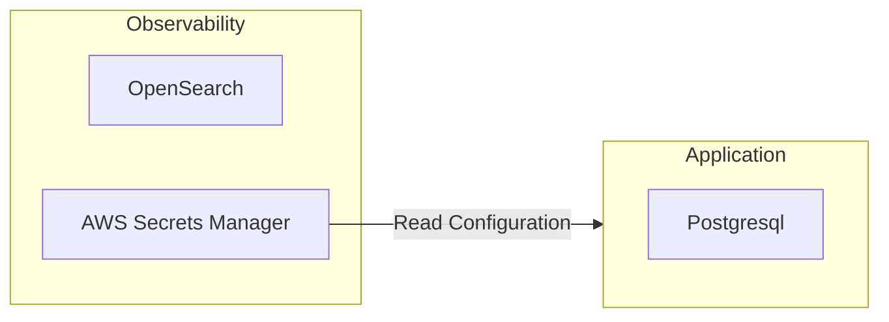

| Data Source   | Description         |
| ------------- | ------------------- |
| Observability | OpenSearch          |
| Application   | Postgresql          |
| Secrets       | AWS Secrets Manager |

### Secrets

Secrets are stored in AWS Secrets Manager. They are used to store credentials for accessing other APIs and or services. A customer can get up to 5 secrets, and then after which they will need to purchase more.
One we scale we can get more secrets

There will be two datastores which will be used to store data. By classifying and separating the into different datastores, we can isolate failures.
The core application which is backed by the SQL database will not be affected by load from the API requests

## Opensearch

The NoSQL database will be able to scale out to any number of nodes and storage. By splitting thc onf

