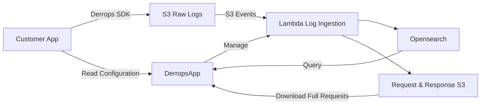

The following diagram shows the components of the Derrops platform. Logs flow from the customer app to the Derrops platform and then to the Opensearch database.

### Derrops SDK

- Code to log request and response into S3 bucket.
- Read the configuration from the `DerropsApp`.
- Configured with permissions to read the configuration.

### Lambda Log Ingestion

- Read Configuration from the `DerropsApp`.
- Read the logs from the S3 bucket.
- Parse the logs into the OpenAPI Intelligence format.
- Store the logs in the Opensearch database.

### Opensearch Database

- Store the logs in the Opensearch database.
- Store the configuration in the Opensearch database.
- Store the metrics in the Opensearch database.
- Store the alerts in the Opensearch database.
- Store the dashboards in the Opensearch database.
- Store the users in the Opensearch database.
