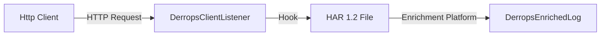

# Client Log



- **Client** logs ultimately take a HTTP request and log a HAR 1.2 file.
- This file can then be enriched by the Enrichment Platform.
- The enriched log is then logged to the Opensearch database.
- Once in the Opensearch database, the log can be queried and analyzed.

##S3

###S3 Bucket

Bucket convention is `derrops-logs-{data}-{region}-{customer}-{id}`

Clients will be logged into the `derrops-logs-raw-{region}-{customer}-{id}` S3 bucket.

### S3 Prefix

The logs will be configured as following

```text
{customer}/{tenant}/{account-id}/{region}/{service-name}/{semantic-version}/{yyyy}/{mm}/{dd}/{hh}/{mm}/{id}.log
```

| Component            | Description                         |
| -------------------- | ----------------------------------- |
| `{customer}`         | The customer name                   |
| `{tenant}`           | The tenant name                     |
| `{account-id}`       | The account id                      |
| `{region}`           | The region                          |
| `{service-name}`     | The name of the service             |
| `{semantic-version}` | The semantic version of the service |
| `{yyyy}`             | The year                            |
| `{mm}`               | The month                           |
| `{dd}`               | The day                             |
| `{hh}`               | The hour                            |
| `{mm}`               | The minute                          |
| `{id}`               | The unique identifier for the log   |

Customers can have multiple tenants, and each tenants.

Example:

```text
acme-corp/production/123456789012/us-east-1/payment-service/1.2.3/2025/01/15/14/30/PL8sO2A7.log
```

This example represents:

- **Customer**: `acme-corp`
- **Tenant**: `production`
- **Account ID**: `123456789012`
- **Region**: `us-east-1`
- **Service Name**: `payment-service`
- **Semantic Version**: `1.2.3`
- **Timestamp**: January 15, 2025 at 14:30 (2:30 PM)
- **Unique Identifier**: `PL8sO2A7`

Then when logs are enriched, they will be logged to opensearch at index: `derrops-logs-enriched-{region}-{customer}-{id}`.

# Request and Response Logging

Full request and response logging is disabled by default. One must configure the

:::note
No authentication credentials are logged, only whitelisted headers are logged by default for security purposes. Headers which are logged can be configured via the SAAS portal. In addition, any other parameters as part of the authentication settings in an openapi specification will not be logged.
:::

:::info
Request and responses are logged as [JSON Line](https://jsonlines.org) files with each line being in the [HAR 1.2 specification](https://w3c.github.io/web-performance/specs/HAR/Overview.html). Many requests could be in the one file if they are grouped together.
:::

## \_metadata

In the HAR format, fields starting with an underscore are extension fields. The following will be added to the logs:

```json
client : ClientInfo,
buildInfo: BuildInfo,
```

### Logs Location

If the request is logged, it will be logged at: `derrops-{region}-logs-har-{customer}-{id}` S3 bucket.

### S3 Prefix

The prefix will be the id

```text
{customer}/{tenant}/{account-id}/{region}/{service-name}/{semantic-version}/{yyyy}/{mm}/{dd}/{hh}/{mm}/{id}.log
{customer}/{deployment}/{service-name}/{semantic-version}/{yyyy}/{mm}/{dd}/{hh}/{mm}/{id}.log
```

## Client Request & Response Logging

### S3 Bucket

If the request is logged, it will be logged at: `derrops-{region}-{customer}-{id}` S3 bucket.

```text
{customer}/{tenant}/{account-id}/{region}/{service-name}/{semantic-version}/{yyyy}/{mm}/{dd}/{hh}/{mm}/{id}.log
{customer}/{deployment}/{service-name}/{semantic-version}/{yyyy}/{mm}/{dd}/{hh}/{mm}/{id}.log
```

## Client Response

If the response is logged, the response is logged at:

## Retention

You can optionally log all requests ans responses, but then set the retention for a long duration. Then requests and response can analyzed for what issue has occurred.

- Log on Error
- Log on SLA Failure
- Log on Request Timeout
- Log on Response Timeout
- Log on Request Validation Failure
- Log on Response Validation Failure
- Log on Request Validation Success
- Log on Response Validation Success
- Log on Request Validation Success
