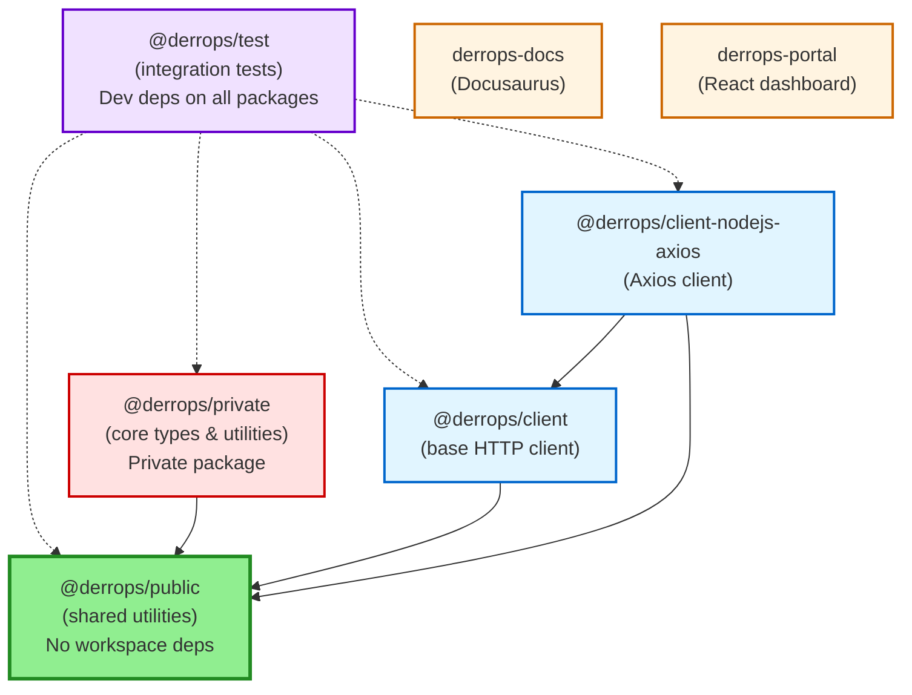

# Derrops Monorepo

The following diagram shows the dependencies between the packages in the Derrops monorepo.

Clean Dependency Structure:

1. @derrops/public (base foundation) - No workspace dependencies ✅
2. @derrops/private → depends on @derrops/public
3. @derrops/client → depends on @derrops/public
4. @derrops/client-nodejs-axios → depends on @derrops/client + @derrops/public
5. @derrops/test → dev dependencies on all packages (built last)
6. Apps (docs, portal) - No workspace dependencies, standalone

Build Order:

`@derrops/public` → `@derrops/private` → `@derrops/client` → `@derrops/client-nodejs-axios` → `@derrops/test`
