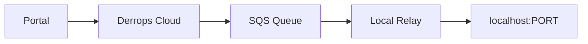

# Local Relay Quickstart

A local relay runs on your machine and lets the Derrops Portal reach services on `localhost`. This is the fastest way to start using Derrops during development — no cloud deployment required.

**Time to complete**: ~10 minutes

**Prerequisites**:

- An Derrops account ([sign up](./portal-login) if you haven't yet)
- Node.js 22 or later
- `npm` or `pnpm`

---

## How it works

The local relay polls a dedicated SQS queue for jobs. When you send a request from the Portal, it is enqueued; the relay picks it up, executes the HTTP call against your local service, and returns the result. All traffic is outbound-only from your machine — no inbound ports are opened.



---

## Step 1 — Install the CLI

```bash
npm install -g derrops-cli
# or
pnpm add -g derrops-cli
```

Verify the install:

```bash
derrops --version
```

---

## Step 2 — Initialise the relay

Run the init command. This opens a browser for authentication and registers a `local-dev` relay with the platform.

```bash
derrops relay init
```

You will see:

```
  Platform URL [https://api.derrops.com]:

  Opening browser for authentication...
  If the browser does not open, visit:
  https://auth.derrops.com/oauth2/authorize?...

  ✓ Authenticated
  ✓ Registering local relay with https://api.derrops.com...
  ✓ Registered (relay_id: abc-123)
  ✓ Config saved to ~/.derrops/config
  ✓ Credentials saved to ~/.derrops/credentials

  Run 'derrops relay start' to connect.
```

What happens during init:

- You authenticate via browser OAuth (PKCE — no password is stored locally).
- The platform provisions a dedicated SQS queue for your relay.
- Non-sensitive configuration is saved to `~/.derrops/config`.
- Short-lived Cognito tokens are saved to `~/.derrops/credentials` (valid 30 days).

No AWS credentials are stored. Temporary AWS credentials are obtained at runtime and kept in memory only.

---

## Step 3 — Start the relay

```bash
derrops relay start
```

Expected output:

```
  ✓ Local relay starting (relay_id: abc-123) [profile: default]
  ✓ Connecting via SQS → https://sqs.ap-southeast-2.amazonaws.com/...

  Target localhost services are now reachable from the Derrops API Tester.
  Press Ctrl+C to stop.
```

Leave this terminal open. The relay polls continuously for incoming jobs.

---

## Step 4 — Send your first request

1. Open the **Derrops Portal** and navigate to **API Tester**.
2. Select your relay from the relay picker (it will appear as a `local-dev` relay with a **Local** badge).
3. Enter a target URL, for example `http://localhost:3001/health`.
4. Click **Send**.

The Portal routes the request through your relay to your local service and displays the response, timing, and SLA metrics.

:::note
If you enter a `localhost` URL but no local relay is selected, the Portal will prompt you: _"Your target is a localhost URL. Start a local relay with `derrops relay start` to route this request."_
:::

---

## Managing sessions

**Token expiry**: Your credentials are valid for 30 days. When they expire, re-authenticate:

```bash
derrops relay init
```

Or force re-authentication before expiry:

```bash
derrops relay init --force
```

---

## Multiple environments

Use profiles to run relays for different Derrops tenants or environments simultaneously.

```bash
# Register a relay against a staging environment
derrops relay init --profile staging --platform-url https://api.staging.derrops.com

# Start the staging relay in a separate terminal
derrops relay start --profile staging
```

Profiles are stored in separate sections of `~/.derrops/config` and `~/.derrops/credentials`, following the same convention as the AWS CLI.

---

## Configuration files

| File                     | Contents                                                | Permissions |
| ------------------------ | ------------------------------------------------------- | ----------- |
| `~/.derrops/config`      | Platform URL, relay ID, SQS queue URL, Cognito settings | `0644`      |
| `~/.derrops/credentials` | Short-lived Cognito tokens                              | `0600`      |

Example `~/.derrops/config`:

```toml
[default]
platform_url = "https://api.derrops.com"
relay_id = "abc-123"
relay_sqs_queue_url = "https://sqs.ap-southeast-2.amazonaws.com/123456789/derrops-acme-local-abc123-relay456"
relay_sqs_region = "ap-southeast-2"
identity_pool_id = "ap-southeast-2:xxxxxxxx-xxxx-xxxx-xxxx-xxxxxxxxxxxx"
cognito_region = "ap-southeast-2"
user_pool_id = "ap-southeast-2_XXXXXXXXX"
```

---

## Troubleshooting

**Browser did not open during `relay init`**

Copy the URL printed in the terminal and open it manually.

**`derrops relay start` says credentials are expired**

Run `derrops relay init` to re-authenticate. Your relay ID and configuration are preserved.

**Requests time out in the Portal**

Make sure the relay process is still running in your terminal. The relay must stay running while you use the API Tester.

**Target service is not responding**

Verify your local service is running (`curl http://localhost:PORT/health`) before sending through the Portal. The relay executes the request from your machine, so the service must be reachable from localhost.

---

## What's next

- **Deploy to staging or production** → [Cloud relay quickstart](./cloud-relay)
- **Add credential injection and request policies** → [Aegis quickstart](./aegis)
- **Index your OpenAPI specs** → [OASpec Bucket](/docs/oaspec-bucket)
