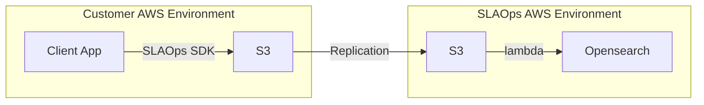
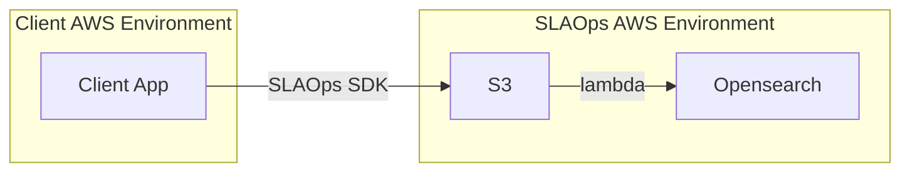
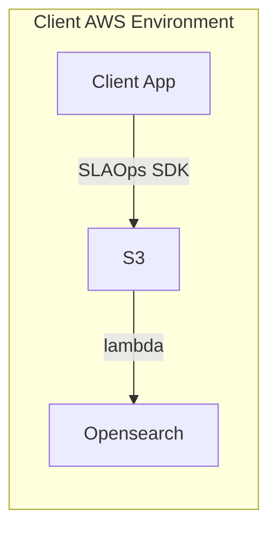

# Log Deployment Options

## Option 1 - Customer Bucket to our S3 Bucket Via Replication

Preferred option, customer can maintain their own logs in their own S3 bucket and we will replicate them to our S3 bucket.

## (Not yet implemented) Option 2 - Direct to our S3 Bucket

Cheapest option, customer does not need to maintain any logs, but will not have access to raw logs.

## (Not yet implemented) Option 3 - Customer Managed Deployment

Customer must manage and maintain the solution in their own AWS environment which requires more maintenance and management overhead.

