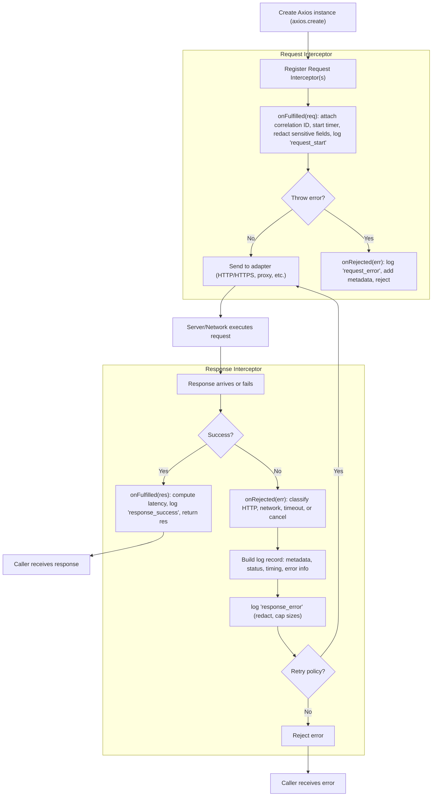

# Axios SDK

## Flowchart of the Axios SDK

```mermaid Flowchart

flowchart TD
  A["Create Axios instance (axios.create)"] --> B["Register Request Interceptor(s)"]

  subgraph "Request Interceptor"
    B --> B1["onFulfilled(req): attach correlation ID, start timer, redact sensitive fields, log 'request_start'"]
    B1 --> C{"Throw error?"}
    C -- "No" --> D["Send to adapter (HTTP/HTTPS, proxy, etc.)"]
    C -- "Yes" --> E["onRejected(err): log 'request_error', add metadata, reject"]
  end

  D --> F["Server/Network executes request"]
  F --> G["Response arrives or fails"]

  subgraph "Response Interceptor"
    G --> H{"Success?"}
    H -- "Yes" --> H1["onFulfilled(res): compute latency, log 'response_success', return res"]
    H -- "No" --> I["onRejected(err): classify HTTP, network, timeout, or cancel"]
    I --> J["Build log record: metadata, status, timing, error info"]
    J --> K["log 'response_error' (redact, cap sizes)"]
    K --> L{"Retry policy?"}
    L -- "Yes" --> D
    L -- "No" --> M["Reject error"]
  end

  H1 --> N["Caller receives response"]
  M --> O["Caller receives error"]

```

