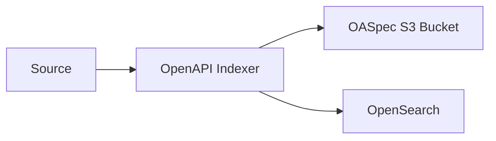

# OpenAPI Indexer Module

This modules is responsible for indexing OpenAPI specifications (OASpec).

## Sources

There are a number of different sources for an OASpec:

- `S3URI` Location of the specification
- Publicly accessible `URL`
- Direct JSON body of the OASpec
- Direct YAML body of the OASpec

## Flow

Whatever the source of the OASpec, it will go through the following flow:

### Upload Flow

The OpenAPI Indexer can generate a pre-signed URL for the user to upload the OASpec to the OASPec Temp Bucket.

OASPec Temp Bucket is a temporary bucket that is used to store the OASpec so it can be transferred by the APIUser. The OpenAPI Indexer can then read the OASpec from the Temp Bucket, validate it, transform it into an OpenSearch document and index it into OpenSearch, as well as copying the OASpec to the OASpec Bucket.

1. The source is provided to the OpenAPI Indexer
2. The `OpenAPI Indexer` will parse the OASpec and validate it
3. The `OpenAPI Indexer` will transform the OASpec into an OpenSearch document
4. The `OpenAPI Indexer` will index the document into OpenSearch
5. The `OpenAPI Indexer` will return the document
