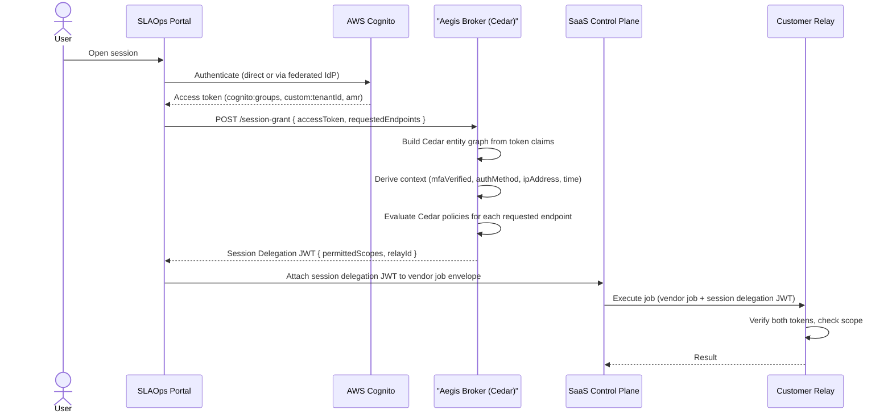

# Aegis — Cedar Policy Authorization Design

This document describes how [Cedar Policy](https://www.cedarpolicy.com) is used as the pluggable policy engine inside the Aegis Broker to determine what a given user is allowed to do through the SLAOps relay.

Related documents:
- [Aegis Token Broker Design](./aegis-token-broker-design) — session delegation model, JWT flow, and dual-authorization model
- [Cloud Relay Security](./cloud-relay-security) — authentication methods between Relay and control plane
- [Network Topology](./network-topology) — runtime component separation

---

## Why Cedar Policy

Aegis's core design goal is that the **customer, not the SLAOps platform, is the final authority for what APIs may be called**. The Aegis Broker was designed with a pluggable policy engine; Cedar Policy is the recommended implementation for that slot.

Cedar fits this problem well for three reasons:

| Property | Why it matters for Aegis |
|---|---|
| **Expressive but bounded** | Cedar can encode RBAC, ABAC, time bounds, and environment constraints without becoming Turing-complete. Policies are analyzable — you can formally prove what is and is not allowed. |
| **Auditable** | Every policy is a human-readable Cedar document. Customers can version-control, review, and audit policies alongside their infrastructure code. |
| **Separation of concerns** | Authorization logic lives in Cedar policy files, not in application code. Aegis evaluates them; it does not embed them. This matches the customer-owned-policy model. |
| **Default deny** | Cedar denies everything unless a `permit` policy explicitly matches. No accidental access. |
| **Schema-validated** | Cedar schemas define the entity types and allowed actions. Policies are validated against the schema before they are deployed, catching errors early. |

---

## Core Concepts: The PARC Model Applied to Aegis

Cedar authorization is structured around four elements: **Principal**, **Action**, **Resource**, and **Context** (PARC). Every Aegis authorization question maps onto this model.

```
Is this Principal allowed to perform this Action on this Resource given this Context?
```

| PARC element | Aegis mapping | Example |
|---|---|---|
| **Principal** | Authenticated Cognito user or group | `User::"sub:a1b2c3d4"`, `UserGroup::"platform-engineers"` |
| **Action** | HTTP method of the relayed request | `Action::"httpGet"`, `Action::"httpPost"` |
| **Resource** | The OpenAPI endpoint being targeted | `ApiEndpoint::"listOrders"`, `ApiHost::"payments.internal"` |
| **Context** | Session-time data from the Cognito token and request | `{ mfaVerified: true, ipAddress: "10.0.0.5", ... }` |

---

## Entity Model

### Principal hierarchy

```
UserGroup (e.g. "platform-engineers")
  └── User (e.g. "sub:a1b2c3d4-...")
```

Users are assigned to one or more `UserGroup` entities. Policies can target individual users or entire groups. Group membership is populated from `cognito:groups` in the Cognito access token.

The `User` entity ID is always the Cognito `sub` (a stable UUID), never the username or email, which can change.

```cedar
entity User in [UserGroup] {
  sub:          String,  // Cognito UUID — stable, immutable identifier
  username:     String,  // Cognito username (may be email or IdP-prefixed)
  email:        String,
  emailVerified: Bool,
  tenantId:     String,  // mapped from custom:tenantId
  isFederated:  Bool,    // true when authenticated via an external IdP
  idpProvider:  String,  // "COGNITO" | "Okta" | "AzureAD" | "Google" | etc.
};

entity UserGroup {
  displayName: String,
};
```

### Action hierarchy

Actions map directly onto HTTP methods. This keeps policies readable in OpenAPI terms — a policy author who knows HTTP knows what each action means.

```
callApi                  // parent: matches any HTTP method
  ├── callApiRead        // parent: GET, HEAD, OPTIONS
  │   ├── httpGet
  │   ├── httpHead
  │   └── httpOptions
  └── callApiWrite       // parent: POST, PUT, PATCH, DELETE
      ├── httpPost
      ├── httpPut
      ├── httpPatch
      └── httpDelete
```

```cedar
action callApi;

action callApiRead    in [callApi];
action callApiWrite   in [callApi];

action httpGet        in [callApiRead];
action httpHead       in [callApiRead];
action httpOptions    in [callApiRead];

action httpPost       in [callApiWrite];
action httpPut        in [callApiWrite];
action httpPatch      in [callApiWrite];
action httpDelete     in [callApiWrite];
```

Granting `callApiRead` covers `httpGet`, `httpHead`, and `httpOptions`. Granting `callApi` covers everything.

### Resource hierarchy

Resources reflect the OpenAPI structure of the target service.

```
ApiEnvironment (e.g. "prod", "staging")
  └── ApiHost (e.g. "payments.internal")
       └── ApiEndpoint (e.g. operationId "listOrders" — GET /v1/orders/{id})
```

`ApiEndpoint` is keyed by OpenAPI `operationId`. The HTTP method and path are stored as attributes for use in policy conditions.

```cedar
entity ApiEnvironment {
  name: String,      // "prod" | "staging" | "dev"
};

entity ApiHost in [ApiEnvironment] {
  hostname: String,
  internal: Bool,
};

entity ApiEndpoint in [ApiHost] {
  operationId:  String,        // OpenAPI operationId, e.g. "listOrders"
  method:       String,        // HTTP method: "GET" | "POST" | ...
  pathPattern:  String,        // URL path pattern: "/v1/orders/{id}"
  tags:         Set<String>,   // OpenAPI operation tags, e.g. {"billing", "read-only"}
};
```

### Context

Context carries data that is scoped to the session grant request — values that are not fixed user attributes but vary per authentication or per request.

```typescript
// Context shape passed to Cedar at session grant time
{
  // Authentication
  mfaVerified:  true,                  // true if amr contains "mfa" (see notes below)
  authMethod:   "SOFTWARE_TOTP",       // derived from amr: "SOFTWARE_TOTP" | "HARDWARE_TOTP" | "PASSWORD" | "EXTERNAL_IDP"
  authTime:     "2026-04-04T08:00:00Z", // when the Cognito token was issued (auth_time claim)

  // Network
  ipAddress:    "10.0.0.5",           // originating IP — Cedar evaluates CIDR ranges via ip().isInRange()

  // Request
  time:         "2026-04-04T09:12:00Z", // wall-clock time of the session grant
  relayId:      "relay-01",            // which relay the session will use
  environment:  "prod",                // target environment
}
```

**MFA note for federated users**: Cognito's `amr` claim only reflects MFA steps performed _within Cognito_. When a user authenticates via an external IdP, Cognito sets `amr: ["external-provider"]` regardless of whether the IdP enforced MFA. If MFA assurance from the external IdP is required, the IdP must pass a custom claim (e.g. `custom:mfaVerified`) through the Cognito attribute mapping, and Aegis must read that attribute rather than relying solely on `amr`.

---

## Mapping Cognito Tokens to Cedar Entities

Aegis receives the Cognito access token on the `/session-grant` request and translates its claims into a Cedar entity graph.

### Scenario A: Direct Cognito authentication (with MFA)

```typescript
// Cognito access token claims
{
  "sub":              "a1b2c3d4-e5f6-7890-abcd-ef1234567890",
  "iss":              "https://cognito-idp.ap-southeast-2.amazonaws.com/ap-southeast-2_XXXXXX",
  "token_use":        "access",
  "client_id":        "...",
  "username":         "alice@acme.com",
  "cognito:groups":   ["platform-engineers", "billing-viewers"],
  "email":            "alice@acme.com",
  "email_verified":   true,
  "custom:tenantId":  "acme-corp",
  "amr":              ["mfa", "software_totp"],
  "auth_time":        1743746400,
  "exp":              1743750000,
  "iat":              1743746400
}

// Translated Cedar entities
[
  {
    "uid": { "type": "User", "id": "a1b2c3d4-e5f6-7890-abcd-ef1234567890" },
    "attrs": {
      "sub":          "a1b2c3d4-e5f6-7890-abcd-ef1234567890",
      "username":     "alice@acme.com",
      "email":        "alice@acme.com",
      "emailVerified": true,
      "tenantId":     "acme-corp",
      "isFederated":  false,
      "idpProvider":  "COGNITO"
    },
    "parents": [
      { "type": "UserGroup", "id": "platform-engineers" },
      { "type": "UserGroup", "id": "billing-viewers" }
    ]
  }
]

// Derived context
{
  "mfaVerified":  true,
  "authMethod":   "SOFTWARE_TOTP",
  "authTime":     "2026-04-04T08:00:00Z"
}
```

### Scenario B: Direct Cognito authentication (no MFA)

```typescript
// Cognito access token claims (MFA not configured or not required)
{
  "sub":             "a1b2c3d4-e5f6-7890-abcd-ef1234567890",
  "username":        "alice@acme.com",
  "cognito:groups":  ["analysts"],
  "email":           "alice@acme.com",
  "email_verified":  true,
  "custom:tenantId": "acme-corp",
  "amr":             ["pwd"],           // password only — no MFA step
  "auth_time":       1743746400
}

// Derived context
{
  "mfaVerified":  false,
  "authMethod":   "PASSWORD",
  "authTime":     "2026-04-04T08:00:00Z"
}
```

### Scenario C: Federated authentication via external IdP (e.g. Okta SAML)

```typescript
// Cognito access token claims for a federated user
{
  "sub":             "a1b2c3d4-e5f6-7890-abcd-ef1234567890",  // Cognito UUID, stable
  "username":        "OktaSSO_alice@acme.com",                 // prefixed with provider name
  "cognito:groups":  ["platform-engineers"],
  "email":           "alice@acme.com",                         // mapped from SAML attribute
  "email_verified":  true,
  "custom:tenantId": "acme-corp",
  "amr":             ["external-provider"],                    // no Cognito-level MFA
  "identities":      "[{\"userId\":\"alice@acme.com\",\"providerName\":\"OktaSSO\",\"providerType\":\"SAML\",\"primary\":true}]"
}

// Translated Cedar entities
[
  {
    "uid": { "type": "User", "id": "a1b2c3d4-e5f6-7890-abcd-ef1234567890" },
    "attrs": {
      "sub":          "a1b2c3d4-e5f6-7890-abcd-ef1234567890",
      "username":     "OktaSSO_alice@acme.com",
      "email":        "alice@acme.com",
      "emailVerified": true,
      "tenantId":     "acme-corp",
      "isFederated":  true,
      "idpProvider":  "OktaSSO"
    },
    "parents": [
      { "type": "UserGroup", "id": "platform-engineers" }
    ]
  }
]

// Derived context
// mfaVerified is false unless the IdP passes custom:mfaVerified = "true"
// as a mapped Cognito attribute — Cognito cannot observe the IdP's own MFA enforcement
{
  "mfaVerified":  false,
  "authMethod":   "EXTERNAL_IDP",
  "authTime":     "2026-04-04T08:00:00Z"
}
```

Cedar's parent/child entity traversal means a policy written for `UserGroup::"platform-engineers"` automatically applies to all members — no per-user policy duplication.

---

## Cedar Schema (Aegis Domain)

```json
{
  "AegisNamespace": {
    "entityTypes": {
      "User": {
        "memberOfTypes": ["UserGroup"],
        "shape": {
          "type": "Record",
          "attributes": {
            "sub":           { "type": "String" },
            "username":      { "type": "String" },
            "email":         { "type": "String" },
            "emailVerified": { "type": "Boolean" },
            "tenantId":      { "type": "String" },
            "isFederated":   { "type": "Boolean" },
            "idpProvider":   { "type": "String" }
          }
        }
      },
      "UserGroup": {
        "shape": {
          "type": "Record",
          "attributes": {
            "displayName": { "type": "String" }
          }
        }
      },
      "ApiEnvironment": {
        "shape": {
          "type": "Record",
          "attributes": {
            "name": { "type": "String" }
          }
        }
      },
      "ApiHost": {
        "memberOfTypes": ["ApiEnvironment"],
        "shape": {
          "type": "Record",
          "attributes": {
            "hostname": { "type": "String" },
            "internal": { "type": "Boolean" }
          }
        }
      },
      "ApiEndpoint": {
        "memberOfTypes": ["ApiHost"],
        "shape": {
          "type": "Record",
          "attributes": {
            "operationId":  { "type": "String" },
            "method":       { "type": "String" },
            "pathPattern":  { "type": "String" },
            "tags":         { "type": "Set", "element": { "type": "String" } }
          }
        }
      }
    },
    "actions": {
      "callApi":      { "appliesTo": { "principalTypes": ["User", "UserGroup"], "resourceTypes": ["ApiEndpoint", "ApiHost", "ApiEnvironment"] } },
      "callApiRead":  { "memberOf": [{ "id": "callApi", "type": "Action" }],      "appliesTo": { "principalTypes": ["User", "UserGroup"], "resourceTypes": ["ApiEndpoint", "ApiHost", "ApiEnvironment"] } },
      "callApiWrite": { "memberOf": [{ "id": "callApi", "type": "Action" }],      "appliesTo": { "principalTypes": ["User", "UserGroup"], "resourceTypes": ["ApiEndpoint", "ApiHost", "ApiEnvironment"] } },
      "httpGet":      { "memberOf": [{ "id": "callApiRead",  "type": "Action" }], "appliesTo": { "principalTypes": ["User", "UserGroup"], "resourceTypes": ["ApiEndpoint", "ApiHost", "ApiEnvironment"] } },
      "httpHead":     { "memberOf": [{ "id": "callApiRead",  "type": "Action" }], "appliesTo": { "principalTypes": ["User", "UserGroup"], "resourceTypes": ["ApiEndpoint", "ApiHost", "ApiEnvironment"] } },
      "httpOptions":  { "memberOf": [{ "id": "callApiRead",  "type": "Action" }], "appliesTo": { "principalTypes": ["User", "UserGroup"], "resourceTypes": ["ApiEndpoint", "ApiHost", "ApiEnvironment"] } },
      "httpPost":     { "memberOf": [{ "id": "callApiWrite", "type": "Action" }], "appliesTo": { "principalTypes": ["User", "UserGroup"], "resourceTypes": ["ApiEndpoint", "ApiHost", "ApiEnvironment"] } },
      "httpPut":      { "memberOf": [{ "id": "callApiWrite", "type": "Action" }], "appliesTo": { "principalTypes": ["User", "UserGroup"], "resourceTypes": ["ApiEndpoint", "ApiHost", "ApiEnvironment"] } },
      "httpPatch":    { "memberOf": [{ "id": "callApiWrite", "type": "Action" }], "appliesTo": { "principalTypes": ["User", "UserGroup"], "resourceTypes": ["ApiEndpoint", "ApiHost", "ApiEnvironment"] } },
      "httpDelete":   { "memberOf": [{ "id": "callApiWrite", "type": "Action" }], "appliesTo": { "principalTypes": ["User", "UserGroup"], "resourceTypes": ["ApiEndpoint", "ApiHost", "ApiEnvironment"] } }
    }
  }
}
```

---

## Example Policies

### 1. Read-only access — HTTP GET only

Allow analysts to call GET on all staging APIs. `httpGet` is a child of `callApiRead` which is a child of `callApi` — no write actions are covered.

```cedar
permit (
  principal in UserGroup::"analysts",
  action == Action::"httpGet",
  resource in ApiEnvironment::"staging"
);
```

To allow all safe read methods (GET, HEAD, OPTIONS), grant the parent action instead:

```cedar
permit (
  principal in UserGroup::"analysts",
  action in Action::"callApiRead",
  resource in ApiEnvironment::"staging"
);
```

### 2. Read and write access

Grant the `callApi` parent action to cover all HTTP methods. Scoped to a specific host.

```cedar
permit (
  principal in UserGroup::"platform-engineers",
  action in Action::"callApi",
  resource in ApiHost::"payments.internal"
);
```

To be more explicit, you can permit read and write separately and combine policies. Cedar evaluates the full policy set and grants access if any permit matches and no forbid matches.

```cedar
// Permit reads on all prod APIs
permit (
  principal in UserGroup::"platform-engineers",
  action in Action::"callApiRead",
  resource in ApiEnvironment::"prod"
);

// Permit writes only on the orders service
permit (
  principal in UserGroup::"platform-engineers",
  action in Action::"callApiWrite",
  resource in ApiHost::"orders.internal"
);
```

### 3. IP whitelisting

Cedar's built-in `ip()` extension supports CIDR range matching natively. `context.ipAddress` is passed as a string and Cedar evaluates the range check itself — no pre-computation needed.

```cedar
// Single CIDR range
permit (
  principal in UserGroup::"external-contractors",
  action in Action::"callApiRead",
  resource in ApiEnvironment::"staging"
) when {
  ip(context.ipAddress).isInRange(ip("10.0.0.0/8"))
};
```

Multiple allowed ranges with `||`:

```cedar
// Allow two corporate CIDR blocks
permit (
  principal in UserGroup::"external-contractors",
  action in Action::"callApiRead",
  resource in ApiEnvironment::"staging"
) when {
  ip(context.ipAddress).isInRange(ip("10.0.0.0/8")) ||
  ip(context.ipAddress).isInRange(ip("192.168.1.0/24"))
};
```

Exact IP match (a /32 range) when a single address is needed:

```cedar
permit (
  principal in UserGroup::"external-contractors",
  action in Action::"callApiRead",
  resource in ApiEnvironment::"staging"
) when {
  ip(context.ipAddress).isInRange(ip("203.0.113.42/32"))
};
```

### 4. Time-bounded access — access until a specific deadline

Grant temporary access that expires at a fixed point (e.g. granted until 13:00 AEST on 5 April 2026, which is 03:00 UTC). `context.time` is an ISO 8601 string compared lexicographically; this works correctly for UTC timestamps in this format.

```cedar
permit (
  principal == User::"a1b2c3d4-e5f6-7890-abcd-ef1234567890",
  action in Action::"callApi",
  resource in ApiEnvironment::"prod"
) when {
  context.time <= "2026-04-05T03:00:00Z"
};
```

For recurring time windows such as business-hours-only access:

```cedar
permit (
  principal in UserGroup::"on-call",
  action in Action::"callApi",
  resource in ApiEnvironment::"prod"
) when {
  context.timeOfDayHour >= 8 &&
  context.timeOfDayHour < 18
};
```

`timeOfDayHour` (0–23, UTC) is computed by Aegis from `context.time` and passed in context, since Cedar's datetime extensions do not expose `.hour` directly on an ISO string.

### 5. Group-based access

Policies targeting `UserGroup` automatically apply to all members, regardless of whether the user authenticated via Cognito directly or via a federated IdP — as long as Cognito's `cognito:groups` claim contains the group.

```cedar
// Allow the support group read-only access to customer data endpoints
permit (
  principal in UserGroup::"customer-support",
  action in Action::"callApiRead",
  resource in ApiHost::"crm.internal"
);

// Deny the same group access to billing endpoints, even if another policy permits it
forbid (
  principal in UserGroup::"customer-support",
  action,
  resource
) when {
  resource.tags.contains("billing")
};
```

`forbid` always wins over `permit`, regardless of evaluation order.

### 6. Access rule using the user's email address

Target a specific user by email when you cannot or do not want to manage a dedicated group. Useful for one-off access grants.

```cedar
// Grant a specific user temporary write access by email attribute
permit (
  principal,
  action in Action::"callApiWrite",
  resource in ApiHost::"payments.internal"
) when {
  principal.email == "alice@acme.com"
};
```

To grant access to all users from a specific domain:

```cedar
permit (
  principal,
  action in Action::"callApiRead",
  resource in ApiEnvironment::"staging"
) when {
  principal.email.endsWith("@acme.com") &&
  principal.emailVerified == true
};
```

**Note**: Prefer group-based policies for operational access. Email-based rules are useful for exceptions or time-limited grants. The `emailVerified` guard prevents unverified addresses from matching.

---

## Decision Logic

Cedar's authorization decision is **default deny** with explicit forbid override:

```
1. Evaluate all policies in the policy set against the request.
2. If ANY forbid policy matches → DENY (final, cannot be overridden).
3. If at least one permit policy matches AND no forbid matches → ALLOW.
4. If no permit policy matches → DENY (default).
```

This maps cleanly onto Aegis's trust model: unless a customer-authored policy explicitly grants access, the session delegation JWT will not include that endpoint in its scope.

---

## Integration with Aegis Session Grant Flow

Cedar evaluation happens **once at session grant time**, not per-request. This is consistent with the Aegis design principle that Aegis must not be in the hot path of every relay request.



### Session grant request

```typescript
// POST /session-grant
{
  accessToken: "<Cognito access JWT>",
  requestedEndpoints: [
    { host: "payments.internal", method: "GET",  path: "/v1/orders/{id}",  operationId: "getOrder" },
    { host: "payments.internal", method: "POST", path: "/v1/refunds",       operationId: "createRefund" },
  ],
  relayId:     "relay-01",
  environment: "prod",
  ipAddress:   "10.0.0.5"
}
```

### Cedar evaluation per endpoint

For each requested endpoint Aegis constructs one Cedar query. The action is derived from the HTTP method.

```typescript
// Cedar query for GET /v1/orders/{id}
{
  principal: { type: "User", id: "a1b2c3d4-e5f6-7890-abcd-ef1234567890" },
  action:    { type: "Action", id: "httpGet" },
  resource:  { type: "ApiEndpoint", id: "getOrder" },
  context: {
    mfaVerified:    true,
    authMethod:     "SOFTWARE_TOTP",
    authTime:       "2026-04-04T08:00:00Z",
    ipAddress:      "10.0.0.5",
    time:           "2026-04-04T09:12:00Z",
    timeOfDayHour:  9,
    relayId:        "relay-01",
    environment:    "prod"
  }
}
```

Cedar returns `Allow` or `Deny` plus the IDs of the determining policies. Aegis collects the permitted endpoints and encodes them into the session delegation JWT scope.

### Session delegation JWT scope

Only endpoints for which Cedar returned `Allow` are included:

```json
{
  "sub": "a1b2c3d4-e5f6-7890-abcd-ef1234567890",
  "iss": "https://aegis.acme.internal",
  "exp": 1743757200,
  "relayId": "relay-01",
  "environment": "prod",
  "permittedScopes": [
    { "host": "payments.internal", "method": "GET", "path": "/v1/orders/{id}", "operationId": "getOrder" }
  ]
}
```

The `POST /v1/refunds` endpoint was denied (no matching permit) and is absent. The Relay enforces this scope on every execution — if a vendor job requests an endpoint not listed in the JWT, the Relay rejects it regardless of the vendor job's own claims.

### Entitlements returned to the portal

```typescript
// POST /session-grant response
{
  sessionJwt: "<signed session delegation JWT>",
  permittedScopes: [
    { host: "payments.internal", method: "GET", path: "/v1/orders/{id}", operationId: "getOrder" }
  ],
  deniedScopes: [
    {
      host: "payments.internal", method: "POST", path: "/v1/refunds", operationId: "createRefund",
      reason: "no matching permit policy"
    }
  ]
}
```

---

## Policy Deployment and Management

### Policy storage

Customer Cedar policies are stored as plain `.cedar` files alongside the Aegis deployment. They are versioned in the customer's own repository and deployed via their CI/CD pipeline.

```
aegis/
├── policies/
│   ├── platform-engineers.cedar
│   ├── analysts.cedar
│   ├── external-contractors.cedar
│   └── deny-billing-contractors.cedar
├── schema.json          # Cedar schema for the Aegis entity model
└── entities.json        # Entity graph template (populated at runtime from Cognito token)
```

### Schema validation

Cedar validates all policies against `schema.json` at startup. Policies that reference entity types or attributes not present in the schema are rejected before Aegis serves any traffic.

### Policy set lifecycle

| Event | Action |
|---|---|
| Policy added | Deploy new `.cedar` file; Aegis hot-reloads on file change (or restart) |
| Policy updated | Replace `.cedar` file; existing sessions are unaffected until next session grant |
| Policy removed | Delete `.cedar` file; next session grant re-evaluates without the removed policy |
| Schema change | Redeploy Aegis; all policies re-validated against new schema at startup |

Existing session delegation JWTs are not revoked when policies change — they remain valid until expiry. Customers requiring immediate revocation should use short JWT expiry windows (e.g. 15–60 minutes).

---

## Security Properties

| Property | Guarantee |
|---|---|
| **Default deny** | A user with no matching `permit` policy cannot access any endpoint. |
| **Explicit deny wins** | A `forbid` policy always overrides any `permit` on the same resource, regardless of evaluation order. |
| **Stable principal identity** | Principals are keyed by Cognito `sub` (UUID), not email or username, so renames and IdP migrations do not accidentally grant or revoke access. |
| **Scope binding** | The Relay enforces the session delegation JWT scope on every execution. Cedar's decision at session grant time is the source of truth for that scope. |
| **No vendor bypass** | The SLAOps control plane cannot expand or forge session delegation JWTs — it holds whatever Aegis issued, and the Relay validates the Aegis signature independently. |
| **Auditability** | Every `permit` or `forbid` decision identifies the determining Cedar policy by ID. Aegis logs include policy IDs alongside session grant decisions, enabling forensic audit. |
| **Schema safety** | Cedar validates policies against the schema before any traffic is served. Type errors in policies are caught at deploy time, not runtime. |

---

## Related Documents

- [Aegis Token Broker Design](./aegis-token-broker-design) — session delegation model, dual-authorization design, and JWT structure
- [Cloud Relay Security](./cloud-relay-security) — authentication methods between Relay and SaaS control plane
- [Network Topology](./network-topology) — why Relay and Aegis are separate runtime components
- [Multi-Tenancy](../infrastructure/multi-tenancy) — per-tenant IAM and data isolation; Cedar operates at the user-within-tenant level
