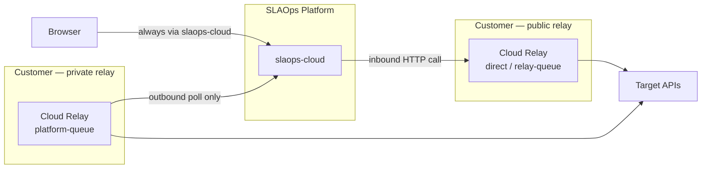
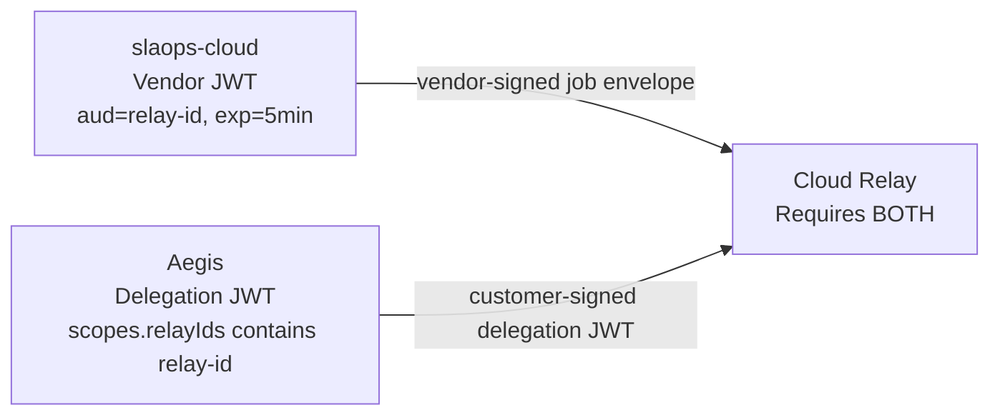

# Network Topology & Component Separation

> **Status**: Reference
> **Author**: SLAOps Team
> **Date**: 2026-03-28
> **Related**: [Relay Connection Design](./cloud-relay/relay-connection.md), [Cloud Relay Component](./cloud-relay/component-cloud-relay.md), [Aegis Token Broker Design](./cloud-relay/aegis-token-broker-design.md)

## Overview

The SLAOps edge consists of three runtime components: **slaops-cloud** (vendor SaaS), **Cloud Relay** (`apps/slaops-relay`), and **Aegis** (`apps/slaops-aegis`). The relay and Aegis are customer-deployed and are intentionally kept as separate, independently deployable artifacts. This document explains the topology options, why the separation exists, and the security properties it provides.

---

## The three components

| Component | Hosted by | Browser-reachable | Holds secrets | Inbound required |
|---|---|---|---|---|
| **slaops-cloud** | SLAOps (vendor SaaS) | Yes (API) | Vendor signing key only | Yes |
| **Cloud Relay** | Customer (or SLAOps-managed) | No (by design) | Customer API credentials | Optional — see delivery modes |
| **Aegis** | Customer | Yes (from browser) | Customer IdP config, signing key | Yes — browser must reach it |

The critical asymmetry: **Aegis must accept inbound connections from the browser. The relay does not have to.**

---

## Delivery modes and what they require from the network

The `delivery_mode` on a relay connection determines how slaops-cloud routes requests. The choice is a direct function of what the customer's network topology allows.



### `direct`
slaops-cloud calls the relay's `POST /cloud-relay/proxy` synchronously and waits for the response.

**Network requirement**: relay must accept inbound HTTPS from slaops-cloud.
**Use when**: relay is publicly reachable (e.g. Lambda behind API Gateway, Docker on a public host).

### `relay-queue`
slaops-cloud submits a job to the relay's `POST /cloud-relay/queue`. The relay's internal `QueueStore` (in-memory or SQS + DynamoDB) processes it asynchronously. slaops-cloud polls the relay for the result.

**Network requirement**: relay must accept inbound HTTPS from slaops-cloud. Browser does not need to reach the relay.
**Use when**: the relay is on a private network reachable from slaops-cloud (server-to-server), but not from the browser directly.

### `platform-queue`
The relay polls `GET /cloud-relay/queue/next` on slaops-cloud, claims a job, executes it, and posts the result to `POST /cloud-relay/job/:id/result`. The relay makes **only outbound** calls.

**Network requirement**: relay needs outbound HTTPS to slaops-cloud only. No inbound connections required at all.
**Use when**: the relay is inside a fully private network with no inbound firewall rules — only outbound internet access is permitted (e.g. an isolated VPC, an on-premises data centre with outbound-only egress).

### Decision guide

```
Can the relay accept inbound connections from slaops-cloud?
├── Yes → Does the customer need async execution with a durable queue?
│         ├── Yes → relay-queue
│         └── No  → direct
└── No  → platform-queue
```

---

## Why Relay and Aegis are separate deployable artifacts

Several AI-generated architecture suggestions have recommended merging the relay and Aegis into a single deployable. The reasoning is usually operational simplicity: one artifact to build, version, and deploy. That argument is valid when the two components have the same network placement and the same trust level. Here they do not.

### 1. Network placement is fundamentally incompatible

Aegis issues session delegation JWTs to the browser. The browser must reach it directly — it is a perimeter service. The relay, by contrast, is designed to operate in environments where inbound connections are impossible (platform-queue mode). Bundling the two would force every relay deployment to expose a port, permanently eliminating the platform-queue deployment option.

This is not a convenience trade-off. It is a hard topological constraint.

### 2. Secret access must not extend to the auth service

The relay holds customer API credentials: Vault tokens, AWS Secret Manager ARNs, Azure Key Vault references, environment-injected keys. These are used at request execution time to fulfil proxy calls to third-party APIs.

Aegis is an auth service. Its only purpose is to assert that a user is who they claim to be and to issue a scoped delegation JWT. It has no legitimate reason to access any of those credentials.

If they were co-deployed:
- A compromise of Aegis (browser-reachable, larger attack surface) would directly expose the relay's secret store access.
- A bug in the secret resolution or template engine would be co-located with the token issuance code.
- An operator granting access to Aegis config inadvertently grants access to secret store credentials.

Keeping them separate enforces **least privilege at the service boundary**.

### 3. The relay's attack surface is uniquely elevated

The relay makes outbound HTTP calls to arbitrary URLs specified by users. This is an SSRF-adjacent operation by design — it is the product's core feature. The policy engine and DNS-level SSRF protections mitigate this, but the relay is still the highest-risk component in the system because it is the one making untrusted outbound network calls.

Co-locating the relay with the component that issues auth tokens means an SSRF bypass, a template injection, or a dependency vulnerability in the proxy path would also compromise token issuance. Separation contains the blast radius.

```
Relay compromise  →  proxy credentials at risk (bounded impact)
Combined artifact →  proxy credentials + session token issuance at risk
```

### 4. Deployment cardinality differs

A customer might deploy:
- **One Aegis per environment** — shared across business units, regions, and relay instances.
- **Multiple relays** — one per VPC, one per region, one per network segment, or one per team.

The relay-connection design reflects this: `relay_instance.aegis_id` is a many-to-one FK — many relays can reference a single Aegis. Bundling would force 1:1 pairing, which does not match customer deployment patterns.

### 5. Aegis is optional per relay

Some customers use simpler auth models: API key, their own reverse proxy, or network-level controls. They can deploy a relay without Aegis by simply not setting `AEGIS_JWKS_URL`. If the two were merged, every relay deployment would carry the Aegis footprint, its signing key material, and its IdP integration — even when none of it is in use.

### 6. Update cadences are different

Relay updates are driven by proxy features, secret backend support, and policy engine changes. They must be tested carefully because they touch production credentials and make outbound network calls.

Aegis updates are driven by auth protocol changes and IdP integration requirements. A security patch to the JWT signing library should be deployable to Aegis without triggering a re-test of the proxy execution path — and vice versa.

---

## The dual-authorization model and why separation enforces it

The security model of the system is: **neither slaops-cloud nor Aegis alone can cause the relay to execute a job**.



The relay validates two independent tokens on every job:

1. **Vendor JWT** — signed by slaops-cloud's private key. Proves the job originated from the SLAOps platform. Scoped to this specific relay (`aud` = `RELAY_ID`).
2. **Delegation JWT** — signed by the customer's Aegis private key. Proves the end user is authenticated under the customer's own IdP. Scoped to this specific relay (`scopes[].relayIds` contains `RELAY_ID`).

If the SLAOps platform is compromised, it cannot execute relay jobs unilaterally — it cannot forge the customer's Aegis signature. If Aegis is compromised, it cannot execute jobs unilaterally — it cannot forge the vendor's signature. Both must be valid for the relay to proceed.

This model only holds if the two signing authorities are distinct. Co-deploying the relay and Aegis in one artifact does not break the cryptographic separation (they can still use different keys), but it does break the **operational separation** — a single deployment being compromised would expose both signing paths at once.

---

## Security properties summary

| Property | Separate | Combined |
|---|---|---|
| Relay can operate in fully private networks (platform-queue) | ✅ | ❌ Aegis must be browser-reachable |
| Aegis compromise cannot access secret store | ✅ | ❌ Same process / same host |
| Relay compromise cannot forge delegation JWTs | ✅ | ❌ Same process / same host |
| SSRF blast radius is contained to proxy credentials | ✅ | ❌ Also exposes token issuance |
| Many relays : one Aegis topology is possible | ✅ | ❌ Forces 1:1 |
| Relay can be deployed without Aegis | ✅ | ❌ Bundled always |
| Independent update / patch cadence | ✅ | ❌ Shared artifact |
| Least privilege: Aegis has no secret store access | ✅ | ❌ Shared deployment unit |

---

## Common objection: operational complexity

The argument for combining is that it reduces the number of things to deploy, configure, and monitor.

This is a real cost. Two deployments have more moving parts than one. The answer to that complexity is good tooling — Docker Compose, Helm chart, or a CDK construct that provisions both together with sensible defaults — not collapsing the security boundary between them. The deployment UX can be made simple while keeping the runtime separation intact.

Operational convenience is the right reason to improve the deployment experience. It is not the right reason to co-locate components with incompatible trust levels and network placement requirements.
