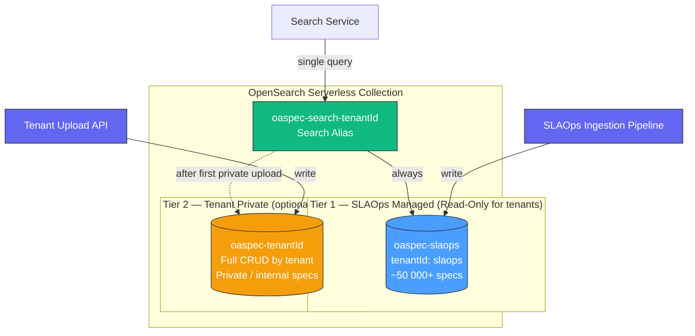
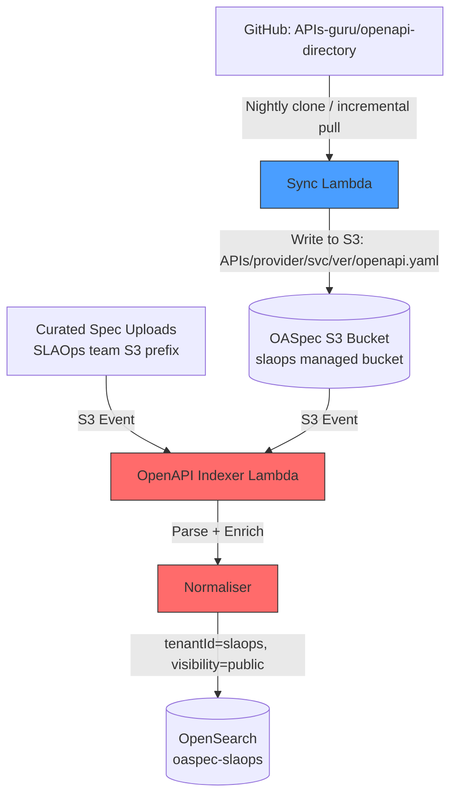

# Design: OpenAPI Index Access Pattern

> **Status**: Draft
> **Author**: Derrick
> **Date**: 2026-03-30
> **Related Design**: [OpenAPI Directory Indexer](./openapi-directory-indexer)

## Overview

This document defines the multi-tenant OpenAPI index architecture: how OpenAPI specifications are stored, organised, and accessed across the two-tier index model — the SLAOps managed public index and per-tenant private indices.

### Goals

- Tenants can search a rich, curated catalogue of well-known APIs without managing it themselves (read-only)
- Tenants can maintain private OASpec definitions (e.g., internal APIs not in the public directory) that take precedence during enrichment
- SLAOps is modelled as a first-class tenant internally; the managed index is just a tenant index with `tenantId = slaops`
- Search across both tiers is transparent: callers get a merged, deduplicated result set

---

## Two-Tier Index Architecture



### Tier 1 — SLAOps Managed Index (`oaspec-slaops`)

| Property | Value |
|---|---|
| Index name | `oaspec-slaops` |
| Owner `tenantId` | `slaops` (the platform's own tenant) |
| Write access | SLAOps internal pipeline only |
| Read access | All authenticated tenants |
| Primary source | APIs-guru/openapi-directory + curated additions |
| Update cadence | Nightly sync + on-demand trigger |

The SLAOps platform is itself modelled as a tenant (`tenantId = "slaops"`). This means:
- All existing multi-tenant access-control, indexing, and search machinery works unchanged
- The managed index is just an ordinary tenant index that happens to be populated automatically and is read-only to other tenants
- Future platform tenants (e.g., `stripe`, `github` as verified providers) follow the same pattern

### Tier 2 — Tenant Private Index (`oaspec-{tenantId}`)

| Property | Value |
|---|---|
| Index name | `oaspec-{tenantId}` |
| Owner `tenantId` | The specific tenant |
| Write access | That tenant only |
| Read access | That tenant only |
| Primary source | Tenant-uploaded OASpecs |
| Provisioning | Created on first tenant upload (lazy) |

Tenant private indices are optional. A tenant with no private index falls back entirely to Tier 1.

---

## Index and Alias Naming Convention

### Physical indices

```
oaspec-{tenantId}
```

Examples:
- `oaspec-slaops` — SLAOps managed public catalogue
- `oaspec-acme-corp` — ACME Corp's private definitions
- `oaspec-7f3a9b12` — UUID-based tenant ID

`tenantId` is lowercase, alphanumeric, hyphen-separated. The prefix `oaspec-` namespaces all spec indices in the OpenSearch collection.

### Search alias

Each tenant gets a single alias used by all search requests:

```
oaspec-search-{tenantId}
```

The alias is the only target that search callers ever address. It abstracts away how many underlying indices back a given tenant's view.

| Alias | Backing indices | When created |
|---|---|---|
| `oaspec-search-{tenantId}` | `oaspec-slaops` only | On tenant onboarding |
| `oaspec-search-{tenantId}` | `oaspec-{tenantId}` + `oaspec-slaops` | After first private spec upload |

The alias is updated (not recreated) when the private index is provisioned — a single `POST /_aliases` call that adds the new index.

---

## Search Resolution Order

When a caller queries OASpecs (e.g., during log enrichment to resolve an incoming request against a known API), the search follows this precedence:

```
1. Tenant private index  (oaspec-{tenantId})   — highest precedence
2. SLAOps managed index  (oaspec-slaops)        — fallback
```

**Why tenant-first?** Tenants may want to override or extend a public spec (e.g., a private staging variant of a public API, or a spec with additional internal routes). The private definition wins.

**Implementation**: The search service queries the tenant's alias — a single, stable index name. OpenSearch resolves the alias to its backing indices. `indices_boost` is included in the query body to give the tenant's private index higher relevance than the managed catalogue for overlapping results.

```
GET /oaspec-search-{tenantId}/_search
{
  "query": { ... },
  "indices_boost": [
    { "oaspec-{tenantId}": 2.0 },
    { "oaspec-slaops": 1.0 }
  ]
}
```

The search service has no conditional logic for "does this tenant have a private index?" — that is entirely encoded in the alias. If the alias points to one index or two, the query is identical.

---

## OASpec Document Schema

Both tiers share the same `OpenApiIndexDocument` schema (defined in [openapi-directory-indexer](./openapi-directory-indexer)) with two additional fields:

```typescript
interface OpenApiIndexDocument {
  // ... all existing fields ...

  /**
   * The tenant that owns this document.
   * "slaops" for managed specs; the tenant's ID for private specs.
   */
  tenantId: string

  /**
   * Visibility of this document.
   * - "public"  → SLAOps managed, readable by all tenants
   * - "private" → Tenant-owned, readable only by that tenant
   */
  visibility: 'public' | 'private'
}
```

---

## SLAOps Managed Index — Ingestion Component

### Sources

| Source | Format | Priority |
|---|---|---|
| [APIs-guru/openapi-directory](https://github.com/APIs-guru/openapi-directory) | Structured directory (YAML/JSON) | Primary |
| Official provider portals (Stripe, Twilio, AWS, etc.) | Provider-published specs | Secondary |
| Curated internal additions | Manual upload by SLAOps team | Supplementary |

### Ingestion Pipeline



### Sync Lambda — APIs-guru Sync

Triggered on a nightly schedule (and manually via SNS). Responsibilities:

1. **Fetch** the APIs-guru directory (shallow clone or tarball download from GitHub)
2. **Diff** against last known commit SHA stored in SSM Parameter Store
3. **Upload** changed/new specs to the SLAOps-managed OASpec bucket (`{region}--{env}--slaops--slaops--oaspec--storage--specs`) under `APIs/{provider}/{service}/{version}/openapi.yaml`
4. **Delete** removed specs from S3 (triggers indexer delete via S3 event)
5. **Update** the last-sync commit SHA in SSM

The SLAOps platform's managed OASpec bucket follows the same naming convention as tenant buckets, using the reserved `slaops` tenant ID in the bucket name. See [Multi-Tenancy (Infrastructure Design)](../infrastructure/multi-tenancy#s3-buckets).

### Indexer Lambda — Document Enrichment for SLAOps Tier

The existing OpenAPI Indexer Lambda processes S3 events. For the `slaops/` prefix it sets:

```typescript
{
  tenantId: 'slaops',
  visibility: 'public',
  // targetIndex: 'oaspec-slaops'  (resolved from tenantId)
}
```

No other changes to the indexer are required — the multi-tenant fields are injected by the S3 key prefix resolver.

### Deduplication and Versioning

- Document ID: `{provider}/{serviceName}/{version}` — same as existing convention, scoped within each index
- On re-index (spec updated upstream), the existing document is replaced via `index` (upsert) with the same ID
- Version history is not retained in OpenSearch; S3 object versions serve as the audit trail

---

## Tenant Private Index — Management

### Write Path

Tenants upload OASpecs via the SLAOps Portal or REST API:

```
POST /v1/oaspecs
Content-Type: application/json
X-Tenant-Id: {tenantId}

{ "spec": "<OpenAPI YAML or JSON>" }
```

The upload handler:
1. Validates the spec (OpenAPI 3.x only; Swagger 2.0 converted upstream)
2. Writes the spec to the tenant's dedicated OASpec S3 bucket (`{region}--{env}--slaops--{tenantId}--oaspec--storage--specs`) under `APIs/{provider}/{service}/{version}/openapi.yaml`
3. S3 event triggers the shared Indexer Lambda
4. Indexer sets `tenantId = caller's tenantId`, `visibility = "private"`, target index `oaspec-{tenantId}`

Each tenant has a dedicated S3 bucket for their specs — there is no shared bucket with tenant-prefixed keys. See [Multi-Tenancy (Infrastructure Design)](../infrastructure/multi-tenancy#s3-buckets) for the full bucket naming conventions.

### Lazy Index and Alias Provisioning

On the tenant's first private spec write, the Indexer Lambda performs a one-time setup if the private index does not yet exist:

1. **Create** `oaspec-{tenantId}` with the standard mapping
2. **Update** the tenant's search alias to include both indices:

```json
POST /_aliases
{
  "actions": [
    { "add": { "index": "oaspec-{tenantId}", "alias": "oaspec-search-{tenantId}" } }
  ]
}
```

After this, the alias points to `["oaspec-{tenantId}", "oaspec-slaops"]`. No further alias changes are needed for that tenant. The search service is unaffected — it continues to query `oaspec-search-{tenantId}` identically.

### Delete Path

```
DELETE /v1/oaspecs/{provider}/{service}/{version}
```

Removes from both S3 and OpenSearch. The S3 delete triggers an indexer event that issues an OpenSearch `delete` for the document ID.

---

## Access Control Summary

| Actor | `oaspec-slaops` | `oaspec-{tenantId}` | `oaspec-search-{tenantId}` (alias) |
|---|---|---|---|
| SLAOps ingestion pipeline | Read + Write | — | — |
| Tenant (own) | Read-only | Read + Write | Read (resolves to both) |
| Tenant (other) | Read-only | No access | No access |
| SLAOps platform services (enrichment) | Read | Read (tenant's index only) | Read |

OpenSearch index-level permissions are enforced via AWS IAM data access policies on the OpenSearch Serverless collection. Each tenant's Lambda execution role is granted:
- Read access to `oaspec-slaops`
- Read + Write access to `oaspec-{tenantId}`
- Read access to alias `oaspec-search-{tenantId}` (alias permissions are separate from index permissions in OpenSearch Serverless)

The search alias is created during tenant onboarding pointing only at `oaspec-slaops`, then updated (not recreated) to add `oaspec-{tenantId}` on first private spec write.

---

## Enrichment Integration

During log enrichment (the hot path described in the [CLAUDE.md architecture notes](../../CLAUDE.md)):

1. Incoming HTTP request arrives at the relay
2. Enrichment service extracts the `host` / base URL
3. OpenSearch search is issued against alias `oaspec-search-{tenantId}` (tenant-boosted via `indices_boost`)
4. Best matching OASpec is returned; the matched operation is attached to the log event
5. DynamoDB cache stores `{tenantId}:{host} → {specId}` for sub-millisecond repeat lookups (TTL: 5 min)

The DynamoDB cache key includes `tenantId` to prevent cross-tenant cache pollution.

---

## Configuration Properties

The following config keys will be added to `packages/slaops-config/src/config.ts`:

```typescript
/** Index name prefix for OASpec physical indices */
'opensearch.oaspec.index-prefix': 'oaspec',

/** Alias name prefix for OASpec search aliases */
'opensearch.oaspec.alias-prefix': 'oaspec-search',

/** Tenant ID for the SLAOps managed public catalogue */
'opensearch.oaspec.slaops-tenant-id': 'slaops',

/** Boost factor applied to tenant private index in multi-index search */
'opensearch.oaspec.tenant-boost': 2.0,

/** DynamoDB cache TTL for host→specId mappings (seconds) */
'dynamodb.oaspec-cache.ttl-seconds': 300,
```

Derived names:
- Index: `` `${config['opensearch.oaspec.index-prefix']}-${tenantId}` ``
- Alias: `` `${config['opensearch.oaspec.alias-prefix']}-${tenantId}` ``

---

## Open Questions

1. **Index per tenant vs. shared index with tenant filter** — This design uses a dedicated index per tenant for access-control simplicity and OpenSearch IAM alignment. A shared index with a `tenantId` filter field is an alternative but complicates row-level access control in Serverless. Decision: dedicated index per tenant.

2. **SLAOps tenantId format** — Using the literal string `"slaops"` (not a UUID) to make it human-readable in index names and logs. This is a reserved identifier that cannot be claimed by external tenants.

3. **Curated additions beyond APIs-guru** — The design leaves a `curated/` S3 prefix open for the SLAOps team to manually upload specs (e.g., AWS service specs, internal SLAOps API). These are treated identically to APIs-guru specs in the pipeline.

4. **APIs-guru sync frequency** — The APIs-guru directory receives infrequent updates (weekly/monthly cadence for most providers). A nightly sync is sufficient and avoids GitHub rate-limit issues.

---

## Related Documents

- [OpenAPI Directory Indexer](./openapi-directory-indexer) — The existing single-index indexer this design extends
- [Multi-Tenancy (Infrastructure Design)](../infrastructure/multi-tenancy) — TenantConstruct, dedicated S3 buckets, IAM scoping, tenant lifecycle
- [Tagging Conventions](../infrastructure/tagging-conventions) — Required AWS tags for all tenant resources
- [Multi-Tenancy (Docs)](/docs/multi-tenancy) — Customer-facing overview of data isolation and dedicated resources
- [OASpec Bucket (Docs)](/docs/oaspec-bucket) — Bucket naming reference
- [CLAUDE.md — When to Use DynamoDB](../../CLAUDE.md) — DynamoDB cache rationale for enrichment hot path
