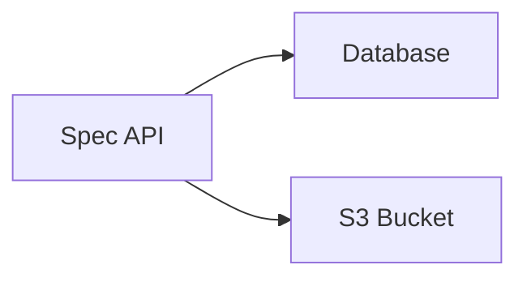

# OpenAPI Specification

## Cron Updater

## Agentic Agent Updater

1. Called if API has not been updated for a long time.
2. Called if there has been issues with the API.

## Populating OpenAPI Specifications

### VIA API or CLI

The sla CLI can be used to populate an OpenAPI specification into the platform.

## Request

Specifying Credentials OAuth, or Header, as well as a request, this can be used to poll for API changes.

## Web search

Web-Agent will be used in an attempt to try and find the OpenAPI specification.

## API Finder

- domain
- basepath

## Operation Finder

For a given operation, need to lookup the paths based off of:

- domain
- version
- date
- base path
- controllerpath
