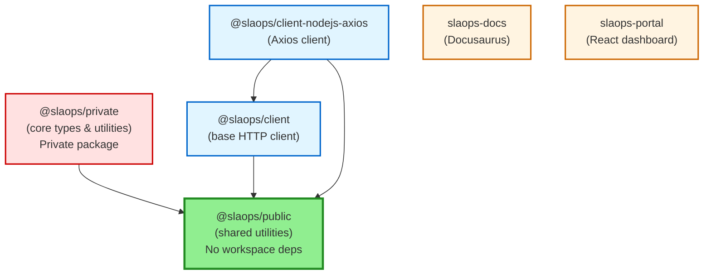

# SLAOps Monorepo

The following diagram shows the dependencies between the packages in the SLAOps monorepo.

Clean Dependency Structure:

1. @slaops/public (base foundation) - No workspace dependencies ✅
2. @slaops/private → depends on @slaops/public
3. @slaops/client → depends on @slaops/public
4. @slaops/client-nodejs-axios → depends on @slaops/client + @slaops/public
5. Apps (docs, portal) - No workspace dependencies, standalone

Build Order:

Build Order:
`@slaops/public` → `@slaops/private` → `@slaops/client` → `@slaops/client-nodejs-axios`
