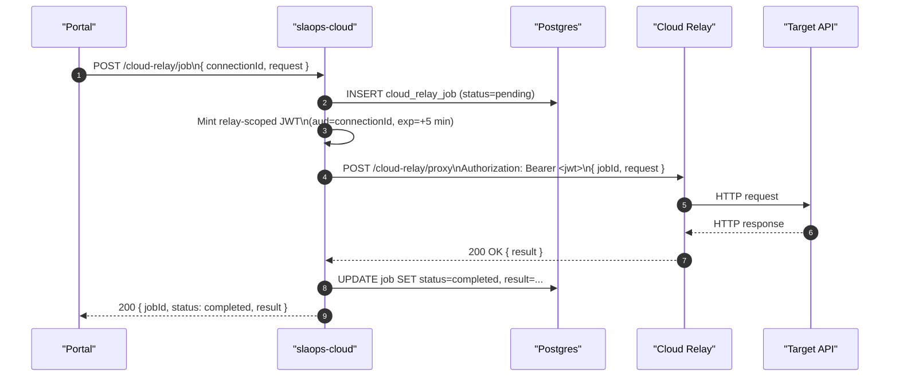
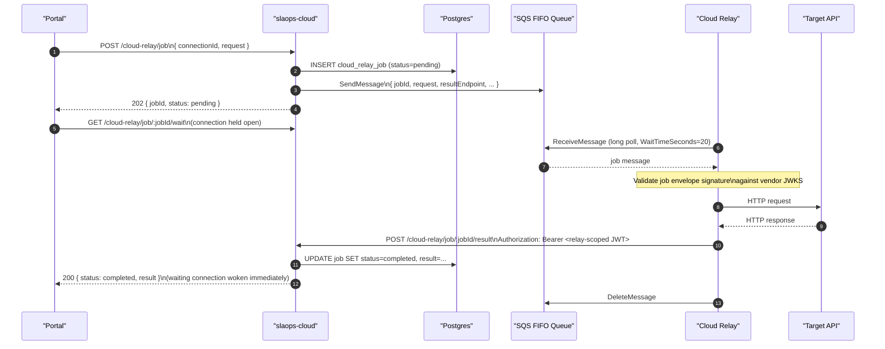

# API Tester — Relay-Backed Job Execution

> **Status**: Draft
> **Author**: dfutschik
> **Related**: [Portal Connections UI](./portal-connections-ui), [Relay Connection Design](./relay-connection), [Component Design](./component-cloud-relay), [Network Topology](./network-topology)

## Overview

This document describes how the API Tester executes HTTP requests through a relay connection. When a user selects a connection and clicks **Send**, the request is handed to `slaops-cloud`, which routes the job to the appropriate relay using the connection's delivery mode (`direct` or `platform-queue`). For `platform-queue` connections, the platform enqueues a job message on the connection's SQS FIFO queue; the relay polls the queue, executes the request, and posts the result back.

---

## Components Involved

| Component                    | Role                                                                                                 |
| ---------------------------- | ---------------------------------------------------------------------------------------------------- |
| **Portal** (`slaops-portal`) | Builds the request payload, submits the job to slaops-cloud, polls for the result                    |
| **slaops-cloud**             | Receives the job, routes it via the connection's delivery mode, stores job state, exposes the result |
| **SQS FIFO queue**           | Durable work channel between slaops-cloud and the relay (platform-queue mode only)                   |
| **Relay** (`slaops-relay`)   | Polls SQS (or receives a direct call), executes the HTTP request, posts the result to slaops-cloud   |

---

## Portal — Connection Selector

### Current state

The API Tester (`ApiTester.tsx`) currently executes all requests via a direct browser `fetch()` call. There is no relay selector, no connection state, and no concept of routing through a relay. The connections registered in **Settings → Connections** are entirely decoupled from the API Tester at the code level.

### Placement

The relay selector sits above the URL bar, spanning the full width of the request panel. It appears on every API Tester load, regardless of whether any connections exist.

```
┌────────────────────────────────────────────────────────────┐
│  [● Production Relay (SQS)  ▼]          [Manage →]        │  ← relay selector row
├────────────────────────────────────────────────────────────┤
│  GET ▾  │  https://api.example.com/v1/users     [Send]    │
```

The **Manage →** link opens **Settings → Connections** in a new browser tab. It is always visible so users can add a connection without losing their request state.

### State management

A new custom hook `useRelaySelector(tenantId)` owns the selector state. It is not added to any existing Redux slice — the connection selection is UI state local to the API Tester page, and Redux overhead is not warranted for a single dropdown value.

```typescript
interface RelaySelection {
  connectionId: string | null // null = browser mode (no relay)
  connection: CloudRelayConnection | null // resolved object, null when browser mode or loading
}
```

The hook:

1. Calls `cloudRelayApi.findAllConnections(tenantId)` on mount and on window focus (to pick up changes made in Settings).
2. Reads the persisted selection from `localStorage` key `slaops_apitester_relay_<tenantId>` and resolves it against the loaded list.
3. Exposes `selection`, `connections`, `isLoading`, and `setConnectionId(id: string | null)`.

### Selector dropdown items

```
─ No relay ──────────────────────────────
  ○ Browser (direct)
─ Connections ───────────────────────────
  ● Production Relay       SQS  · active
  ● Staging Relay          HTTP · active
  ○ DR Relay               SQS  · unreachable
─ Local ─────────────────────────────────
  ◉ My local relay         SQS  · local
```

- The **Browser (direct)** option always appears first. Selecting it sets `connectionId = null` and routes requests through the existing `fetch()` path with no changes to behaviour.
- Connection rows show a delivery-mode badge (`HTTP` or `SQS`) and a status dot.
- `unreachable` connections are rendered greyed-out with a strikethrough status dot. They are selectable (the user may want to test anyway) but show a warning tooltip: _"This connection was last seen as unreachable."_
- `pending` connections are shown greyed-out with a clock icon and tooltip: _"This connection has not completed setup."_

### localStorage persistence

| Key                                 | Value                          | Scope      |
| ----------------------------------- | ------------------------------ | ---------- |
| `slaops_apitester_relay_<tenantId>` | `connectionId: string \| null` | Per-tenant |

On page load, `useRelaySelector` reads the stored `connectionId` and cross-checks it against the current connections list:

| Stored value | Current list result            | Behaviour                                                                                                                              |
| ------------ | ------------------------------ | -------------------------------------------------------------------------------------------------------------------------------------- |
| A valid UUID | Connection exists              | Pre-select that connection                                                                                                             |
| A valid UUID | Connection was deleted         | Clear localStorage entry; fall back to **Browser (direct)**; show one-time toast: _"Your previously selected connection was deleted."_ |
| `null`       | —                              | Select **Browser (direct)**                                                                                                            |
| No entry     | One or more active connections | Select the first active non-local connection; otherwise **Browser (direct)**                                                           |

The stored value is updated immediately on every selection change. No debounce needed — it is a simple string write.

The existing `apiTester_lastRequest` localStorage entry is **not** extended to include `connectionId`. The relay selection is independent of the request state; they are restored separately on page load.

### Switching while idle (no request in-flight)

Selecting a different connection from the dropdown while the response panel is empty or showing a completed result:

1. `setConnectionId(newId)` updates state and persists to `localStorage`.
2. The URL bar, headers, body — all request state — is preserved unchanged.
3. The response panel is **not** cleared. The previous result remains visible with a muted label: _"Previous result — via [old connection name]."_
4. No API calls are made on switch. The new connection takes effect on the next **Send**.

### Switching while a request is in-flight

When the user switches the selector while the response panel shows a loading state (a job has been submitted and the portal is polling):

1. `setConnectionId(newId)` updates the dropdown immediately and persists.
2. **The in-flight poll is not cancelled.** The existing job was already submitted to the old connection's relay — cancelling the poll does not stop relay execution, it only discards the result on the portal side.
3. The response panel continues polling. When the result arrives, it is rendered with a banner: _"Result via [old connection name]"_ — so the user knows which relay actually executed it.
4. The next **Send** uses the newly selected connection.

This avoids the complexity of a cancel/re-submit flow and is honest about what actually ran. The user is never left with a result that silently came from a different relay than the one currently shown in the selector.

### Send path branching

The API Tester's send handler branches on `selection.connectionId`:

```
if connectionId === null:
    // existing path — browser fetch()
    response = await fetch(url, { method, headers, body })
    render response directly

else:
    // relay path — this design
    { jobId } = await POST /cloud-relay/job { connectionId, request }
    if immediate result (direct mode, 200):
        render result
    else:
        start poll loop → render result when completed
```

The two paths share the response rendering layer (status, headers, body viewer) but diverge entirely in how the HTTP request is dispatched. The existing `fetch()` path is unchanged.

### Send button guard rails

| Condition                                                  | Behaviour                                                                                                                     |
| ---------------------------------------------------------- | ----------------------------------------------------------------------------------------------------------------------------- |
| Selected connection is `unreachable`                       | Confirmation inline banner above Send button: _"This connection appears unreachable. [Send anyway] [Cancel]"_                 |
| Selected connection is `pending`                           | Send is blocked; tooltip on button: _"Complete connection setup before sending."_                                             |
| Selected connection was deleted between page load and Send | `POST /cloud-relay/job` returns 404; portal shows: _"Connection not found — it may have been deleted. [Select a connection]"_ |
| No connections registered and user has never selected one  | Selector shows only **Browser (direct)**; no guard needed                                                                     |

### Mode indicator in the response panel

When a relay-routed result is displayed, the status ribbon (currently shows HTTP status + time) gains two additional fields:

| Field        | Value                                                                                                                                   |
| ------------ | --------------------------------------------------------------------------------------------------------------------------------------- |
| Via          | Connection name (e.g. _Production Relay_)                                                                                               |
| Mode         | `SQS` or `HTTP`                                                                                                                         |
| Relay timing | Time measured by the relay from receiving the job to getting a response from the target, shown alongside the portal-measured round-trip |

For browser (direct) results the Via and Mode fields are omitted.

---

## Contract

### Job submission

```
POST /cloud-relay/job
x-tenant-id: <tenantId>

{
  connectionId: string           // UUID of the selected relay connection
  request: {
    method:      string          // GET, POST, PUT, PATCH, DELETE, HEAD, OPTIONS
    url:         string          // fully-qualified target URL
    headers:     Record<string, string>
    queryParams: Record<string, string>
    body:        string | null   // serialised body; null for bodyless methods
    contentType: string | null   // Content-Type header value if body is present
  }
  timeoutMs?: number             // optional per-request timeout override (default from config)
}
```

Response (202 Accepted):

```json
{
  "jobId": "<uuid>",
  "status": "pending"
}
```

For `direct` connections the response may also be 200 with `status: "completed"` and a `result` field if the relay responds synchronously within the request window.

### Job wait (long-poll)

The primary way the portal retrieves a result. The connection is held open until the job completes or the timeout expires.

```
GET /cloud-relay/job/:jobId/wait?timeout=25
x-tenant-id: <tenantId>
```

`timeout` — seconds to wait before returning; default 25, max 25 (safely below API Gateway's 29-second integration limit).

**If the job is already complete when the request arrives**, slaops-cloud returns immediately:

```json
{
  "jobId": "<uuid>",
  "status": "completed | failed | timed_out",
  "connectionId": "<uuid>",
  "createdAt": "<ISO timestamp>",
  "completedAt": "<ISO timestamp>",
  "result": {
    "statusCode": 200,
    "statusText": "OK",
    "headers":    {},
    "body":       "<string>",
    "timingMs":   142
  } | null,
  "error": {
    "code":    "relay_timeout | relay_error | execution_error",
    "message": "<human-readable description>"
  } | null
}
```

**If the job is still pending**, slaops-cloud holds the connection open. When the relay posts its result, slaops-cloud wakes the waiting handler and responds immediately with the same shape above.

**If `timeout` seconds elapse with no result**, slaops-cloud returns:

```json
{
  "jobId": "<uuid>",
  "status": "pending"
}
```

The portal re-issues `/wait` immediately — the user never perceives this cycle.

### Job status (non-blocking)

Used on page load to check whether a previously submitted job already has a result, without holding a connection open.

```
GET /cloud-relay/job/:jobId
x-tenant-id: <tenantId>
```

Returns the same shape as `/wait` but never blocks — always responds immediately with the current job state.

### Result delivery (relay → slaops-cloud)

```
POST /cloud-relay/job/:jobId/result
Authorization: Bearer <relay-scoped JWT>

{
  "statusCode": 200,
  "statusText": "OK",
  "headers":    {},
  "body":       "<string>",
  "timingMs":   142
}
```

On error:

```
POST /cloud-relay/job/:jobId/result
Authorization: Bearer <relay-scoped JWT>

{
  "error": {
    "code":    "execution_error",
    "message": "Connection refused: api.example.com:443"
  }
}
```

---

## SQS Message Format

When the connection's delivery mode is `platform-queue`, slaops-cloud enqueues a message on the connection's SQS FIFO queue. The relay reads this message to know what to execute.

```json
{
  "jobId": "<uuid>",
  "connectionId": "<uuid>",
  "tenantId": "<uuid>",
  "request": {
    "method": "GET",
    "url": "https://api.example.com/v1/users",
    "headers": {},
    "queryParams": {},
    "body": null,
    "contentType": null
  },
  "resultEndpoint": "https://api.slaops.com/cloud-relay/job/<jobId>/result",
  "vendorJwksUrl": "https://api.slaops.com/cloud-relay/.well-known/jwks.json",
  "timeoutMs": 30000,
  "createdAt": "<ISO timestamp>"
}
```

- **`resultEndpoint`** — the relay posts its result here; included in the message so the relay needs no additional platform configuration.
- **`vendorJwksUrl`** — included for relays that have not yet cached the JWKS URL; relay must validate the message's envelope signature before executing.
- **`MessageGroupId`** — set to `connectionId` to preserve per-connection ordering on the FIFO queue.
- **`MessageDeduplicationId`** — set to `jobId` (content-based deduplication disabled so the relay cannot receive the same job twice).

---

## Sequence

### Direct delivery mode



For `direct` connections the portal receives the full result in the initial response. No polling is required.

---

### Platform-queue (SQS) delivery mode



The portal opens the `/wait` connection immediately after receiving the `jobId`. slaops-cloud holds it open on an RxJS Subject keyed by `jobId`. When the relay posts `POST /result`, the handler emits on that Subject, the waiting connection wakes, and the result is flushed to the portal in the same moment — with no polling cycle in between.

---

## Portal Long-Poll Behaviour

For `platform-queue` jobs the portal uses a long-poll loop rather than short-interval polling. The portal sends one request that hangs open; slaops-cloud responds the instant the relay posts its result. The user sees the result as fast as the relay can execute — there is no artificial polling latency added on top.

### Normal flow

1. Portal calls `POST /cloud-relay/job` → receives `{ jobId }`.
2. Portal immediately opens `GET /cloud-relay/job/:jobId/wait?timeout=25`.
3. If the relay is fast (result already posted): `/wait` returns immediately with the full result.
4. If the relay is still executing: the connection stays open. When `POST /result` arrives, slaops-cloud wakes the handler and the response is flushed to the portal at that moment.
5. If 25 seconds elapse with no result: slaops-cloud returns `{ status: pending }` and the portal re-issues `/wait` immediately. This cycle repeats transparently — the user sees only a continuous loading state.

### Parameters

| Parameter               | Value | Notes                                                                            |
| ----------------------- | ----- | -------------------------------------------------------------------------------- |
| Wait timeout            | 25 s  | Below API Gateway's 29-second integration limit                                  |
| Max total wait          | 120 s | Portal renders a user-visible timeout error after 120 s of accumulated wait time |
| Retries on 5xx          | 3     | Then surface error to user                                                       |
| Retries on network drop | 3     | Portal re-issues `/wait`; connection drops are expected at the timeout boundary  |

### slaops-cloud implementation

slaops-cloud maintains an in-process `Map<jobId, Subject<JobResult>>`. Subjects are created on demand when `/wait` is called and cleaned up when the result is emitted or the handler times out.

The `POST /result` handler:

1. Writes the result to `cloud_relay_job`.
2. Looks up the Subject for the `jobId`. If one exists, emits the result on it — this directly wakes any open `/wait` connection.
3. Cleans up the Subject entry.

If no `/wait` connection is open when the result arrives (e.g. the portal tab was closed), the result is still written to the database and will be available when the portal next calls `GET /cloud-relay/job/:jobId` (non-blocking status check).

### Page load restoration

If the portal is loaded while a job is already in-flight (e.g. tab was closed and re-opened), the portal reads the `jobId` from `apiTester_lastRequest` in localStorage, calls the non-blocking `GET /cloud-relay/job/:jobId` to check current state, and either renders the stored result immediately (if already complete) or opens a `/wait` connection to resume waiting.

### Future upgrade path

SSE (`@Sse()` in NestJS) would allow the server to push the result without a client-driven re-request loop and would remove the 25-second API Gateway constraint. It requires Lambda Response Streaming and a move to the HTTP API integration type. Long-polling is the current approach; SSE is the natural upgrade once infrastructure supports it.

---

## slaops-cloud Job Lifecycle

```
pending → executing → completed
                    ↘ failed
         → timed_out
```

| Transition              | Trigger                                                                                                |
| ----------------------- | ------------------------------------------------------------------------------------------------------ |
| `pending → executing`   | Relay posts result (flip to executing just before the result write, or omit this state for simplicity) |
| `pending → timed_out`   | Background job scans for jobs older than `config['relay.job.timeout_ms']` with status `pending`        |
| `executing → completed` | `POST /cloud-relay/job/:id/result` with a valid result payload                                         |
| `executing → failed`    | `POST /cloud-relay/job/:id/result` with an error payload                                               |

For `platform-queue` jobs, `executing` is set when the relay posts its result (the relay signals execution start via the result call). There is no explicit "relay claimed the job" callback — the SQS visibility timeout provides the implicit execution window.

### SQS visibility timeout

The SQS message visibility timeout must exceed the maximum relay execution time. Default: `config['relay.sqs.visibility_timeout_seconds']` (recommended: 120 s). If the relay crashes after receiving the message but before posting a result, the message becomes visible again after the visibility timeout and a healthy relay instance can re-claim and re-execute it.

To avoid double-execution on retried jobs, the relay should check whether a result already exists before posting (`GET /cloud-relay/job/:id` → if `status != pending`, skip execution and just delete the SQS message).

---

## Trust Boundary

| Direction                          | Mechanism                                                                                                                                                                                                                                            |
| ---------------------------------- | ---------------------------------------------------------------------------------------------------------------------------------------------------------------------------------------------------------------------------------------------------- |
| Portal → slaops-cloud              | Cognito JWT (existing portal session auth)                                                                                                                                                                                                           |
| slaops-cloud → Relay (direct mode) | Relay-scoped vendor JWT (`aud = connectionId`)                                                                                                                                                                                                       |
| Relay → slaops-cloud (`/result`)   | Relay-scoped vendor JWT — relay proves identity before posting results                                                                                                                                                                               |
| Relay → SQS                        | IAM credentials (`AWS_ACCESS_KEY_ID` / `AWS_SECRET_ACCESS_KEY`) provisioned at connection creation time; scoped to `sqs:ReceiveMessage`, `sqs:DeleteMessage`, `sqs:GetQueueAttributes`, `sqs:ChangeMessageVisibility` on the connection's queue only |
| slaops-cloud → SQS                 | SLAOps platform IAM role; scoped to `sqs:SendMessage`                                                                                                                                                                                                |

The relay validates the SQS job message's envelope signature (vendor JWKS) before executing any request. This prevents a compromised SQS queue from being used to make the relay execute arbitrary requests.

---

## Failure Modes

| Failure                                        | Detection                                                                               | Handling                                                                                                                 |
| ---------------------------------------------- | --------------------------------------------------------------------------------------- | ------------------------------------------------------------------------------------------------------------------------ |
| Relay offline (SQS mode)                       | Job stays `pending` past 120 s of accumulated portal wait                               | Portal renders "Relay did not respond within 120 s"; background timeout scanner flips job to `timed_out`                 |
| Relay crashes mid-execution                    | SQS visibility timeout expires                                                          | Message re-queued; healthy relay picks it up. Idempotency guard prevents double-execution if a result was already posted |
| SQS unreachable (send)                         | `SendMessage` throws                                                                    | slaops-cloud returns 503 to portal with `error.code: sqs_unavailable`; `/wait` connection is never opened                |
| `/wait` connection dropped by network          | Client sees connection reset                                                            | Portal detects the drop, re-issues `/wait` up to 3 times before surfacing a network error                                |
| API Gateway 29-second hard timeout             | `/wait?timeout=25` returns `{ status: pending }` before the gateway cuts the connection | Portal re-issues `/wait` immediately; this is expected behaviour, not an error                                           |
| Target unreachable                             | Relay TCP/HTTP error                                                                    | Relay posts error result; `/wait` wakes and portal shows connection-level error                                          |
| Target slow                                    | Relay-side timeout per `timeoutMs` in job message                                       | Relay posts `error.code: target_timeout`; portal shows timeout with the relay-measured duration                          |
| Invalid vendor JWT on relay result             | 401 from slaops-cloud                                                                   | Relay logs the rejection; job stays `pending`; portal eventually times out after 120 s                                   |
| Job not found (result POST)                    | 404 from slaops-cloud                                                                   | Relay logs and deletes the SQS message; stale job — no user impact                                                       |
| No `/wait` connection open when result arrives | Subject lookup returns nothing                                                          | Result is written to DB; portal picks it up on next `/wait` cycle or page-load status check                              |

---

## New Endpoints Required on `slaops-cloud`

| Endpoint                           | Notes                                                                                                                               |
| ---------------------------------- | ----------------------------------------------------------------------------------------------------------------------------------- |
| `POST /cloud-relay/job`            | Job submission — new endpoint; creates `cloud_relay_job`, routes by delivery mode                                                   |
| `GET /cloud-relay/job/:id/wait`    | Long-poll result endpoint — new endpoint; holds the connection open until the job completes or `timeout` seconds elapse             |
| `GET /cloud-relay/job/:id`         | Non-blocking status check — new endpoint; returns current job state immediately; used on page-load restoration                      |
| `POST /cloud-relay/job/:id/result` | Result delivery from relay — **already exists** per component design; also wakes any open `/wait` connection via in-process Subject |

The `cloud_relay_job` table already exists (referenced in component design); confirm schema includes `result` (JSONB) and `error` (JSONB) columns alongside `status` and `tenant_id`.

---

## New Behaviour Required on the Relay (`slaops-relay`)

For **direct** mode the relay already exposes `POST /cloud-relay/proxy`. No changes needed for direct mode.

For **platform-queue** (SQS) mode:

1. Relay must poll the SQS queue configured via `SQS_QUEUE_URL` environment variable using long-polling (`WaitTimeSeconds=20`).
2. On message receipt: validate the job envelope signature against `vendorJwksUrl` in the message (or the cached `SLAOPS_VENDOR_JWKS_URL`).
3. Execute the HTTP request per `request` fields.
4. Post result to `resultEndpoint` with a relay-scoped JWT.
5. Delete the SQS message on successful result post.
6. Before executing: check `GET /cloud-relay/job/:id` — if `status != pending`, delete the SQS message and skip execution (idempotency guard).

---

## Key Decisions

**Long-polling over SSE for the initial implementation.** Long-polling gives near-instant result delivery — the portal receives the result the moment the relay posts it, with no artificial poll interval — while working within the existing Lambda + API Gateway infrastructure. SSE would remove the 25-second timeout constraint and eliminate the client re-request loop, but requires Lambda Response Streaming and an HTTP API integration change. Long-polling is the right balance of UX quality and implementation cost; SSE is the natural upgrade path once infrastructure supports it.

**Job message carries `resultEndpoint` and `vendorJwksUrl`.** This makes the relay stateless regarding platform URL configuration — the relay does not need `SLAOPS_PLATFORM_URL` set to post results. It trusts the URL in the signed message.

**Idempotency guard on relay result post.** SQS at-least-once delivery can cause a message to be re-delivered if the relay crashes after posting a result but before deleting the message. The guard prevents double execution without requiring distributed locks.

**Relay-scoped JWT for result authentication.** The relay authenticates its result post using the same vendor JWT mechanism used for direct-mode calls. This avoids introducing a separate credential for the result path.

---

## Open Questions

- Should `POST /cloud-relay/job` return the full result synchronously for `direct` connections (200 with result), or always return 202 + jobId so the portal always goes through `/wait`? Unified path is simpler portal-side but adds one extra round-trip for fast direct relays.
- What is the right default `timeoutMs` for the relay-side execution timeout? The relay timeout and the portal's 120-second accumulated wait must align. Propose: `relay.job.timeout_ms = 30000` (config), background scanner flips jobs to `timed_out` after this.
- Should the in-process Subject map be bounded (e.g., max N open `/wait` connections per tenant) to prevent memory pressure at scale? Propose a per-tenant cap enforced at the `/wait` handler with a 429 fallback to short-poll.

---

## Related Documents

- [Portal Connections UI](./portal-connections-ui) — relay selector in the API Tester, connection wizard
- [Relay Connection Design](./relay-connection) — connection trust model, SQS queue provisioning, IAM credentials
- [Component Design](./component-cloud-relay) — delivery modes, relay architecture, `cloud_relay_job` entity
- [Network Topology](./network-topology) — delivery mode selection rationale
- [Local Relay](./local-relay) — local relay SQS polling setup for developer machines
