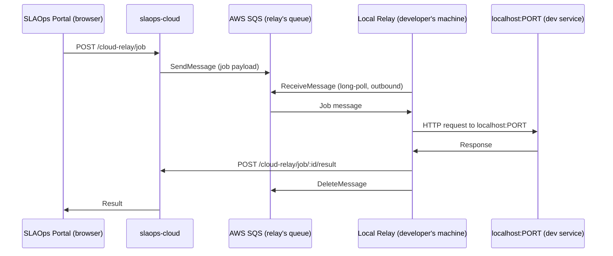

# Local Relay for Development

> **Status**: Implemented
> **Author**: SLAOps Team
> **Date**: 2026-03-28
> **Related**: [Cloud Relay Component](./component-cloud-relay.md), [Network Topology](./network-topology.md), [Relay Connection Design](./relay-connection.md)

## Overview

The SLAOps API Tester routes requests through a Cloud Relay to solve CORS, egress IP, credential exposure, and timing problems. However, when a developer is running a service **locally on their machine** (e.g. `http://localhost:3001`), no cloud-hosted or VPC-deployed relay can reach that address.

The solution is for the developer to run the `slaops-relay` process locally. This is architecturally identical to any other relay deployment — the relay happens to run on the developer's machine with target services also on localhost.

### Why not an in-browser relay?

An alternative would be to run relay logic in the browser and have it make requests directly to `localhost`. This is not viable:

- **Secret templates don't work.** `{{secret:env:*}}`, `{{secret:aws-secrets-manager:*}}`, `{{secret:vault:*}}` require a server-side process with access to environment variables and secret backends. A browser has neither.
- **Inconsistent experience.** Developers would get a different code path, different timing baseline, and different SSRF protections compared to the relay they use in staging and production — defeating the purpose.
- **Trust model.** The relay's dual-authorization model (vendor JWT + Aegis delegation JWT) is enforced at the relay process boundary and cannot be replicated in browser JS.

---

## Local Relay via SQS

The developer runs the existing `slaops-relay` process on their own machine. This is architecturally identical to any customer-deployed relay — it just happens to run on `localhost:PORT` with target services also on localhost.

### Why SQS instead of HTTP polling

When the relay cannot accept inbound connections (developer behind NAT or a corporate firewall), it needs a pull-based channel. Rather than the relay HTTP-polling a slaops-cloud endpoint, each relay registration provisions a **dedicated AWS SQS queue**. slaops-cloud publishes jobs to the queue; the relay consumes via SQS long-poll.

This gives:

- **No inbound ports** — the relay only makes outbound connections (SQS + slaops-cloud for result delivery)
- **Instant delivery** — SQS long-poll (20s) gives near-immediate job pickup vs. a polling interval
- **Durable queuing** — jobs survive a relay restart without being lost
- **Works from any network** — outbound HTTPS to SQS and slaops-cloud is sufficient

### How the relay authenticates to SQS — Cognito Identity Pool

The relay does not use long-lived IAM credentials. Instead, authentication flows entirely through the developer's existing Cognito session:

1. `slaops relay init` authenticates the developer via Cognito (PKCE), stores relay configuration in `~/.slaops/config`, and stores only the **Cognito tokens** in `~/.slaops/credentials`.
2. `slaops relay start` reads configuration from `~/.slaops/config` and tokens from `~/.slaops/credentials`, then exchanges the `id_token` for **temporary AWS credentials** (AccessKeyId + SecretKey + SessionToken, valid ~1 hour) via the Cognito Identity Pool → STS `AssumeRoleWithWebIdentity`.
3. Temporary credentials are passed to the relay process **in memory only** — never written to either file.
4. The relay **auto-refreshes** these credentials before they expire:
   - If the `id_token` is still valid: calls the Identity Pool directly.
   - If the `id_token` has expired: uses the `refresh_token` to get a new `id_token` first, then calls the Identity Pool.
5. The `refresh_token` is valid for **30 days**. When it expires, the developer runs `slaops relay init --force` to re-authenticate.

**Queue isolation is enforced entirely by IAM** using attribute-based access control (ABAC). The Identity Pool maps two id_token claims to IAM principal tags (`tenantId` ← Lambda-injected claim, `userId` ← `sub`). The IAM policy on the authenticated role uses those tags as variables in the resource ARN:

```
arn:aws:sqs:*:*:slaops-${aws:PrincipalTag/tenantId}-local-${aws:PrincipalTag/userId}-*
```

A user can only consume from queues whose name encodes their own tenant and user ID. No per-queue resource policies are needed — isolation holds generically for any queue that follows the naming convention.

### Request flow



---

## Design Decisions

### 1. Local relay always uses `platform-queue` delivery mode

No inbound ports are opened on the developer's machine. The developer doesn't touch firewall or router settings. The relay simply starts and begins polling.

### 2. `relay_instance.type` field

Relay connections in slaops-cloud carry a `type` discriminator:

| Value         | Description                                     |
| ------------- | ----------------------------------------------- |
| `managed`     | SLAOps-hosted Lambda behind API Gateway         |
| `self-hosted` | Customer-deployed on their own infrastructure   |
| `local-dev`   | Developer's local machine — platform-queue only |

A `local-dev` relay has additional constraints enforced by slaops-cloud:

- `delivery_mode` is locked to `platform-queue` and cannot be changed
- The SSRF policy preset is locked to `dev-local` (see below)

### 3. SSRF policy: `dev-local` preset

The standard relay SSRF policy blocks RFC-1918 private addresses to prevent cloud-internal SSRF attacks. A local relay must be able to reach `localhost`, so a dedicated preset is applied:

| Policy      | Allows                                 | Blocks                                  |
| ----------- | -------------------------------------- | --------------------------------------- |
| `default`   | All public IPs                         | RFC-1918, link-local, localhost         |
| `dev-local` | `127.0.0.1`, `::1`, and all public IPs | RFC-1918, link-local (except localhost) |

`dev-local` is only applied when `relay_instance.type = 'local-dev'`. It cannot be selected for `managed` or `self-hosted` relays.

### 4. Aegis is optional for `local-dev` relays

The full dual-authorization model (vendor JWT + customer Aegis delegation JWT) is designed for production deployments. For a `local-dev` relay:

- The developer is already authenticated to slaops-cloud via Cognito
- Running a local Aegis instance is significant operational overhead for a dev workflow
- The relay's `AEGIS_REQUIRED` env var defaults to `false` when started via `slaops relay start`

Aegis may be set up voluntarily against a shared dev Aegis instance if the team requires it, but it is not enforced. The vendor JWT alone is sufficient for local-dev relay jobs.

### 5. Liveness tracking

Liveness tracking (showing whether a relay is currently connected) is out of scope for this iteration — see Out of Scope below.

### 6. Portal UX

The relay selector in the API Tester:

- Shows `local-dev` relays with a distinct **Local** badge
- Warns the developer if the selected target URL begins with `localhost` or `127.0.0.1` but no `local-dev` relay is registered:

  > _Your target is a localhost URL. Start a local relay with `slaops relay start` to route this request._

---

## Developer Onboarding: `slaops-cli`

The `slaops-cli` package (`apps/slaops-cli`) is a dedicated CLI tool for developer-facing workflows, implemented with oclif. It depends on `slaops-relay` as a workspace dependency to start the relay programmatically.

The local relay workflow uses two commands:

### `slaops relay init` (one-time setup)

Authenticates the developer via Cognito browser OAuth (PKCE), registers a `local-dev` relay with the platform, and saves configuration and credentials to separate files.

```
$ slaops relay init

  Platform URL [https://api.slaops.com]:

  Opening browser for authentication...
  If the browser does not open, visit:
  https://auth.slaops.com/oauth2/authorize?...

  ✓ Authenticated
  ✓ Registering local relay with https://api.slaops.com...
  ✓ Registered (relay_id: abc-123)
  ✓ Config saved to ~/.slaops/config
  ✓ Credentials saved to ~/.slaops/credentials

  Run 'slaops relay start' to connect.
```

The platform creates a dedicated SQS queue for the relay. Configuration and tokens are stored in **separate files**, following the same separation as the AWS CLI:

**`~/.slaops/config`** (mode `0644`) — non-sensitive relay configuration:

```toml
[default]
platform_url = "https://api.slaops.com"
relay_id = "abc-123"
relay_sqs_queue_url = "https://sqs.ap-southeast-2.amazonaws.com/123456789/slaops-acme-local-abc123-relay456"
relay_sqs_region = "ap-southeast-2"
identity_pool_id = "ap-southeast-2:xxxxxxxx-xxxx-xxxx-xxxx-xxxxxxxxxxxx"
cognito_region = "ap-southeast-2"
user_pool_id = "ap-southeast-2_XXXXXXXXX"
```

**`~/.slaops/credentials`** (mode `0600`) — sensitive time-limited tokens:

```toml
[default]
access_token = "eyJ..."
id_token = "eyJ..."
refresh_token = "eyJ..."          # valid 30 days — re-run relay init when expired
expires_at = "2026-03-28T13:00:00Z"
```

**No AWS credentials are stored in either file.** Temporary credentials are obtained at runtime from the Identity Pool and kept in the relay process's memory only.

Both files follow the same profile structure (`[default]`, `[staging]`, etc.). Multiple profiles let developers connect to different SLAOps tenants or environments simultaneously:

```
slaops relay init --profile staging --platform-url https://api.staging.slaops.com
slaops relay start --profile staging
```

### `slaops relay start`

Reads configuration from `~/.slaops/config` and tokens from `~/.slaops/credentials`, refreshes the Cognito tokens if expired, and starts the relay:

```
$ slaops relay start

  ✓ Local relay starting (relay_id: abc-123)
  ✓ Connecting via SQS → https://sqs.ap-southeast-2.amazonaws.com/123456789/slaops-acme-local-abc123-relay456

  Target localhost services are now reachable from the SLAOps API Tester.
  Press Ctrl+C to stop.
```

---

## Schema Additions (`relay_instance`)

One column is added to the `relay_instance` table to support local relays:

```sql
ALTER TABLE relay_instance
  ADD COLUMN type VARCHAR(20) NOT NULL DEFAULT 'self-hosted'
    CHECK (type IN ('managed', 'self-hosted', 'local-dev'));
```

---

## Security Properties

- **Secret templates work.** The relay process has full access to the developer's environment variables, local Vault, and any configured secret backend — identical to a production relay deployment.
- **Secrets stay on the developer's machine.** Credentials are resolved inside the local process and never sent to the browser or to slaops-cloud in plaintext.
- **No inbound ports.** `platform-queue` mode uses outbound-only connections. The developer's machine is never reachable from the internet.
- **Works behind NAT / corporate firewalls.** Any network with outbound HTTPS access to slaops-cloud is sufficient.
- **Same binary as production.** Developers test with the exact same relay code they deploy, giving consistent timing, SSRF protections, and secret resolution behaviour.

---

## Out of Scope

- **Relay liveness tracking** — tracking whether a relay is currently connected involves high-frequency writes. This should be fed into OpenSearch as an event stream rather than stored in the relational database. Deferred to a later iteration.
- Sharing a local relay across a team (each developer runs their own)
- Multiple simultaneous local relays per developer
- Relay auto-start on machine boot (users can use a process manager like `pm2` or a system service)
- SQS queue provisioning details (queue naming, IAM policy, retention period) — covered in the infrastructure design
