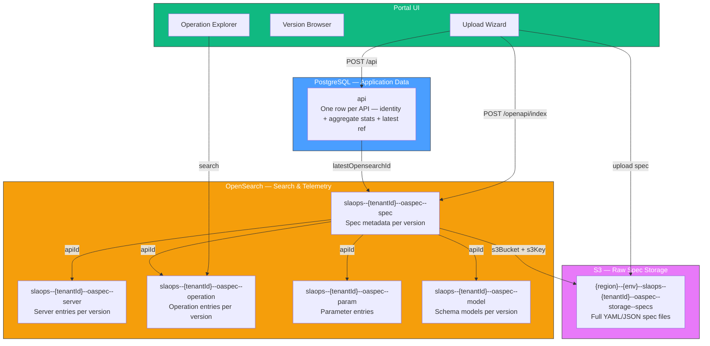

# OpenAPI Indexer

This section covers the design of the OASpec domain: how APIs and their OpenAPI specifications are stored, indexed, versioned, and searched across the SLAOps platform.

## Design Documents

| Document | Status | Description |
|---|---|---|
| [API & OASpec Data Model](./api-oaspec-data-model) | Draft | SQL entities for APIs and OASpec records; entity relationships; multi-tenancy |
| [OpenSearch Indices](./opensearch-indices) | Draft | Five dedicated indices (spec, server, operation, parameter, model); versioning strategy |
| [Spec Field Extraction](./spec-field-extraction) | Draft | How raw OpenAPI spec fields are parsed and transformed into the five index document types |
| [Extractor Pattern](./extractor-pattern) | Draft | Common `ISpecExtractor<TDoc>` pattern — shared context, extraction result, and per-entity `ExtractionState[]` returned by the indexer |
| [Indexing Pipeline](./indexing-pipeline) | Draft | Six-step sequential indexing flow; indexing stats; version lifecycle management |
| [Search Design](./search-design) | Draft | Operation, server, API, parameter, and model search; host-shape matching; enrichment lookup |
| [API Matching Algorithm](./api-matching) | Draft | Server resolution, base-path disambiguation, operation matching; host shape rules; AWS URL reference test cases |
| [UI Design](./ui-design) | Draft | APIs tab; upload wizard; version browser; diff view; operation explorer |
| [Version Strategies](./version-strategies) | Draft | Management modes (platform vs. private); platform catalogue; url_fetch strategy and future strategies |
| [New API Wizard](./new-api-wizard) | Draft | `/apis/new` wizard: Redux slice design, URL auto-populate via `GET /apis/info`, component tree |

### Legacy / Reference

- [OpenAPI Directory Indexer](./openapi-directory-indexer) — **Superseded.** Original single-index S3-triggered Lambda design. The implementation has since moved to NestJS.
- [OpenAPI Index Access Pattern](./openapi-index-access-pattern) — Two-tier multi-tenant access pattern. Still valid for understanding index scoping and alias strategy.

---

## Domain Overview

The OASpec domain separates **application data** (what APIs exist, which version is current) from **search and telemetry data** (indexed spec content, operations, servers, parameters, models).

### Key Principles

- **API first.** An API entity must exist in PostgreSQL before any OpenAPI spec can be indexed against it. An OASpec cannot exist without a parent API.
- **Three-tier storage.** Raw spec files (YAML/JSON) live in the [OASpec S3 bucket](/docs/oaspec-bucket). Indexed/searchable content lives in OpenSearch. Application state (API identity, version counts, stats) lives in PostgreSQL.
- **Multiple versions, one SQL row.** The `api` table holds one row per API — not one row per version. It tracks the latest version reference and aggregate counts.
- **Configurable version retention.** By default the last 2 versions are retained in OpenSearch. The `latest: true` flag is exclusive to one document per API in each index.
- **Tenant isolation.** Every SQL row carries `tenant_id`. Every OpenSearch document carries `tenantId`, and indices are scoped per tenant via aliases (see [OpenAPI Index Access Pattern](./openapi-index-access-pattern)).
