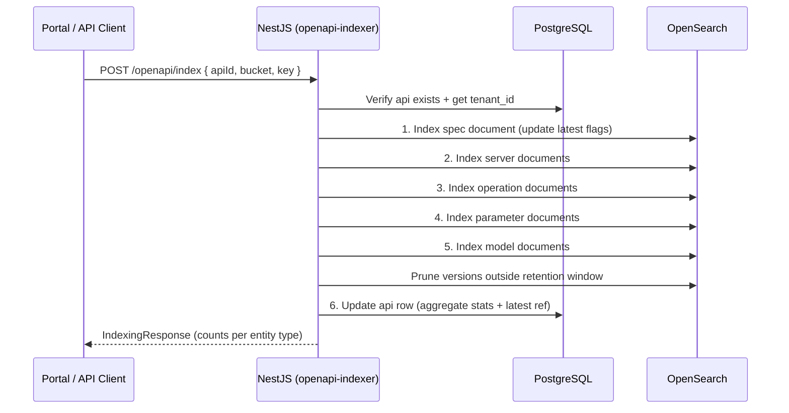

# Indexing Pipeline

This document describes the six-step sequential pipeline that runs whenever an OpenAPI spec is submitted for indexing, the indexing response format, and version lifecycle management.

## Overview



---

## Step 1 — Index Spec Document

**Target index:** `slaops--{tenantId}--oaspec--spec`

1. Parse the raw spec content (YAML or JSON).
2. Extract top-level metadata (`info`, `tags`, `externalDocs`, `contact`, `license`).
3. Update the single document with `apiId = <apiId> AND latest = true` to set `latest: false`. (By invariant, exactly one such document exists — or none if this is the first version.)
4. Write the new spec document with `latest: true`.
5. Derive aggregate counts (populated after steps 2–5; written in step 6 to SQL, but pre-estimated here for the spec document itself from a parse pass).

**Version retention pruning** happens after step 5, once all entity types are indexed. Versions outside the configured retention window are deleted across all five indices in a single bulk delete pass keyed by `(apiId, version)`.

---

## Step 2 — Index Server Documents

**Target index:** `slaops--{tenantId}--oaspec--server`

1. Extract each entry from `spec.servers`.
2. For each server, parse and derive the matching fields:
   - `host_template` — the raw hostname from the URL (preserving `{variable}` placeholders)
   - `host_shape` — template with all variables replaced by `*`
   - `dns_suffix` — public suffix + one label (e.g. `amazonaws.com`)
   - `fixed_labels`, `var_labels` — split from subdomain
   - `base_path` — path component of the server URL, or `/` if absent
3. Update server docs with `apiId = <apiId> AND latest = true` to set `latest: false`.
4. Bulk index new server documents with `latest: true`.

---

## Step 3 — Index Operation Documents

**Target index:** `slaops--{tenantId}--oaspec--operation`

1. Iterate `spec.paths` — for each `(path, pathItem)`, for each HTTP method present.
2. Build the operation document:
   - `path_key` — compact form for fast matching: method initial + compacted path (e.g. `G:{i}/orders` for `GET /{userId}/orders`)
   - Collect `parameter_ids` (references to step 4 documents)
   - Collect `request_model_id` and `response_model_ids` (references to step 5 documents)
3. Update operation docs with `apiId = <apiId> AND latest = true` to set `latest: false`.
4. Bulk index new operation documents with `latest: true`.

**Path compaction rules:**
- Path parameters with integer-like schemas → `{i}` 
- String path parameters → `{s}`
- The HTTP method is abbreviated to its first character (uppercased): `G`, `P`, `D`, `A` (PATCH), `H`, `O` (OPTIONS)

---

## Step 4 — Index Parameter Documents

**Target index:** `slaops--{tenantId}--oaspec--param`

1. Collect all parameters from `components.parameters` (shared) and per-operation `parameters` arrays.
2. Deduplicate: if the same named parameter appears in multiple operations, it becomes one document with all referencing `operation_ids` listed.
3. Update param docs with `apiId = <apiId> AND latest = true` to set `latest: false`.
4. Bulk index new parameter documents with `latest: true`.

---

## Step 5 — Index Model Documents

**Target index:** `slaops--{tenantId}--oaspec--model`

1. Collect all schemas from `components.schemas`.
2. For inline request/response body schemas without a named component entry, generate a derived name from the operation ID and status code.
3. Extract the top-level properties (one level deep — do not recurse into nested objects for the index).
4. Record which operations use each model (`operation_ids`, `used_in`).
5. Update model docs with `apiId = <apiId> AND latest = true` to set `latest: false`.
6. Bulk index new model documents with `latest: true`.

---

## Version Pruning

After step 5, the pipeline queries each index for all versions of `apiId`, ordered by `indexed_at` descending. Versions beyond the configured retention limit (`config['opensearch.oaspec.version-retention']`, default `2`) are collected and deleted in a single bulk delete across all five indices.

Deletion is best-effort: a failure here is logged and does not fail the overall indexing response. Old documents will be cleaned up on the next indexing run.

---

## Step 6 — Update `api` SQL Row

**Target:** PostgreSQL `api` table

1. Count indexed entities from the pipeline run.
2. Update the row with:
   - `latest_version` = `spec.info.version`
   - `latest_opensearch_id` = spec document ID from step 1
   - `operation_count`, `server_count`, `parameter_count`, `model_count`
   - `last_indexed_at` = now

This is the **last** step intentionally. If any earlier step fails, the `api` row is not updated and the portal shows the previous version's stats. The `api` row is the source of truth for application-layer status; it only advances when a full pipeline run completes.

---

## Indexing Response

The pipeline returns a structured response with counts for each entity type and any truncation flags. This is stored as part of the spec document in OpenSearch and also returned to the caller.

```typescript
interface IndexingResponse {
  success: boolean
  apiId: string
  version: string
  spec_opensearch_id: string
  duration_ms: number

  counts: {
    operations: number
    servers: number
    parameters: number
    models: number
  }

  truncated: {
    operations: boolean  // true if operation count exceeded index limit
    models: boolean      // true if model count exceeded index limit
  }

  versions_pruned: number  // number of old versions deleted across all indices

  errors: Array<{
    step: 'spec' | 'server' | 'operation' | 'param' | 'model' | 'sql'
    message: string
  }>
}
```

Steps 1–5 (OpenSearch writes) are non-transactional. A partial failure (e.g. operations indexed but parameters failed) records the error in `errors` and continues. Step 6 (SQL update) is the commit point — if it succeeds, the version is considered fully indexed even if some entity types had partial errors.

---

## API Endpoint

```
POST /openapi/index
{
  "apiId": "uuid",
  "bucket": "string",   // OASpec S3 bucket — permanent storage, not a staging bucket
  "key": "string"       // Object key, e.g. "APIs/{provider}/{service}/{version}/openapi.yaml"
}
```

The `bucket` and `key` reference the spec's permanent location in the tenant's OASpec bucket (`{region}--{env}--slaops--{tenantId}--oaspec--storage--specs`). The pre-signed upload URL from `POST /openapi/upload-url` points directly to this bucket — there is no intermediate staging location. These values are written into the `OaSpecDocument` so any component can later retrieve the raw file. See [OASpec Bucket](/docs/oaspec-bucket) and [API Data Model — Raw Spec Storage](./api-oaspec-data-model#raw-spec-storage).

Alternatively, spec content can be submitted directly:

```
POST /openapi
Content-Type: text/yaml

<OpenAPI YAML content>
```

In this case the `apiId` is inferred from the wizard context (passed as a query parameter or resolved from the spec's `info.title` against the tenant's API list).

---

## Error Handling

| Failure | Behaviour |
|---|---|
| Spec parse failure | Abort pipeline, return error — no OpenSearch writes, no SQL update |
| `api` row not found | Abort pipeline — spec cannot be indexed without a parent API |
| OpenSearch step N fails | Log error, continue to step N+1 and SQL upsert; record in `errors` |
| Version pruning fails | Log warning, continue; pruning retried on next index run |
| SQL update fails | Log error; OpenSearch data is correct but SQL stats are stale |

---

## Related Documents

- [API Data Model](./api-oaspec-data-model) — SQL `api` table updated in step 6
- [OpenSearch Indices](./opensearch-indices) — document schemas and versioning for each index
- [Search Design](./search-design) — how the indexed data is queried
- [UI Design](./ui-design) — wizard that triggers this pipeline and displays the response
