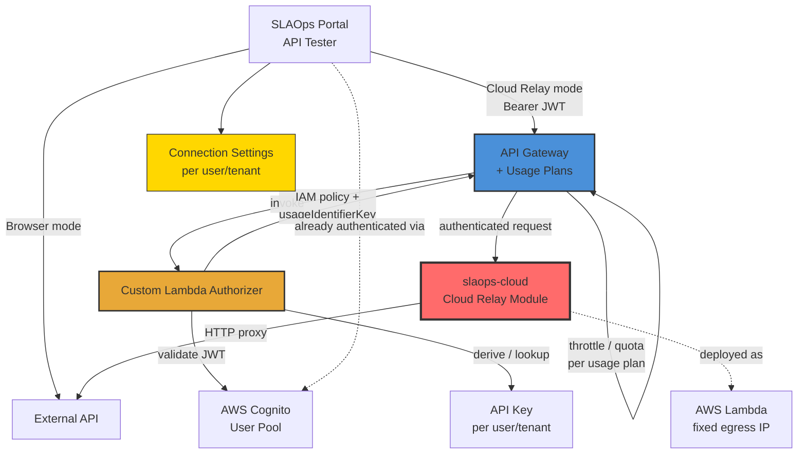
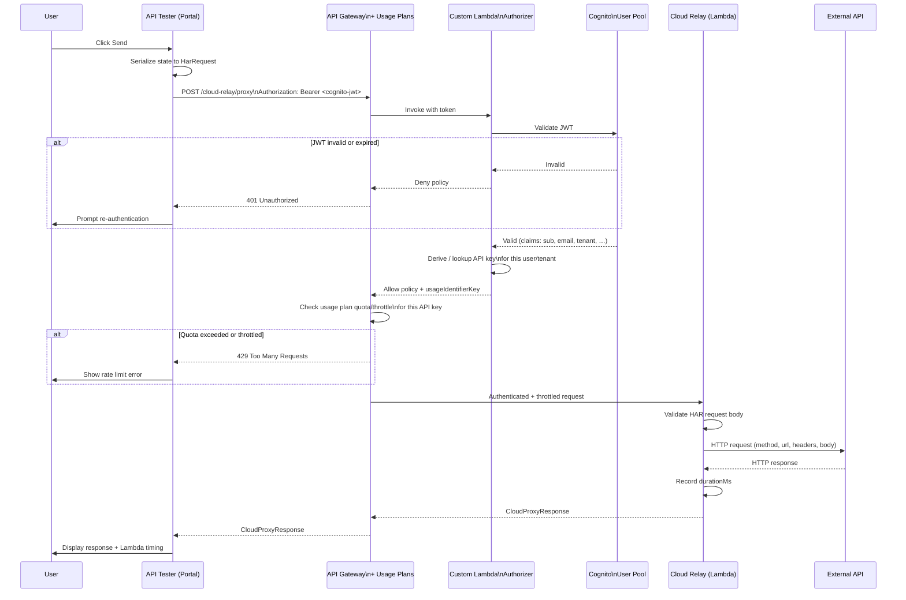
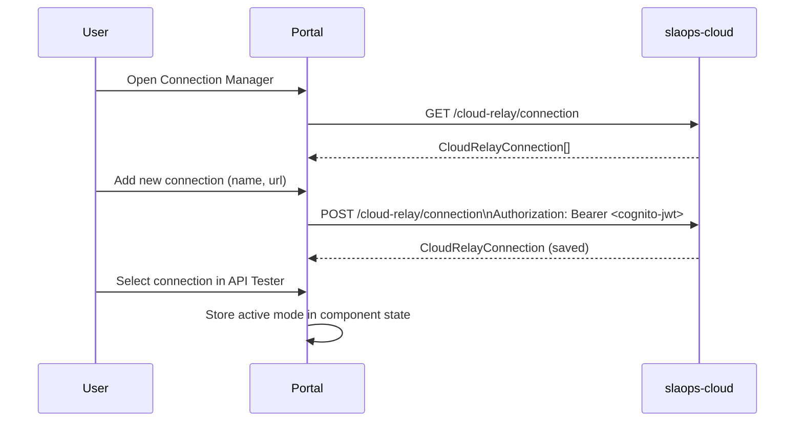

# Component Proposal: Cloud Relay

> **Status**: Draft
> **Author**: SLAOps Team
> **Date**: 2026-03-22
> **Related Issue**: N/A

## Overview

### Purpose

A cloud-based HTTP proxy service that enables the SLAOps API Tester to route requests through a Lambda function in an AWS account instead of making requests directly from the browser.

### Problem Statement

The current API Tester makes HTTP requests directly from the browser. This creates several problems:

- **CORS errors** — Many APIs restrict cross-origin requests. Requests from the portal domain are blocked by CORS policies, requiring users to disable browser security or add workarounds.
- **Inconsistent timing** — Response times measured from the browser include local network latency, making it impossible to compare results reliably or establish accurate baselines.
- **No fixed egress IP** — Users cannot make requests to SaaS APIs that whitelist specific IP addresses (e.g. customer VPCs, enterprise-gated APIs).
- **Credential exposure** — API keys and secrets entered in the browser are visible in network tab and browser memory.

### Scope

**In Scope (Iteration 1):**

- New NestJS module in `apps/slaops-cloud` to proxy HTTP requests
- Authentication to the Cloud Relay via **OAuth 2.0 (Cognito JWT)** — the portal passes its existing Cognito session token; no separate credential is stored per connection
- A **custom Lambda authorizer** on API Gateway validates the JWT, derives/looks up the API Gateway API key for the authenticated user, and returns it as the `usageIdentifierKey` so API Gateway can enforce per-user **usage plans** (rate limiting and quotas)
- All AWS infrastructure (API Gateway, Cognito User Pool, usage plans, API keys, Lambda authorizer function) provisioned by **CDK in `packages/slaops-infra`**
- The **Cloud Relay Lambda** defined in **`packages/slaops-backend`** (Amplify) as an app-level function — enabling independent feature deploys
- The **Lambda authorizer** treated as shared infrastructure — deployed with the CDK infra stack rather than as a feature deploy, as it is shared across the entire environment
- Portal UI for managing Cloud Relay connections (name + URL)
- Request mode selector in the API Tester: **Browser** (current behaviour) or a named **Cloud Relay** instance
- Forwarding of request method, URL, headers, query parameters, and body (HAR format)
- Return of response status, headers, body, and timing from the Lambda perspective
- Storing Cloud Relay connection settings per-user (via existing service/tenant infrastructure)

**Out of Scope (Iteration 1):**

- Self-hosted Cloud Relay in a customer's own AWS account (planned future iteration — the module is designed with this extraction in mind but not yet packaged for it)
- Secure credential storage / Secrets Manager integration (future)
- Multiple simultaneous Cloud Relay instances per request
- Streaming / chunked response support
- WebSocket proxying
- Request replay / scheduling

### Relationship to Existing Components



## Type Definitions

### Portal-side Types

```typescript
/**
 * A saved connection to a Cloud Relay instance.
 * Users can create multiple connections (e.g. us-east-1, eu-west-1).
 *
 * Authentication is handled via OAuth 2.0 (Cognito JWT). The portal reuses its
 * existing Cognito session — no separate credential is stored per connection.
 *
 * Future self-hosted connections will add Cognito pool configuration fields
 * (userPoolId, clientId, region) so the portal can obtain a token from the
 * customer's own Cognito pool.
 */
export type CloudRelayConnection = {
  /** Locally unique identifier (UUID) */
  id: string

  /** Human-readable label shown in the mode selector */
  name: string

  /**
   * API Gateway base URL of the Cloud Relay endpoint.
   * Example: https://xyz.execute-api.ap-southeast-2.amazonaws.com/prod
   */
  url: string

  /** ISO timestamp of when this connection was created */
  createdAt: string

  // ── Future fields for self-hosted instances (not in iteration 1) ──────────
  // cognitoUserPoolId?: string   // Customer's Cognito User Pool ID
  // cognitoClientId?: string     // App Client ID in that pool
  // cognitoRegion?: string       // AWS region of the customer's Cognito pool
}

/**
 * Which execution mode the API Tester is currently using.
 */
export type RequestMode = { type: 'browser' } | { type: 'cloud'; connection: CloudRelayConnection }
```

### API Contract (Portal → Cloud Relay)

The proxy endpoint accepts a [HAR `Request` object](http://www.softwareishard.com/blog/har-12-spec/#request) as the request description. HAR (HTTP Archive) is the standard format used by browser DevTools to represent HTTP requests. Using it means:

- Users can paste a request directly from the browser network tab (Export as HAR → copy `entry.request`)
- The format carries headers, query string, cookies, and post body in one structured object
- Future features (replay, history, diffing) can store and compare HAR entries natively

```typescript
/** A single name/value pair — used for headers, query string, and cookies in HAR. */
export type HarNameValue = {
  name: string
  value: string
}

/** HAR postData object describing a request body. */
export type HarPostData = {
  /** MIME type of the posted data */
  mimeType: string

  /** Raw text body (used for JSON, plain text, XML, etc.) */
  text?: string

  /**
   * Form fields (used when mimeType is application/x-www-form-urlencoded
   * or multipart/form-data). Mutually exclusive with `text`.
   */
  params?: Array<{
    name: string
    value?: string
    fileName?: string
    contentType?: string
  }>
}

/**
 * HAR Request object — the standard representation of an HTTP request.
 * Matches the HAR 1.2 spec (http://www.softwareishard.com/blog/har-12-spec/#request).
 */
export type HarRequest = {
  /** HTTP method */
  method: string

  /** Absolute URL of the request */
  url: string

  /** HTTP version string (e.g. "HTTP/1.1") */
  httpVersion: string

  /** Request headers */
  headers: HarNameValue[]

  /** Query string parameters (parsed from the URL) */
  queryString: HarNameValue[]

  /** Cookies sent with the request */
  cookies: HarNameValue[]

  /** Posted body data. Absent for methods that carry no body. */
  postData?: HarPostData

  /** Total size of request headers in bytes (-1 if unknown) */
  headersSize: number

  /** Size of the request body in bytes (-1 if unknown or no body) */
  bodySize: number
}

/**
 * Request body sent to the Cloud Relay proxy endpoint.
 * `request` is a standard HAR Request object; `timeoutMs` is a
 * proxy-level extension not part of the HAR spec.
 */
export type CloudProxyRequest = {
  /** HAR-format description of the request to execute */
  request: HarRequest

  /** Request timeout in milliseconds (default: 30 000) */
  timeoutMs?: number
}

/**
 * Response returned by the Cloud Relay proxy endpoint.
 */
export type CloudProxyResponse = {
  /** HTTP status code returned by the target */
  status: number

  /** HTTP status text */
  statusText: string

  /** Response headers from the target */
  headers: Record<string, string>

  /** Response body as a string */
  body: string

  /** Duration from Lambda perspective in milliseconds */
  durationMs: number

  /** ISO timestamp when the request was initiated from Lambda */
  requestedAt: string
}

/**
 * Error shape when the proxy itself fails (network error, timeout, etc.)
 */
export type CloudProxyError = {
  error: string
  code: 'TIMEOUT' | 'NETWORK_ERROR' | 'INVALID_URL' | 'UNSUPPORTED_METHOD'
  durationMs: number
}
```

### Input/Output Summary

| Type                   | Direction       | Purpose                                                |
| ---------------------- | --------------- | ------------------------------------------------------ |
| `CloudRelayConnection` | Portal state    | Saved connection details entered by the user           |
| `RequestMode`          | Portal state    | Current API Tester mode (browser vs cloud)             |
| `HarRequest`           | Portal → Lambda | Standard HAR request object describing what to proxy   |
| `CloudProxyRequest`    | Portal → Lambda | Wrapper: HAR request + proxy-level `timeoutMs`         |
| `CloudProxyResponse`   | Lambda → Portal | Target response + Lambda-side timing                   |
| `CloudProxyError`      | Lambda → Portal | Proxy-level failure (distinct from target HTTP errors) |

## Architecture

### Component Diagram

```mermaid
graph TB
    subgraph "SLAOps Portal (Browser)"
        Tester[API Tester Page]
        ModeSelector[Request Mode Selector]
        ConnectionManager[Connection Manager UI]
        BrowserFetch[Browser fetch()]
        CloudClient[Cloud Relay Client]
    end

    subgraph "API Gateway"
        APIGW[API Gateway\nUsage Plans]
        AuthLambda[Custom Lambda Authorizer]
    end

    subgraph "slaops-cloud (NestJS / Lambda)"
        CloudController[CloudRelayController\nPOST /cloud-relay/proxy]
        ProxyService[ProxyService\nNode fetch / undici]
        ValidationPipe[ValidationPipe\nclass-validator]
    end

    Tester --> ModeSelector
    ModeSelector -->|browser| BrowserFetch
    ModeSelector -->|cloud\nBearer JWT| APIGW
    APIGW -->|invoke| AuthLambda
    AuthLambda -.->|validate + key lookup| Cognito[Cognito User Pool]
    AuthLambda -->|IAM policy + usageIdentifierKey| APIGW
    APIGW -->|authenticated + throttled| CloudController
    CloudController --> ValidationPipe
    ValidationPipe --> ProxyService
    ProxyService -->|HTTP| ExternalAPI[External API]
    ExternalAPI --> ProxyService
    ProxyService --> CloudController
    CloudController --> APIGW
    ConnectionManager -.->|stored in| DB[(PostgreSQL)]
```

### Request Flow (Cloud Mode)



### Connection Management Flow



### Integration Points

| Integration Point       | Component                                         | Direction  | Protocol                              |
| ----------------------- | ------------------------------------------------- | ---------- | ------------------------------------- |
| Proxy endpoint          | `CloudRelayController` in slaops-cloud            | Inbound    | HTTPS POST (JSON) via API Gateway     |
| Target API              | Any external HTTP endpoint                        | Outbound   | HTTP/HTTPS                            |
| Connection storage      | PostgreSQL (via existing TypeORM)                 | Read/Write | SQL                                   |
| Portal client           | Generated Axios client (from OpenAPI spec)        | Inbound    | HTTPS                                 |
| Auth — token validation | Custom Lambda Authorizer → Cognito User Pool      | Inbound    | `Authorization: Bearer <jwt>`         |
| Auth — API key / usage  | Custom Lambda Authorizer → API Gateway usage plan | Internal   | `usageIdentifierKey` in auth response |
| Auth — portal login     | Existing Cognito auth (portal already uses this)  | Existing   | Cognito OAuth 2.0 flow                |

## API Specification

### slaops-cloud — New Module

#### Controller

```typescript
// src/cloud-relay/cloud-relay.controller.ts

@Controller('cloud-relay')
export class CloudRelayController {
  constructor(private readonly proxyService: ProxyService) {}

  /**
   * Proxy an HTTP request to an external URL and return the response.
   * This is the core endpoint used by the API Tester in cloud mode.
   */
  @Post('proxy')
  @ApiOperation({ summary: 'Proxy an HTTP request to an external URL' })
  @ApiResponse({ status: 200, description: 'Proxied response', type: CloudProxyResponseDto })
  @ApiResponse({ status: 400, description: 'Invalid request' })
  @ApiResponse({ status: 504, description: 'Target request timed out' })
  async proxy(@Body() dto: CloudProxyRequestDto): Promise<CloudProxyResponseDto>

  /**
   * List saved Cloud Relay connections for the current tenant.
   */
  @Get('connection')
  @ApiOperation({ summary: 'List Cloud Relay connections' })
  async listConnections(): Promise<CloudRelayConnectionDto[]>

  /**
   * Save a new Cloud Relay connection.
   */
  @Post('connection')
  @ApiOperation({ summary: 'Create a Cloud Relay connection' })
  async createConnection(
    @Body() dto: CreateCloudRelayConnectionDto,
  ): Promise<CloudRelayConnectionDto>

  /**
   * Delete a Cloud Relay connection by ID.
   */
  @Delete('connection/:id')
  @ApiOperation({ summary: 'Delete a Cloud Relay connection' })
  async deleteConnection(@Param('id') id: string): Promise<void>
}
```

#### DTOs

```typescript
// src/cloud-relay/dto/har-name-value.dto.ts
export class HarNameValueDto {
  @IsString()
  name: string

  @IsString()
  value: string
}

// src/cloud-relay/dto/har-post-data.dto.ts
export class HarPostDataParamDto {
  @IsString()
  name: string

  @IsString()
  @IsOptional()
  value?: string

  @IsString()
  @IsOptional()
  fileName?: string

  @IsString()
  @IsOptional()
  contentType?: string
}

export class HarPostDataDto {
  @IsString()
  mimeType: string

  @IsString()
  @IsOptional()
  text?: string

  @ValidateNested({ each: true })
  @Type(() => HarPostDataParamDto)
  @IsOptional()
  params?: HarPostDataParamDto[]
}

// src/cloud-relay/dto/har-request.dto.ts
export class HarRequestDto {
  @IsIn(['GET', 'POST', 'PUT', 'PATCH', 'DELETE', 'HEAD', 'OPTIONS'])
  method: string

  @IsUrl()
  url: string

  @IsString()
  httpVersion: string

  @ValidateNested({ each: true })
  @Type(() => HarNameValueDto)
  headers: HarNameValueDto[]

  @ValidateNested({ each: true })
  @Type(() => HarNameValueDto)
  queryString: HarNameValueDto[]

  @ValidateNested({ each: true })
  @Type(() => HarNameValueDto)
  cookies: HarNameValueDto[]

  @ValidateNested()
  @Type(() => HarPostDataDto)
  @IsOptional()
  postData?: HarPostDataDto

  @IsInt()
  headersSize: number

  @IsInt()
  bodySize: number
}

// src/cloud-relay/dto/cloud-proxy-request.dto.ts
export class CloudProxyRequestDto {
  @ValidateNested()
  @Type(() => HarRequestDto)
  request: HarRequestDto

  @IsInt()
  @Min(1000)
  @Max(60_000)
  @IsOptional()
  timeoutMs?: number
}

// src/cloud-relay/dto/cloud-proxy-response.dto.ts
export class CloudProxyResponseDto {
  status: number
  statusText: string
  headers: Record<string, string>
  body: string
  durationMs: number
  requestedAt: string
}

// src/cloud-relay/dto/create-cloud-relay-connection.dto.ts
// No credential fields — authentication is handled via the caller's Cognito JWT.
// Future self-hosted support will add optional Cognito pool fields here.
export class CreateCloudRelayConnectionDto {
  @IsString()
  @MinLength(1)
  name: string

  @IsUrl()
  url: string
}
```

### Portal — New UI Components

#### `CloudRelayModeSelector`

Replaces (or wraps) the current Send button area with a mode dropdown:

```tsx
// src/components/api-tester/CloudRelayModeSelector.tsx

interface Props {
  mode: RequestMode
  connections: CloudRelayConnection[]
  onModeChange: (mode: RequestMode) => void
  onManageConnections: () => void
}

export function CloudRelayModeSelector(props: Props): JSX.Element
```

#### `CloudRelayConnectionManager`

A dialog/sheet for adding and deleting connections:

```tsx
// src/components/api-tester/CloudRelayConnectionManager.tsx

interface Props {
  open: boolean
  onOpenChange: (open: boolean) => void
}

export function CloudRelayConnectionManager(props: Props): JSX.Element
```

#### `useCloudRelay` hook

```tsx
// src/hooks/use-cloud-relay.ts

export function useCloudRelay(): {
  connections: CloudRelayConnection[]
  isLoading: boolean
  createConnection: (data: CreateConnectionInput) => Promise<void>
  deleteConnection: (id: string) => Promise<void>
}
```

### Usage in API Tester

```tsx
// Simplified excerpt showing mode-aware send logic in ApiTester.tsx

/** Build a HAR Request object from the API Tester's current form state. */
function buildHarRequest(state: ApiTesterState): HarRequest {
  return {
    method: state.method,
    url: state.resolvedUrl, // fully resolved, including path variables
    httpVersion: 'HTTP/1.1',
    headers: state.headers.filter((h) => h.enabled).map((h) => ({ name: h.key, value: h.value })),
    queryString: state.queryParams
      .filter((p) => p.enabled)
      .map((p) => ({ name: p.key, value: p.value })),
    cookies: [],
    postData: state.body ? { mimeType: state.bodyContentType, text: state.body } : undefined,
    headersSize: -1,
    bodySize: state.body ? state.body.length : -1,
  }
}

const sendRequest = async () => {
  if (mode.type === 'browser') {
    // existing fetch() logic — no changes
    response = await fetch(url, { method, headers, body })
  } else {
    // Cloud Relay path — serialize form state to HAR then proxy
    const proxyResult = await CloudRelayApi.proxy({
      request: buildHarRequest(testerState),
      timeoutMs: 30_000,
    })
    response = adaptCloudProxyResponse(proxyResult)
  }
}
```

## Data Structures

### Connection Record (Database)

Authentication is OAuth / Cognito JWT — no credential is stored per connection in iteration 1.

```sql
CREATE TABLE cloud_requester_connection (
  id          UUID PRIMARY KEY DEFAULT gen_random_uuid(),
  tenant_id   UUID NOT NULL REFERENCES tenant(id) ON DELETE CASCADE,
  name        TEXT NOT NULL,
  url         TEXT NOT NULL,    -- API Gateway base URL
  -- Future self-hosted fields (not in iteration 1):
  -- cognito_user_pool_id  TEXT,
  -- cognito_client_id     TEXT,
  -- cognito_region        TEXT,
  created_at  TIMESTAMPTZ NOT NULL DEFAULT NOW(),
  updated_at  TIMESTAMPTZ NOT NULL DEFAULT NOW()
);

CREATE INDEX idx_crc_tenant ON cloud_requester_connection(tenant_id);
```

### CloudProxyRequest JSON (Wire Format)

The outer envelope wraps a standard HAR `request` object. This is what the portal POSTs to `/cloud-relay/proxy`.

**GET request:**

```json
{
  "request": {
    "method": "GET",
    "url": "https://api.example.com/v1/users",
    "httpVersion": "HTTP/1.1",
    "headers": [
      { "name": "Authorization", "value": "Bearer sk-..." },
      { "name": "Accept", "value": "application/json" }
    ],
    "queryString": [{ "name": "page", "value": "1" }],
    "cookies": [],
    "headersSize": -1,
    "bodySize": -1
  },
  "timeoutMs": 30000
}
```

**POST request with JSON body:**

```json
{
  "request": {
    "method": "POST",
    "url": "https://api.example.com/v1/users",
    "httpVersion": "HTTP/1.1",
    "headers": [
      { "name": "Content-Type", "value": "application/json" },
      { "name": "Authorization", "value": "Bearer sk-..." }
    ],
    "queryString": [],
    "cookies": [],
    "postData": {
      "mimeType": "application/json",
      "text": "{\"name\": \"Alice\", \"email\": \"alice@example.com\"}"
    },
    "headersSize": -1,
    "bodySize": 47
  },
  "timeoutMs": 30000
}
```

### CloudProxyResponse JSON (Wire Format)

```json
{
  "status": 200,
  "statusText": "OK",
  "headers": {
    "content-type": "application/json",
    "x-ratelimit-remaining": "99"
  },
  "body": "{\"users\": [...]}",
  "durationMs": 142,
  "requestedAt": "2026-03-17T04:22:10.000Z"
}
```

### Field Specifications

#### CloudProxyRequest (outer envelope)

| Field       | Type       | Required | Description                                 | Validation                  |
| ----------- | ---------- | -------- | ------------------------------------------- | --------------------------- |
| `request`   | HarRequest | Yes      | HAR request object describing what to proxy | See HarRequest fields       |
| `timeoutMs` | number     | No       | Timeout in ms (proxy-level extension)       | 1000–60 000, default 30 000 |

#### HarRequest fields

| Field         | Type           | Required | Description                                      | Validation               |
| ------------- | -------------- | -------- | ------------------------------------------------ | ------------------------ |
| `method`      | string         | Yes      | HTTP method                                      | Enum (GET, POST, PUT, …) |
| `url`         | string         | Yes      | Absolute URL of the target                       | Valid HTTP/HTTPS URL     |
| `httpVersion` | string         | Yes      | HTTP version (informational, e.g. `"HTTP/1.1"`)  | Non-empty string         |
| `headers`     | HarNameValue[] | Yes      | Request headers to forward                       | Array (may be empty)     |
| `queryString` | HarNameValue[] | Yes      | Query parameters (merged into URL by proxy)      | Array (may be empty)     |
| `cookies`     | HarNameValue[] | Yes      | Cookies to forward (merged into `Cookie` header) | Array (may be empty)     |
| `postData`    | HarPostData    | No       | Request body. Absent for GET/HEAD.               | —                        |
| `headersSize` | number         | Yes      | Size of headers in bytes (`-1` if unknown)       | Integer                  |
| `bodySize`    | number         | Yes      | Size of body in bytes (`-1` if no body/unknown)  | Integer                  |

#### HarPostData fields

| Field      | Type               | Required | Description                                                                                                          |
| ---------- | ------------------ | -------- | -------------------------------------------------------------------------------------------------------------------- |
| `mimeType` | string             | Yes      | Content-Type of the body (e.g. `application/json`)                                                                   |
| `text`     | string             | No       | Raw body text. Used for JSON, XML, plain text, etc.                                                                  |
| `params`   | HarPostDataParam[] | No       | Form fields. Used for `multipart/form-data` and `application/x-www-form-urlencoded`. Mutually exclusive with `text`. |

#### CloudRelayConnection

| Field       | Type   | Required | Description                                      |
| ----------- | ------ | -------- | ------------------------------------------------ |
| `id`        | UUID   | Yes      | Unique identifier                                |
| `name`      | string | Yes      | Display label                                    |
| `url`       | string | Yes      | API Gateway base URL of the Cloud Relay instance |
| `createdAt` | string | Yes      | ISO creation timestamp                           |

Authentication to the Cloud Relay is via the portal user's existing Cognito JWT — no separate credential is stored. Future self-hosted connections will add `cognitoUserPoolId`, `cognitoClientId`, and `cognitoRegion` to allow the portal to obtain a token from the customer's own pool.

## Dependencies

### slaops-cloud (new)

| Package  | Version | Purpose                               | License |
| -------- | ------- | ------------------------------------- | ------- |
| `undici` | `^6.x`  | Fast Node.js HTTP client for proxying | MIT     |

`undici` is the recommended HTTP client for server-side proxy use in Node.js 22+ (it's the underlying engine of `fetch` in Node.js). No additional external dependencies needed — NestJS, TypeORM, class-validator, and `@slaops/config` are all already present.

### Portal (new)

No new npm dependencies. The connection management API will be exposed through the auto-generated Axios client from the OpenAPI spec (existing pattern).

### Dependency Graph

```mermaid
graph LR
    Private[@slaops/private] --> Cloud[slaops-cloud]
    Config[@slaops/config] --> Cloud
    Undici[undici] --> Cloud
    Cloud -->|OpenAPI client generation| Portal[slaops-portal]
```

## Implementation Details

### Proxy Algorithm

```text
FUNCTION proxy(dto: CloudProxyRequest): CloudProxyResponse | CloudProxyError

  har = dto.request

  // 1. Validate URL — must be a reachable HTTP/HTTPS endpoint
  IF NOT isValidHttpUrl(har.url):
    RETURN { error: 'Invalid URL', code: 'INVALID_URL' }

  // 2. Merge queryString params into the URL
  //    (HAR queryString is the authoritative source; the URL itself may also carry them)
  resolvedUrl = mergeQueryString(har.url, har.queryString)

  // 3. Convert HAR headers array to a Headers map and strip hop-by-hop entries
  rawHeaders = har.headers.reduce((map, h) => map.set(h.name, h.value), new Headers())

  // 4. Merge cookies into the Cookie header
  IF har.cookies.length > 0:
    cookieString = har.cookies.map(c => `${c.name}=${c.value}`).join('; ')
    rawHeaders.set('Cookie', cookieString)

  cleanHeaders = stripHopByHop(rawHeaders)

  // 5. Resolve request body from HAR postData
  body = NONE
  IF har.postData IS PRESENT:
    IF har.postData.text IS PRESENT:
      body = har.postData.text
      // Ensure Content-Type is set from postData.mimeType if not already in headers
      IF NOT cleanHeaders.has('Content-Type'):
        cleanHeaders.set('Content-Type', har.postData.mimeType)
    ELSE IF har.postData.params IS PRESENT:
      body = encodeFormParams(har.postData.params)   // application/x-www-form-urlencoded
      cleanHeaders.set('Content-Type', har.postData.mimeType)

  // 6. Execute fetch with timeout
  startTime = Date.now()
  TRY:
    nativeResponse = await fetch(resolvedUrl, {
      method: har.method,
      headers: cleanHeaders,
      body: body,
      signal: AbortSignal.timeout(dto.timeoutMs ?? 30_000)
    })
  CATCH TimeoutError:
    RETURN { error: 'Request timed out', code: 'TIMEOUT', durationMs: Date.now() - startTime }
  CATCH NetworkError:
    RETURN { error: err.message, code: 'NETWORK_ERROR', durationMs: Date.now() - startTime }

  // 7. Read response body as text (binary responses returned base64-encoded)
  responseBody = await nativeResponse.text()
  durationMs = Date.now() - startTime

  RETURN {
    status: nativeResponse.status,
    statusText: nativeResponse.statusText,
    headers: Object.fromEntries(nativeResponse.headers),
    body: responseBody,
    durationMs,
    requestedAt: new Date(startTime).toISOString()
  }
```

### Hop-by-Hop Headers to Strip

The proxy must not forward these headers to the target or back to the caller:

```
Connection, Keep-Alive, Transfer-Encoding, TE, Trailer,
Upgrade, Proxy-Authorization, Proxy-Authenticate
```

Additionally, do not forward `Host` (the target URL determines the host).

### Edge Cases

| Case                                  | Condition                                  | Handling                                                                   | Expected Outcome                 |
| ------------------------------------- | ------------------------------------------ | -------------------------------------------------------------------------- | -------------------------------- |
| Target returns non-2xx                | status 4xx / 5xx                           | Forward normally — these are valid responses                               | `CloudProxyResponse` with status |
| Target returns binary body            | image, PDF, etc.                           | Return as base64-encoded string in `body`                                  | Display raw in portal            |
| Request body on GET                   | `postData` set + `method: GET`             | Strip body, log warning                                                    | Request forwarded without body   |
| Very large response                   | response body > 10 MB                      | Truncate to 10 MB, add `X-Slaops-Truncated: true` header in proxy response | Partial body shown               |
| Self-request (portal → cloud → cloud) | URL resolves back to slaops-cloud          | Blocked by URL validation / allowlist                                      | 400 Bad Request                  |
| Missing connection URL in portal      | User selects connection with deleted entry | Fallback to browser mode with toast warning                                | Graceful degradation             |
| Lambda cold start                     | First request after idle                   | Normal — latency included in `durationMs`                                  | Accurate Lambda timing           |

### Security Considerations

- **Authentication — Custom Lambda Authorizer**: The Cloud Relay routes on API Gateway are protected by a custom Lambda authorizer (not the built-in Cognito authorizer). The authorizer:
  1. Receives the `Authorization: Bearer <jwt>` header from the portal
  2. Validates the JWT against the SLAOps Cognito User Pool (signature, expiry, audience)
  3. Derives or looks up the API Gateway **API key** associated with the authenticated user/tenant (e.g. from a DynamoDB table keyed on the Cognito `sub` claim, or by convention from tenant metadata)
  4. Returns an IAM `Allow` policy to API Gateway along with the `usageIdentifierKey` set to that API key
  5. Returns an IAM `Deny` policy (→ `401`) if the JWT is invalid or expired

  The portal reuses its existing Cognito session — no separate login or stored credential per connection is required.

- **Usage Plans**: API Gateway uses the `usageIdentifierKey` from the authorizer response to enforce per-user/tenant throttling and quotas defined in a usage plan. This means rate limiting is tied to the authenticated identity rather than a shared limit, and different tiers can have different quotas. Requests that exceed the plan receive `429 Too Many Requests` before reaching the Lambda.

- **Authorization scope**: In iteration 1, any authenticated SLAOps user can call the Cloud Relay. The usage plan throttle provides the primary abuse-prevention layer. Finer-grained restrictions (per-role, per-tenant plan tier) can be introduced by varying the usage plan returned by the authorizer based on Cognito group membership or tenant attributes.

- **SSRF (Server-Side Request Forgery)**: The proxy must not allow requests to private IP ranges (RFC 1918: 10.x, 172.16.x, 192.168.x) or link-local addresses (169.254.x) in production. This is enforced at the `ProxyService` level before executing the fetch.

- **Target credentials**: Headers forwarded to the target (e.g. `Authorization`) pass through the Lambda in plaintext. Users should be aware these are visible in Lambda logs. The CloudWatch log group for the Lambda should have restricted access.

## Integration Guide

### Deploying a Cloud Relay Instance

The Cloud Relay is a module within `slaops-cloud`, which is already deployed as an AWS Lambda behind API Gateway. No separate deployment is needed for the default SLAOps-managed instance.

For self-hosted or customer-VPC instances, deploy `slaops-cloud` as a standalone Lambda:

```bash
# From monorepo root
pnpm --filter @slaops/cloud run build
# Then deploy via slaops-backend / Amplify as usual
```

### Adding a Connection in the Portal

1. Open the API Tester
2. Click the mode selector (defaults to "Browser")
3. Select "Manage Connections…"
4. Click "Add Connection"
5. Enter a name and the Cloud Relay API Gateway URL
6. Save — the connection now appears in the mode selector

No separate credential is required. The portal uses the user's active Cognito session when making requests through the connection.

### Configuration Options (slaops-cloud module)

| Config Key                         | Default    | Description                                          |
| ---------------------------------- | ---------- | ---------------------------------------------------- |
| `cloud-relay.proxy.timeout-ms`     | `30000`    | Default proxy timeout if not specified by caller     |
| `cloud-relay.proxy.max-body-bytes` | `10485760` | Maximum response body size before truncation (10 MB) |
| `cloud-relay.proxy.blocked-cidrs`  | RFC 1918   | IP ranges blocked for SSRF prevention                |

All values defined in `packages/slaops-config/src/config.ts` following the no-magic-numbers convention.

### New Environment Variables

None. All configuration is derived from existing environment or the `@slaops/config` module.

## Testing Strategy

### Unit Tests (slaops-cloud)

| Test Case                         | Input                                                                     | Expected Output                             | Priority |
| --------------------------------- | ------------------------------------------------------------------------- | ------------------------------------------- | -------- |
| Valid GET proxy                   | HAR request: `method:'GET'`, valid URL, empty `queryString`               | `CloudProxyResponseDto` with correct status | High     |
| Query string merged into URL      | HAR `queryString:[{name:'page',value:'2'}]`                               | `?page=2` appended to URL before fetch      | High     |
| Valid POST with JSON body         | HAR `postData:{mimeType:'application/json', text:'...'}`                  | Body and Content-Type forwarded correctly   | High     |
| Form-encoded POST via params      | HAR `postData:{mimeType:'application/x-www-form-urlencoded', params:[…]}` | Body URL-encoded and forwarded              | Medium   |
| Cookies merged into Cookie header | HAR `cookies:[{name:'session',value:'abc'}]`                              | `Cookie: session=abc` sent to target        | Medium   |
| Timeout                           | Target takes > `timeoutMs`                                                | `{code:'TIMEOUT'}`                          | High     |
| Network error                     | Unreachable host                                                          | `{code:'NETWORK_ERROR'}`                    | High     |
| SSRF blocked (private IP)         | HAR `url:'http://192.168.1.1/secret'`                                     | 400 Bad Request                             | High     |
| postData on GET stripped          | `method:'GET'` + `postData` present                                       | Body absent in forwarded request            | Medium   |
| Hop-by-hop headers stripped       | HAR `headers:[{name:'Connection',value:'keep-alive'}]`                    | Header not forwarded to target              | Medium   |
| Large response truncated          | Target returns 15 MB body                                                 | Body truncated at 10 MB, truncation header  | Medium   |
| Invalid URL                       | HAR `url:'not-a-url'`                                                     | 400 with `INVALID_URL`                      | High     |
| Connection CRUD                   | Create, list, delete a connection                                         | Correct persistence and retrieval           | High     |

### Integration Tests (slaops-cloud)

1. **Proxy against real endpoint** — Use a known public test API (e.g. `httpbin.org`) in integration tests to verify headers and body are correctly forwarded and returned.
2. **Timeout enforcement** — Use a slow mock server to verify the Lambda aborts at `timeoutMs`.
3. **Connection persistence** — Create a connection, retrieve it, delete it, verify it's gone.

### Portal Tests

1. **Mode selector renders connections** — Mock the connection list API, verify connections appear in the dropdown.
2. **Cloud request path invoked** — When cloud mode is active, verify `CloudRelayApi.proxy()` is called instead of `fetch()`.
3. **Browser fallback** — If cloud request fails with a network error, a toast is shown and the mode is offered to be switched back to browser.
4. **Connection manager CRUD** — Create, list, delete via the UI.

### Coverage Targets

- Unit tests: 90%+ on `ProxyService` and DTOs
- Integration tests: All controller endpoints
- Portal: Mode selector and request dispatch logic

## Infrastructure Ownership

The Cloud Relay spans two packages whose responsibilities must stay clearly separated:

| Concern                                              | Package                   | Mechanism                                      | Rationale                                                                                                        |
| ---------------------------------------------------- | ------------------------- | ---------------------------------------------- | ---------------------------------------------------------------------------------------------------------------- |
| API Gateway REST API (Cloud Relay routes)            | `packages/slaops-infra`   | AWS CDK (`CloudRelayApiStack`)                 | Long-lived infrastructure; shared entry point for all Cloud Relay traffic                                        |
| Cognito User Pool                                    | `packages/slaops-infra`   | AWS CDK (`userpool.ts` — existing or extended) | Already provisioned; referenced by the authorizer                                                                |
| Usage Plans + API Keys                               | `packages/slaops-infra`   | AWS CDK (within `CloudRelayApiStack`)          | Tied to API Gateway lifecycle; managed alongside the gateway                                                     |
| **Custom Lambda Authorizer** (function + CDK wiring) | `packages/slaops-infra`   | AWS CDK Lambda construct                       | **Infrastructure** — shared across the entire environment; must not be gated behind a feature deploy             |
| **Cloud Relay Lambda** (function definition)         | `packages/slaops-backend` | Amplify `defineFunction`                       | **Application** — independently deployable as a feature; follows the same pattern as the existing `api` function |

### Why the authorizer lives in infra, not backend

The Lambda authorizer is **environment-wide shared infrastructure**. Every request to any Cloud Relay endpoint passes through it. Deploying it via Amplify would tie its availability to the app deployment cycle, creating a risk of the gateway becoming unauthenticated during a failed or in-progress feature deploy. By wiring it in CDK (`slaops-infra`) it is deployed once, independently of application code, and remains stable while features come and go.

The Cloud Relay Lambda, by contrast, contains application logic that evolves with features (new proxy behaviours, HAR handling, etc.) and benefits from Amplify's feature-branch deploy model.

### Infrastructure diagram

```mermaid
graph TB
    subgraph "packages/slaops-infra (CDK)"
        APIGW[API Gateway\nCloudRelayApiStack]
        UsagePlan[Usage Plans\n+ API Keys]
        AuthLambdaInfra[Lambda Authorizer\nCDK Lambda construct]
        CognitoPool[Cognito User Pool\nuserpool.ts]
        APIGW --> UsagePlan
        APIGW --> AuthLambdaInfra
        AuthLambdaInfra -.->|validates against| CognitoPool
    end

    subgraph "packages/slaops-backend (Amplify)"
        CloudFn[Cloud Relay\ndefineFunction]
    end

    subgraph "apps/slaops-cloud (NestJS)"
        CloudModule[cloud-relay module\napp logic + HAR proxy]
        AuthorizerCode[authorizer/\nfunction code]
    end

    CloudFn -->|entry: slaops-cloud/src/lambda.ts| CloudModule
    AuthLambdaInfra -->|entry: slaops-cloud/src/authorizer.ts| AuthorizerCode
    APIGW -->|Lambda proxy integration\n(ARN imported from Amplify output)| CloudFn
```

The authorizer function **code** lives in `apps/slaops-cloud/src/authorizer.ts` (co-located with the rest of the cloud app), but it is **wired into API Gateway by CDK in `slaops-infra`**, not by Amplify. This mirrors the existing pattern where the main API Lambda is defined in `slaops-backend` but its ARN is imported into `ApiStack` via a CloudFormation export.

## Build Configuration

### slaops-cloud (existing package, new module added)

No new package — the `cloud-relay` module is added to the existing `apps/slaops-cloud` NestJS application:

```
apps/slaops-cloud/src/
└── cloud-relay/
    ├── cloud-relay.module.ts
    ├── cloud-relay.controller.ts
    ├── proxy.service.ts
    ├── entities/
    │   └── cloud-relay-connection.entity.ts
    └── dto/
        ├── har-name-value.dto.ts
        ├── har-post-data.dto.ts
        ├── har-request.dto.ts
        ├── cloud-proxy-request.dto.ts       ← wraps HarRequestDto + timeoutMs
        ├── cloud-proxy-response.dto.ts
        └── create-cloud-relay-connection.dto.ts
```

Register in `app.module.ts`:

```typescript
@Module({
  imports: [
    // ...existing modules
    CloudRelayModule,
  ],
})
export class AppModule {}
```

### Portal (existing app, new components added)

```
apps/slaops-portal/src/
├── components/api-tester/
│   ├── CloudRelayModeSelector.tsx
│   └── CloudRelayConnectionManager.tsx
└── hooks/
    └── use-cloud-relay.ts
```

The Portal client for the new endpoints is auto-generated from the OpenAPI spec at build time — no manual client code needed.

### Migration

A TypeORM migration is required to create the `cloud_requester_connection` table. Generate after adding the entity:

```bash
pnpm --filter @slaops/cloud run migration:generate -- src/migrations/CreateCloudRelayConnection
```

### slaops-infra (CDK — new stack + authorizer function)

A new CDK stack is added to `packages/slaops-infra` for Cloud Relay infrastructure. It follows the same pattern as the existing `ApiStack` (which imports the main API Lambda ARN from Amplify and wires it to API Gateway).

```
packages/slaops-infra/lib/stack/
└── cloud-relay.ts          ← new CloudRelayStack
```

The stack provisions:

```typescript
// packages/slaops-infra/lib/stack/cloud-relay.ts (sketch)

export class CloudRelayStack extends Stack {
  constructor(scope: Construct, id: string, props: CloudRelayStackProps) {
    super(scope, id, props)

    // 1. Reference existing Cognito User Pool (exported from AuthStack / userpool.ts)
    const userPool = UserPool.fromUserPoolId(this, 'UserPool', props.userPoolId)

    // 2. Lambda authorizer function
    //    Code lives in slaops-cloud/src/authorizer.ts — same repo, deployed here by CDK
    const authorizerFn = new NodejsFunction(this, 'CloudRelayAuthorizer', {
      entry: '<slaops-cloud>/src/authorizer.ts',
      environment: {
        USER_POOL_ID: userPool.userPoolId,
        USER_POOL_REGION: this.region,
        // API key lookup config (DynamoDB table ARN, etc.)
      },
    })

    // 3. API Gateway REST API
    const api = new RestApi(this, 'CloudRelayApi', {
      restApiName: 'SLAOps Cloud Relay',
      defaultMethodOptions: {
        apiKeyRequired: true, // usage plan enforcement
      },
    })

    // 4. Token authorizer — wires the Lambda authorizer to the API
    const authorizer = new TokenAuthorizer(this, 'JwtAuthorizer', {
      handler: authorizerFn,
      resultsCacheTtl: Duration.minutes(5),
    })

    // 5. Usage plan + API key (one plan per tier; keys created per user/tenant)
    const usagePlan = api.addUsagePlan('Standard', {
      throttle: { rateLimit: 10, burstLimit: 20 },
      quota: { limit: 10_000, period: Period.DAY },
    })

    // 6. Cloud Relay Lambda (ARN imported from Amplify slaops-backend output)
    const CloudRelayFn = Function.fromFunctionArn(this, 'CloudRelayFn', props.CloudRelayFunctionArn)

    // 7. Wire proxy route
    const proxy = api.root.addResource('cloud-relay')
    proxy.addProxy({
      defaultIntegration: new LambdaIntegration(CloudRelayFn),
      defaultMethodOptions: { authorizer },
    })

    // 8. CloudFormation exports for the portal connection URL
    new CfnOutput(this, 'CloudRelayApiUrl', {
      value: api.url,
      exportName: 'SlaOpsCloudRelayApiUrl',
    })
  }
}
```

Register the new stack in `packages/slaops-infra/bin/cdk.ts` alongside the existing stacks.

CDK commands (from monorepo root):

```bash
pnpm infra:synth       # verify CloudFormation template
pnpm infra:diff        # preview changes
pnpm infra:deploy      # deploy CloudRelayStack
```

### slaops-backend (Amplify — Cloud Relay Lambda function)

A new `defineFunction` entry is added in `packages/slaops-backend/amplify/functions/` for the Cloud Relay Lambda. This follows the exact same pattern as the existing `api` function:

```
packages/slaops-backend/amplify/functions/
├── api/
│   └── resource.ts          ← existing main API Lambda
└── cloud-relay/
    └── resource.ts          ← new Cloud Relay Lambda
```

```typescript
// packages/slaops-backend/amplify/functions/cloud-relay/resource.ts

import { createRequire } from 'node:module'
import path from 'node:path'
import { defineFunction } from '@aws-amplify/backend'
import { config } from '@slaops/config'

const require = createRequire(import.meta.url)
const slaopsCloudRoot = path.dirname(require.resolve('@slaops/cloud/package.json'))

export const CloudRelay = defineFunction({
  name: config['app.cloud-relay.name'],
  entry: path.join(slaopsCloudRoot, 'src', 'lambda.ts'), // same Lambda entry; NestJS routes to the module
  timeoutSeconds: config['aws.lambda.cloud-relay.timeout.seconds'],
  memoryMB: config['aws.lambda.cloud-relay.memory'],
  runtime: config['node.version'] as 18 | 20 | 22,
  environment: {
    NODE_ENV: config['node.env'] as string,
    DB_HOST: config['db.host'],
    DB_PORT: config['db.port'] + '',
    DB_NAME: config['db.database'],
    DB_SSL: config['db.ssl'],
    DB_LOGGING: config['db.logging'],
  },
})
```

The Amplify deploy outputs the Lambda ARN as a CloudFormation export. `CloudRelayStack` in `slaops-infra` imports that ARN (the same mechanism used by the existing `ApiStack` for the main API Lambda).

## Documentation Requirements

- [ ] Update `apps/slaops-docs/docs/components.md` to include Cloud Relay
- [ ] Add `apps/slaops-docs/docs/cloud-relay.md` with user guide (how to add a connection, use cases)
- [ ] Add security note about credential handling to the user guide
- [ ] Update `apps/slaops-cloud/CLAUDE.md` with the new module and `src/authorizer.ts` entry point
- [ ] Update `packages/slaops-infra/README.md` with `CloudRelayStack` (resources, outputs, deploy order)
- [ ] Update `packages/slaops-backend/README.md` with the `cloud-relay` function and its dependency on the infra stack ARN export

## Rollout Plan

### Phase 1: App Logic (Iteration 1a)

- [ ] Add `cloud-relay` NestJS module to `slaops-cloud` (controller, ProxyService, connection CRUD, DTOs, entity)
- [ ] Write Lambda authorizer function at `apps/slaops-cloud/src/authorizer.ts` (JWT validation + API key lookup)
- [ ] Implement `ProxyService` with SSRF protection, timeout, and HAR request handling
- [ ] Write unit and integration tests for the proxy module
- [ ] Generate updated OpenAPI spec + portal client

### Phase 2: Infrastructure (Iteration 1b)

- [ ] Add `CloudRelayStack` to `packages/slaops-infra` (API Gateway, usage plans, token authorizer wired to authorizer Lambda)
- [ ] Add `cloud-relay` function definition to `packages/slaops-backend/amplify/functions/`
- [ ] Deploy backend via Amplify to obtain Cloud Relay Lambda ARN
- [ ] Deploy `CloudRelayStack` via CDK — imports Lambda ARN from Amplify output
- [ ] Verify end-to-end: portal JWT → API Gateway → authorizer → Cloud Relay Lambda → external API

### Phase 3: Portal UI (Iteration 1c)

- [ ] Add `CloudRelayModeSelector` to API Tester
- [ ] Add `CloudRelayConnectionManager` dialog
- [ ] Implement `useCloudRelay` hook
- [ ] Wire mode-aware send logic in `ApiTester.tsx`
- [ ] Test CORS bypass end-to-end against a CORS-restricted API

### Phase 4: Hardening (Iteration 2, future)

- [ ] Secrets Manager integration for any sensitive Lambda env vars
- [ ] Support for multiple simultaneous Cloud Relay regions
- [ ] Request history tied to Cloud Relay source
- [ ] Package Cloud Relay + authorizer + CDK stack for customer self-hosting

## Open Questions

- [x] **Q1: How is the proxy endpoint authenticated?**
      **Decision**: OAuth 2.0 via AWS Cognito, enforced by a **custom Lambda authorizer** on API Gateway. The authorizer validates the portal's Cognito JWT, then derives/looks up the API key for that user and returns it as `usageIdentifierKey` so API Gateway can enforce per-user **usage plans**. No separate login or stored API key is needed on the portal side. The portal UI should enforce HTTPS-only URLs for connections.

- [ ] **Q2: How should the portal handle binary responses?**
      Base64 encoding is simple but inflates size. Alternative: return a content-type hint and let the portal decide how to display it.

- [ ] **Q3: Should `timeoutMs` be configurable per-connection or per-request?**
      Per-request gives more flexibility; per-connection is simpler to configure. Current proposal: per-request (passed in `CloudProxyRequest`), with a connection-level default as future work.

- [ ] **Q4: Audit log for proxied requests?**
      Lambda logs will capture requests, but should we store a summary in the database for auditing? Out of scope for iteration 1 but worth deciding before launch.

## Alternatives Considered

### Alternative 1: Browser Service Worker Proxy

Use a Service Worker to intercept fetch calls and route through the cloud.

**Pros:** No changes to existing request logic; transparent to the API Tester.

**Cons:** Complex to set up; still bound by CORS on the Service Worker fetch; no fixed egress IP.

**Why not chosen:** Doesn't solve CORS or egress IP problems.

### Alternative 2: Separate Microservice / Lambda (Planned Future Path)

Deploy the proxy as a standalone Lambda separate from `slaops-cloud`.

**Pros:** Complete isolation; independently deployable into any region or a customer's own AWS account; customers can self-host without exposing the full `slaops-cloud` API surface.

**Cons:** Additional deployment artifact to manage; connection setup is more complex; currently loses code reuse of existing NestJS patterns, TypeORM, and config.

**Why not chosen for iteration 1:** Adding a module to the existing `slaops-cloud` NestJS app is the lowest-friction path. The Lambda packaging already handles scale-to-zero and per-region deployment.

**Planned extraction:** The `cloud-relay` module is intentionally isolated within `slaops-cloud` (own module, own controller, no cross-module dependencies) so it can be pulled out into a standalone deployable service in a future iteration. When that happens:

- The module becomes its own package (e.g. `packages/slaops-cloud-relay/`)
- It drops the TypeORM dependency (no database needed — connections would be managed portal-side or via environment config)
- Authentication for self-hosted instances uses the customer's own Cognito User Pool; the portal connection record gains `cognitoUserPoolId`, `cognitoClientId`, and `cognitoRegion` fields so the portal can obtain a token from that pool
- The custom Lambda authorizer and usage plan infrastructure are packaged alongside the service so customers can deploy the full stack (API Gateway + Authorizer + Lambda) into their own AWS account
- The SLAOps-managed instance continues to use the SLAOps Cognito pool and existing usage plans, keeping backward compatibility

### Alternative 3: Third-party CORS Proxy (e.g. cors-anywhere)

Use a public or self-hosted CORS proxy.

**Pros:** Zero implementation effort.

**Cons:** No fixed egress IP; no credential control; third-party dependency; not suitable for production API keys.

**Why not chosen:** Security and reliability requirements preclude using a third-party proxy for real API credentials.

## Approval

- [ ] Technical Lead: \***\*\*\*\*\***\_\_\***\*\*\*\*\***
- [ ] Architect: \***\*\*\*\*\***\_\_\***\*\*\*\*\***
- [ ] Product Owner: \***\*\*\*\*\***\_\_\***\*\*\*\*\***
- [ ] Date Approved: \***\*\*\*\*\***\_\_\***\*\*\*\*\***

---

**Template Version**: 1.0
**Last Updated**: 2026-03-17
**Status**: Draft
