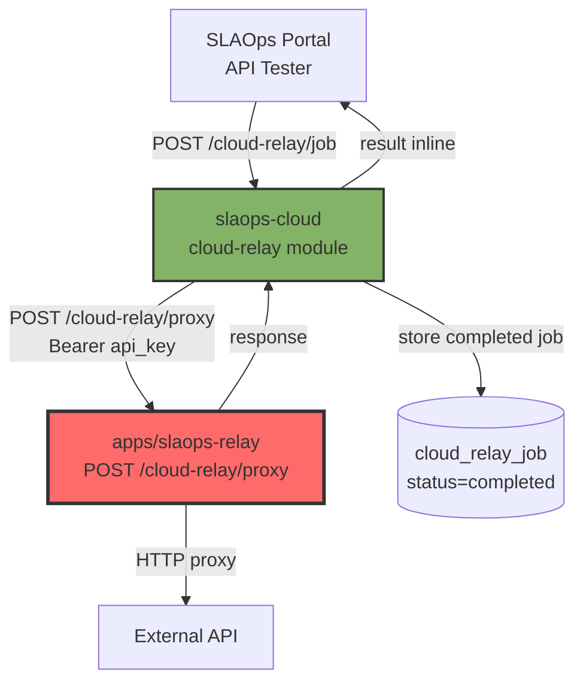
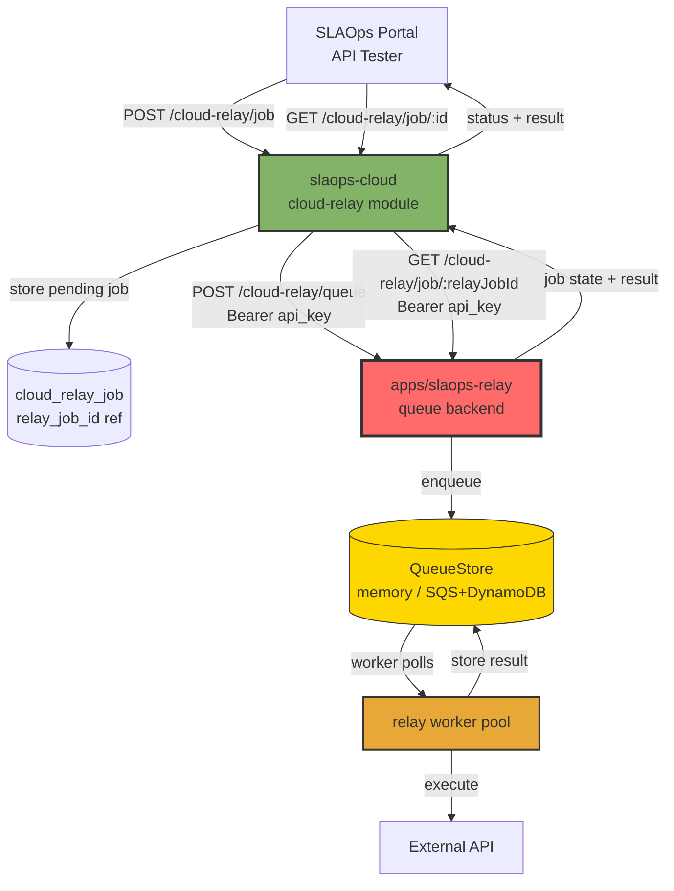
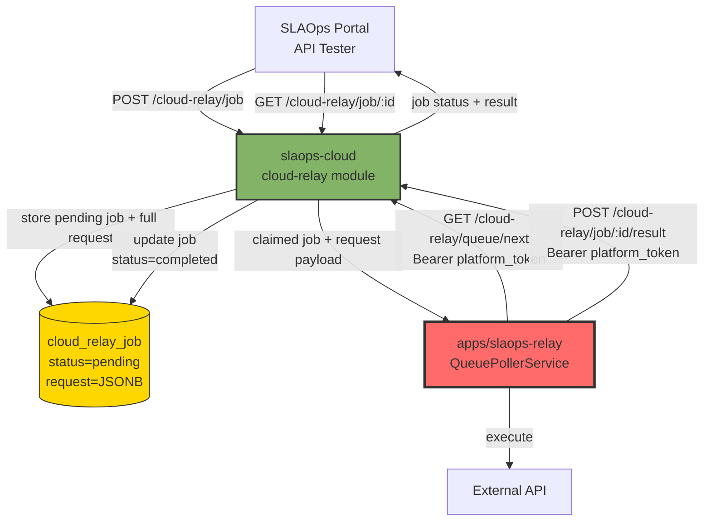
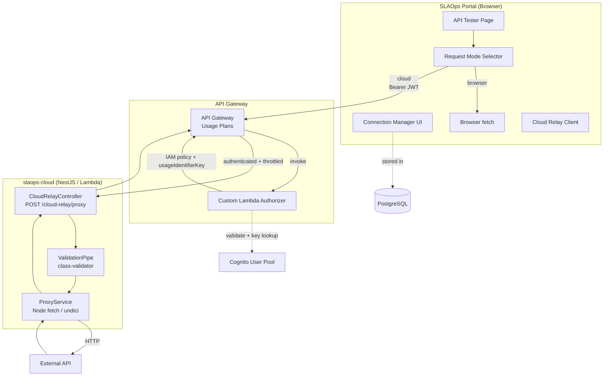
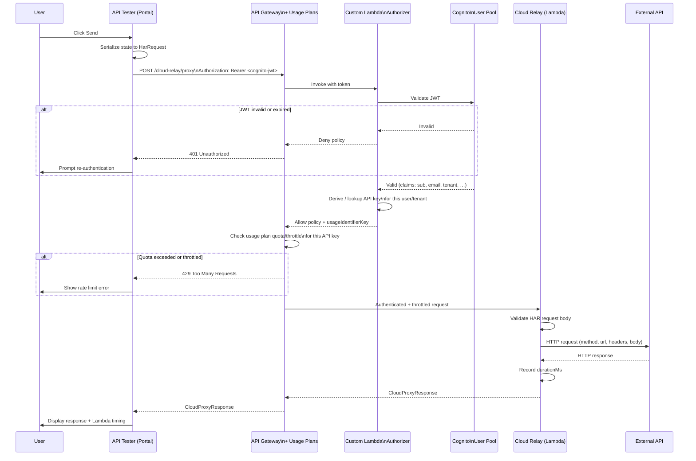
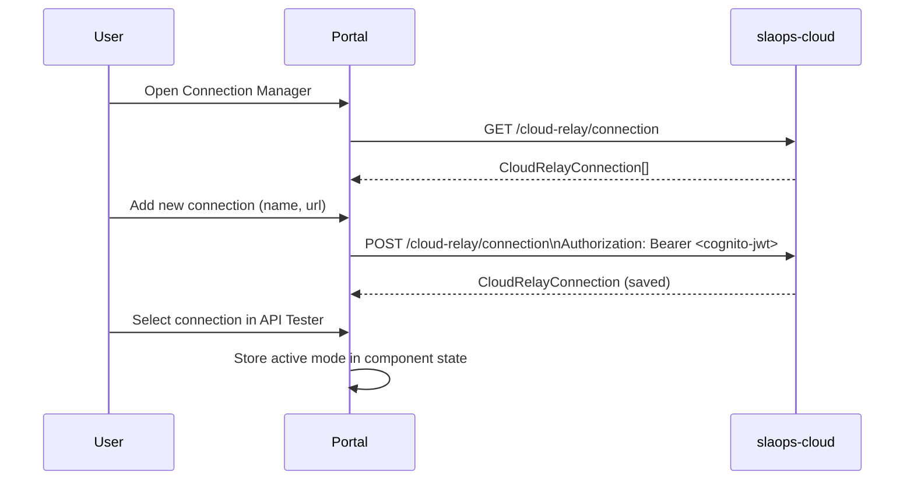
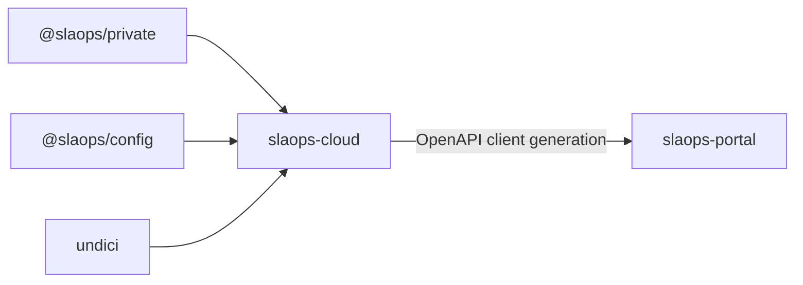
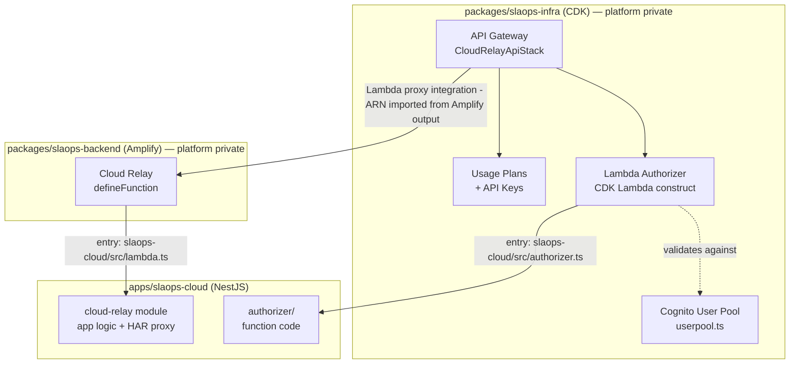
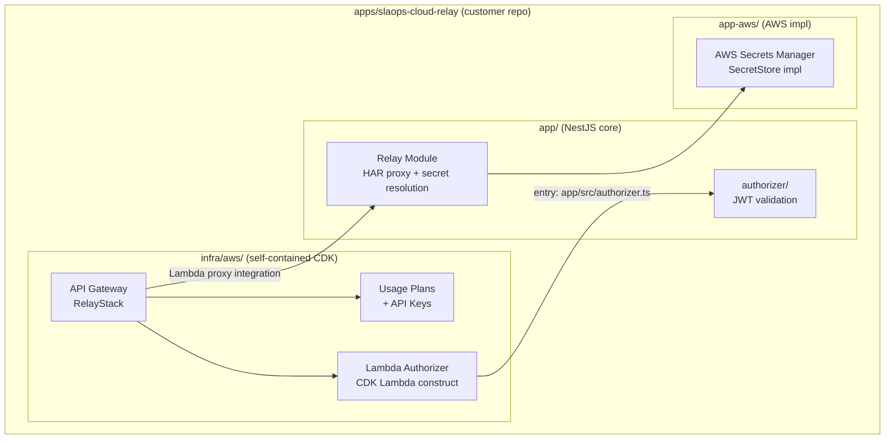

# Component Proposal: Cloud Relay

> **Status**: Draft
> **Author**: SLAOps Team
> **Date**: 2026-03-22
> **Related Issue**: N/A

## Overview

### Purpose

A cloud-based HTTP proxy service that enables the SLAOps API Tester to route requests through a Lambda function in an AWS account instead of making requests directly from the browser.

### Problem Statement

The current API Tester makes HTTP requests directly from the browser. This creates several problems:

- **CORS errors** — Many APIs restrict cross-origin requests. Requests from the portal domain are blocked by CORS policies, requiring users to disable browser security or add workarounds.
- **Inconsistent timing** — Response times measured from the browser include local network latency, making it impossible to compare results reliably or establish accurate baselines.
- **No fixed egress IP** — Users cannot make requests to SaaS APIs that whitelist specific IP addresses (e.g. customer VPCs, enterprise-gated APIs).
- **Credential exposure** — API keys and secrets entered in the browser are visible in network tab and browser memory.

### Scope

**In Scope (Iteration 1):**

- **`apps/slaops-relay`** — standalone, self-contained NestJS proxy service. Supports three delivery modes:
  - **`direct`** — slaops-cloud calls the relay's `POST /cloud-relay/proxy` synchronously and returns the result inline. Relay must be reachable from slaops-cloud.
  - **`relay-queue`** — slaops-cloud submits jobs to the relay's `POST /cloud-relay/queue`. The relay owns an internal queue (`QueueStore` backend: in-memory by default, SQS + DynamoDB for AWS) and processes jobs asynchronously. slaops-cloud stores a lightweight reference (job ID → relay job ID) and proxies status polls to the relay. Relay must be reachable from slaops-cloud.
  - **`platform-queue`** — the relay **cannot** accept inbound connections (private network). Instead, the relay polls `GET /cloud-relay/queue/next` on slaops-cloud, claims a job, executes it, and posts the result to `POST /cloud-relay/job/:id/result`. slaops-cloud stores the full request payload so the relay can retrieve it on claim.
- **`apps/slaops-cloud`** — hosts the `cloud-relay` module, which manages the registry of relay connections (`cloud_relay_connection` table: name + URL + `delivery_mode` per tenant). Owns the full `cloud_relay_job` entity which tracks every submitted job regardless of delivery mode. The portal always interacts with slaops-cloud; slaops-cloud selects the delivery path based on the connection's `delivery_mode`.
- Authentication to the Cloud Relay via **OAuth 2.0 (Cognito JWT)** — the portal passes its existing Cognito session token; no separate credential is stored per connection
- A **custom Lambda authorizer** on API Gateway validates the JWT, derives/looks up the API Gateway API key for the authenticated user, and returns it as the `usageIdentifierKey` so API Gateway can enforce per-user **usage plans** (rate limiting and quotas)
- All AWS infrastructure (API Gateway, Cognito User Pool, usage plans, API keys, Lambda authorizer function) provisioned by **CDK in `packages/slaops-infra`**
- The **Cloud Relay Lambda** (`apps/slaops-relay`) is self-contained with its own `infra/` directory — customers can deploy it independently without access to any private SLAOps package
- The **Lambda authorizer** treated as shared infrastructure — deployed with the CDK infra stack rather than as a feature deploy, as it is shared across the entire environment
- Portal UI for managing Cloud Relay connections (name + URL) — backed by `slaops-cloud`
- Request mode selector in the API Tester: **Browser** (current behaviour) or a named **Cloud Relay** instance selected from the connections stored in `slaops-cloud`
- Forwarding of request method, URL, headers, query parameters, and body (HAR format)
- Return of response status, headers, body, and timing from the relay's perspective
- Cloud Relay connection settings stored per-tenant in `slaops-cloud` (not in the relay itself)

**Out of Scope (Iteration 1):**

- Self-hosted Cloud Relay in a customer's own AWS account — see **Iteration 2** below
- Multiple simultaneous Cloud Relay instances per request
- Streaming / chunked response support
- WebSocket proxying
- Request replay / scheduling

**Iteration 2 — Self-hosted (`apps/slaops-relay` already extracted):**

`apps/slaops-relay` is already a standalone, self-contained application managed as a **git subtree** (same workflow as `apps/slaops-portal/`). It may eventually be open-sourced so customers can review and deploy it themselves.

Key design decisions:
- The relay has **no database** and no connection registry. Connection management lives in `slaops-cloud`.
- In **direct mode** the relay is fully stateless. In **relay-queue mode** the relay owns its job queue via a pluggable `QueueStore` interface — `InMemoryQueueStore` (default) or `SqsQueueStore` (AWS: SQS work channel + DynamoDB for job state). Additional backends can be registered without modifying relay code (same pattern as `SecretStore`). In **platform-queue mode** the relay is fully stateless again — slaops-cloud stores the job state; the relay only polls, executes, and delivers results.
- The relay is authenticated via `RELAY_API_KEY` (inbound: validates calls from slaops-cloud) and `RELAY_PLATFORM_TOKEN` (outbound: sent as Bearer when polling slaops-cloud in platform-queue mode). Both values are generated when a connection is created in slaops-cloud and configured on the relay as env vars.
- The base application is **cloud-agnostic** — no cloud SDK dependencies in the core; SQS/DynamoDB only pulled in when `RELAY_QUEUE_BACKEND=sqs`
- Cloud-specific implementations are separate sub-packages: `app-aws/`, `app-azure/`, `app-cp/`
- Configuration relies **solely on environment variables** — no `@slaops/config` module, minimising dependencies for self-hosted deployments
- Supported deployment targets: **Docker**, **Lambda** (AWS SAM), and equivalents on other clouds
- Customers store and manage their own credentials, maintaining data sovereignty
- Customers control their own network egress

Module layout:
```
apps/slaops-cloud-relay/
├── app/         # NestJS core — cloud-agnostic (env-vars config, no @slaops/config)
├── app-aws/     # AWS implementation (Secrets Manager, Lambda/SAM packaging)
├── app-azure/   # Azure implementation (Key Vault, Azure Functions)
├── app-cp/      # GCP implementation (Secret Manager, Cloud Run/Functions)
└── infra/       # Self-contained deployment infrastructure (no dependency on packages/slaops-infra)
    ├── aws/     # CDK stack — API Gateway, Lambda authorizer, usage plans, SAM template
    ├── azure/   # Azure Bicep / ARM — API Management, Azure Functions
    └── gcp/     # GCP Deployment Manager / Terraform — Cloud Endpoints, Cloud Run
```

The `infra/` directory at the root of `apps/slaops-cloud-relay` is the **only** infrastructure customers need to self-host the Relay. It has no dependency on `packages/slaops-infra`, which is private to the SLAOps platform and is not distributed. Customers clone the relay repository, configure environment variables, and run `cd infra/aws && cdk deploy` (or equivalent for their cloud) — no access to any SLAOps private package is required.

### Relationship to Existing Components

The portal **always** submits requests through slaops-cloud. slaops-cloud selects the delivery path based on the connection's `delivery_mode`. Three modes are supported to accommodate any customer network topology.

**`direct` mode** — relay is publicly reachable from slaops-cloud (e.g. SLAOps-managed Lambda behind API Gateway):



**`relay-queue` mode** — relay is in a private network but reachable from slaops-cloud (server-to-server), not from the browser:



**`platform-queue` mode** — relay is fully isolated (private network, no inbound connections). The relay polls slaops-cloud outbound:



## Type Definitions

### Portal-side Types

```typescript
/**
 * A saved connection to a Cloud Relay instance.
 * Users can create multiple connections (e.g. us-east-1, eu-west-1).
 *
 * Authentication is handled via OAuth 2.0 (Cognito JWT). The portal reuses its
 * existing Cognito session — no separate credential is stored per connection.
 *
 * Future self-hosted connections will add Cognito pool configuration fields
 * (userPoolId, clientId, region) so the portal can obtain a token from the
 * customer's own Cognito pool.
 */
export type CloudRelayConnection = {
  /** Locally unique identifier (UUID) */
  id: string

  /** Human-readable label shown in the mode selector */
  name: string

  /**
   * API Gateway base URL of the Cloud Relay endpoint.
   * Example: https://xyz.execute-api.ap-southeast-2.amazonaws.com/prod
   */
  url: string

  /** ISO timestamp of when this connection was created */
  createdAt: string

  // ── Future fields for self-hosted instances (not in iteration 1) ──────────
  // cognitoUserPoolId?: string   // Customer's Cognito User Pool ID
  // cognitoClientId?: string     // App Client ID in that pool
  // cognitoRegion?: string       // AWS region of the customer's Cognito pool
}

/**
 * Which execution mode the API Tester is currently using.
 */
export type RequestMode = { type: 'browser' } | { type: 'cloud'; connection: CloudRelayConnection }
```

### API Contract (Portal → Cloud Relay)

The proxy endpoint accepts a [HAR `Request` object](http://www.softwareishard.com/blog/har-12-spec/#request) as the request description. HAR (HTTP Archive) is the standard format used by browser DevTools to represent HTTP requests. Using it means:

- Users can paste a request directly from the browser network tab (Export as HAR → copy `entry.request`)
- The format carries headers, query string, cookies, and post body in one structured object
- Future features (replay, history, diffing) can store and compare HAR entries natively

```typescript
/** A single name/value pair — used for headers, query string, and cookies in HAR. */
export type HarNameValue = {
  name: string
  value: string
}

/** HAR postData object describing a request body. */
export type HarPostData = {
  /** MIME type of the posted data */
  mimeType: string

  /** Raw text body (used for JSON, plain text, XML, etc.) */
  text?: string

  /**
   * Form fields (used when mimeType is application/x-www-form-urlencoded
   * or multipart/form-data). Mutually exclusive with `text`.
   */
  params?: Array<{
    name: string
    value?: string
    fileName?: string
    contentType?: string
  }>
}

/**
 * HAR Request object — the standard representation of an HTTP request.
 * Matches the HAR 1.2 spec (http://www.softwareishard.com/blog/har-12-spec/#request).
 */
export type HarRequest = {
  /** HTTP method */
  method: string

  /** Absolute URL of the request */
  url: string

  /** HTTP version string (e.g. "HTTP/1.1") */
  httpVersion: string

  /** Request headers */
  headers: HarNameValue[]

  /** Query string parameters (parsed from the URL) */
  queryString: HarNameValue[]

  /** Cookies sent with the request */
  cookies: HarNameValue[]

  /** Posted body data. Absent for methods that carry no body. */
  postData?: HarPostData

  /** Total size of request headers in bytes (-1 if unknown) */
  headersSize: number

  /** Size of the request body in bytes (-1 if unknown or no body) */
  bodySize: number
}

/**
 * Request body sent to the Cloud Relay proxy endpoint.
 * `request` is a standard HAR Request object; `timeoutMs` is a
 * proxy-level extension not part of the HAR spec.
 */
export type CloudProxyRequest = {
  /** HAR-format description of the request to execute */
  request: HarRequest

  /** Request timeout in milliseconds (default: 30 000) */
  timeoutMs?: number
}

/**
 * Response returned by the Cloud Relay proxy endpoint.
 */
export type CloudProxyResponse = {
  /** HTTP status code returned by the target */
  status: number

  /** HTTP status text */
  statusText: string

  /** Response headers from the target */
  headers: Record<string, string>

  /** Response body as a string */
  body: string

  /** Duration from Lambda perspective in milliseconds */
  durationMs: number

  /** ISO timestamp when the request was initiated from Lambda */
  requestedAt: string
}

/**
 * Error shape when the proxy itself fails (network error, timeout, etc.)
 */
export type CloudProxyError = {
  error: string
  code:
    | 'TIMEOUT'
    | 'NETWORK_ERROR'
    | 'INVALID_URL'
    | 'UNSUPPORTED_METHOD'
    | 'POLICY_DENIED'     // request blocked by the security policy evaluator
    | 'TEMPLATE_ERROR'    // template expression could not be resolved
  durationMs: number
}
```

### Input/Output Summary

| Type                   | Direction       | Purpose                                                |
| ---------------------- | --------------- | ------------------------------------------------------ |
| `CloudRelayConnection` | Portal state    | Saved connection details entered by the user           |
| `RequestMode`          | Portal state    | Current API Tester mode (browser vs cloud)             |
| `HarRequest`           | Portal → Lambda | Standard HAR request object describing what to proxy   |
| `CloudProxyRequest`    | Portal → Lambda | Wrapper: HAR request + proxy-level extensions          |
| `CloudProxyResponse`   | Lambda → Portal | Target response + Lambda-side timing                   |
| `CloudProxyError`      | Lambda → Portal | Proxy-level failure (distinct from target HTTP errors) |

## HAR Template Expressions

The Cloud Relay extends the standard HAR format with a **template expression system**. Any string field inside the `HarRequest` may contain `{{expr}}` placeholders that the Relay resolves at execution time — before the request leaves the Relay. This keeps secrets and generated values out of the browser and off the wire between the portal and the Relay.

### Expression Syntax

Expressions use double-brace syntax: `{{type:qualifier}}`.

| Expression | Resolved to |
|---|---|
| `{{secret:MY_KEY}}` | Value of secret `MY_KEY` from the configured secret store |
| `{{secret:MY_KEY.field}}` | Field `field` parsed from a JSON secret `MY_KEY` |
| `{{jit:uuid}}` | A freshly generated UUID v4 (e.g. `f47ac10b-58cc-4372-a567-0e02b2c3d479`) |
| `{{jit:uuid-short}}` | First 8 hex chars of a UUID (e.g. `f47ac10b`) |
| `{{jit:timestamp}}` | Current UTC timestamp in ISO 8601 (e.g. `2026-03-22T10:00:00.000Z`) |
| `{{jit:timestamp-unix}}` | Current Unix epoch in **seconds** (e.g. `1774068000`) |
| `{{jit:timestamp-unix-ms}}` | Current Unix epoch in **milliseconds** (e.g. `1774068000000`) |
| `{{jit:random-hex:N}}` | `N` cryptographically random hex characters (e.g. `{{jit:random-hex:16}}`) |
| `{{var:NAME}}` | Named variable resolved from `templateContext.variables` (see below) |

Expressions are resolved in the following fields:
- `url`
- `headers[].value`
- `queryString[].value`
- `cookies[].value`
- `postData.text`
- `postData.params[].value`

### Extended CloudProxyRequest

`templateContext` is an optional extension to `CloudProxyRequest`. When absent, the HAR is forwarded as-is.

```typescript
/**
 * Describes how a named template variable `{{var:NAME}}` should be resolved.
 * The Relay resolves each variable once per request execution.
 */
export type TemplateVariableDefinition =
  /** Fetch a secret from the Relay's configured secret store. */
  | { type: 'secret'; secretId: string; field?: string }
  /**
   * Read a value from a Relay environment variable.
   * Useful for non-sensitive per-environment values without a secret store.
   */
  | { type: 'env'; envVar: string }
  /** A static literal (useful for parameterising shared request templates). */
  | { type: 'literal'; value: string }

/**
 * Template resolution context attached to a CloudProxyRequest.
 * Defines named variables that can be referenced as `{{var:NAME}}` inside HAR fields.
 *
 * JIT functions (`{{jit:*}}`) and direct secret references (`{{secret:*}}`)
 * do not require entries here — they are resolved inline from the expression alone.
 */
export type TemplateContext = {
  variables?: Record<string, TemplateVariableDefinition>
}

/**
 * Request body sent to the Cloud Relay proxy endpoint.
 */
export type CloudProxyRequest = {
  /** HAR-format description of the request to execute */
  request: HarRequest

  /** Request timeout in milliseconds (default: 30 000) */
  timeoutMs?: number

  /**
   * Optional template context for resolving `{{var:NAME}}` expressions
   * embedded in the HAR request fields.
   */
  templateContext?: TemplateContext
}
```

### Secret Store Backends

The Relay resolves `{{secret:*}}` expressions against a **`SecretStore`** implementation. The `SecretStore` interface is defined in the cloud-agnostic `app/` core. Built-in implementations ship with each cloud sub-package, and customers can bring their own by implementing the interface and registering it with the Relay factory.

#### The `SecretStore` Interface

Defined in `app/src/secrets/secret-store.ts`. All implementations must satisfy this contract.

```typescript
/**
 * Describes a secret retrieved from a secret store.
 * The raw value is always a string; structured secrets are JSON strings
 * that callers may parse to extract individual fields.
 */
export type SecretValue = {
  /** The raw secret string (or JSON string for structured secrets). */
  value: string
  /** ISO 8601 timestamp of when this value was last fetched or cached. */
  fetchedAt: string
  /** True if this value was served from the local cache rather than the store. */
  fromCache: boolean
}

/**
 * Thrown by SecretStore implementations when a secret cannot be retrieved.
 * The `code` field allows callers to distinguish between "not found" and
 * "access denied" without parsing error messages.
 */
export class SecretStoreError extends Error {
  constructor(
    message: string,
    public readonly code:
      | 'NOT_FOUND'        // Secret ID does not exist in the store
      | 'ACCESS_DENIED'    // Credentials or IAM policy denied access
      | 'STORE_UNAVAILABLE'// Secret store is unreachable (network, config)
      | 'INVALID_FORMAT',  // Secret exists but cannot be parsed as expected
    public readonly secretId: string,
  ) {
    super(message)
    this.name = 'SecretStoreError'
  }
}

/**
 * Cloud-agnostic interface for retrieving secrets.
 *
 * Implementations are provided per cloud/backend and are selected at
 * startup via RELAY_SECRET_BACKEND. Customers may supply a custom
 * implementation by registering it with SecretStoreRegistry.
 *
 * All methods are async to accommodate network-backed stores. Implementations
 * should apply their own internal caching where appropriate (see CachingSecretStore).
 */
export interface SecretStore {
  /**
   * Retrieve a secret by ID.
   *
   * @param secretId  The identifier of the secret in the backing store.
   *                  For AWS Secrets Manager this is the secret name or ARN.
   *                  For env-var backend this is the environment variable name.
   * @returns         The secret value.
   * @throws          SecretStoreError if the secret cannot be retrieved.
   */
  getSecret(secretId: string): Promise<SecretValue>

  /**
   * Retrieve a single field from a structured (JSON) secret.
   *
   * Equivalent to getSecret(secretId) followed by JSON.parse(value)[field].
   * Implementations may optimise this (e.g. AWS Secrets Manager supports
   * fetching individual keys from a JSON secret natively).
   *
   * @throws SecretStoreError with code 'INVALID_FORMAT' if the secret is not
   *         valid JSON or does not contain the requested field.
   */
  getSecretField(secretId: string, field: string): Promise<SecretValue>

  /**
   * Check whether a secret exists without fetching its value.
   * Used at request-validation time to surface missing secrets early.
   */
  hasSecret(secretId: string): Promise<boolean>

  /**
   * Optional: list available secret IDs. Useful for admin tooling and
   * autocomplete in the portal. Implementations that do not support listing
   * (e.g. env-var backend) may return null to indicate unsupported.
   */
  listSecrets?(): Promise<string[] | null>

  /**
   * Optional: proactively warm the local cache for a set of secret IDs.
   * Called by the Relay at startup when RELAY_SECRET_PREFETCH is set.
   */
  prefetch?(secretIds: string[]): Promise<void>
}
```

#### Built-in Implementations

| `RELAY_SECRET_BACKEND` | Package | Where credentials live | Notes |
|---|---|---|---|
| `env` | `app/` (built-in) | Relay process environment variables | Zero-dependency fallback; suits Docker Compose, local dev |
| `aws-secrets-manager` | `app-aws/` | AWS Secrets Manager in the customer's account | IAM role authentication; supports JSON secrets |
| `hashicorp-vault` | `app/` (built-in) | HashiCorp Vault (self-hosted or HCP Vault) | KV v1 and KV v2 engines; AppRole / token auth |
| `azure-key-vault` | `app-azure/` | Azure Key Vault | Managed identity or client credentials auth |
| `gcp-secret-manager` | `app-cp/` | GCP Secret Manager | Workload Identity or service account key auth |

The `hashicorp-vault` backend ships in `app/` (not a cloud sub-package) because HashiCorp Vault is cloud-neutral and a common choice in on-premises and multi-cloud enterprise deployments.

#### Caching

All network-backed implementations should be wrapped with `CachingSecretStore` (provided in `app/`) to avoid a remote call for every request that uses a secret. The TTL is configurable via `RELAY_SECRET_CACHE_TTL_S` (default: `300` seconds / 5 minutes).

```typescript
/**
 * Decorator that wraps any SecretStore with an in-process LRU/TTL cache.
 * Defined in app/src/secrets/caching-secret-store.ts.
 *
 * The cache is process-local and does not survive Lambda cold starts or
 * container restarts. This is intentional — stale secrets are a bigger
 * risk than the latency of a re-fetch on restart.
 *
 * Cache is keyed by (secretId, field?) so getSecret and getSecretField
 * are cached independently.
 */
export class CachingSecretStore implements SecretStore {
  constructor(
    private readonly inner: SecretStore,
    private readonly ttlSeconds: number,
  ) {}

  // Delegates to inner after cache miss; populates cache on hit.
  // getSecret, getSecretField, hasSecret all benefit from caching.
  // listSecrets and prefetch pass through to inner directly.
}
```

#### Secret Store Registry and Factory

The Relay selects an implementation at startup via `SecretStoreRegistry`. Built-in backends are pre-registered. Customers extending the application can register custom implementations by calling `registry.register(name, factory)` before the application bootstraps.

```typescript
/**
 * A factory function that receives the process environment and returns a
 * configured SecretStore instance. Factories are called once at startup.
 */
export type SecretStoreFactory = (env: NodeJS.ProcessEnv) => SecretStore

/**
 * Registry of available SecretStore implementations.
 * Defined in app/src/secrets/secret-store-registry.ts.
 *
 * Built-in backends are registered in app/ and each cloud sub-package.
 * Customers building a custom relay application register their own factory
 * here before calling RelayApplication.bootstrap().
 */
export class SecretStoreRegistry {
  /** Register a named SecretStore factory. Throws if the name is already taken. */
  register(name: string, factory: SecretStoreFactory): void

  /**
   * Create the active SecretStore from RELAY_SECRET_BACKEND.
   * Wraps the result in CachingSecretStore automatically unless
   * RELAY_SECRET_CACHE_TTL_S=0 is set.
   * Throws if RELAY_SECRET_BACKEND names an unregistered backend.
   */
  create(env: NodeJS.ProcessEnv): SecretStore
}

/** Singleton registry used throughout the application. */
export const secretStoreRegistry = new SecretStoreRegistry()
```

Built-in registrations happen in each package's entry point:

```typescript
// app/src/secrets/index.ts — registers built-in backends
secretStoreRegistry.register('env', (env) => new EnvSecretStore(env))
secretStoreRegistry.register('hashicorp-vault', (env) => new VaultSecretStore(env))

// app-aws/src/index.ts — registers AWS backend
secretStoreRegistry.register('aws-secrets-manager', (env) => new AwsSecretsManagerStore(env))

// app-azure/src/index.ts
secretStoreRegistry.register('azure-key-vault', (env) => new AzureKeyVaultStore(env))

// app-cp/src/index.ts
secretStoreRegistry.register('gcp-secret-manager', (env) => new GcpSecretManagerStore(env))
```

#### Bringing Your Own Implementation

Customers who want to use a secret backend not provided out of the box — for example, CyberArk Conjur, 1Password Secrets Automation, or a proprietary internal vault — can implement `SecretStore` and register it before bootstrap.

The Relay application exposes a `createRelayApp` factory that accepts pre-bootstrap hooks:

```typescript
// customer-relay/src/main.ts — example custom integration

import { createRelayApp, secretStoreRegistry } from '@slaops/cloud-relay'
import { ConjurSecretStore } from './conjur-secret-store'

// Register before bootstrap — the registry will select this when
// RELAY_SECRET_BACKEND=conjur is set in the environment.
secretStoreRegistry.register('conjur', (env) => new ConjurSecretStore({
  applianceUrl: env.CONJUR_APPLIANCE_URL!,
  account: env.CONJUR_ACCOUNT!,
  authnToken: env.CONJUR_AUTHN_TOKEN!,
}))

const app = await createRelayApp()
await app.listen(process.env.PORT ?? 3000)
```

`ConjurSecretStore` only needs to implement the `SecretStore` interface:

```typescript
// customer-relay/src/conjur-secret-store.ts

import { SecretStore, SecretValue, SecretStoreError } from '@slaops/cloud-relay'

export class ConjurSecretStore implements SecretStore {
  constructor(private readonly config: ConjurConfig) {}

  async getSecret(secretId: string): Promise<SecretValue> {
    // Call Conjur API, map errors to SecretStoreError codes
    const raw = await this.fetchFromConjur(secretId)
    return { value: raw, fetchedAt: new Date().toISOString(), fromCache: false }
  }

  async getSecretField(secretId: string, field: string): Promise<SecretValue> {
    const { value, ...meta } = await this.getSecret(secretId)
    const parsed = JSON.parse(value)
    if (!(field in parsed)) {
      throw new SecretStoreError(
        `Field '${field}' not found in secret '${secretId}'`,
        'INVALID_FORMAT',
        secretId,
      )
    }
    return { value: String(parsed[field]), ...meta }
  }

  async hasSecret(secretId: string): Promise<boolean> {
    try { await this.getSecret(secretId); return true }
    catch { return false }
  }
  // listSecrets and prefetch are optional — omit if unsupported
}
```

#### Module Structure (Iteration 2)

```
apps/slaops-cloud-relay/
├── app/                          # Cloud-agnostic NestJS core
│   └── src/
│       ├── secrets/
│       │   ├── secret-store.ts           # SecretStore interface + SecretStoreError
│       │   ├── secret-store-registry.ts  # SecretStoreRegistry + SecretStoreFactory
│       │   ├── caching-secret-store.ts   # CachingSecretStore decorator
│       │   ├── env-secret-store.ts       # Built-in: env-var backend
│       │   └── vault-secret-store.ts     # Built-in: HashiCorp Vault backend
│       ├── template/
│       │   └── template-resolver.ts      # {{expr}} resolution + injectedSecrets tracking
│       ├── masking/
│       │   └── secret-masker.ts          # Response body/header masking
│       └── relay-app.ts                  # createRelayApp() factory
│
├── app-aws/                      # AWS-specific implementations
│   └── src/
│       └── secrets/
│           └── aws-secrets-manager-store.ts
│
├── app-azure/                    # Azure-specific implementations
│   └── src/
│       └── secrets/
│           └── azure-key-vault-store.ts
│
└── app-cp/                       # GCP-specific implementations
    └── src/
        └── secrets/
            └── gcp-secret-manager-store.ts
```

### Wire Format Example

A request that uses a secret API key, a generated idempotency key, and a timestamp:

```json
{
  "request": {
    "method": "POST",
    "url": "https://api.partner.com/v1/payments",
    "httpVersion": "HTTP/1.1",
    "headers": [
      { "name": "Authorization", "value": "Bearer {{secret:PARTNER_API_KEY}}" },
      { "name": "Idempotency-Key", "value": "{{jit:uuid}}" },
      { "name": "X-Request-Time", "value": "{{jit:timestamp}}" },
      { "name": "X-Correlation-Id", "value": "{{var:correlationId}}" }
    ],
    "queryString": [],
    "cookies": [],
    "postData": {
      "mimeType": "application/json",
      "text": "{\"amount\": 100, \"reference\": \"{{jit:uuid-short}}\"}"
    },
    "headersSize": -1,
    "bodySize": -1
  },
  "timeoutMs": 15000,
  "templateContext": {
    "variables": {
      "correlationId": {
        "type": "env",
        "envVar": "CORRELATION_ID_PREFIX"
      }
    }
  }
}
```

After template resolution (before the outbound HTTP request is sent):
- `{{secret:PARTNER_API_KEY}}` → actual key fetched from Secrets Manager
- `{{jit:uuid}}` → `f47ac10b-58cc-4372-a567-0e02b2c3d479`
- `{{jit:timestamp}}` → `2026-03-22T10:00:00.123Z`
- `{{var:correlationId}}` → value of `process.env.CORRELATION_ID_PREFIX`
- `{{jit:uuid-short}}` in the body → `f47ac10b`

### TypeScript Types for the DTO

```typescript
export class TemplateVariableDefinitionDto {
  @IsIn(['secret', 'env', 'literal'])
  type: 'secret' | 'env' | 'literal'

  @IsString()
  @IsOptional()
  secretId?: string       // for type: 'secret'

  @IsString()
  @IsOptional()
  field?: string          // for type: 'secret' (optional JSON field selector)

  @IsString()
  @IsOptional()
  envVar?: string         // for type: 'env'

  @IsString()
  @IsOptional()
  value?: string          // for type: 'literal'
}

export class TemplateContextDto {
  @IsOptional()
  @ValidateNested({ each: true })
  @Type(() => TemplateVariableDefinitionDto)
  variables?: Record<string, TemplateVariableDefinitionDto>
}

export class CloudProxyRequestDto {
  @ValidateNested()
  @Type(() => HarRequestDto)
  request: HarRequestDto

  @IsInt()
  @Min(1000)
  @Max(60_000)
  @IsOptional()
  timeoutMs?: number

  @ValidateNested()
  @Type(() => TemplateContextDto)
  @IsOptional()
  templateContext?: TemplateContextDto
}
```

## Response Secret Masking

After template expressions are resolved and the outbound request is constructed, the Relay tracks the **resolved values of all secrets** that were injected into the request. On receiving the response, it scans both the response body and response headers for any of those values and **replaces them with a redaction marker** before returning the response to the caller.

This guards against scenarios where a target API echoes back sensitive values — for example, an error response that reflects the `Authorization` header, or a body that contains a payment reference seeded from a secret.

### Masking Algorithm

```text
FUNCTION maskSecrets(response, injectedSecrets):
  FOR each secret in injectedSecrets:
    IF secret.value appears in response.body:
      response.body = replace(response.body, secret.value, '[REDACTED:' + secret.id + ']')
      record secret.id in maskedSecretIds
    FOR each headerName in response.headers:
      IF secret.value appears in response.headers[headerName]:
        response.headers[headerName] = replace(..., '[REDACTED:' + secret.id + ']')
        record secret.id in maskedSecretIds
  RETURN { response, maskedSecretIds }
```

Rules:
- Masking is always performed — it cannot be disabled by the caller.
- JIT-generated values (`{{jit:*}}`) are **not** masked in responses; only secrets from the secret store are tracked.
- If a secret value is shorter than 8 characters it is **not** used for masking (too collision-prone); the Relay logs a warning at startup if any secret below this threshold is used in a request.
- Masking is exact-string (case-sensitive). Partial or encoded matches are not detected in iteration 1.

### Audit Metadata

The `CloudProxyResponse` gains a `masking` field to inform the caller that masking occurred (without revealing which values or where):

```typescript
export type CloudProxyResponse = {
  status: number
  statusText: string
  headers: Record<string, string>
  body: string
  durationMs: number
  requestedAt: string
  /** Present when one or more secrets were detected and masked in the response. */
  masking?: {
    /** IDs of secrets whose values were found and masked. */
    maskedSecretIds: string[]
    /** True if any masking occurred in the response body. */
    bodyMasked: boolean
    /** True if any masking occurred in the response headers. */
    headersMasked: boolean
  }
}
```

### Example

Request sends `Authorization: Bearer {{secret:PARTNER_API_KEY}}`. The target API returns a 401 with body:

```json
{ "error": "invalid_token", "token": "sk-abc123..." }
```

Where `sk-abc123...` is the value of `PARTNER_API_KEY`. The Relay masks it before returning:

```json
{ "error": "invalid_token", "token": "[REDACTED:PARTNER_API_KEY]" }
```

And the response includes:

```json
{
  "status": 401,
  "masking": {
    "maskedSecretIds": ["PARTNER_API_KEY"],
    "bodyMasked": true,
    "headersMasked": false
  }
}
```

## Architecture

### Component Diagram



### Request Flow (Cloud Mode)



### Connection Management Flow



### Integration Points

| Integration Point       | Component                                         | Direction  | Protocol                              |
| ----------------------- | ------------------------------------------------- | ---------- | ------------------------------------- |
| Proxy endpoint          | `CloudRelayController` in slaops-cloud            | Inbound    | HTTPS POST (JSON) via API Gateway     |
| Target API              | Any external HTTP endpoint                        | Outbound   | HTTP/HTTPS                            |
| Connection storage      | PostgreSQL (via existing TypeORM)                 | Read/Write | SQL                                   |
| Portal client           | Generated Axios client (from OpenAPI spec)        | Inbound    | HTTPS                                 |
| Auth — token validation | Custom Lambda Authorizer → Cognito User Pool      | Inbound    | `Authorization: Bearer <jwt>`         |
| Auth — API key / usage  | Custom Lambda Authorizer → API Gateway usage plan | Internal   | `usageIdentifierKey` in auth response |
| Auth — portal login     | Existing Cognito auth (portal already uses this)  | Existing   | Cognito OAuth 2.0 flow                |

## API Specification

### slaops-cloud — New Module

#### Controller

```typescript
// src/cloud-relay/cloud-relay.controller.ts

@Controller('cloud-relay')
export class CloudRelayController {
  constructor(private readonly proxyService: ProxyService) {}

  /**
   * Proxy an HTTP request to an external URL and return the response.
   * This is the core endpoint used by the API Tester in cloud mode.
   */
  @Post('proxy')
  @ApiOperation({ summary: 'Proxy an HTTP request to an external URL' })
  @ApiResponse({ status: 200, description: 'Proxied response', type: CloudProxyResponseDto })
  @ApiResponse({ status: 400, description: 'Invalid request' })
  @ApiResponse({ status: 504, description: 'Target request timed out' })
  async proxy(@Body() dto: CloudProxyRequestDto): Promise<CloudProxyResponseDto>

  /**
   * List saved Cloud Relay connections for the current tenant.
   */
  @Get('connection')
  @ApiOperation({ summary: 'List Cloud Relay connections' })
  async listConnections(): Promise<CloudRelayConnectionDto[]>

  /**
   * Save a new Cloud Relay connection.
   */
  @Post('connection')
  @ApiOperation({ summary: 'Create a Cloud Relay connection' })
  async createConnection(
    @Body() dto: CreateCloudRelayConnectionDto,
  ): Promise<CloudRelayConnectionDto>

  /**
   * Delete a Cloud Relay connection by ID.
   */
  @Delete('connection/:id')
  @ApiOperation({ summary: 'Delete a Cloud Relay connection' })
  async deleteConnection(@Param('id') id: string): Promise<void>
}
```

#### DTOs

```typescript
// src/cloud-relay/dto/har-name-value.dto.ts
export class HarNameValueDto {
  @IsString()
  name: string

  @IsString()
  value: string
}

// src/cloud-relay/dto/har-post-data.dto.ts
export class HarPostDataParamDto {
  @IsString()
  name: string

  @IsString()
  @IsOptional()
  value?: string

  @IsString()
  @IsOptional()
  fileName?: string

  @IsString()
  @IsOptional()
  contentType?: string
}

export class HarPostDataDto {
  @IsString()
  mimeType: string

  @IsString()
  @IsOptional()
  text?: string

  @ValidateNested({ each: true })
  @Type(() => HarPostDataParamDto)
  @IsOptional()
  params?: HarPostDataParamDto[]
}

// src/cloud-relay/dto/har-request.dto.ts
export class HarRequestDto {
  @IsIn(['GET', 'POST', 'PUT', 'PATCH', 'DELETE', 'HEAD', 'OPTIONS'])
  method: string

  @IsUrl()
  url: string

  @IsString()
  httpVersion: string

  @ValidateNested({ each: true })
  @Type(() => HarNameValueDto)
  headers: HarNameValueDto[]

  @ValidateNested({ each: true })
  @Type(() => HarNameValueDto)
  queryString: HarNameValueDto[]

  @ValidateNested({ each: true })
  @Type(() => HarNameValueDto)
  cookies: HarNameValueDto[]

  @ValidateNested()
  @Type(() => HarPostDataDto)
  @IsOptional()
  postData?: HarPostDataDto

  @IsInt()
  headersSize: number

  @IsInt()
  bodySize: number
}

// src/cloud-relay/dto/cloud-proxy-request.dto.ts
export class CloudProxyRequestDto {
  @ValidateNested()
  @Type(() => HarRequestDto)
  request: HarRequestDto

  @IsInt()
  @Min(1000)
  @Max(60_000)
  @IsOptional()
  timeoutMs?: number
}

// src/cloud-relay/dto/cloud-proxy-response.dto.ts
export class CloudProxyResponseDto {
  status: number
  statusText: string
  headers: Record<string, string>
  body: string
  durationMs: number
  requestedAt: string
}

// src/cloud-relay/dto/create-cloud-relay-connection.dto.ts
// No credential fields — authentication is handled via the caller's Cognito JWT.
// Future self-hosted support will add optional Cognito pool fields here.
export class CreateCloudRelayConnectionDto {
  @IsString()
  @MinLength(1)
  name: string

  @IsUrl()
  url: string
}
```

### Portal — New UI Components

#### `CloudRelayModeSelector`

Replaces (or wraps) the current Send button area with a mode dropdown:

```tsx
// src/components/api-tester/CloudRelayModeSelector.tsx

interface Props {
  mode: RequestMode
  connections: CloudRelayConnection[]
  onModeChange: (mode: RequestMode) => void
  onManageConnections: () => void
}

export function CloudRelayModeSelector(props: Props): JSX.Element
```

#### `CloudRelayConnectionManager`

A dialog/sheet for adding and deleting connections:

```tsx
// src/components/api-tester/CloudRelayConnectionManager.tsx

interface Props {
  open: boolean
  onOpenChange: (open: boolean) => void
}

export function CloudRelayConnectionManager(props: Props): JSX.Element
```

#### `useCloudRelay` hook

```tsx
// src/hooks/use-cloud-relay.ts

export function useCloudRelay(): {
  connections: CloudRelayConnection[]
  isLoading: boolean
  createConnection: (data: CreateConnectionInput) => Promise<void>
  deleteConnection: (id: string) => Promise<void>
}
```

### Usage in API Tester

```tsx
// Simplified excerpt showing mode-aware send logic in ApiTester.tsx

/** Build a HAR Request object from the API Tester's current form state. */
function buildHarRequest(state: ApiTesterState): HarRequest {
  return {
    method: state.method,
    url: state.resolvedUrl, // fully resolved, including path variables
    httpVersion: 'HTTP/1.1',
    headers: state.headers.filter((h) => h.enabled).map((h) => ({ name: h.key, value: h.value })),
    queryString: state.queryParams
      .filter((p) => p.enabled)
      .map((p) => ({ name: p.key, value: p.value })),
    cookies: [],
    postData: state.body ? { mimeType: state.bodyContentType, text: state.body } : undefined,
    headersSize: -1,
    bodySize: state.body ? state.body.length : -1,
  }
}

const sendRequest = async () => {
  if (mode.type === 'browser') {
    // existing fetch() logic — no changes
    response = await fetch(url, { method, headers, body })
  } else {
    // Cloud Relay path — serialize form state to HAR then proxy
    const proxyResult = await CloudRelayApi.proxy({
      request: buildHarRequest(testerState),
      timeoutMs: 30_000,
    })
    response = adaptCloudProxyResponse(proxyResult)
  }
}
```

## Data Structures

### Connection Record (Database)

Authentication is OAuth / Cognito JWT — no credential is stored per connection in iteration 1.

```sql
CREATE TABLE cloud_requester_connection (
  id          UUID PRIMARY KEY DEFAULT gen_random_uuid(),
  tenant_id   UUID NOT NULL REFERENCES tenant(id) ON DELETE CASCADE,
  name        TEXT NOT NULL,
  url         TEXT NOT NULL,    -- API Gateway base URL
  -- Future self-hosted fields (not in iteration 1):
  -- cognito_user_pool_id  TEXT,
  -- cognito_client_id     TEXT,
  -- cognito_region        TEXT,
  created_at  TIMESTAMPTZ NOT NULL DEFAULT NOW(),
  updated_at  TIMESTAMPTZ NOT NULL DEFAULT NOW()
);

CREATE INDEX idx_crc_tenant ON cloud_requester_connection(tenant_id);
```

### CloudProxyRequest JSON (Wire Format)

The outer envelope wraps a standard HAR `request` object. This is what the portal POSTs to `/cloud-relay/proxy`.

**GET request:**

```json
{
  "request": {
    "method": "GET",
    "url": "https://api.example.com/v1/users",
    "httpVersion": "HTTP/1.1",
    "headers": [
      { "name": "Authorization", "value": "Bearer sk-..." },
      { "name": "Accept", "value": "application/json" }
    ],
    "queryString": [{ "name": "page", "value": "1" }],
    "cookies": [],
    "headersSize": -1,
    "bodySize": -1
  },
  "timeoutMs": 30000
}
```

**POST request with JSON body:**

```json
{
  "request": {
    "method": "POST",
    "url": "https://api.example.com/v1/users",
    "httpVersion": "HTTP/1.1",
    "headers": [
      { "name": "Content-Type", "value": "application/json" },
      { "name": "Authorization", "value": "Bearer sk-..." }
    ],
    "queryString": [],
    "cookies": [],
    "postData": {
      "mimeType": "application/json",
      "text": "{\"name\": \"Alice\", \"email\": \"alice@example.com\"}"
    },
    "headersSize": -1,
    "bodySize": 47
  },
  "timeoutMs": 30000
}
```

### CloudProxyResponse JSON (Wire Format)

```json
{
  "status": 200,
  "statusText": "OK",
  "headers": {
    "content-type": "application/json",
    "x-ratelimit-remaining": "99"
  },
  "body": "{\"users\": [...]}",
  "durationMs": 142,
  "requestedAt": "2026-03-17T04:22:10.000Z"
}
```

### Field Specifications

#### CloudProxyRequest (outer envelope)

| Field       | Type       | Required | Description                                 | Validation                  |
| ----------- | ---------- | -------- | ------------------------------------------- | --------------------------- |
| `request`   | HarRequest | Yes      | HAR request object describing what to proxy | See HarRequest fields       |
| `timeoutMs` | number     | No       | Timeout in ms (proxy-level extension)       | 1000–60 000, default 30 000 |

#### HarRequest fields

| Field         | Type           | Required | Description                                      | Validation               |
| ------------- | -------------- | -------- | ------------------------------------------------ | ------------------------ |
| `method`      | string         | Yes      | HTTP method                                      | Enum (GET, POST, PUT, …) |
| `url`         | string         | Yes      | Absolute URL of the target                       | Valid HTTP/HTTPS URL     |
| `httpVersion` | string         | Yes      | HTTP version (informational, e.g. `"HTTP/1.1"`)  | Non-empty string         |
| `headers`     | HarNameValue[] | Yes      | Request headers to forward                       | Array (may be empty)     |
| `queryString` | HarNameValue[] | Yes      | Query parameters (merged into URL by proxy)      | Array (may be empty)     |
| `cookies`     | HarNameValue[] | Yes      | Cookies to forward (merged into `Cookie` header) | Array (may be empty)     |
| `postData`    | HarPostData    | No       | Request body. Absent for GET/HEAD.               | —                        |
| `headersSize` | number         | Yes      | Size of headers in bytes (`-1` if unknown)       | Integer                  |
| `bodySize`    | number         | Yes      | Size of body in bytes (`-1` if no body/unknown)  | Integer                  |

#### HarPostData fields

| Field      | Type               | Required | Description                                                                                                          |
| ---------- | ------------------ | -------- | -------------------------------------------------------------------------------------------------------------------- |
| `mimeType` | string             | Yes      | Content-Type of the body (e.g. `application/json`)                                                                   |
| `text`     | string             | No       | Raw body text. Used for JSON, XML, plain text, etc.                                                                  |
| `params`   | HarPostDataParam[] | No       | Form fields. Used for `multipart/form-data` and `application/x-www-form-urlencoded`. Mutually exclusive with `text`. |

#### CloudRelayConnection

| Field       | Type   | Required | Description                                      |
| ----------- | ------ | -------- | ------------------------------------------------ |
| `id`        | UUID   | Yes      | Unique identifier                                |
| `name`      | string | Yes      | Display label                                    |
| `url`       | string | Yes      | API Gateway base URL of the Cloud Relay instance |
| `createdAt` | string | Yes      | ISO creation timestamp                           |

Authentication to the Cloud Relay is via the portal user's existing Cognito JWT — no separate credential is stored. Future self-hosted connections will add `cognitoUserPoolId`, `cognitoClientId`, and `cognitoRegion` to allow the portal to obtain a token from the customer's own pool.

## Dependencies

### slaops-cloud (new)

| Package  | Version | Purpose                               | License |
| -------- | ------- | ------------------------------------- | ------- |
| `undici` | `^6.x`  | Fast Node.js HTTP client for proxying | MIT     |

`undici` is the recommended HTTP client for server-side proxy use in Node.js 22+ (it's the underlying engine of `fetch` in Node.js). No additional external dependencies needed — NestJS, TypeORM, class-validator, and `@slaops/config` are all already present.

### Portal (new)

No new npm dependencies. The connection management API will be exposed through the auto-generated Axios client from the OpenAPI spec (existing pattern).

### Dependency Graph



## Implementation Details

### Proxy Algorithm

```text
FUNCTION proxy(dto: CloudProxyRequest): CloudProxyResponse | CloudProxyError

  har = dto.request

  // 1. Resolve template expressions in all HAR string fields
  //    Track the resolved values of any secrets for later response masking.
  { har, injectedSecrets } = resolveTemplates(har, dto.templateContext)
  //    injectedSecrets: Array<{ id: string; value: string }>
  //    resolveTemplates replaces {{secret:*}}, {{jit:*}}, and {{var:*}} expressions.

  // 2. Validate URL — must be a reachable HTTP/HTTPS endpoint
  IF NOT isValidHttpUrl(har.url):
    RETURN { error: 'Invalid URL', code: 'INVALID_URL' }

  // 3. Resolve DNS and compute derived host flags (isPrivateNetwork, isLoopback, etc.)
  resolvedIps = dns.resolve(har.url.host)
  requestCtx  = buildRequestContext(har, resolvedIps, tenant, user)

  // 4. Evaluate the security policy against the request context
  //    hardDeny rules are checked first; then named allow/deny rules in order.
  //    See the Security Policy section for the full DSL and evaluator.
  policyResult = evaluatePolicy(activePolicy, requestCtx)
  IF NOT policyResult.allowed:
    RETURN { error: policyResult.reason, code: 'POLICY_DENIED' }
  //    policyResult.enforce carries per-request overrides (timeoutMs, maxResponseBodyBytes,
  //    stripRequestHeaders, allowRequestHeaders, allowResponseHeaders, allowRedirects).

  // 5. Merge queryString params into the URL
  resolvedUrl = mergeQueryString(har.url, har.queryString)

  // 6. Convert HAR headers array to a Headers map and strip hop-by-hop entries
  rawHeaders = har.headers.reduce((map, h) => map.set(h.name, h.value), new Headers())

  // 7. Merge cookies into the Cookie header
  IF har.cookies.length > 0:
    cookieString = har.cookies.map(c => `${c.name}=${c.value}`).join('; ')
    rawHeaders.set('Cookie', cookieString)

  // 8. Strip hop-by-hop headers, then apply policy-enforced header rules
  cleanHeaders = stripHopByHop(rawHeaders)
  IF policyResult.enforce.stripRequestHeaders:
    cleanHeaders = applyStripList(cleanHeaders, policyResult.enforce.stripRequestHeaders)
  IF policyResult.enforce.allowRequestHeaders:
    cleanHeaders = applyAllowList(cleanHeaders, policyResult.enforce.allowRequestHeaders)

  // 9. Resolve request body from HAR postData
  body = NONE
  IF har.postData IS PRESENT:
    IF har.postData.text IS PRESENT:
      body = har.postData.text
      // Ensure Content-Type is set from postData.mimeType if not already in headers
      IF NOT cleanHeaders.has('Content-Type'):
        cleanHeaders.set('Content-Type', har.postData.mimeType)
    ELSE IF har.postData.params IS PRESENT:
      body = encodeFormParams(har.postData.params)   // application/x-www-form-urlencoded
      cleanHeaders.set('Content-Type', har.postData.mimeType)

  // 10. Execute fetch — respect policy-enforced timeout and redirect behaviour
  effectiveTimeout  = policyResult.enforce.timeoutMs    ?? dto.timeoutMs ?? 30_000
  effectiveRedirect = policyResult.enforce.allowRedirects ?? false ? 'follow' : 'manual'
  startTime = Date.now()
  TRY:
    nativeResponse = await fetch(resolvedUrl, {
      method: har.method,
      headers: cleanHeaders,
      body: body,
      redirect: effectiveRedirect,
      signal: AbortSignal.timeout(effectiveTimeout)
    })
  CATCH TimeoutError:
    RETURN { error: 'Request timed out', code: 'TIMEOUT', durationMs: Date.now() - startTime }
  CATCH NetworkError:
    RETURN { error: err.message, code: 'NETWORK_ERROR', durationMs: Date.now() - startTime }

  // 11. Read response body as text (binary responses returned base64-encoded)
  responseBody = await nativeResponse.text()
  responseHeaders = Object.fromEntries(nativeResponse.headers)
  durationMs = Date.now() - startTime

  // 12. Apply policy-enforced response header allow-list
  IF policyResult.enforce.allowResponseHeaders:
    responseHeaders = applyAllowList(responseHeaders, policyResult.enforce.allowResponseHeaders)

  // 13. Enforce max response body size (policy or config, whichever is lower)
  maxBody = min(policyResult.enforce.maxResponseBodyBytes ?? Infinity, config.maxBodyBytes)
  IF responseBody.length > maxBody:
    responseBody = responseBody.slice(0, maxBody)
    responseHeaders['X-Slaops-Truncated'] = 'true'

  // 14. Mask any injected secret values found in the response body or headers
  { responseBody, responseHeaders, masking } = maskSecrets(responseBody, responseHeaders, injectedSecrets)
  //    maskSecrets: replaces exact occurrences of any secret value with [REDACTED:SECRET_ID]
  //    Only secrets resolved from the secret store are masked (JIT values are not tracked).
  //    Secrets shorter than 8 chars are skipped (collision risk) — a warning was logged at resolution time.

  RETURN {
    status: nativeResponse.status,
    statusText: nativeResponse.statusText,
    headers: responseHeaders,
    body: responseBody,
    durationMs,
    requestedAt: new Date(startTime).toISOString(),
    masking: masking.maskedSecretIds.length > 0 ? masking : undefined
  }
```

### Hop-by-Hop Headers to Strip

The proxy must not forward these headers to the target or back to the caller:

```
Connection, Keep-Alive, Transfer-Encoding, TE, Trailer,
Upgrade, Proxy-Authorization, Proxy-Authenticate
```

Additionally, do not forward `Host` (the target URL determines the host).

### Edge Cases

| Case                                  | Condition                                  | Handling                                                                   | Expected Outcome                 |
| ------------------------------------- | ------------------------------------------ | -------------------------------------------------------------------------- | -------------------------------- |
| Target returns non-2xx                | status 4xx / 5xx                           | Forward normally — these are valid responses                               | `CloudProxyResponse` with status |
| Target returns binary body            | image, PDF, etc.                           | Return as base64-encoded string in `body`                                  | Display raw in portal            |
| Request body on GET                   | `postData` set + `method: GET`             | Strip body, log warning                                                    | Request forwarded without body   |
| Very large response                   | response body > 10 MB                      | Truncate to 10 MB, add `X-Slaops-Truncated: true` header in proxy response | Partial body shown               |
| Private IP destination                | Hostname resolves to RFC 1918 address      | Hard-deny rule triggers before fetch; `POLICY_DENIED` returned             | 403 Policy Denied                |
| Metadata endpoint                     | URL is `http://169.254.169.254/*`          | Hard-deny rule triggers; cloud metadata blocked unconditionally            | 403 Policy Denied                |
| Destination not in tenant allowlist   | Host not in tenant's allowlist             | No allow rule matches in deny-by-default mode; `POLICY_DENIED`             | 403 Policy Denied                |
| Redirect to private IP                | Target redirects to internal host          | Redirect target re-checked against policy before following                 | 403 Policy Denied                |
| Self-request (portal → cloud → cloud) | URL resolves back to slaops-cloud          | Blocked by URL validation / allowlist                                      | 400 Bad Request                  |
| Missing connection URL in portal      | User selects connection with deleted entry | Fallback to browser mode with toast warning                                | Graceful degradation             |
| Lambda cold start                     | First request after idle                   | Normal — latency included in `durationMs`                                  | Accurate Lambda timing           |
| Unknown secret ID in expression       | `{{secret:NO_SUCH_KEY}}` not in store      | Request rejected with `TEMPLATE_ERROR` before making any outbound call     | 422 Unprocessable Entity         |
| Unknown `{{var:NAME}}` expression     | Name not in `templateContext.variables`    | Request rejected with `TEMPLATE_ERROR`                                     | 422 Unprocessable Entity         |
| Invalid expression syntax             | `{{bad}}` — no recognised type prefix     | Request rejected with `TEMPLATE_ERROR`                                     | 422 Unprocessable Entity         |
| Secret shorter than 8 chars          | Resolved secret value is very short        | Secret fetched and injected; masking skipped; warning logged               | Request proceeds, no masking     |
| Secret value in response body         | Response echoes back a secret value        | Value replaced with `[REDACTED:SECRET_ID]`; `masking` field populated      | Masked `CloudProxyResponse`      |
| Secret value in response header       | Response header contains a secret value    | Header value replaced with `[REDACTED:SECRET_ID]`                          | Masked `CloudProxyResponse`      |

### Security Considerations

- **Authentication — Custom Lambda Authorizer**: The Cloud Relay routes on API Gateway are protected by a custom Lambda authorizer (not the built-in Cognito authorizer). The authorizer:
  1. Receives the `Authorization: Bearer <jwt>` header from the portal
  2. Validates the JWT against the SLAOps Cognito User Pool (signature, expiry, audience)
  3. Derives or looks up the API Gateway **API key** associated with the authenticated user/tenant (e.g. from a DynamoDB table keyed on the Cognito `sub` claim, or by convention from tenant metadata)
  4. Returns an IAM `Allow` policy to API Gateway along with the `usageIdentifierKey` set to that API key
  5. Returns an IAM `Deny` policy (→ `401`) if the JWT is invalid or expired

  The portal reuses its existing Cognito session — no separate login or stored credential per connection is required.

- **Usage Plans**: API Gateway uses the `usageIdentifierKey` from the authorizer response to enforce per-user/tenant throttling and quotas defined in a usage plan. This means rate limiting is tied to the authenticated identity rather than a shared limit, and different tiers can have different quotas. Requests that exceed the plan receive `429 Too Many Requests` before reaching the Lambda.

- **Authorization scope**: In iteration 1, any authenticated SLAOps user can call the Cloud Relay. The usage plan throttle provides the primary abuse-prevention layer. Finer-grained restrictions (per-role, per-tenant plan tier) can be introduced by varying the usage plan returned by the authorizer based on Cognito group membership or tenant attributes.

- **SSRF (Server-Side Request Forgery)**: Private IP ranges (RFC 1918), loopback, link-local, and cloud metadata endpoints are blocked unconditionally as **hard-deny rules** in the security policy — they cannot be overridden by any allow rule. DNS is resolved before policy evaluation so that a public-looking hostname that resolves to an internal IP is also caught. See the **Security Policy** section for the full hard-deny list, the policy DSL, and the `evaluatePolicy` implementation.

- **Target credentials**: Headers forwarded to the target (e.g. `Authorization`) pass through the Lambda in plaintext. Users should be aware these are visible in Lambda logs. The CloudWatch log group for the Lambda should have restricted access.

- **Template expression security**: Secrets resolved from `{{secret:*}}` expressions are fetched server-side inside the Relay — they are never sent from the browser, and they are not present in the request from the portal to the Relay. The Relay is the only party that holds the resolved secret value, and only for the duration of the request.

- **Response Secret Masking**: After every request, the Relay scans the response body and headers for any secret values that were injected. Any match is replaced with `[REDACTED:SECRET_ID]`. This prevents accidental leakage of secrets through API error responses that echo back request contents. Masking cannot be disabled by the caller. See the **Response Secret Masking** section for the full algorithm.

- **Minimum secret length**: Secrets shorter than 8 characters are not used for response masking to prevent false positives. A warning is emitted at resolution time. Short secrets should be avoided in production configurations.

- **JIT values are not masked**: Generated values from `{{jit:*}}` expressions (UUIDs, timestamps, random hex) are intentionally not masked in responses, as they are ephemeral and carry no persistent sensitivity.

## Security Policy

The Cloud Relay enforces a **declarative security policy** on every outbound request. The policy is evaluated after template resolution and DNS lookup, before the HTTP fetch is made. It controls:

- which destinations are allowed or denied
- which HTTP methods and protocols are permitted
- which request headers are stripped or allowed through
- which response headers are forwarded to the caller
- whether redirects are followed
- per-request rate, size, and timeout limits

The policy layer is structured in three tiers that compose together:

```
effectivePolicy = platformPolicy ∪ tenantPolicy ∪ userPolicy
```

**Platform policy** (immutable hard-deny rules, enforced inside `ProxyService` regardless of other rules) → **Tenant policy** (stored per-tenant) → **User policy** (optional narrower restrictions or quotas per user).

---

### Policy DSL

A policy document is a JSON object. Mode `deny-by-default` means a request is rejected unless at least one `allow` rule matches. The `hardDeny` array is checked first and cannot be overridden by any `allow` rule.

```json
{
  "version": "2026-03-20",
  "mode": "deny-by-default",
  "defaults": {
    "allowRedirects": false,
    "maxRedirects": 0,
    "maxRequestBodyBytes": 262144,
    "maxResponseBodyBytes": 1048576,
    "timeoutMs": 15000,
    "allowedProtocols": ["https"],
    "allowedPorts": [443]
  },
  "hardDeny": [
    { "host.isIp": true },
    { "host.isLocalhost": true },
    { "host.isPrivateNetwork": true },
    { "host.isLinkLocal": true },
    { "host.isLoopback": true },
    { "host.isMulticast": true },
    { "host.matches": ["*.internal", "*.local"] },
    { "url.matches": ["http://169.254.169.254/*", "http://metadata.google.internal/*"] }
  ],
  "rules": [
    {
      "id": "allow-public-api-readonly",
      "effect": "allow",
      "when": {
        "all": [
          { "user.authenticated": true },
          { "request.method.in": ["GET", "HEAD"] },
          { "host.matches": ["api.github.com", "jsonplaceholder.typicode.com", "*.stripe.com"] }
        ]
      },
      "enforce": {
        "stripRequestHeaders": ["cookie", "x-forwarded-for", "x-real-ip"],
        "allowRequestHeaders": ["accept", "content-type", "authorization"],
        "allowResponseHeaders": ["content-type", "content-length", "etag"]
      }
    },
    {
      "id": "allow-tenant-domains",
      "effect": "allow",
      "when": {
        "all": [
          { "tenant.id": { "exists": true } },
          { "host.inTenantAllowlist": true },
          { "request.method.in": ["GET", "POST", "PUT", "PATCH", "DELETE"] }
        ]
      },
      "enforce": {
        "allowRedirects": false,
        "timeoutMs": 20000
      }
    }
  ]
}
```

**Minimal production starting point** — start with this and expand per-tenant allowlists as needed:

```json
{
  "version": "2026-03-20",
  "mode": "deny-by-default",
  "hardDeny": [
    { "host.isIp": true },
    { "host.isLocalhost": true },
    { "host.isPrivateNetwork": true },
    { "host.isLinkLocal": true },
    { "url.scheme.in": ["http", "file", "ftp"] }
  ],
  "rules": [
    {
      "id": "tenant-approved",
      "effect": "allow",
      "when": {
        "all": [{ "user.authenticated": true }, { "host.inTenantAllowlist": true }]
      }
    }
  ]
}
```

---

### Request Context Shape

The policy evaluator receives a `RequestContext` built from the parsed request plus DNS-resolved host information. Derived flags (`isPrivateNetwork`, `inTenantAllowlist`, etc.) are computed by `ProxyService` before evaluation — they are never supplied by the caller.

```json
{
  "user": {
    "id": "user-123",
    "authenticated": true,
    "roles": ["developer"]
  },
  "tenant": {
    "id": "westpac-sit",
    "plan": "enterprise",
    "allowlist": ["api.westpac.com.au", "*.example-partner.com"]
  },
  "request": {
    "method": "POST",
    "headers": {
      "accept": "application/json",
      "content-type": "application/json"
    },
    "bodyBytes": 420
  },
  "url": {
    "raw": "https://api.westpac.com.au/payments",
    "scheme": "https",
    "host": "api.westpac.com.au",
    "port": 443,
    "path": "/payments",
    "query": {}
  },
  "host": {
    "resolvedIps": ["203.0.113.10"],
    "isIp": false,
    "isLocalhost": false,
    "isPrivateNetwork": false,
    "isLinkLocal": false,
    "isLoopback": false,
    "isMulticast": false,
    "inTenantAllowlist": true
  }
}
```

---

### TypeScript Types

```typescript
// app/src/policy/types.ts  (apps/slaops-cloud-relay, cloud-agnostic core)

export type Policy = {
  version: string
  mode: 'deny-by-default' | 'allow-by-default'
  defaults?: Enforcement
  hardDeny?: Condition[]
  rules: Rule[]
}

export type Rule = {
  id: string
  effect: 'allow' | 'deny'
  when: Condition
  enforce?: Enforcement
}

export type Enforcement = {
  allowRedirects?: boolean
  maxRedirects?: number
  maxRequestBodyBytes?: number
  maxResponseBodyBytes?: number
  timeoutMs?: number
  allowedProtocols?: string[]
  allowedPorts?: number[]
  stripRequestHeaders?: string[]
  allowRequestHeaders?: string[]
  allowResponseHeaders?: string[]
}

export type Condition =
  | { all: Condition[] }
  | { any: Condition[] }
  | { not: Condition }
  | Record<string, unknown>

export type PolicyResult =
  | { allowed: true;  ruleId: string; enforce: Enforcement }
  | { allowed: false; reason: string }

export type RequestContext = Record<string, unknown>
```

---

### Evaluator

```typescript
// app/src/policy/evaluator.ts

export function evaluatePolicy(policy: Policy, ctx: RequestContext): PolicyResult {
  // 1. Hard-deny rules — checked unconditionally, cannot be overridden
  for (const cond of policy.hardDeny ?? []) {
    if (matches(cond, ctx)) {
      return { allowed: false, reason: `Matched hard-deny rule` }
    }
  }

  // 2. Named rules — first matching rule wins
  for (const rule of policy.rules) {
    if (matches(rule.when, ctx)) {
      if (rule.effect === 'deny') {
        return { allowed: false, reason: `Denied by rule ${rule.id}` }
      }
      return {
        allowed: true,
        ruleId: rule.id,
        enforce: mergeEnforcement(policy.defaults ?? {}, rule.enforce ?? {}),
      }
    }
  }

  // 3. No rule matched
  if (policy.mode === 'deny-by-default') {
    return { allowed: false, reason: 'No allow rule matched (deny-by-default)' }
  }
  return { allowed: true, ruleId: 'default', enforce: policy.defaults ?? {} }
}

function mergeEnforcement(base: Enforcement, override: Enforcement): Enforcement {
  return { ...base, ...override }
}
```

---

### Condition Matching

```typescript
// app/src/policy/matcher.ts

export function matches(condition: Condition, ctx: RequestContext): boolean {
  if ('all' in condition) return (condition as any).all.every((c: Condition) => matches(c, ctx))
  if ('any' in condition) return (condition as any).any.some((c: Condition) => matches(c, ctx))
  if ('not' in condition) return !matches((condition as any).not, ctx)

  return Object.entries(condition).every(([key, expected]) => {
    const actual = getPathValue(ctx, normalizeKey(key))

    if (key.endsWith('.in') && Array.isArray(expected))
      return (expected as unknown[]).includes(actual)

    if (key.endsWith('.lte'))
      return typeof actual === 'number' && actual <= Number(expected)

    if (key.endsWith('.gte'))
      return typeof actual === 'number' && actual >= Number(expected)

    if (key.endsWith('.matches') && Array.isArray(expected))
      return matchPatterns(String(actual ?? ''), expected as string[])

    if (typeof expected === 'object' && expected !== null && 'exists' in expected) {
      const exists = actual !== undefined && actual !== null
      return exists === Boolean((expected as any).exists)
    }

    return actual === expected
  })
}

/** Glob-style pattern matching (* matches any sequence of characters, case-insensitive). */
function matchPatterns(value: string, patterns: string[]): boolean {
  return patterns.some(pattern => {
    const regex = new RegExp(
      '^' + pattern.replace(/[.+?^${}()|[\]\\]/g, '\\$&').replace(/\*/g, '.*') + '$',
      'i',
    )
    return regex.test(value)
  })
}
```

**Important**: always match on `host.matches` / `url.scheme` / `url.port` rather than raw URL strings. Fuzzy URL matching (`url.matches: ["*westpac*"]`) is error-prone and easy to bypass.

---

### Operator Reference

| Operator | Example | Description |
|---|---|---|
| `all` | `{ "all": [...] }` | All sub-conditions must match |
| `any` | `{ "any": [...] }` | At least one sub-condition must match |
| `not` | `{ "not": { ... } }` | Negates a sub-condition |
| Equality | `{ "request.method": "GET" }` | Exact equality |
| `.in` | `{ "request.method.in": ["GET","HEAD"] }` | Value is in the given array |
| `.lte` / `.gte` | `{ "request.bodyBytes.lte": 1048576 }` | Numeric comparison |
| `.matches` | `{ "host.matches": ["*.stripe.com"] }` | Glob pattern match (case-insensitive, `*` = any) |
| `{ "exists": true }` | `{ "tenant.id": { "exists": true } }` | Value is present and non-null |
| Derived flags | `{ "host.isPrivateNetwork": true }` | Computed by `ProxyService` — not user-supplied |

---

### Evaluation Order

The evaluator always applies steps in this order, regardless of rule order in the document:

1. **Normalise** — parse URL, method, headers, body size.
2. **Resolve DNS** — resolve hostname to IP addresses.
3. **Compute derived flags** — `host.isPrivateNetwork`, `host.isLoopback`, `host.inTenantAllowlist`, etc.
4. **Apply `hardDeny`** — if any condition matches, reject immediately. These are immutable platform-level rules.
5. **Apply `rules`** — first matching rule wins (allow or deny).
6. **Fallback** — if no rule matched and mode is `deny-by-default`, reject.

---

### Hard SSRF Protections (Immutable Platform Rules)

These rules are always enforced outside the DSL, regardless of what any policy says. They live in `ProxyService` and cannot be disabled by tenant or user policy:

- Block resolved IPs in private ranges (RFC 1918: `10/8`, `172.16/12`, `192.168/16`)
- Block loopback (`127.0.0.0/8`, `::1`)
- Block link-local (`169.254.0.0/16`, `fe80::/10`)
- Block multicast (`224.0.0.0/4`)
- Block literal IP destinations (no `http://1.2.3.4/`) unless the tenant policy explicitly includes an `allowLiteralIp: true` flag (enterprise VPC mode only)
- Block `localhost` and `.local` hostnames
- Block cloud metadata endpoints: `169.254.169.254`, `metadata.google.internal`, `169.254.170.2` (ECS task metadata)
- Normalise and re-check redirects before following (redirect target must also pass policy)
- Strip hop-by-hop headers unconditionally
- Enforce maximum response body size
- Enforce maximum timeout

Think of these as the **kernel layer** — the policy DSL is the **policy layer** that sits above them.

---

### Tenant Allowlist DSL

Per-tenant allowlists are stored separately and composed into `host.inTenantAllowlist` at evaluation time. This keeps the main policy document generic while allowing per-customer destination control:

```json
{
  "tenantId": "westpac-sit",
  "destinations": [
    {
      "name": "westpac-api",
      "match": ["api.westpac.com.au", "*.westpac.com.au"],
      "methods": ["GET", "POST"],
      "protocols": ["https"],
      "ports": [443]
    },
    {
      "name": "partner-sandbox",
      "match": ["sandbox.partner.com"],
      "methods": ["GET", "POST", "PUT"],
      "protocols": ["https"],
      "ports": [443]
    }
  ]
}
```

---

### Policy Audit Log

Every request produces an audit event regardless of the policy outcome:

```json
{
  "decision": "allow",
  "ruleId": "allow-tenant-domains",
  "tenantId": "westpac-sit",
  "userId": "user-123",
  "host": "api.westpac.com.au",
  "method": "POST",
  "resolvedIps": ["203.0.113.10"],
  "durationMs": 142,
  "enforcement": {
    "timeoutMs": 20000,
    "allowRedirects": false
  }
}
```

Denied requests produce the same shape with `"decision": "deny"` and a `"reason"` field. Audit events are emitted via the structured logger and can be forwarded to CloudWatch, OpenSearch, or any log sink.

---

## Integration Guide

### Deploying a Cloud Relay Instance

The Cloud Relay is a module within `slaops-cloud`, which is already deployed as an AWS Lambda behind API Gateway. No separate deployment is needed for the default SLAOps-managed instance.

For self-hosted or customer-VPC instances, deploy `slaops-cloud` as a standalone Lambda:

```bash
# From monorepo root
pnpm --filter @slaops/cloud run build
# Then deploy via slaops-backend / Amplify as usual
```

### Adding a Connection in the Portal

1. Open the API Tester
2. Click the mode selector (defaults to "Browser")
3. Select "Manage Connections…"
4. Click "Add Connection"
5. Enter a name and the Cloud Relay API Gateway URL
6. Save — the connection now appears in the mode selector

No separate credential is required. The portal uses the user's active Cognito session when making requests through the connection.

### Configuration Options (slaops-cloud module)

| Config Key                         | Default    | Description                                          |
| ---------------------------------- | ---------- | ---------------------------------------------------- |
| `cloud-relay.proxy.timeout-ms`     | `30000`    | Default proxy timeout if not specified by caller     |
| `cloud-relay.proxy.max-body-bytes` | `10485760` | Maximum response body size before truncation (10 MB) |
| `cloud-relay.proxy.blocked-cidrs`  | RFC 1918   | IP ranges blocked for SSRF prevention                |

All values defined in `packages/slaops-config/src/config.ts` following the no-magic-numbers convention.

### New Environment Variables (slaops-cloud-relay — Iteration 2)

The self-hosted `apps/slaops-cloud-relay` application uses **only environment variables** for configuration (no `@slaops/config` module dependency):

| Environment Variable    | Required | Description |
|---|---|---|
| `RELAY_SECRET_BACKEND` | Yes | Secret store backend: `aws-secrets-manager`, `env`, `azure-key-vault`, `gcp-secret-manager` |
| `RELAY_LOG_LEVEL`      | No  | Log verbosity: `debug`, `info`, `warn`, `error`. Default: `info` |
| `RELAY_MAX_BODY_BYTES` | No  | Max response body size before truncation. Default: `10485760` (10 MB) |
| `RELAY_PROXY_TIMEOUT_MS` | No | Default proxy timeout if not supplied by the caller. Default: `30000` |
| `RELAY_BLOCKED_CIDRS`  | No  | Comma-separated additional CIDR blocks to block (RFC 1918 ranges always blocked) |

For the SLAOps-managed instance embedded in `apps/slaops-cloud`, configuration continues to use `@slaops/config` in the module wrapper.

## Testing Strategy

### Unit Tests (slaops-cloud)

| Test Case                         | Input                                                                     | Expected Output                             | Priority |
| --------------------------------- | ------------------------------------------------------------------------- | ------------------------------------------- | -------- |
| Valid GET proxy                   | HAR request: `method:'GET'`, valid URL, empty `queryString`               | `CloudProxyResponseDto` with correct status | High     |
| Query string merged into URL      | HAR `queryString:[{name:'page',value:'2'}]`                               | `?page=2` appended to URL before fetch      | High     |
| Valid POST with JSON body         | HAR `postData:{mimeType:'application/json', text:'...'}`                  | Body and Content-Type forwarded correctly   | High     |
| Form-encoded POST via params      | HAR `postData:{mimeType:'application/x-www-form-urlencoded', params:[…]}` | Body URL-encoded and forwarded              | Medium   |
| Cookies merged into Cookie header | HAR `cookies:[{name:'session',value:'abc'}]`                              | `Cookie: session=abc` sent to target        | Medium   |
| Timeout                           | Target takes > `timeoutMs`                                                | `{code:'TIMEOUT'}`                          | High     |
| Network error                     | Unreachable host                                                          | `{code:'NETWORK_ERROR'}`                    | High     |
| SSRF blocked (private IP)         | HAR `url:'http://192.168.1.1/secret'`                                     | 403 `POLICY_DENIED`                         | High     |
| SSRF blocked (metadata endpoint)  | HAR `url:'http://169.254.169.254/latest'`                                 | 403 `POLICY_DENIED`                         | High     |
| Policy allow rule matches         | Host in tenant allowlist, method allowed                                   | Request proceeds with merged enforcement    | High     |
| Policy deny-by-default            | Host not in any allow rule                                                 | 403 `POLICY_DENIED`                         | High     |
| Policy stripRequestHeaders        | Allow rule has `stripRequestHeaders: ['cookie']`                          | `cookie` header not forwarded to target     | Medium   |
| Policy allowResponseHeaders       | Allow rule has `allowResponseHeaders: ['content-type']`                   | Only `content-type` returned in response    | Medium   |
| Policy maxResponseBodyBytes       | Allow rule sets `maxResponseBodyBytes: 65536` for a large response        | Body truncated at 65 536 bytes              | Medium   |
| evaluatePolicy unit — hard-deny   | Context with `host.isPrivateNetwork: true`                                | Returns `{ allowed: false }`                | High     |
| evaluatePolicy unit — no match    | deny-by-default policy, no rules match                                    | Returns `{ allowed: false, reason: '...' }` | High     |
| evaluatePolicy unit — allow       | Context matches a named allow rule                                        | Returns `{ allowed: true, ruleId }`         | High     |
| matchPatterns — glob              | `*.stripe.com` against `api.stripe.com`                                   | Matches                                     | Medium   |
| matchPatterns — no match          | `api.github.com` against `api.stripe.com`                                 | Does not match                              | Medium   |
| postData on GET stripped          | `method:'GET'` + `postData` present                                       | Body absent in forwarded request            | Medium   |
| Hop-by-hop headers stripped       | HAR `headers:[{name:'Connection',value:'keep-alive'}]`                    | Header not forwarded to target              | Medium   |
| Large response truncated          | Target returns 15 MB body                                                 | Body truncated at 10 MB, truncation header  | Medium   |
| Invalid URL                       | HAR `url:'not-a-url'`                                                     | 400 with `INVALID_URL`                      | High     |
| Connection CRUD                   | Create, list, delete a connection                                         | Correct persistence and retrieval           | High     |
| Secret expression resolved        | `{{secret:API_KEY}}` in header, secret store returns `sk-abc`             | Outbound header contains `sk-abc`           | High     |
| JIT uuid expression               | `{{jit:uuid}}` in header                                                  | Outbound header contains a valid UUID v4    | High     |
| JIT timestamp expression          | `{{jit:timestamp}}` in body                                               | Resolved to ISO 8601 string                 | High     |
| JIT random-hex expression         | `{{jit:random-hex:16}}` in body                                           | Resolved to 16 hex characters               | Medium   |
| Var expression resolved           | `{{var:myVar}}` with `variables.myVar = {type:'literal', value:'hello'}`  | Resolved to `hello`                         | High     |
| Unknown secret rejected           | `{{secret:MISSING_KEY}}` secret not in store                              | 422 `TEMPLATE_ERROR`, no outbound call      | High     |
| Unknown var rejected              | `{{var:unknown}}` not in templateContext                                   | 422 `TEMPLATE_ERROR`                        | High     |
| Secret masked in response body    | Secret value appears verbatim in response body                            | Body has `[REDACTED:API_KEY]`; masking flag | High     |
| Secret masked in response header  | Secret value appears in a response header                                 | Header replaced; masking flag set           | High     |
| Short secret not masked           | Secret resolved to `abc` (< 8 chars)                                      | Not masked; warning logged                  | Medium   |
| JIT value not masked              | UUID from `{{jit:uuid}}` appears in response                              | Not redacted — JIT values are not tracked   | Medium   |

### Integration Tests (slaops-cloud)

1. **Proxy against real endpoint** — Use a known public test API (e.g. `httpbin.org`) in integration tests to verify headers and body are correctly forwarded and returned.
2. **Timeout enforcement** — Use a slow mock server to verify the Lambda aborts at `timeoutMs`.
3. **Connection persistence** — Create a connection, retrieve it, delete it, verify it's gone.

### Portal Tests

1. **Mode selector renders connections** — Mock the connection list API, verify connections appear in the dropdown.
2. **Cloud request path invoked** — When cloud mode is active, verify `CloudRelayApi.proxy()` is called instead of `fetch()`.
3. **Browser fallback** — If cloud request fails with a network error, a toast is shown and the mode is offered to be switched back to browser.
4. **Connection manager CRUD** — Create, list, delete via the UI.

### Coverage Targets

- Unit tests: 90%+ on `ProxyService` and DTOs
- Integration tests: All controller endpoints
- Portal: Mode selector and request dispatch logic

## Infrastructure Ownership

The Cloud Relay has two distinct deployment models with separate infrastructure ownership. The split is important because `packages/slaops-infra` is **private to the SLAOps platform** and is never distributed to customers.

### Iteration 1 — SLAOps-managed deployment (platform internal)

| Concern                                              | Package                   | Mechanism                                      | Rationale                                                                                                        |
| ---------------------------------------------------- | ------------------------- | ---------------------------------------------- | ---------------------------------------------------------------------------------------------------------------- |
| API Gateway REST API (Cloud Relay routes)            | `packages/slaops-infra`   | AWS CDK (`CloudRelayApiStack`)                 | Long-lived infrastructure; shared entry point for all Cloud Relay traffic                                        |
| Cognito User Pool                                    | `packages/slaops-infra`   | AWS CDK (`userpool.ts` — existing or extended) | Already provisioned; referenced by the authorizer                                                                |
| Usage Plans + API Keys                               | `packages/slaops-infra`   | AWS CDK (within `CloudRelayApiStack`)          | Tied to API Gateway lifecycle; managed alongside the gateway                                                     |
| **Custom Lambda Authorizer** (function + CDK wiring) | `packages/slaops-infra`   | AWS CDK Lambda construct                       | **Infrastructure** — shared across the entire environment; must not be gated behind a feature deploy             |
| **Cloud Relay Lambda** (function definition)         | `packages/slaops-backend` | Amplify `defineFunction`                       | **Application** — independently deployable as a feature; follows the same pattern as the existing `api` function |

`packages/slaops-infra` is used **only** for the SLAOps platform-managed deployment (Iteration 1). It is a private package and is not part of the customer-facing relay distribution.

#### Why the authorizer lives in infra, not backend

The Lambda authorizer is **environment-wide shared infrastructure**. Every request to any Cloud Relay endpoint passes through it. Deploying it via Amplify would tie its availability to the app deployment cycle, creating a risk of the gateway becoming unauthenticated during a failed or in-progress feature deploy. By wiring it in CDK (`slaops-infra`) it is deployed once, independently of application code, and remains stable while features come and go.

The Cloud Relay Lambda, by contrast, contains application logic that evolves with features (new proxy behaviours, HAR handling, etc.) and benefits from Amplify's feature-branch deploy model.

#### Infrastructure diagram (Iteration 1 — platform-managed)



The authorizer function **code** lives in `apps/slaops-cloud/src/authorizer.ts` (co-located with the rest of the cloud app), but it is **wired into API Gateway by CDK in `slaops-infra`**, not by Amplify. This mirrors the existing pattern where the main API Lambda is defined in `slaops-backend` but its ARN is imported into `ApiStack` via a CloudFormation export.

### Iteration 2 — Self-hosted deployment (customer-facing, self-contained)

Customers deploying their own Relay use only `apps/slaops-cloud-relay`. The `infra/` directory at the root of that package is **fully self-contained** — it has no dependency on `packages/slaops-infra` or any other private SLAOps package.

| Concern                                | Package / Path                          | Mechanism                                              |
| -------------------------------------- | --------------------------------------- | ------------------------------------------------------ |
| API Gateway + Lambda authorizer        | `apps/slaops-cloud-relay/infra/aws/`    | AWS CDK stack (`RelayStack`) — standalone, no imports from slaops-infra |
| Usage plans + API keys (AWS)           | `apps/slaops-cloud-relay/infra/aws/`    | CDK within `RelayStack`                                |
| Azure API Management + Functions       | `apps/slaops-cloud-relay/infra/azure/`  | Bicep / ARM template                                   |
| GCP Cloud Endpoints + Cloud Run        | `apps/slaops-cloud-relay/infra/gcp/`    | Deployment Manager / Terraform                         |
| Docker (cloud-agnostic)                | `apps/slaops-cloud-relay/` (root)       | `Dockerfile` + `docker-compose.yml`                    |

Customers configure via environment variables only — no `@slaops/config` or any SLAOps private package is required. A customer self-hosting on AWS runs:

```bash
cd apps/slaops-cloud-relay/infra/aws
cdk deploy
```

No SLAOps private packages, no `packages/slaops-infra`, no Amplify dependency.

#### Infrastructure diagram (Iteration 2 — self-hosted)



## Build Configuration

### slaops-cloud (existing package, new module added)

No new package — the `cloud-relay` module is added to the existing `apps/slaops-cloud` NestJS application:

```
apps/slaops-cloud/src/
└── cloud-relay/
    ├── cloud-relay.module.ts
    ├── cloud-relay.controller.ts
    ├── proxy.service.ts
    ├── entities/
    │   └── cloud-relay-connection.entity.ts
    └── dto/
        ├── har-name-value.dto.ts
        ├── har-post-data.dto.ts
        ├── har-request.dto.ts
        ├── cloud-proxy-request.dto.ts       ← wraps HarRequestDto + timeoutMs
        ├── cloud-proxy-response.dto.ts
        └── create-cloud-relay-connection.dto.ts
```

Register in `app.module.ts`:

```typescript
@Module({
  imports: [
    // ...existing modules
    CloudRelayModule,
  ],
})
export class AppModule {}
```

### Portal (existing app, new components added)

```
apps/slaops-portal/src/
├── components/api-tester/
│   ├── CloudRelayModeSelector.tsx
│   └── CloudRelayConnectionManager.tsx
└── hooks/
    └── use-cloud-relay.ts
```

The Portal client for the new endpoints is auto-generated from the OpenAPI spec at build time — no manual client code needed.

### Migration

A TypeORM migration is required to create the `cloud_requester_connection` table. Generate after adding the entity:

```bash
pnpm --filter @slaops/cloud run migration:generate -- src/migrations/CreateCloudRelayConnection
```

### slaops-infra (CDK — Iteration 1, platform-managed only)

> **Note**: This section covers the SLAOps platform-managed deployment (Iteration 1). `packages/slaops-infra` is a **private** package — it is never distributed to customers. For the self-hosted deployment (Iteration 2), see the `apps/slaops-cloud-relay/infra/` section below.

A new CDK stack is added to `packages/slaops-infra` for the platform-managed Cloud Relay infrastructure. It follows the same pattern as the existing `ApiStack` (which imports the main API Lambda ARN from Amplify and wires it to API Gateway).

```
packages/slaops-infra/lib/stack/
└── cloud-relay.ts          ← new CloudRelayStack (platform-managed only)
```

The stack provisions:

```typescript
// packages/slaops-infra/lib/stack/cloud-relay.ts (sketch)

export class CloudRelayStack extends Stack {
  constructor(scope: Construct, id: string, props: CloudRelayStackProps) {
    super(scope, id, props)

    // 1. Reference existing Cognito User Pool (exported from AuthStack / userpool.ts)
    const userPool = UserPool.fromUserPoolId(this, 'UserPool', props.userPoolId)

    // 2. Lambda authorizer function
    //    Code lives in slaops-cloud/src/authorizer.ts — same repo, deployed here by CDK
    const authorizerFn = new NodejsFunction(this, 'CloudRelayAuthorizer', {
      entry: '<slaops-cloud>/src/authorizer.ts',
      environment: {
        USER_POOL_ID: userPool.userPoolId,
        USER_POOL_REGION: this.region,
        // API key lookup config (DynamoDB table ARN, etc.)
      },
    })

    // 3. API Gateway REST API
    const api = new RestApi(this, 'CloudRelayApi', {
      restApiName: 'SLAOps Cloud Relay',
      defaultMethodOptions: {
        apiKeyRequired: true, // usage plan enforcement
      },
    })

    // 4. Token authorizer — wires the Lambda authorizer to the API
    const authorizer = new TokenAuthorizer(this, 'JwtAuthorizer', {
      handler: authorizerFn,
      resultsCacheTtl: Duration.minutes(5),
    })

    // 5. Usage plan + API key (one plan per tier; keys created per user/tenant)
    const usagePlan = api.addUsagePlan('Standard', {
      throttle: { rateLimit: 10, burstLimit: 20 },
      quota: { limit: 10_000, period: Period.DAY },
    })

    // 6. Cloud Relay Lambda (ARN imported from Amplify slaops-backend output)
    const CloudRelayFn = Function.fromFunctionArn(this, 'CloudRelayFn', props.CloudRelayFunctionArn)

    // 7. Wire proxy route
    const proxy = api.root.addResource('cloud-relay')
    proxy.addProxy({
      defaultIntegration: new LambdaIntegration(CloudRelayFn),
      defaultMethodOptions: { authorizer },
    })

    // 8. CloudFormation exports for the portal connection URL
    new CfnOutput(this, 'CloudRelayApiUrl', {
      value: api.url,
      exportName: 'SlaOpsCloudRelayApiUrl',
    })
  }
}
```

Register the new stack in `packages/slaops-infra/bin/cdk.ts` alongside the existing stacks.

CDK commands (from monorepo root):

```bash
pnpm infra:synth       # verify CloudFormation template
pnpm infra:diff        # preview changes
pnpm infra:deploy      # deploy CloudRelayStack
```

### apps/slaops-cloud-relay/infra/ (Iteration 2 — self-hosted, self-contained)

The self-hosted relay ships its own infrastructure at the root of the `apps/slaops-cloud-relay` package. This has **no dependency on `packages/slaops-infra`** or any other private SLAOps package. It is the only infrastructure a customer needs.

```
apps/slaops-cloud-relay/
├── infra/
│   ├── aws/                     # Self-contained AWS CDK stack
│   │   ├── bin/
│   │   │   └── cdk.ts           # CDK app entry point
│   │   ├── lib/
│   │   │   └── relay-stack.ts   # RelayStack: API Gateway, authorizer, usage plans
│   │   ├── cdk.json
│   │   └── package.json         # Standalone — no slaops-infra dependency
│   ├── azure/                   # Bicep / ARM template for Azure API Management + Functions
│   └── gcp/                     # Terraform / Deployment Manager for Cloud Endpoints + Cloud Run
├── app/
├── app-aws/
├── app-azure/
├── app-cp/
├── Dockerfile
└── docker-compose.yml           # Zero-infrastructure option for local/VM deployment
```

The AWS CDK stack in `infra/aws/` is standalone — customers `cd infra/aws && cdk deploy` from the relay directory. It provisions its own API Gateway, Lambda authorizer, and usage plans. It does not import any CloudFormation exports from `packages/slaops-infra`.

```typescript
// apps/slaops-cloud-relay/infra/aws/lib/relay-stack.ts (sketch)

export class RelayStack extends Stack {
  constructor(scope: Construct, id: string, props: RelayStackProps) {
    super(scope, id, props)

    // All configuration comes from environment variables or stack props —
    // no imports from slaops-infra, no @slaops/config dependency.

    // 1. Lambda authorizer — points to app/src/authorizer.ts in this repo
    const authorizerFn = new NodejsFunction(this, 'RelayAuthorizer', {
      entry: path.join(__dirname, '../../app/src/authorizer.ts'),
      environment: {
        RELAY_JWKS_URI: props.jwksUri,           // Customer's IdP JWKS endpoint
        RELAY_JWT_AUDIENCE: props.jwtAudience,   // Expected audience claim
      },
    })

    // 2. Relay Lambda — points to app/src/lambda.ts in this repo
    const relayFn = new NodejsFunction(this, 'RelayFn', {
      entry: path.join(__dirname, '../../app/src/lambda.ts'),
      environment: {
        RELAY_SECRET_BACKEND: props.secretBackend ?? 'aws-secrets-manager',
        // All config via env vars — no @slaops/config
      },
      timeout: Duration.seconds(60),
    })

    // 3. API Gateway
    const api = new RestApi(this, 'RelayApi', {
      restApiName: 'Cloud Relay',
    })

    const authorizer = new TokenAuthorizer(this, 'JwtAuthorizer', {
      handler: authorizerFn,
      resultsCacheTtl: Duration.minutes(5),
    })

    api.root.addProxy({
      defaultIntegration: new LambdaIntegration(relayFn),
      defaultMethodOptions: { authorizer },
    })

    new CfnOutput(this, 'RelayApiUrl', { value: api.url })
  }
}
```

Deploy commands (from the relay package root):

```bash
cd infra/aws
npm install
cdk bootstrap   # once per account/region
cdk deploy
```

### slaops-backend (Amplify — Cloud Relay Lambda function)

A new `defineFunction` entry is added in `packages/slaops-backend/amplify/functions/` for the Cloud Relay Lambda. This follows the exact same pattern as the existing `api` function:

```
packages/slaops-backend/amplify/functions/
├── api/
│   └── resource.ts          ← existing main API Lambda
└── cloud-relay/
    └── resource.ts          ← new Cloud Relay Lambda
```

```typescript
// packages/slaops-backend/amplify/functions/cloud-relay/resource.ts

import { createRequire } from 'node:module'
import path from 'node:path'
import { defineFunction } from '@aws-amplify/backend'
import { config } from '@slaops/config'

const require = createRequire(import.meta.url)
const slaopsCloudRoot = path.dirname(require.resolve('@slaops/cloud/package.json'))

export const CloudRelay = defineFunction({
  name: config['app.cloud-relay.name'],
  entry: path.join(slaopsCloudRoot, 'src', 'lambda.ts'), // same Lambda entry; NestJS routes to the module
  timeoutSeconds: config['aws.lambda.cloud-relay.timeout.seconds'],
  memoryMB: config['aws.lambda.cloud-relay.memory'],
  runtime: config['node.version'] as 18 | 20 | 22,
  environment: {
    NODE_ENV: config['node.env'] as string,
    DB_HOST: config['db.host'],
    DB_PORT: config['db.port'] + '',
    DB_NAME: config['db.database'],
    DB_SSL: config['db.ssl'],
    DB_LOGGING: config['db.logging'],
  },
})
```

The Amplify deploy outputs the Lambda ARN as a CloudFormation export. `CloudRelayStack` in `slaops-infra` imports that ARN (the same mechanism used by the existing `ApiStack` for the main API Lambda).

## Documentation Requirements

- [ ] Update `apps/slaops-docs/docs/components.md` to include Cloud Relay
- [ ] Add `apps/slaops-docs/docs/cloud-relay.md` with user guide (how to add a connection, use cases)
- [ ] Add security note about credential handling to the user guide
- [ ] Update `apps/slaops-cloud/CLAUDE.md` with the new module and `src/authorizer.ts` entry point
- [ ] Update `packages/slaops-infra/README.md` with `CloudRelayStack` (resources, outputs, deploy order) — platform-managed deployment only
- [ ] Update `packages/slaops-backend/README.md` with the `cloud-relay` function and its dependency on the infra stack ARN export
- [ ] Add `apps/slaops-cloud-relay/infra/README.md` documenting the self-hosted deployment for each cloud (`aws/`, `azure/`, `gcp/`) and Docker

## Rollout Plan

### Phase 1: App Logic (Iteration 1a)

- [ ] Add `cloud-relay` NestJS module to `slaops-cloud` (controller, ProxyService, connection CRUD, DTOs, entity)
- [ ] Write Lambda authorizer function at `apps/slaops-cloud/src/authorizer.ts` (JWT validation + API key lookup)
- [ ] Implement `ProxyService` with SSRF protection, timeout, and HAR request handling
- [ ] Write unit and integration tests for the proxy module
- [ ] Generate updated OpenAPI spec + portal client

### Phase 2: Infrastructure (Iteration 1b)

- [ ] Add `CloudRelayStack` to `packages/slaops-infra` (API Gateway, usage plans, token authorizer wired to authorizer Lambda)
- [ ] Add `cloud-relay` function definition to `packages/slaops-backend/amplify/functions/`
- [ ] Deploy backend via Amplify to obtain Cloud Relay Lambda ARN
- [ ] Deploy `CloudRelayStack` via CDK — imports Lambda ARN from Amplify output
- [ ] Verify end-to-end: portal JWT → API Gateway → authorizer → Cloud Relay Lambda → external API

### Phase 3: Portal UI (Iteration 1c)

- [ ] Add `CloudRelayModeSelector` to API Tester
- [ ] Add `CloudRelayConnectionManager` dialog
- [ ] Implement `useCloudRelay` hook
- [ ] Wire mode-aware send logic in `ApiTester.tsx`
- [ ] Test CORS bypass end-to-end against a CORS-restricted API

### Phase 4: Self-hosted extraction (Iteration 2, future)

- [ ] Extract `cloud-relay` NestJS module into `apps/slaops-cloud-relay` (git subtree)
- [ ] Build `infra/aws/` CDK stack at the root of `apps/slaops-cloud-relay` — standalone, no `packages/slaops-infra` dependency
- [ ] Build `infra/azure/` Bicep templates and `infra/gcp/` Terraform for non-AWS customers
- [ ] Add `Dockerfile` + `docker-compose.yml` at the repo root for cloud-agnostic deployments
- [ ] Ensure all config uses environment variables only — no `@slaops/config`, no private SLAOps packages
- [ ] Support for multiple simultaneous Cloud Relay regions
- [ ] Request history tied to Cloud Relay source
- [ ] Validate customer self-hosting end-to-end: `cd infra/aws && cdk deploy` with zero SLAOps private dependencies

## Open Questions

- [x] **Q1: How is the proxy endpoint authenticated?**
      **Decision**: OAuth 2.0 via AWS Cognito, enforced by a **custom Lambda authorizer** on API Gateway. The authorizer validates the portal's Cognito JWT, then derives/looks up the API key for that user and returns it as `usageIdentifierKey` so API Gateway can enforce per-user **usage plans**. No separate login or stored API key is needed on the portal side. The portal UI should enforce HTTPS-only URLs for connections.

- [ ] **Q2: How should the portal handle binary responses?**
      Base64 encoding is simple but inflates size. Alternative: return a content-type hint and let the portal decide how to display it.

- [ ] **Q3: Should `timeoutMs` be configurable per-connection or per-request?**
      Per-request gives more flexibility; per-connection is simpler to configure. Current proposal: per-request (passed in `CloudProxyRequest`), with a connection-level default as future work.

- [ ] **Q4: Audit log for proxied requests?**
      Lambda logs will capture requests, but should we store a summary in the database for auditing? Out of scope for iteration 1 but worth deciding before launch.

## Alternatives Considered

### Alternative 1: Browser Service Worker Proxy

Use a Service Worker to intercept fetch calls and route through the cloud.

**Pros:** No changes to existing request logic; transparent to the API Tester.

**Cons:** Complex to set up; still bound by CORS on the Service Worker fetch; no fixed egress IP.

**Why not chosen:** Doesn't solve CORS or egress IP problems.

### Alternative 2: Standalone `apps/slaops-cloud-relay` (Chosen for Iteration 2)

Deploy the proxy as a standalone application in `apps/slaops-cloud-relay`, managed as a git subtree (same workflow as `apps/slaops-portal/`). `apps/slaops-cloud` embeds it by importing the NestJS module, keeping the SLAOps-managed deployment as a single Lambda artifact while enabling customer self-hosting.

**Pros:** Complete isolation; independently deployable by customers via Docker or Lambda/SAM; cloud-agnostic core; customer credentials never leave the customer's own infrastructure; supports open-sourcing.

**Cons:** Additional repository and subtree workflow to manage; connection setup is more involved for self-hosted deployments.

**Why not chosen for iteration 1:** Adding a module to the existing `slaops-cloud` NestJS app is the lowest-friction path. The module is intentionally isolated (own module, own controller, no cross-module dependencies) so the Iteration 2 extraction is low-risk.

**Extraction plan (Iteration 2):**

- `cloud-relay` moves to `apps/slaops-cloud-relay/app/` (NestJS, cloud-agnostic, env-vars config only)
- Cloud-specific secret store implementations land in `app-aws/`, `app-azure/`, `app-cp/`
- `apps/slaops-cloud` imports `CloudRelayModule` from the subtree — no breaking change to the SLAOps-managed deployment
- TypeORM dependency is dropped from the relay itself; connections are managed portal-side or via environment config
- Authentication for self-hosted instances uses the customer's own Cognito User Pool; the portal connection record gains `cognitoUserPoolId`, `cognitoClientId`, and `cognitoRegion` fields
- The custom Lambda authorizer and usage plan infrastructure are packaged alongside `app-aws/` so customers can deploy the full stack (API Gateway + Authorizer + Lambda/SAM) into their own AWS account
- The SLAOps-managed instance continues to use the SLAOps Cognito pool and existing usage plans, keeping backward compatibility

### Alternative 3: Third-party CORS Proxy (e.g. cors-anywhere)

Use a public or self-hosted CORS proxy.

**Pros:** Zero implementation effort.

**Cons:** No fixed egress IP; no credential control; third-party dependency; not suitable for production API keys.

**Why not chosen:** Security and reliability requirements preclude using a third-party proxy for real API credentials.

## Approval

- [ ] Technical Lead: \***\*\*\*\*\***\_\_\***\*\*\*\*\***
- [ ] Architect: \***\*\*\*\*\***\_\_\***\*\*\*\*\***
- [ ] Product Owner: \***\*\*\*\*\***\_\_\***\*\*\*\*\***
- [ ] Date Approved: \***\*\*\*\*\***\_\_\***\*\*\*\*\***

---

**Template Version**: 1.1
**Last Updated**: 2026-03-23

---

## Implementation status

### Designed (not yet implemented)

- [ ] `CloudRelayController` — `POST /cloud-relay/proxy` (direct sync mode)
- [ ] `CloudRelayController` — `POST /cloud-relay/queue` (async queue mode)
- [ ] `CloudRelayController` — `GET /cloud-relay/job/:id` (async job status poll)
- [ ] `ProxyService` — outbound HTTP execution with HAR request format
- [ ] `QueueStore` interface + `InMemoryQueueStore` built-in
- [ ] `SqsQueueStore` AWS implementation (SQS + DynamoDB)
- [ ] Secret template resolution (`{{secret:ID}}`, `{{jit:uuid}}`, `{{jit:timestamp}}`)
- [ ] Response secret masking
- [ ] Vendor job envelope signing (vendor private key / JWS)
- [ ] Relay validates vendor job signature against vendor JWKS (`SLAOPS_VENDOR_JWKS_URL`)
- [ ] Relay validates session delegation JWT signature against Aegis JWKS (`AEGIS_JWKS_URL`)
- [ ] Relay validates its `RELAY_ID` appears in delegation JWT `scopes[].relayIds`
- [ ] Platform → relay private JWT authentication (vendor-signed, `aud` = relay UUID)
- [ ] Vendor JWKS endpoint (`GET /cloud-relay/.well-known/jwks.json`) on `slaops-cloud`
- [ ] `SecretStore` interface + `EnvSecretStore` built-in
- [ ] Cloud-specific secret stores: `SecretsManagerStore`, `AzureKeyVaultStore`, `GcpSecretManagerStore`
- [ ] `app-aws/`, `app-azure/`, `app-cp/` sub-packages
- [ ] `infra/aws`, `infra/azure`, `infra/gcp` self-contained deployment stacks
- [ ] API Gateway + custom Lambda authorizer + Cognito usage plans (SLAOps-managed relay)
- [ ] Portal UI: request mode selector (browser vs cloud relay)
- [ ] Portal UI: connection manager (relay instances — backed by relay-connection design)

### Implemented

_(nothing yet — all design)_
**Status**: Draft — updated with Iteration 2 module structure, HAR template expressions, and response secret masking
