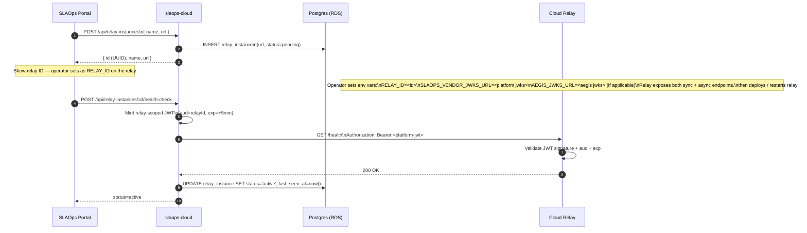
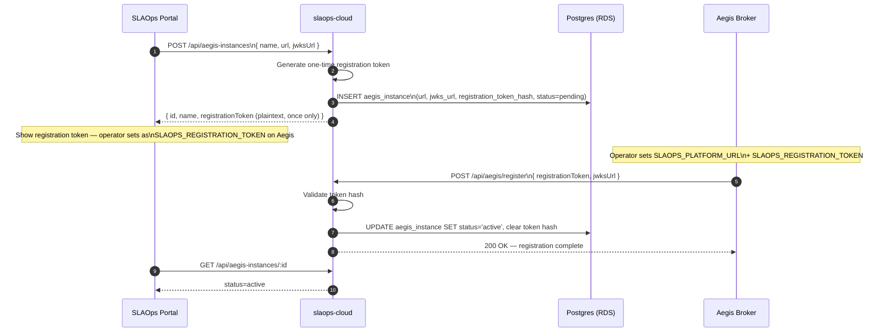
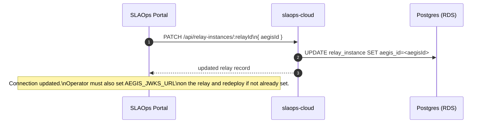
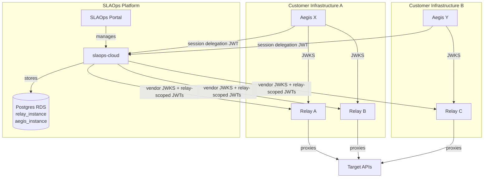

# Relay Connection Design

> **Status**: Implemented (Stage 1)
> **Author**: SLAOps Team
> **Date**: 2026-03-24
> **Related**: [component-cloud-relay.md](./component-cloud-relay.md), [aegis-token-broker-design.md](./aegis-token-broker-design.md)

## Overview

This document describes how connections and trust are established between the three runtime components:

| Component | Hosted by |
|---|---|
| **SLAOps Platform** (`slaops-cloud`) | SLAOps (vendor) |
| **Cloud Relay** (`slaops-relay`) | Customer or SLAOps-managed |
| **Aegis Broker** | Customer |

A working deployment requires all three components to know where each other lives and to mutually trust each other's signatures. This document covers:

- How that configuration is registered and stored
- What credentials/keys flow between components
- The RDS schema for storing connection state
- The Portal UI for managing connections
- What stage 1 includes and what is deferred

---

## Scope

### Stage 1 (this document)

- Multi-tenant: all connection state is namespaced by `tenant_id`
- Relay instances and Aegis instances registered via the SLAOps Portal
- Connection details stored in RDS (`slaops-cloud`)
- One Aegis instance can be linked to many Relay instances (1:N)
- One Relay instance can be linked to at most one Aegis instance (many Relays share one Aegis)
- **Private JWT authentication** for platform → relay: the platform mints short-lived JWTs signed with its vendor private key; no static secrets on the relay
- Each relay supports both **sync** (`POST /cloud-relay/proxy`) and **async** (`POST /cloud-relay/queue`) modes; mode is chosen per-request by the platform, not configured on the connection
- JWKS endpoint used for relay → Aegis JWT validation
- Portal UI for create / read / update / delete of both instance types and their mappings
- Health check / connectivity test per registered instance

### Deferred to later stages

- **API Gateway mTLS endpoints** for hardened platform ↔ relay authentication
- **Multiple Aegis instances per account** beyond the basic 1:N relay mapping
- **Relay-initiated connection registration** (relay self-registers with the platform on startup)
- **Aegis ↔ relay direct trust** (currently Aegis is only in the session-start path, not the per-request relay path)

---

## Trust model

Each pair of components needs a distinct trust mechanism:

| Direction | Mechanism | Stage 1 |
|---|---|---|
| SLAOps Platform → Relay | **Private JWT** — platform mints a short-lived, relay-scoped JWT signed with the vendor private key; relay validates against vendor JWKS | ✅ |
| Relay → SLAOps Platform | Vendor JWKS (relay validates vendor job envelope signatures) | ✅ |
| Browser → Aegis | Customer SSO IdP token | ✅ |
| Aegis → Relay (scope binding) | Delegation JWT `scopes[].relayIds` — Aegis only issues JWTs scoped to relay IDs in its configured allowlist; relay rejects JWTs whose scopes do not include its own `RELAY_ID` | ✅ |
| Aegis → SLAOps Platform | Aegis pushes session delegation JWT to platform | ✅ |
| Relay → Aegis | JWKS endpoint (relay validates delegation JWT signature against Aegis JWKS) | ✅ |
| SLAOps Platform → Aegis | No direct call in hot path (Aegis calls platform at session registration) | ✅ |
| Platform → Relay (mutual TLS) | mTLS certificate | ❌ deferred |

The dual-authorization model is preserved: **neither the SLAOps platform nor Aegis alone can cause the relay to execute a job**. The relay requires a valid vendor-signed job envelope AND a valid customer-signed session delegation JWT whose scopes include the relay's own ID.

No static secrets are stored on or distributed to the relay. All platform → relay credentials are short-lived JWTs that rotate automatically. Both Relay and Aegis are **stateless (no database)** — trust is established through configuration (env vars / config file) and cryptographic JWT validation.

---

## Platform → Relay authentication detail

When `slaops-cloud` calls a relay (job submission, status poll, health check), it attaches a short-lived **relay-scoped JWT** as a Bearer token:

```
Authorization: Bearer <platform-jwt>
```

### JWT claims

| Claim | Value | Purpose |
|---|---|---|
| `iss` | `https://api.slaops.com` | Identifies the SLAOps platform |
| `aud` | `<relay-id>` (UUID) | Scopes the token to one specific relay — tokens for relay A are rejected by relay B |
| `iat` | now | Issued-at timestamp |
| `exp` | now + 5 min | Short TTL — automatic rotation, no long-lived secret |
| `jti` | random UUID | Prevents token reuse within the TTL window |

### Relay validation steps

1. Fetch vendor JWKS from `SLAOPS_VENDOR_JWKS_URL` (cached with a short TTL; refreshed on unknown `kid`).
2. Verify JWT signature against the matching public key.
3. Verify `aud` equals `RELAY_ID` (the relay's own registered UUID).
4. Verify `exp` is in the future.
5. Optionally check `jti` against a small in-memory replay window.

The vendor private key is the same key already used to sign vendor job envelopes. The relay therefore needs only one JWKS URL and zero static secrets.

---

## Configuration each component needs

### SLAOps Platform (`slaops-cloud`)

Reads all connection state from RDS. Uses its existing vendor signing key (also used for job envelopes) to mint relay-scoped JWTs per request.

Exposes:
- Vendor JWKS endpoint (`GET /cloud-relay/.well-known/jwks.json`) — used by relays to validate both relay-scoped JWTs and vendor job envelope signatures.
- Connection registration API — used by the portal to register relay and Aegis instances.

### Cloud Relay (`slaops-relay`)

Environment variables required at deployment:

| Variable | Description |
|---|---|
| `RELAY_ID` | UUID assigned by the SLAOps platform at registration. Used to validate the `aud` claim on every inbound platform JWT. |
| `SLAOPS_VENDOR_JWKS_URL` | URL of the platform's JWKS endpoint. Used to validate both relay-scoped auth JWTs and vendor job envelope signatures. Example: `https://api.slaops.com/cloud-relay/.well-known/jwks.json` |
| `AEGIS_JWKS_URL` | URL of the linked Aegis instance's JWKS endpoint. Used to validate session delegation JWT signatures. Example: `https://aegis.customer.example.com/.well-known/jwks.json` |
| `AEGIS_REQUIRED` | `true` / `false`. When `true`, any job without a valid session delegation JWT is rejected. Default: `false` in stage 1 (Aegis optional per relay). |

No API keys. No secrets generated or distributed at registration time.

### Aegis Broker

Environment variables required at deployment:

| Variable | Description |
|---|---|
| `SLAOPS_PLATFORM_URL` | Base URL of the SLAOps platform. Used to push session delegation JWTs at session start. Example: `https://api.slaops.com` |
| `SLAOPS_REGISTRATION_TOKEN` | Short-lived token used to complete the Aegis registration handshake with the platform (generated in the portal during registration). Cleared from Aegis after the handshake completes. |
| `AEGIS_SIGNING_KEY_ID` | Key ID (`kid`) of the active signing key. Must match the entry Aegis publishes in its own JWKS. |
| `AEGIS_SIGNING_KEY` | Private key (RSA or EC) used to sign session delegation JWTs. Customer-generated and customer-held. |
| `CUSTOMER_IDP_JWKS_URL` | JWKS of the customer SSO IdP. Used to validate user tokens at session start. |

---

## RDS schema

All connection state lives in `slaops-cloud` and is stored in Postgres (Aurora Serverless v2).

### `relay_instance`

Represents a registered Cloud Relay deployment.

```sql
CREATE TABLE relay_instance (
  id           UUID PRIMARY KEY DEFAULT gen_random_uuid(),
  tenant_id    UUID NOT NULL,
  name         TEXT NOT NULL,
  url          TEXT NOT NULL,                    -- base URL of the relay
  aegis_id     UUID REFERENCES aegis_instance(id) ON DELETE SET NULL,
  status       TEXT NOT NULL DEFAULT 'pending',  -- 'pending' | 'active' | 'unreachable' | 'disabled'
  last_seen_at TIMESTAMPTZ,
  created_at   TIMESTAMPTZ NOT NULL DEFAULT now(),
  updated_at   TIMESTAMPTZ NOT NULL DEFAULT now()
);

CREATE INDEX relay_instance_tenant_idx ON relay_instance (tenant_id);
```

No API key columns, no mode column. The relay's `id` (UUID) is the only credential the relay operator needs to configure (`RELAY_ID`). The platform uses its vendor private key to mint relay-scoped JWTs on demand. Sync vs async is chosen per-request at call time.

### `aegis_instance`

Represents a registered Aegis Broker deployment.

```sql
CREATE TABLE aegis_instance (
  id                      UUID PRIMARY KEY DEFAULT gen_random_uuid(),
  tenant_id               UUID NOT NULL,
  name                    TEXT NOT NULL,
  url                     TEXT NOT NULL,     -- base URL of the Aegis service
  jwks_url                TEXT NOT NULL,     -- JWKS endpoint (used by relay + platform)
  registration_token_hash TEXT,              -- hash of the one-time registration token (cleared after handshake)
  status                  TEXT NOT NULL DEFAULT 'pending',  -- 'pending' | 'active' | 'unreachable' | 'disabled'
  last_seen_at            TIMESTAMPTZ,
  created_at              TIMESTAMPTZ NOT NULL DEFAULT now(),
  updated_at              TIMESTAMPTZ NOT NULL DEFAULT now()
);

CREATE INDEX aegis_instance_tenant_idx ON aegis_instance (tenant_id);
```

### Relationship

`relay_instance.aegis_id` is a nullable FK to `aegis_instance`. This encodes the 1:N relationship: one Aegis instance can be referenced by many relay rows; each relay references at most one Aegis.

All queries must filter by `tenant_id`. `aegis_id` on a relay must reference an `aegis_instance` belonging to the same tenant — enforced at the application layer.

---

## Aegis-Relay trust (stateless, config-driven)

Neither Aegis nor the Relay has a database. Trust between them is established through **configuration** (environment variables or a config file loaded at startup). Changes to the allowlist or JWKS URL require a restart of the affected component.

### Point 1 — Relay validates its own ID in delegation JWT scopes

The session delegation JWT issued by Aegis carries `scopes[].relayIds` — the set of relay UUIDs the user is authorized to use. When the relay receives a job envelope:

1. It validates the delegation JWT signature against `AEGIS_JWKS_URL`.
2. It checks that its own `RELAY_ID` appears in at least one entry of `scopes[].relayIds`.
3. If not present, the job is rejected — a delegation JWT issued for relay A cannot be used on relay B.

No state on the relay. The relay only needs `RELAY_ID` and `AEGIS_JWKS_URL` in its configuration.

### Point 2 — Aegis validates relay identity via configured allowlist

Aegis is configured with an allowlist of relay UUIDs it is permitted to issue delegation JWTs for. When the browser requests a session delegation JWT and specifies a `relayId`:

1. Aegis checks the requested `relayId` against its configured `ALLOWED_RELAY_IDS`.
2. If the relay ID is not in the list, Aegis rejects the session request.
3. If allowed, Aegis issues the delegation JWT with the relay UUID embedded in `scopes[].relayIds`.

No state on Aegis. The allowlist is read from configuration at startup.

### Aegis configuration for relay allowlist

| Variable | Description |
|---|---|
| `ALLOWED_RELAY_IDS` | Comma-separated list of relay UUIDs Aegis will issue delegation JWTs for. Example: `relay-uuid-a,relay-uuid-b`. Requires restart to update. |

### Operator setup flow

```
1. Register relay in SLAOps Portal → get relay UUID
2. Add relay UUID to Aegis ALLOWED_RELAY_IDS config → restart Aegis
3. Set RELAY_ID + AEGIS_JWKS_URL on relay → deploy relay
4. Link Aegis to relay in Portal (sets aegis_id FK, surfaces AEGIS_JWKS_URL to operator)
```

---

## Registration flows

### 1. Register a Relay



### 2. Register an Aegis instance



### 3. Link Aegis to a Relay



---

## End-to-end connection topology



Key observations:
- A single Aegis instance (`AegisX`) is linked to multiple relays (`RelayA`, `RelayB`). Both relays fetch their JWKS from the same Aegis endpoint.
- A separate team or environment can deploy its own Aegis (`AegisY`) with its own relay (`RelayC`).
- The SLAOps platform authenticates to every relay using short-lived relay-scoped JWTs — no static secrets distributed or stored.

---

## Portal UI

### Relay Instances page

| Action | Description |
|---|---|
| Create relay | Form: name, URL. Returns the relay UUID to set as `RELAY_ID`. No API key generated. |
| Edit relay | Update name, URL, linked Aegis instance. |
| Delete relay | Removes registration. The relay UUID is effectively invalidated — the platform will no longer mint JWTs with that `aud`. |
| Test connection | Triggers a health check (platform mints a relay-scoped JWT, calls relay `/health`). Shows last-seen timestamp and round-trip latency. |
| View linked Aegis | Shows the Aegis instance currently linked to this relay. |
| Copy relay ID | The UUID shown as a copyable field for operator use. |

### Aegis Instances page

| Action | Description |
|---|---|
| Register Aegis | Form: name, URL, JWKS URL. Returns one-time registration token. |
| Edit Aegis | Update name, URL, JWKS URL. |
| Delete Aegis | Unlinks from all relays, removes registration. |
| Test connection | Fetches JWKS URL and validates key format. Shows status. |
| View linked relays | Shows which relay instances reference this Aegis. |

### Connection health dashboard

A summary table showing all registered components, their status, and last-seen time. Color-coded:

- 🟢 Active — last seen within the health-check interval
- 🟡 Degraded — health check failing but recently active
- 🔴 Unreachable — repeated health check failures
- ⚪ Pending — not yet confirmed active (registration not complete)

---

## API endpoints (`slaops-cloud`)

### Relay instances

```
POST   /api/relay-instances                    Register a new relay
GET    /api/relay-instances                    List all relay instances
GET    /api/relay-instances/:id                Get a single relay instance
PATCH  /api/relay-instances/:id                Update name, URL, aegisId
DELETE /api/relay-instances/:id                Delete a relay instance
POST   /api/relay-instances/:id/health-check   Trigger health check
```

### Aegis instances

```
POST   /api/aegis-instances                    Register a new Aegis instance
GET    /api/aegis-instances                    List all Aegis instances
GET    /api/aegis-instances/:id                Get a single Aegis instance
PATCH  /api/aegis-instances/:id                Update name, URL, JWKS URL
DELETE /api/aegis-instances/:id                Delete an Aegis instance
POST   /api/aegis-instances/:id/health-check   Fetch JWKS and validate
```

### Aegis registration callback (called by Aegis)

```
POST   /api/aegis/register   Complete Aegis registration handshake
```

Request body:
```typescript
{
  registrationToken: string   // one-time token from portal
  jwksUrl: string             // JWKS endpoint Aegis publishes
}
```

### Vendor JWKS (public, unauthenticated)

```
GET    /cloud-relay/.well-known/jwks.json   Vendor signing public keys (for relays + Aegis)
```

---

## Key lifecycle

### Platform → Relay authentication JWTs

1. The platform mints a fresh JWT per outbound relay request (`exp` = now + 5 min).
2. Each JWT carries `aud` = the target relay's UUID — tokens cannot be reused across relays.
3. No secret is stored or distributed. Rotation is implicit: every JWT expires within minutes.
4. The signing key is the vendor private key (same key used for job envelopes). One JWKS serves both purposes.
5. **Key rotation**: the platform rotates its vendor private key, publishes the new public key in the JWKS with a new `kid`. Relays pick up the new key automatically when they refresh the JWKS (on unknown `kid` or at their normal TTL). No relay redeployment required.

### Aegis signing key

1. Customer-generated RSA or EC private key. Never leaves customer infrastructure.
2. Customer sets `AEGIS_SIGNING_KEY` and `AEGIS_SIGNING_KEY_ID` on the Aegis deployment.
3. Aegis publishes the corresponding public key at its JWKS endpoint.
4. Both `slaops-cloud` and the relay fetch the JWKS to verify session delegation JWTs.
5. **Rotation**: customer rotates the key, publishes new `kid` in JWKS, updates env var on Aegis. Old JWTs expire naturally (short TTL). No platform changes needed.

### Vendor signing key (SLAOps-controlled)

1. Held by `slaops-cloud`.
2. Published at `/cloud-relay/.well-known/jwks.json`.
3. Used to sign both **relay-scoped auth JWTs** and **vendor job envelopes**.
4. Relays verify all platform-originated signatures using this single JWKS.
5. Rotation is fully vendor-controlled; relays pick up new keys automatically on unknown `kid`.

---

## Stage 1 constraints and known limitations

| Limitation | Notes |
|---|---|
| No mTLS between platform and relay | Private JWT only. mTLS deferred — requires API Gateway MTLS endpoint configuration. |
| No automatic relay health monitoring | Health checks are manual (portal-triggered). Background polling deferred. |
| Aegis registration token is one-time only | If lost before Aegis completes the handshake, the admin must delete and re-register the Aegis instance. |
| JWKS caching on the relay is implementation-specific | Relay should cache JWKS with a short TTL (5 min) and refresh on unknown `kid`. |
| Aegis allowlist changes require restart | `ALLOWED_RELAY_IDS` is config-driven. Adding or removing a relay requires an Aegis restart. |

---

## Implementation status

### Implemented (2026-03-24)

- [x] `relay_instance` table with `tenant_id` — `apps/slaops-cloud/src/relay-instance/entities/relay-instance.entity.ts`
- [x] `aegis_instance` table with `tenant_id` — `apps/slaops-cloud/src/aegis-instance/entities/aegis-instance.entity.ts`
- [x] Relay registration flow (portal → slaops-cloud → RDS) — `RelayInstanceService.create` + `RelayInstanceController`
- [x] Aegis registration flow + one-time token handshake — `AegisInstanceService.create/register` + `AegisRegisterController`
- [x] Aegis-to-relay linking via `aegis_id` FK — `RelayInstanceService.update` accepts `aegisId`
- [x] Platform → relay private JWT authentication (vendor-signed, relay-scoped) — `VendorJwtService.mintRelayJwt` in `apps/slaops-cloud/src/vendor-jwt/`; validated by `PlatformJwtGuard` in `apps/slaops-relay/src/auth/`
- [x] Vendor JWKS endpoint (`GET /cloud-relay/.well-known/jwks.json`) — `CloudRelayController.getJwks`
- [x] Relay validates `RELAY_ID` in inbound platform JWTs (`aud` claim) — `PlatformJwtGuard` in `apps/slaops-relay`
- [x] Aegis `ALLOWED_RELAY_IDS` config allowlist — `SessionService` in `apps/slaops-aegis`; rejects delegation JWT requests for relay IDs not in `ALLOWED_RELAY_IDS`
- [x] Health endpoint on relay (`GET /health`) — `HealthController` in `apps/slaops-relay/src/health/`
- [x] Health check triggered from platform — `RelayInstanceService.healthCheck` mints JWT and calls relay `/health`
- [x] Aegis JWKS health check — `AegisInstanceService.healthCheck` fetches and validates the JWKS endpoint

### Deferred

- [ ] Portal UI: relay instances page (create, edit, delete, health check)
- [ ] Portal UI: Aegis instances page (register, edit, delete, health check)
- [ ] Portal UI: connection health dashboard
- [ ] mTLS between platform and relay (deferred — API Gateway MTLS endpoint)
- [ ] Automatic background relay health monitoring (currently portal-triggered only)
