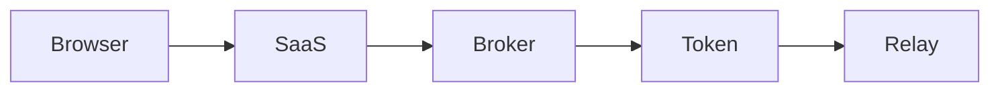
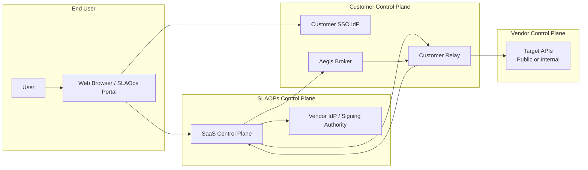
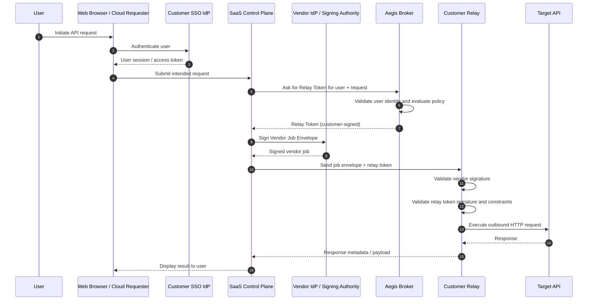
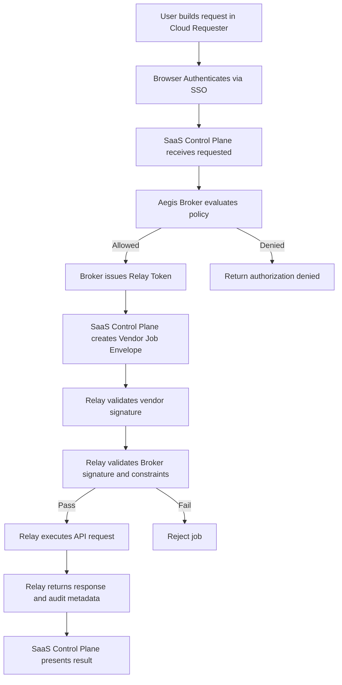
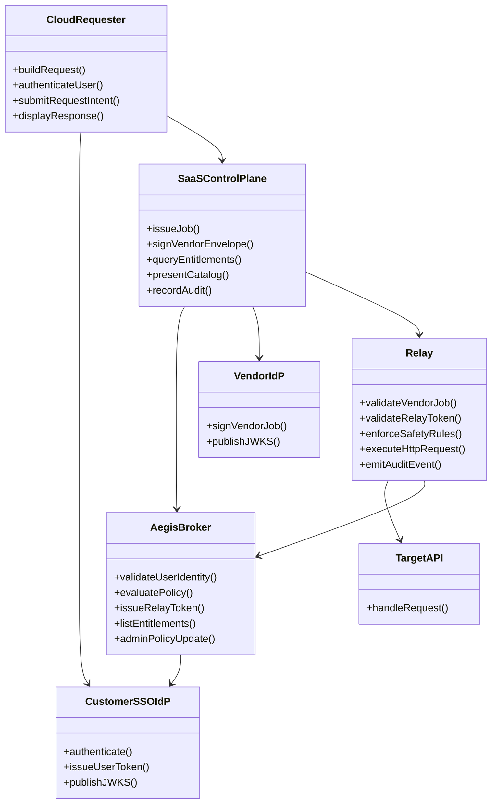
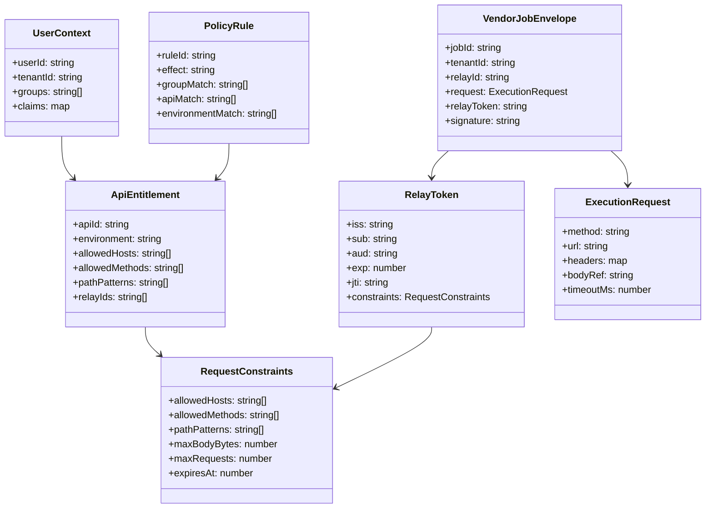
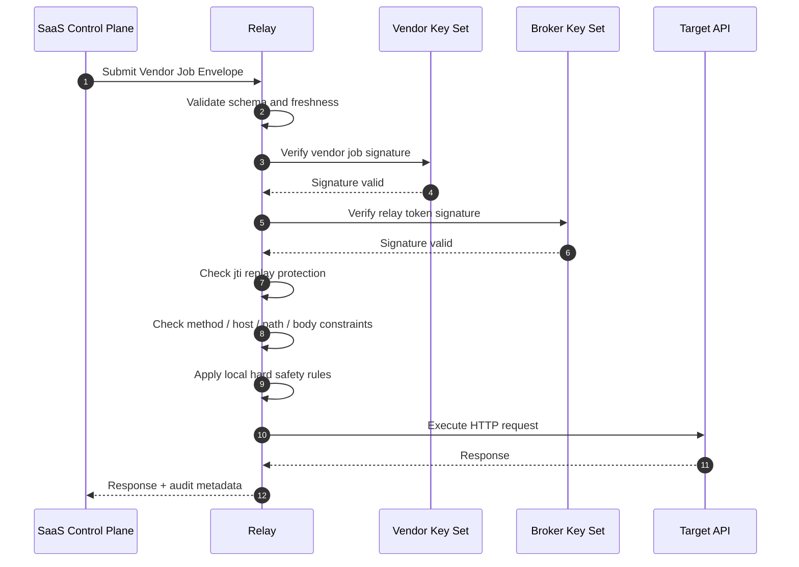
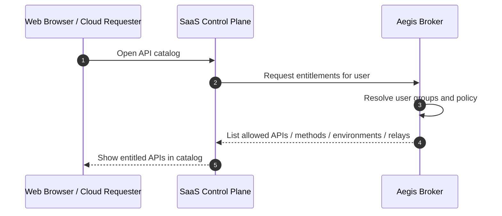

# Aegis Broker Design

```
Relay = execution engine + network boundary`
```

1.  a vendor job from your control plane
2.  a customer-issued execution grant that your control plane cannot mint or expand

Security Model

:::important
SaaS control plane is not sufficient, by itself, to make the customer relay do work.
:::

What you want is a model where your SaaS control plane is not sufficient, by itself, to make the customer relay do work.

That means the relay should require two independent approvals:

# Broker as a customer-controlled authorization service

- OpenAPI spec
- simple deploy (Docker)
- pluggable policy
- optional integration with their IdP



# Aegis Broker Design

## Broker | Relay Token Service Design

**Suggested service name:** **Aegis Broker**

Alternative names:

- Relay Authorization Service
- Execution Grant Broker
- API Entitlement Broker
- TrustBridge Broker

`Aegis Broker` works well because it suggests protection, guardrails, and policy enforcement between the SaaS control plane and the customer-hosted relay.

---

## 1. Purpose

Aegis Broker is a customer-controlled authorization and token issuance service used with a customer-hosted Relay. It integrates with the customer identity provider (SSO / IdP), evaluates customer policy, issues short-lived Relay Tokens, and allows the Relay to verify that a request was authorized by both:

1. the **vendor SaaS control plane**, and
2. the **customer-controlled broker**.

This prevents the SaaS control plane from unilaterally causing arbitrary executions through the customer Relay.

---

## 2. Goals

### Primary goals

- Allow a browser-based HTTP client to execute requests without direct browser-to-target CORS dependency.
- Ensure the customer, not the vendor, is the final authority for what APIs may be called.
- Support customer-hosted execution for internal and external APIs.
- Prevent the SaaS control plane from issuing unlimited jobs without customer authorization.
- Support enterprise SSO and group-based authorization.
- Return entitlements to the main platform so users can see what APIs they can access.

### Non-goals

- The Broker is not intended to be a general API gateway.
- The Broker does not perform the outbound HTTP request itself.
- The browser must not hold downstream API secrets.
- The vendor SaaS control plane should not hold customer downstream API secrets.

---

## 3. Key terms

### Cloud Requester

The browser-based HTTP client UI used by the end user.

### SaaS Control Plane

Vendor-hosted platform responsible for UI orchestration, request modeling, API catalog, auditing, and signed job issuance.

### SSO IdP

Customer identity provider used to authenticate the user.

### Aegis Broker

Customer-controlled authorization and relay token issuance service.

### Relay

Customer-hosted execution component that performs the outbound HTTP request to the target API.

### Vendor IdP

Vendor identity / trust issuer used by the SaaS control plane to sign vendor job envelopes.

### Relay Token

A customer-issued short-lived execution grant constraining the API call.

### Vendor Job Envelope

A vendor-signed job payload carrying the request intent and the customer-issued Relay Token.

---

## 4. High-level architecture



---

## 5. Trust model

The Relay only executes a request when all of the following are true:

1. The **Vendor Job Envelope** is valid and signed by the vendor.
2. The **Relay Token** is valid and signed by the customer Broker.
3. The requested operation is within the Relay Token constraints.
4. The Relay's local safety controls also allow it.

This creates a **dual-authorization model**:

- **Vendor approval**: request came through the official platform.
- **Customer approval**: request is allowed under customer policy.

Neither side can independently force execution.

---

## 6. Deployment model

### Recommended enterprise deployment

- **Cloud Requester** runs in the browser.
- **SaaS Control Plane** runs in vendor infrastructure.
- **Aegis Broker** runs in customer infrastructure.
- **Relay** runs in customer infrastructure.
- **SSO IdP** is customer-controlled.
- **Vendor IdP / signing authority** is vendor-controlled.

### Broker runtime options

- Lambda + API Gateway
- ECS / Kubernetes service
- Internal VM / container service
- Existing enterprise middleware service

### Broker UI options

The Broker should be designed **service-first**. UI is optional.

Supported operating models:

1. **Service-only**
   - policy via config / database / GitOps
   - group mapping managed externally
2. **Service + admin UI**
   - delegated admin
   - API entitlements management
   - access visibility
3. **Hybrid**
   - policy managed in customer systems
   - Broker exposes only APIs and entitlement lookup

---

## 7. End-to-end request flow



---

## 8. Flow diagram



---

## 9. Broker responsibilities

### Identity responsibilities

- validate user identity context from customer SSO
- resolve user groups / roles / claims
- optionally map user to workspace or environment entitlements

### Authorization responsibilities

- evaluate whether the user may access a given API or route
- evaluate constraints such as method, environment, host, path, relay, and body size
- issue short-lived Relay Tokens for allowed requests
- return user entitlements to the SaaS control plane

### Administrative responsibilities

- expose entitlement APIs
- optionally expose admin APIs / UI for policy management
- optionally sync or map a global API catalog into local entitlements

---

## 10. Relay responsibilities

- validate vendor job signature
- validate Broker Relay Token signature
- enforce token constraints
- enforce hard local safety rules
- execute outbound HTTP request
- use customer-owned downstream credentials
- produce audit events and execution logs

---

## 11. Why the Broker exists

Without the Broker, the SaaS control plane could sign jobs continuously and the Relay would have no independent customer approval mechanism.

The Broker exists so that:

- the customer controls authorization policy
- the customer signs the Relay Token
- the Relay enforces customer limits on every execution
- entitlements can be surfaced back into the SaaS platform

---

## 12. Broker UI and admin model

### Should the Broker have a UI?

**Optional, but useful.**

For many enterprises, first approval is easier if the Broker is only a service with configuration-driven policy.

A UI becomes useful when the customer wants:

- delegated admin
- self-service onboarding of APIs
- group-to-API mapping
- environment-specific visibility
- approval workflows

### Recommended rollout

#### Phase 1

- service-only Broker
- config or DB-backed policy
- entitlement APIs
- no mandatory UI

#### Phase 2

- optional admin UI
- policy editor
- entitlement management
- sync with main platform catalog

---

## 13. Main platform integration for API catalog visibility

The SaaS control plane should remain the **global catalog and user experience layer**.

The Broker should remain the **local authorization oracle**.

### Recommended split

#### SaaS Control Plane

- global API directory
- search / discovery
- request builder UI
- execution history
- audit views
- entitlement-aware presentation

#### Broker

- final local authorization decision
- token issuance
- user entitlement resolution
- mapping of customer groups to APIs / environments / methods / paths

### Example integration

The SaaS control plane queries the Broker:

- `list entitlements for this user`
- `issue a relay token for this exact request`

The platform can then show:

- APIs available to the user
- environments they may use
- methods / paths allowed
- denial reasons where appropriate

---

## 14. Architecture diagram



---

## 15. Domain model / class diagram



---

## 16. Authorization patterns

### Pattern A: Browser authenticates, control plane requests token

1. Browser authenticates user with customer SSO.
2. SaaS control plane receives request intent.
3. SaaS control plane calls Broker to get a Relay Token.
4. Broker validates user context and issues token.

### Pattern B: Browser calls Broker directly

1. Browser authenticates user with customer SSO.
2. Browser requests Relay Token from Broker.
3. Browser passes token to SaaS control plane.
4. SaaS control plane wraps token into Vendor Job Envelope.

### Recommended default

Use **Pattern A** for enterprise deployments, because it allows the Broker to remain private and reduces browser exposure.

---

## 17. Relay API contract

### 17.1 Submit execution job

**Endpoint**

```http
POST /v1/jobs/execute
```

**Headers**

```http
Content-Type: application/json
Authorization: Bearer <vendor-control-plane-token>
X-Vendor-Signature: <optional detached signature>
X-Request-Id: <uuid>
```

**Request body**

```json
{
  "jobId": "job_01JX...",
  "tenantId": "westpac-uat",
  "workspaceId": "payments-team",
  "relayId": "relay-westpac-uat-01",
  "submittedAt": "2026-03-22T10:00:00Z",
  "expiresAt": "2026-03-22T10:01:00Z",
  "request": {
    "method": "POST",
    "url": "https://api.partner.com/v1/payments",
    "headers": {
      "content-type": "application/json",
      "accept": "application/json"
    },
    "body": {
      "encoding": "utf-8",
      "contentType": "application/json",
      "content": "{\"amount\":100}"
    },
    "timeoutMs": 15000,
    "followRedirects": false
  },
  "relayToken": "<customer-signed-jwt>",
  "vendorJobSignature": "<vendor-signed-jws>"
}
```

**Response**

```json
{
  "jobId": "job_01JX...",
  "status": "SUCCEEDED",
  "response": {
    "statusCode": 200,
    "headers": {
      "content-type": "application/json"
    },
    "body": "{\"status\":\"ok\"}",
    "durationMs": 423
  },
  "audit": {
    "decision": "ALLOW",
    "ruleId": "payments-uat-post",
    "relayTokenJti": "7db3d2af-...",
    "vendorJobId": "job_01JX..."
  }
}
```

### 17.2 Get job status

```http
GET /v1/jobs/{jobId}
```

### 17.3 Health endpoint

```http
GET /v1/health
```

### 17.4 Relay metadata / capabilities

```http
GET /v1/capabilities
```

Example response:

```json
{
  "relayId": "relay-westpac-uat-01",
  "status": "ONLINE",
  "version": "1.2.0",
  "supports": {
    "mTLS": true,
    "http2": true,
    "websocket": false,
    "streaming": true
  }
}
```

---

## 18. Broker API contract

### 18.1 Issue relay token

```http
POST /v1/relay-tokens
```

**Request**

```json
{
  "tenantId": "westpac-uat",
  "user": {
    "userId": "derrick@example.com",
    "groups": ["payments-developers", "uat-users"]
  },
  "request": {
    "apiId": "partner-payments",
    "environment": "uat",
    "relayId": "relay-westpac-uat-01",
    "method": "POST",
    "url": "https://api.partner.com/v1/payments",
    "headers": {
      "content-type": "application/json"
    },
    "bodyBytes": 128
  }
}
```

**Response**

```json
{
  "relayToken": "<customer-signed-jwt>",
  "expiresAt": "2026-03-22T10:01:00Z",
  "decision": "ALLOW",
  "ruleId": "payments-uat-post"
}
```

### 18.2 List user entitlements

```http
GET /v1/entitlements?tenantId=westpac-uat&userId=derrick@example.com
```

**Response**

```json
{
  "tenantId": "westpac-uat",
  "userId": "derrick@example.com",
  "apis": [
    {
      "apiId": "partner-payments",
      "displayName": "Partner Payments API",
      "environments": ["sandbox", "uat"],
      "allowedMethods": ["GET", "POST"],
      "pathPatterns": ["/v1/payments/*"],
      "relayIds": ["relay-westpac-uat-01"]
    },
    {
      "apiId": "customer-profile",
      "displayName": "Customer Profile API",
      "environments": ["uat"],
      "allowedMethods": ["GET"],
      "pathPatterns": ["/v2/profile/*"],
      "relayIds": ["relay-westpac-uat-01"]
    }
  ]
}
```

### 18.3 Admin policy APIs

#### Upsert policy rule

```http
PUT /v1/admin/policies/{policyId}
```

#### Get policies

```http
GET /v1/admin/policies
```

#### Test decision

```http
POST /v1/admin/policy-decisions/test
```

---

## 19. Job payload format

The Vendor Job Envelope should be explicit, auditable, and signed.

### Canonical job format

```json
{
  "jobId": "job_01JX...",
  "version": "1.0",
  "tenantId": "westpac-uat",
  "workspaceId": "payments-team",
  "relayId": "relay-westpac-uat-01",
  "user": {
    "userId": "derrick@example.com",
    "displayName": "Derrick Futschik"
  },
  "request": {
    "method": "POST",
    "url": "https://api.partner.com/v1/payments",
    "headers": {
      "content-type": "application/json",
      "accept": "application/json"
    },
    "body": {
      "contentType": "application/json",
      "encoding": "utf-8",
      "content": "{\"amount\":100}"
    },
    "timeoutMs": 15000,
    "followRedirects": false,
    "maxResponseBodyBytes": 1048576
  },
  "relayToken": "<customer-signed-jwt>",
  "submittedAt": "2026-03-22T10:00:00Z",
  "expiresAt": "2026-03-22T10:01:00Z",
  "trace": {
    "requestId": "6c7b8408-...",
    "correlationId": "6c7b8408-..."
  },
  "vendorJobSignature": "<vendor-signed-jws>"
}
```

### Design notes

- `jobId` is unique per execution.
- `relayId` binds the request to a specific Relay.
- `relayToken` is opaque to the SaaS control plane except for transport.
- `expiresAt` keeps jobs short-lived.
- `vendorJobSignature` protects request integrity.
- `trace` supports auditability.

---

## 20. Relay Token format

### Suggested JWT claims

```json
{
  "iss": "https://broker.customer.example",
  "sub": "derrick@example.com",
  "aud": "relay-westpac-uat-01",
  "iat": 1774068000,
  "exp": 1774068060,
  "jti": "7db3d2af-0f90-44b2-b98e-6f17f5f9a1df",
  "tenantId": "westpac-uat",
  "workspaceId": "payments-team",
  "constraints": {
    "apiId": "partner-payments",
    "environment": "uat",
    "allowedHosts": ["api.partner.com"],
    "allowedMethods": ["POST"],
    "pathPatterns": ["/v1/payments/*"],
    "maxBodyBytes": 262144,
    "maxRequests": 1,
    "followRedirects": false
  }
}
```

### Recommended properties

- short TTL, normally 30 to 120 seconds
- `jti` replay protection
- audience bound to specific Relay
- method / host / path constrained
- body-size constrained
- optionally single-use

---

## 21. Validation flow step-by-step

### Step 1: Receive job

Relay receives `POST /v1/jobs/execute`.

### Step 2: Validate job envelope shape

Check schema, required fields, and version.

### Step 3: Validate job freshness

Reject if:

- `expiresAt` is in the past
- job timestamp outside tolerated skew

### Step 4: Validate vendor signature

Verify the `vendorJobSignature` using the vendor trust key set.

Checks:

- signature valid
- issuer trusted
- relay ID matches this Relay
- tenant binding valid
- job payload not tampered with

### Step 5: Validate Relay Token signature

Verify `relayToken` using Broker / customer trust key set.

Checks:

- signature valid
- issuer trusted
- audience equals this Relay
- token not expired
- token issued for correct tenant / workspace

### Step 6: Replay protection

Check `jti` not already used.

If single-use mode is enabled:

- store `jti`
- reject any repeat usage

### Step 7: Validate request against Relay Token constraints

Compare the requested execution against token constraints:

- method allowed
- host allowed
- path allowed
- body size within limit
- relay ID matches
- max requests not exceeded
- redirect behavior allowed

### Step 8: Apply Relay local hard safety rules

These rules are non-bypassable.

Examples:

- block localhost
- block private / loopback / link-local IPs unless explicitly allowed for private relay mode
- block metadata endpoints
- enforce protocol and port restrictions
- strip dangerous headers

### Step 9: Resolve destination and perform safety checks

Resolve DNS if required and evaluate destination safety based on local configuration.

### Step 10: Attach customer-managed downstream credentials

Relay injects the credential mode configured for this target:

- API key
- OAuth client credential token
- mTLS certificate
- internal service identity

### Step 11: Execute outbound HTTP request

Relay sends the request to the target API.

### Step 12: Capture response and audit event

Record:

- status code
- duration
- response size
- allow / deny decision
- matching policy rule
- token IDs

### Step 13: Return result

Send the response back to the SaaS control plane for presentation to the browser.

---

## 22. Detailed validation sequence diagram



---

## 23. Entitlement discovery flow



---

## 24. Policy model

### Recommended coarse-to-fine approach

#### Coarse access

Managed through customer IdP groups, such as:

- `payments-read`
- `payments-write`
- `uat-users`
- `prod-approvers`

#### Fine-grained access

Managed in Broker policy, such as:

- allowed API IDs
- allowed environments
- allowed methods
- allowed path patterns
- allowed Relay IDs
- max body size
- time windows

### Example policy rule

```json
{
  "policyId": "payments-uat-post",
  "groups": ["payments-write", "uat-users"],
  "apiId": "partner-payments",
  "environment": "uat",
  "relayIds": ["relay-westpac-uat-01"],
  "allowedHosts": ["api.partner.com"],
  "allowedMethods": ["POST"],
  "pathPatterns": ["/v1/payments/*"],
  "maxBodyBytes": 262144,
  "tokenTtlSeconds": 60,
  "singleUse": true
}
```

---

## 25. Suggested admin UI capabilities

If an admin UI is later added, recommended capabilities are:

- view APIs known from the global catalog
- map customer groups to APIs / environments
- assign Relay IDs to environments
- define path / method constraints
- test policy decisions
- inspect denied requests
- rotate Broker signing keys
- view Relay health and version

---

## 26. Security recommendations

- Use short-lived Relay Tokens.
- Prefer single-use `jti` for sensitive operations.
- Bind tokens to `relayId` and tenant.
- Keep downstream credentials only in the Relay.
- Treat Relay safety rules as immutable local controls.
- Use signed job envelopes rather than unsigned requests.
- Log metadata by default, not raw secrets or bodies.
- Separate global catalog visibility from local execution permission.

---

## 27. Recommended product positioning

### Main platform

- global API catalog
- search and discovery
- browser request builder
- execution history
- audit and reporting
- user experience and workflow

### Aegis Broker

- customer authorization authority
- token issuance service
- entitlement provider
- optional admin policy plane

### Relay

- execution engine
- credential holder
- network boundary
- policy enforcement point

---

## 28. Final recommendation

Use **Aegis Broker** as the customer-controlled authorization and Relay Token issuance service, paired with a customer-hosted Relay.

This design gives:

- strong enterprise trust boundaries
- customer control over authorization
- browser usability without target-side CORS dependency
- clean separation between vendor control plane and customer execution plane
- a path to rich entitlement-aware catalog UX in the main platform
