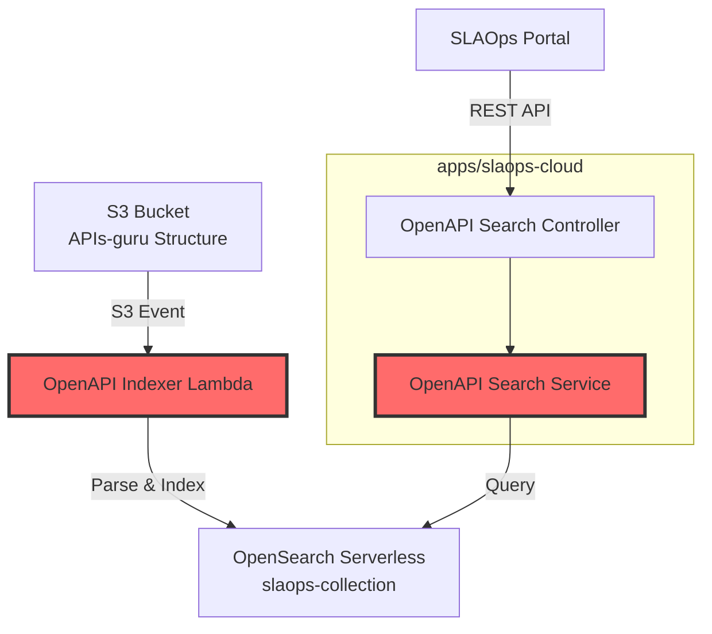
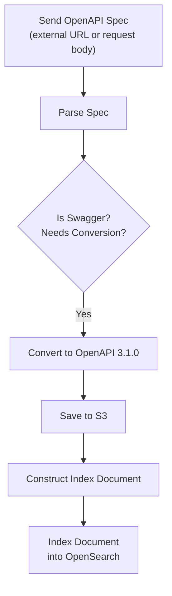
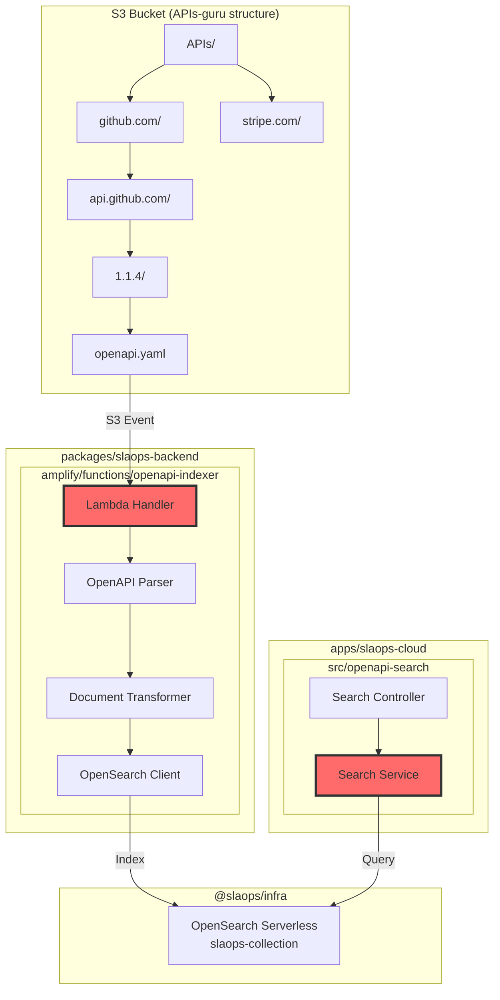
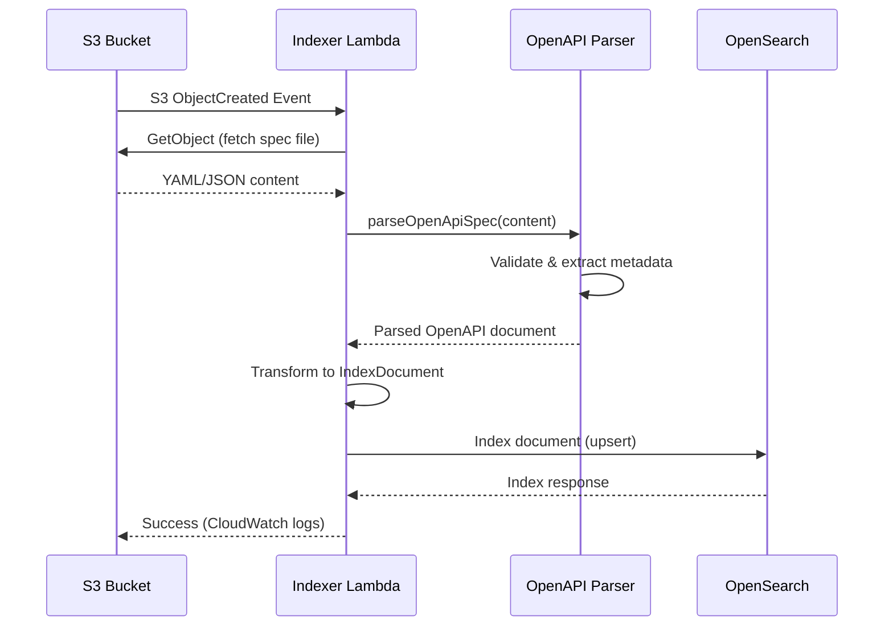
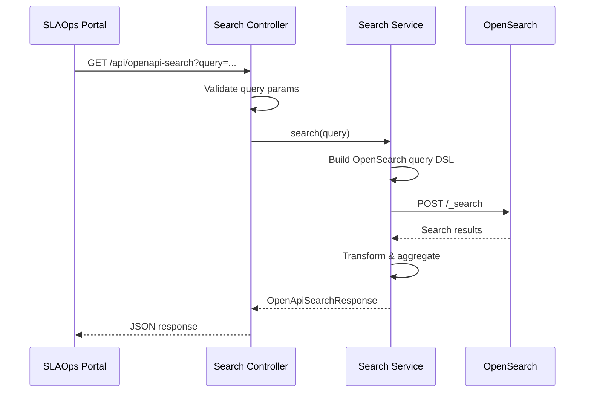

# Component Proposal: OpenAPI Directory Indexer

> **Status**: Draft
> **Author**: Derrick
> **Date**: 2025-01-21
> **Related Issue**: [Link to GitHub issue if applicable]

## Overview

### Purpose

An event-driven indexing system that automatically parses OpenAPI specifications from an S3 bucket (structured like the [APIs-guru/openapi-directory](https://github.com/APIs-guru/openapi-directory) repository) and indexes them into OpenSearch Serverless for semantic search and retrieval.

### Problem Statement

Discovering and finding relevant APIs across a large collection of OpenAPI specifications is challenging. Users need to:

- Search APIs by their descriptions and purpose (semantic search)
- Find APIs by domain/provider (e.g., `github.com`, `stripe.com`)
- Locate APIs by server locations and base URLs
- Discover APIs by specific operation ids, operation summaries, operation descriptions, paths, or HTTP methods
- Browse APIs by tags and categories

Without automated indexing, users must manually browse directories or grep through thousands of YAML/JSON files, which is slow and impractical for large API directories.

=

### Relationship to Existing Components

This component spans two existing areas:

1. **Lambda Function** in `packages/slaops-backend/amplify/functions/` - handles S3 event processing and indexing
2. **Search Service** in `apps/slaops-cloud/` - provides query API for indexed specifications



## Indexing Flow



### Methods

The following are methods which will be needed when operating on the OpenAPI spec.

| Method                    | Description                                                      | Inputs              | Outputs    |
| ------------------------- | ---------------------------------------------------------------- | ------------------- | ---------- |
| `getSpecFromS3`           | Fetch the current OpenAPI specification from S3                  | `_id`               | `spec`     |
| `getSpecFromExternalDocs` | Fetch the latest OpenAPI specification from the externalDocs URL | `_id`               | `spec`     |
| `updateSpecInS3`          | Update the OpenAPI specification in S3                           | `_id`, `spec`       | `void`     |
| `indexOperations`         | Index operations which will be used to search for the API        | `_id`, `operations` | `void`     |
| `indexMetadata`           | Index the high-level current metadata to find the API easily     | `_id`, `metadata`   | `void`     |
| `getMetadata`             | Get the metadata from the OpenAPI specification                  | `_id`               | `metadata` |
| `indexSpec`               | Index the entire OpenAPI specification (Indexing Flow)           | `_id`, `spec`       | `void`     |

## High Level Metadata

**Utility Methods**
To support `indexMetadata` there will need to be a function which takes an entire `spec` and returns the metadata which will be indexed. This will be used to index the high-level current metadata to find the API easily.

| Field       | Description                |
| ----------- | -------------------------- |
| version     | The version of the API     |
| title       | The title of the API       |
| description | The description of the API |
| tags        | The tags of the API        |

```typescript


/** Make use of **/
import { OpenAPIV3_1.Document } from "openapi-types";


/** The S3 location of an OpenAPI specification */
export type S3Location = {
  bucket: string,
  key: string,
}


/**
 * Represents the indexed metadata for an OpenAPI specification
 * This is the document schema stored in OpenSearch
 *
 * Follow Opensearch conventions such as _id
 *
 */
export interface OpenApiIndexDocument {

  /** Unique identifier: {provider}/{service}/{version} */
  _id: string

  /** Who owns and produces this API i.e. Amazon Web Services*/
  owner: string

  current: {
    provider: string
    service: string
    version: string
    title: string
    description: string
    tags: string[]
    servers: string[]
    contact: string
  }


  /** Index the high-level current


  /** Provider/domain name (e.g., 'github.com', 'stripe.com') */
  provider: string


  latestVersion:

  /** Service name within the provider */
  serviceName: string

  /** API version string */
  version: string

  /** OpenAPI specification version (e.g., '3.0.3', '3.1.0') */
  specVersion: string


  /** Sample operations for display (max 20) */
  sampleOperations: Array<{
    method: string
    path: string
    operationId?: string
    summary?: string
  }>

  /** All unique top-level paths (max 100, truncated for large APIs) */
  paths: string[]

  /** Concatenated searchable text from all operation summaries/descriptions */
  operationSearchText: string

  /** External documentation links which can be used to fetch and update the openAPI spec */
  externalDocs?: {
    url: string
    description?: string
  }

  /** S3 location of the original spec file */
  s3Location: {
    bucket: string
    key: string
  }

  /** Metadata */
  metadata: {
    indexedAt: string
    updatedAt: string
    fileSize: number
    fileFormat: 'yaml' | 'json'
  }

}

/**
 * Configuration for the OpenAPI indexer Lambda
 */
export interface IndexerConfig {
  /** OpenSearch endpoint URL */
  opensearchEndpoint: string

  /** OpenSearch index name */
  indexName: string

  /** AWS region */
  region: string

  /** Maximum file size to process (bytes) */
  maxFileSize?: number

  /** Enable debug logging */
  debug?: boolean
}

/**
 * S3 event record for Lambda trigger
 */
export interface S3EventRecord {
  bucket: string
  key: string
  size: number
  etag: string
  eventType: 'ObjectCreated' | 'ObjectRemoved'
}

/**
 * Result of indexing a single OpenAPI spec
 */
export interface IndexResult {
  success: boolean
  documentId: string
  s3Key: string
  operationCount: number
  pathCount: number
  truncated: boolean // true if paths/operations were truncated due to size
  error?: string
  duration: number
}

/**
 * Search query parameters for the search service
 */
export interface OpenApiSearchQuery {
  /** Free-text search across title, description, and operation text */
  query?: string

  /** Filter by provider/domain */
  provider?: string

  /** Filter by tags */
  tags?: string[]

  /** Filter by HTTP method (from operationStats.methods) */
  method?: string

  /** Filter by path prefix (from operationStats.pathPrefixes) */
  pathPattern?: string

  /** Filter by exact operationId */
  operationId?: string

  /** Filter by server URL pattern */
  serverPattern?: string

  /** Pagination */
  from?: number
  size?: number

  /** Sort field and order */
  sort?: {
    field: 'title' | 'provider' | 'indexedAt' | 'operationStats.total' | '_score'
    order: 'asc' | 'desc'
  }
}

/**
 * Search results response
 */
export interface OpenApiSearchResponse {
  /** Total matching documents */
  total: number

  /** Current page of results */
  hits: Array<{
    /** Document data */
    document: OpenApiIndexDocument
    /** Search relevance score */
    score: number
    /** Highlighted matches */
    highlights?: Record<string, string[]>
  }>

  /** Aggregations/facets */
  aggregations?: {
    providers: Array<{ key: string; count: number }>
    tags: Array<{ key: string; count: number }>
    methods: Array<{ key: string; count: number }>
    pathPrefixes: Array<{ key: string; count: number }>
  }

  /** Query metadata */
  took: number
}
```

### Input/Output Types

| Type                    | Purpose                    | Location                                                     |
| ----------------------- | -------------------------- | ------------------------------------------------------------ |
| `OpenApiIndexDocument`  | OpenSearch document schema | `apps/slaops-cloud/src/openapi-search/types/`                |
| `IndexerConfig`         | Lambda configuration       | `packages/slaops-backend/amplify/functions/openapi-indexer/` |
| `S3EventRecord`         | S3 event input             | `packages/slaops-backend/amplify/functions/openapi-indexer/` |
| `IndexResult`           | Indexing result            | `packages/slaops-backend/amplify/functions/openapi-indexer/` |
| `OpenApiSearchQuery`    | Search request             | `apps/slaops-cloud/src/openapi-search/dto/`                  |
| `OpenApiSearchResponse` | Search response            | `apps/slaops-cloud/src/openapi-search/dto/`                  |

## Architecture

### Component Diagram



### Data Flow - Indexing



### Data Flow - Search



### Integration Points

| Integration Point | Component               | Direction | Protocol              |
| ----------------- | ----------------------- | --------- | --------------------- |
| S3 Events         | S3 → Lambda             | Inbound   | S3 Event Notification |
| Spec Files        | S3                      | Inbound   | AWS SDK GetObject     |
| Index Documents   | OpenSearch Serverless   | Outbound  | HTTPS (AWS SigV4)     |
| Search Queries    | OpenSearch Serverless   | Inbound   | HTTPS (AWS SigV4)     |
| REST API          | slaops-cloud Controller | Inbound   | HTTP/REST             |
| Infrastructure    | @slaops/infra exports   | Reference | CloudFormation        |

## API Specification

### OpenSearch Index Mapping

```json
{
  "mappings": {
    "properties": {
      "id": { "type": "keyword" },
      "version": { "type": "keyword" },
      "specVersion": { "type": "keyword" },
      "title": {
        "type": "text",
        "analyzer": "standard",
        "fields": {
          "keyword": { "type": "keyword" }
        }
      },
      "description": {
        "type": "text",
        "analyzer": "standard"
      },
      "servers": {
        "type": "nested",
        "properties": {
          "url": { "type": "keyword" },
          "description": { "type": "text" }
        }
      },
      "tags": { "type": "keyword" },
      "operationStats": {
        "properties": {
          "total": { "type": "integer" },
          "methods": { "type": "keyword" },
          "pathPrefixes": { "type": "keyword" },
          "operationIds": { "type": "keyword" }
        }
      },
      "sampleOperations": {
        "type": "nested",
        "properties": {
          "method": { "type": "keyword" },
          "path": { "type": "keyword" },
          "operationId": { "type": "keyword" },
          "summary": { "type": "text" }
        }
      },
      "paths": { "type": "keyword" },
      "operationSearchText": {
        "type": "text",
        "analyzer": "standard"
      },
      "s3Location": {
        "properties": {
          "bucket": { "type": "keyword" },
          "key": { "type": "keyword" }
        }
      },
      "indexedAt": { "type": "date" },
      "updatedAt": { "type": "date" },
      "fileSize": { "type": "integer" },
      "fileFormat": { "type": "keyword" }
    }
  },
  "settings": {
    "number_of_shards": 2,
    "number_of_replicas": 1
  }
}
```

### Dimensionality Reduction Strategy

For APIs with hundreds or thousands of operations, we apply the following limits to keep documents searchable and performant:

| Field                         | Limit    | Strategy                                     |
| ----------------------------- | -------- | -------------------------------------------- |
| `paths`                       | Max 100  | Store first 100 unique paths                 |
| `sampleOperations`            | Max 20   | Store first 20 operations for display        |
| `operationStats.operationIds` | Max 500  | Store first 500 operation IDs                |
| `operationSearchText`         | Max 50KB | Concatenate summaries/descriptions, truncate |
| `tags`                        | No limit | Usually small, aggregate all unique tags     |

**Search text aggregation**: Instead of indexing each operation as a nested document, we concatenate all operation summaries and descriptions into a single `operationSearchText` field. This allows full-text search across all operations without the overhead of nested queries.

**Statistics for filtering**: The `operationStats` object provides aggregate data for filtering (e.g., "APIs with POST methods", "APIs with /webhooks paths") without needing to query nested documents.

### S3 Bucket Structure (APIs-guru format)

```
s3://slaops-openapi-specs/
└── APIs/
    ├── github.com/
    │   └── api.github.com/
    │       ├── 1.1.4/
    │       │   ├── openapi.yaml
    │       │   └── info.json (optional metadata)
    │       └── 1.1.3/
    │           └── openapi.yaml
    ├── stripe.com/
    │   └── api.stripe.com/
    │       └── 2023-10-16/
    │           └── openapi.json
    └── ...
```

### Field Specifications

| Field                         | Type     | Required | Description                                 | Indexing              |
| ----------------------------- | -------- | -------- | ------------------------------------------- | --------------------- |
| `id`                          | string   | Yes      | Unique ID: `[provider]/[service]/[version]` | keyword               |
| `provider`                    | string   | Yes      | Domain/provider name                        | keyword (filterable)  |
| `serviceName`                 | string   | Yes      | Service name                                | keyword               |
| `version`                     | string   | Yes      | API version                                 | keyword               |
| `title`                       | string   | Yes      | API title                                   | text + keyword        |
| `description`                 | string   | No       | Full description                            | text (searchable)     |
| `servers`                     | array    | Yes      | Server URLs                                 | nested                |
| `tags`                        | string[] | No       | All unique tags                             | keyword (facetable)   |
| `operationStats.total`        | number   | Yes      | Total operation count                       | integer               |
| `operationStats.methods`      | string[] | Yes      | Unique HTTP methods                         | keyword (filterable)  |
| `operationStats.pathPrefixes` | string[] | Yes      | First path segments                         | keyword (filterable)  |
| `operationStats.operationIds` | string[] | No       | Operation IDs (max 500)                     | keyword               |
| `sampleOperations`            | array    | No       | First 20 operations                         | nested (display only) |
| `paths`                       | string[] | Yes      | Unique paths (max 100)                      | keyword               |
| `operationSearchText`         | string   | No       | Concatenated operation text                 | text (searchable)     |
| `indexedAt`                   | date     | Yes      | Index timestamp                             | date                  |

## Implementation Details

### Key Algorithms

#### OpenAPI Parsing and Transformation

#### Search Query Building

```text
FUNCTION buildSearchQuery(params: OpenApiSearchQuery):
  query = { bool: { must: [], filter: [], should: [] } }

  // Free-text search across multiple fields
  IF params.query:
    query.bool.must.push({
      multi_match: {
        query: params.query,
        fields: [
          'title^3',              // Boost title matches
          'description^2',        // Boost description
          'operationSearchText',  // Aggregated operation text
          'tags^2'
        ],
        type: 'best_fields',
        fuzziness: 'AUTO'
      }
    })

  // Provider filter
  IF params.provider:
    query.bool.filter.push({
      term: { provider: params.provider }
    })

  // Tags filter
  IF params.tags AND params.tags.length > 0:
    query.bool.filter.push({
      terms: { tags: params.tags }
    })

  // Method filter (uses aggregated stats, not nested query)
  IF params.method:
    query.bool.filter.push({
      term: { 'operationStats.methods': params.method }
    })

  // Path prefix filter
  IF params.pathPattern:
    query.bool.filter.push({
      wildcard: { 'operationStats.pathPrefixes': params.pathPattern }
    })

  // Operation ID search
  IF params.operationId:
    query.bool.filter.push({
      term: { 'operationStats.operationIds': params.operationId }
    })

  // Add aggregations for faceting (no nested queries needed)
  aggs = {
    providers: { terms: { field: 'provider', size: 50 } },
    tags: { terms: { field: 'tags', size: 100 } },
    methods: { terms: { field: 'operationStats.methods', size: 10 } },
    pathPrefixes: { terms: { field: 'operationStats.pathPrefixes', size: 50 } }
  }

  RETURN {
    query,
    aggs,
    from: params.from || 0,
    size: params.size || 20,
    sort: buildSortClause(params.sort),
    highlight: {
      fields: {
        description: {},
        operationSearchText: {}
      }
    }
  }
```

### Edge Cases

| Case                   | Condition                                            | Handling                                             | Expected Outcome                                  |
| ---------------------- | ---------------------------------------------------- | ---------------------------------------------------- | ------------------------------------------------- |
| Invalid OpenAPI spec   | Parsing/validation fails                             | Log error, skip indexing                             | Error in CloudWatch, no document indexed          |
| Non-OpenAPI 3.x spec   | Missing `openapi: "3.x.x"`                           | Reject with error                                    | Logged, not indexed (conversion happens upstream) |
| Missing description    | `info.description` undefined                         | Generate use LLM                                     | Document indexed, low search relevance            |
| Large spec file        | Size > 10MB                                          | Skip with warning                                    | Logged, not indexed                               |
| Many operations        | 1000+ operations                                     | Apply truncation limits                              | Document indexed with truncated=true              |
| Duplicate upload       | Same S3 key re-uploaded                              | Upsert (update existing)                             | Document updated with new timestamp               |
| Delete event           | S3 ObjectRemoved                                     | Remove from index                                    | Document deleted from OpenSearch                  |
| Malformed S3 key       | Doesn't match `APIs/[provider]/[service]/[version]/` | Skip with error                                      | Logged, not indexed                               |
| OpenSearch unavailable | Connection timeout                                   | Retry with backoff (3 attempts)                      | Either succeeds or fails to DLQ                   |
| Circular $ref          | Spec has circular references                         | Use SwaggerParser.dereference with circular handling | Document indexed normally                         |

### Error Handling

```typescript
/**
 * Custom error class for indexing failures
 */
export class IndexingError extends Error {
  constructor(
    message: string,
    public readonly code: IndexingErrorCode,
    public readonly s3Key: string,
    public readonly details?: unknown,
  ) {
    super(message)
    this.name = 'IndexingError'
  }
}

export const IndexingErrorCode = {
  PARSE_ERROR: 'PARSE_ERROR',
  VALIDATION_ERROR: 'VALIDATION_ERROR',
  S3_ERROR: 'S3_ERROR',
  OPENSEARCH_ERROR: 'OPENSEARCH_ERROR',
  INVALID_PATH: 'INVALID_PATH',
  FILE_TOO_LARGE: 'FILE_TOO_LARGE',
} as const
```

### Performance Considerations

- **Lambda Memory**: 1024MB recommended for parsing large specs
- **Lambda Timeout**: 30 seconds (most specs process in < 5s)
- **Batch Processing**: Process multiple S3 events in parallel (up to 5 concurrent)
- **OpenSearch Bulk API**: Use bulk indexing when processing multiple specs
- **Caching**: Cache OpenSearch client connection across Lambda invocations
- **Search Latency**: Target < 200ms for simple queries, < 500ms for complex

## Integration Guide

### S3 Bucket Setup (in @slaops/infra)

Add the S3 bucket for OpenAPI specs:

```typescript
// packages/slaops-infra/lib/stack/openapi-bucket-stack.ts

import * as s3 from 'aws-cdk-lib/aws-s3'
import * as lambda from 'aws-cdk-lib/aws-lambda'
import * as s3n from 'aws-cdk-lib/aws-s3-notifications'

export class OpenApiBucketStack extends Stack {
  constructor(scope: Construct, id: string, props?: StackProps) {
    super(scope, id, props)

    const bucket = new s3.Bucket(this, 'OpenApiSpecsBucket', {
      bucketName: 'slaops-openapi-specs',
      versioned: true,
      encryption: s3.BucketEncryption.S3_MANAGED,
    })

    // Lambda will be created in slaops-backend
    // Event notification configured via Amplify
  }
}
```

### Lambda Function Setup

```typescript
// packages/slaops-backend/amplify/functions/openapi-indexer/resource.ts

import { defineFunction } from '@aws-amplify/backend'

export const openapiIndexer = defineFunction({
  name: 'openapi-indexer',
  entry: './handler.ts',
  timeoutSeconds: 30,
  memoryMB: 1024,
  environment: {
    OPENSEARCH_ENDPOINT: process.env.OPENSEARCH_ENDPOINT!,
    INDEX_NAME: 'openapi-specs',
  },
})
```

### Environment Variables

| Variable              | Required | Default         | Description                    |
| --------------------- | -------- | --------------- | ------------------------------ |
| `OPENSEARCH_ENDPOINT` | Yes      | N/A             | OpenSearch Serverless endpoint |
| `INDEX_NAME`          | No       | `openapi-specs` | OpenSearch index name          |
| `MAX_FILE_SIZE_MB`    | No       | `10`            | Maximum spec file size         |
| `DEBUG`               | No       | `false`         | Enable debug logging           |

## Testing Strategy

### Unit Tests

| Test Case                          | Input                         | Expected Output                                  | Priority |
| ---------------------------------- | ----------------------------- | ------------------------------------------------ | -------- |
| Parse valid OpenAPI 3.0            | Valid YAML spec               | Parsed document                                  | High     |
| Reject not supported specs         | Swagger 2.0 or invalid spec   | IndexingError                                    | High     |
| Convert Swagger 2.0 to OpenAPI 3.0 | Swagger 2.0 spec              | OpenAPI 3.0 spec                                 | High     |
| Aggregate operations               | Spec with 100 endpoints       | operationStats.total=100, methods, prefixes      | High     |
| Truncate large specs               | Spec with 1000 operations     | sampleOperations.length=20, paths.length&lt;=100 | High     |
| Build search text                  | Spec with operation summaries | Concatenated operationSearchText                 | High     |
| Extract unique tags                | Spec with duplicate tags      | Deduplicated tags                                | Medium   |
| Build search query                 | Search params                 | Valid DSL query (no nested)                      | High     |
| Handle missing description         | Spec without description      | Use AI to generate a description                 | Medium   |
| Reject invalid spec                | Malformed YAML                | IndexingError                                    | High     |
| Extract path params                | S3 key                        | provider, service, version                       | High     |

### Integration Tests

- Test S3 event → Lambda → OpenSearch flow with localstack
- Test search service against OpenSearch with test data
- Test API endpoints with supertest
- Test error handling with invalid specs

### Performance Tests

- Index 1000 specs in < 5 minutes
- Search latency < 200ms for 10k document index
- Lambda cold start < 3 seconds

### Test Coverage Target

- **Unit tests**: 90%+ coverage
- **Integration tests**: All happy paths + error cases
- **E2E tests**: Full indexing and search workflow

## Build Configuration

### Lambda Function Package

```json
{
  "name": "openapi-indexer",
  "version": "0.1.0",
  "type": "module",
  "main": "handler.js",
  "scripts": {
    "build": "esbuild handler.ts --bundle --platform=node --target=node20 --outfile=dist/handler.js",
    "test": "vitest"
  },
  "dependencies": {
    "@opensearch-project/opensearch": "^2.5.0",
    "@aws-sdk/client-s3": "^3.500.0",
    "@apidevtools/swagger-parser": "^10.1.0",
    "yaml": "^2.3.0"
  }
}
```

### slaops-cloud additions

No new package.json changes needed - add files to existing structure.

## Documentation Requirements

### Required Documentation

- [ ] README.md for Lambda function with deployment guide
- [ ] API documentation for search endpoints (auto-generated via NestJS Swagger)
- [ ] OpenSearch index mapping documentation
- [ ] S3 bucket structure documentation
- [ ] Usage examples in slaops-docs

### Code Documentation

- [ ] TSDoc comments on all exported types
- [ ] TSDoc comments on all service methods
- [ ] Inline comments for parsing logic
- [ ] OpenAPI decorators on all controller endpoints

## Rollout Plan

### Phase 1: Infrastructure (Week 1)

- [ ] Create S3 bucket in @slaops/infra
- [ ] Configure S3 event notifications
- [ ] Set up OpenSearch index mapping
- [ ] Update data access policy for Lambda role

### Phase 2: Lambda Indexer (Week 2)

- [ ] Implement OpenAPI parser
- [ ] Implement document transformer
- [ ] Implement OpenSearch indexing
- [ ] Unit tests and local testing

### Phase 3: Search Service (Week 3)

- [ ] Implement search service in slaops-cloud
- [ ] Implement search controller
- [ ] Add DTO validation
- [ ] Integration tests

### Phase 4: Testing & Deployment (Week 4)

- [ ] End-to-end testing
- [ ] Performance testing
- [ ] Deploy to staging
- [ ] Index sample APIs-guru data

### Phase 5: Production (Week 5)

- [ ] Production deployment
- [ ] Monitor indexing performance
- [ ] Documentation completion
- [ ] Portal integration (future)

## Open Questions

- [ ] **Q1: Should we support incremental sync from APIs-guru GitHub repo?**
      Options: Manual S3 upload only, or automated GitHub → S3 sync

- [ ] **Q2: How should we handle API versioning in search results?**
      Options: Show all versions, latest only, or configurable

- [ ] **Q3: Should we add vector embeddings for semantic search?**
      Future enhancement using OpenSearch k-NN

- [ ] **Q4: Rate limiting for search API?**
      Proposal: 100 req/min per user, 1000 req/min global

## Alternatives Considered

### Alternative 1: Elasticsearch instead of OpenSearch Serverless

**Pros:**

- More features, larger community
- Self-managed flexibility

**Cons:**

- Additional infrastructure to manage
- Higher operational overhead
- Already have OpenSearch Serverless provisioned

**Why not chosen**: OpenSearch Serverless is already deployed and managed by AWS.

### Alternative 2: Store specs in database instead of S3

**Pros:**

- Simpler architecture
- Direct querying without separate search

**Cons:**

- Database not optimized for full-text search
- Large YAML/JSON blobs in DB
- No faceted search capability

**Why not chosen**: OpenSearch provides better search capabilities and S3 is ideal for file storage.

### Alternative 3: Single Lambda for indexing + search

**Pros:**

- Simpler deployment
- Shared code

**Cons:**

- Different scaling requirements
- Search should be API Gateway → Lambda, not event-driven
- Separation of concerns

**Why not chosen**: Indexing and search have different triggers and scaling needs.

## References

- [OpenAPI Specification](https://spec.openapis.org/oas/latest.html)
- [APIs-guru/openapi-directory](https://github.com/APIs-guru/openapi-directory)
- [OpenSearch Serverless](https://docs.aws.amazon.com/opensearch-service/latest/developerguide/serverless.html)
- [AWS S3 Event Notifications](https://docs.aws.amazon.com/AmazonS3/latest/userguide/NotificationHowTo.html)
- [NestJS Documentation](https://docs.nestjs.com/)

## Approval

- [ ] Technical Lead: \***\*\_\_\_\_\*\***
- [ ] Architect: \***\*\_\_\_\_\*\***
- [ ] Product Owner: \***\*\_\_\_\_\*\***
- [ ] Date Approved: \***\*\_\_\_\_\*\***

---

**Template Version**: 1.0
**Last Updated**: 2025-01-21
