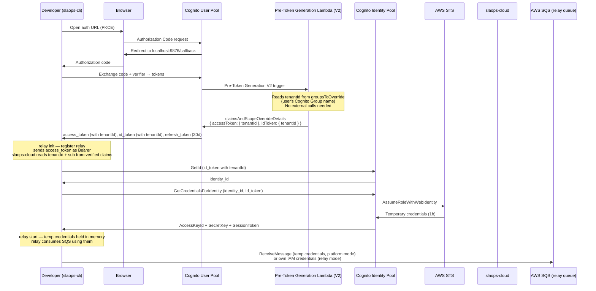

# AuthStack — User Pool & Identity Pool

**File**: `userpool.ts`
**Stack ID**: `SlaOpsAuthStack`

## Purpose

Manages all Cognito authentication infrastructure for the SLAOps platform. These resources are long-lived and deployed independently from feature stacks.

## Tenant Membership — Cognito Groups (no DynamoDB)

Tenants are represented as **Cognito User Pool Groups**. Each group's name IS the tenantId (e.g. "acme", "globex"). slaops-cloud manages group creation and user→group assignment via the Cognito Admin API; the canonical records are stored in **RDS** (not DynamoDB).

The Pre-Token Generation **V2** Lambda reads the user's groups directly from the trigger event (`event.request.groupConfiguration.groupsToOverride`) — no external API calls or database lookups are needed. It injects `tenantId` into both the **access token** and **id_token**.

Groups beginning with `slaops-internal-` are reserved for platform use and skipped during tenantId resolution.

## SQS Queue Ownership Modes

When a `local-dev` relay connection is registered, the queue can be owned in two ways:

| Mode | Who creates the queue | Who can consume | Use case |
|---|---|---|---|
| `platform` (default) | SLAOps (`RelayQueueService`) | Relay via Identity Pool → STS | Standard developer workflow |
| `relay` | Customer (manually) | Relay via customer IAM credentials | Enterprise networks that cannot reach SQS endpoints in the SLAOps account |

For `relay` mode, the customer must:
1. Create an SQS FIFO queue in their own AWS account
2. Add a queue resource policy granting `SlaOpsSqsPublishRole` (`SlaOpsSqsPublishRoleArn` export) the `sqs:SendMessage` permission
3. Provide the queue URL at relay registration (`relay init --queue-mode relay --relay-queue-url <url>`)

## Authentication Flow (slaops-cli)



## Credential Lifecycle

| Credential | TTL | Stored at rest | Refreshed by |
|---|---|---|---|
| Cognito access_token | 1 hour | `~/.slaops/credentials` (0600) | `relay start` on launch |
| Cognito id_token | 1 hour | `~/.slaops/credentials` (0600) | relay process (in memory) |
| Cognito refresh_token | **30 days** | `~/.slaops/credentials` (0600) | Developer re-runs `slaops relay init` |
| AWS temp credentials | 1 hour | **In-memory only** | relay process, automatically |
| Relay config (URLs, IDs, mode) | Permanent | `~/.slaops/config` (0644) | `relay init` re-registration |

## SQS Queue Naming and ABAC Isolation

Local relay queues (platform mode) follow the naming convention:

```
slaops-{tenantId}-local-{userId}-{relayId}.fifo
```

The IAM policy on the authenticated Identity Pool role uses ABAC principal tag variables:

```
arn:aws:sqs:*:*:slaops-${aws:PrincipalTag/tenantId}-local-${aws:PrincipalTag/userId}-*.fifo
```

| Principal tag | id_token claim | Source |
|---|---|---|
| `tenantId` | `tenantId` | Lambda-injected from Cognito Group name |
| `userId` | `sub` | Cognito User Pool subject (stable UUID) |

## CloudFormation Exports

| Export | Description |
|---|---|
| `SlaOpsUserPoolId` | Cognito User Pool ID |
| `SlaOpsUserPoolArn` | User Pool ARN |
| `SlaOpsUserPoolClientId` | PKCE client ID for slaops-cli |
| `SlaOpsUserPoolProviderName` | Cognito provider name |
| `SlaOpsUserPoolProviderUrl` | Cognito provider URL (Identity Pool login key) |
| `SlaOpsIdentityPoolId` | Identity Pool ID — for credential exchange in CLI |
| `SlaOpsIdentityPoolAuthRoleArn` | IAM role ARN for authenticated identities (relay SQS consume) |
| `SlaOpsSqsPublishRoleArn` | IAM role ARN slaops-cloud uses to publish to relay queues. Enterprise customers with relay-owned queues must grant this role `sqs:SendMessage` on their queue. |

## Infrastructure Diagram

```mermaid
graph TD
    subgraph AuthStack
        PTG[Pre-Token Generation Lambda V2<br/>slaops-pre-token-generation<br/>Reads tenantId from Cognito Groups<br/>No external calls — groups in event<br/>Injects into access_token + id_token]
        UP[Cognito User Pool<br/>slaops-users<br/>Groups = tenants<br/>V2 trigger via CfnUserPool L1 override]
        UPC[User Pool Client<br/>slaops-cli<br/>public PKCE, no secret<br/>refresh: 30d / access+id: 1h]
        IP[Cognito Identity Pool<br/>slaops_relay_identity_pool<br/>serverSideTokenCheck: true]
        PT[Principal Tag Mapping<br/>tenantId ← tenantId claim<br/>userId ← sub]
        AUTH_ROLE[IAM Role<br/>SlaOpsIdentityPoolAuthRole<br/>sqs:ReceiveMessage / DeleteMessage<br/>on slaops-{tenantId}-local-{userId}-*.fifo]
        PUB_ROLE[IAM Role<br/>SlaOpsSqsPublishRole<br/>CreateQueue + DeleteQueue + SendMessage<br/>on slaops-*-local-*.fifo (same account)<br/>SendMessage on *.fifo (cross-account, customer queues)<br/>Used by slaops-cloud Lambda]
    end

    subgraph RDS["RDS (slaops-cloud)"]
        TM[Tenant records<br/>User→tenant assignments<br/>Group names sync'd to Cognito]
    end

    TM -->|AdminAddUserToGroup| UP
    PTG -->|reads groups from event| UP
    UP --> UPC
    UP --> IP
    IP --> PT
    PT --> AUTH_ROLE
    PUB_ROLE -->|SendMessage| SQS[SQS FIFO relay queues<br/>platform: slaops-owned<br/>relay: customer-owned]

    CLI[slaops-cli] -->|PKCE auth| UPC
    CLI -->|id_token| IP
    IP -->|temp credentials| CLI
    CLI -->|consume| SQS
    Cloud[slaops-cloud] -->|publish via PUB_ROLE| SQS
    Cloud -->|verify access_token JWKS| UP
```
