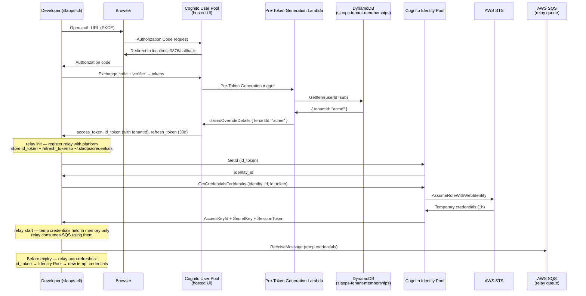

# AuthStack — User Pool & Identity Pool

**File**: `userpool.ts`
**Stack ID**: `SlaOpsAuthStack`

## Purpose

Manages all Cognito authentication infrastructure for the SLAOps platform. These resources are long-lived and deployed independently from feature stacks.

This stack provisions four related things:

1. **DynamoDB Tenant Membership Table** — the authoritative source of user→tenant assignments. Written by slaops-cloud when a user is provisioned; read only by the Lambda trigger. Users have no IAM access to this table.
2. **Pre-Token Generation Lambda** — runs on every token generation event. Reads `tenantId` from the DynamoDB table and injects it into the `id_token` via `claimsOverrideDetails`. Users cannot change this value.
3. **Cognito User Pool** — the user directory. Email-based sign-up and sign-in, TOTP MFA (optional), advanced security mode. **No `custom:tenantId` attribute** — tenantId is injected server-side by the Lambda only.
4. **User Pool Client** — a public (no secret) PKCE client used by `slaops-cli` for the browser OAuth flow. Refresh tokens live for 30 days; developers re-authenticate monthly.
5. **Cognito Identity Pool** — lets authenticated CLI users exchange their Cognito `id_token` for short-lived AWS credentials via STS `AssumeRoleWithWebIdentity`. Used by the local relay to consume from its dedicated SQS queue. Credentials expire in 1 hour and are refreshed automatically by the relay process — no AWS credentials are written to disk.

## tenantId Security Model

`tenantId` is **not** a Cognito custom attribute. This is intentional:

- Cognito custom attributes can be changed by the user via `UpdateUserAttributes`
- If `tenantId` were a custom attribute, a user could set it to another tenant's ID and gain access to that tenant's SQS queues

Instead, `tenantId` is injected server-side:

1. The Pre-Token Generation Lambda reads from `slaops-tenant-memberships` (DynamoDB) — a platform-managed table that users have no write access to
2. The Lambda injects `tenantId` into the token via `claimsOverrideDetails` — this runs inside AWS before the token is issued
3. The Identity Pool maps the Lambda-injected `tenantId` claim to the `tenantId` principal tag
4. `serverSideTokenCheck: true` on the Identity Pool means every token exchange is re-validated against the User Pool

There is no path by which a user can change their own `tenantId`.

## Authentication Flow (slaops-cli)



## Credential Lifecycle

| Credential | TTL | Stored at rest | Refreshed by |
|---|---|---|---|
| Cognito access_token | 1 hour | `~/.slaops/credentials` (0600) | `relay start` on launch |
| Cognito id_token | 1 hour | `~/.slaops/credentials` (0600) | relay process (in memory) |
| Cognito refresh_token | **30 days** | `~/.slaops/credentials` (0600) | Developer re-runs `slaops relay init` |
| AWS temp credentials | 1 hour | **In-memory only** | relay process, automatically |
| Relay config (URLs, IDs) | Permanent | `~/.slaops/config` (0644) | `relay init` re-registration |

## SQS Queue Naming and ABAC Isolation

Local relay queues follow the naming convention:

```
slaops-{tenantId}-local-{userId}-{relayId}
```

Where:
- `tenantId` — injected into the id_token by the Pre-Token Generation Lambda from the DynamoDB table
- `userId` — the Cognito User Pool `sub` (stable UUID per user)
- `relayId` — UUID assigned at relay registration (makes the name unique per relay)

**Isolation is enforced entirely by IAM** using attribute-based access control (ABAC). The Identity Pool maps two id_token claims to IAM principal tags:

| Principal tag | id_token claim | Source | Example value |
|---|---|---|---|
| `tenantId` | `tenantId` | Lambda-injected (from DynamoDB) | `acme` |
| `userId` | `sub` | Cognito standard claim | `abc-123` |

The IAM policy on the authenticated role uses these tags as resource variables:

```
arn:aws:sqs:*:*:slaops-${aws:PrincipalTag/tenantId}-local-${aws:PrincipalTag/userId}-*
```

At evaluation time, IAM substitutes the caller's principal tags. A user with `tenantId=acme` and `userId=abc-123` can only receive from queues matching `slaops-acme-local-abc-123-*`. No cross-user or cross-tenant access is possible — enforced at the AWS policy layer without any application-side check.

## CloudFormation Exports

| Export | Description |
|---|---|
| `SlaOpsUserPoolId` | Cognito User Pool ID |
| `SlaOpsUserPoolArn` | User Pool ARN |
| `SlaOpsUserPoolClientId` | PKCE client ID for slaops-cli |
| `SlaOpsUserPoolProviderName` | Cognito provider name |
| `SlaOpsUserPoolProviderUrl` | Cognito provider URL (used as Identity Pool login key) |
| `SlaOpsIdentityPoolId` | Identity Pool ID — used by CLI for credential exchange |
| `SlaOpsIdentityPoolAuthRoleArn` | IAM role ARN for authenticated identities |
| `SlaOpsTenantMembershipTableName` | DynamoDB table name — slaops-cloud writes tenant assignments here |
| `SlaOpsTenantMembershipTableArn` | DynamoDB table ARN — for slaops-cloud IAM policy attachment |

## Infrastructure Diagram

```mermaid
graph TD
    subgraph AuthStack
        DDB[DynamoDB Table<br/>slaops-tenant-memberships<br/>PK: userId → tenantId<br/>Written by slaops-cloud only]
        PTG[Pre-Token Generation Lambda<br/>slaops-pre-token-generation<br/>Reads tenantId from DynamoDB<br/>Injects via claimsOverrideDetails]
        UP[Cognito User Pool<br/>slaops-users<br/>email auth, TOTP MFA<br/>No custom:tenantId attribute]
        UPC[User Pool Client<br/>slaops-cli<br/>public PKCE, no secret<br/>refresh: 30d / access+id: 1h]
        IP[Cognito Identity Pool<br/>slaops_relay_identity_pool<br/>unauthenticated: disabled<br/>serverSideTokenCheck: true]
        PT[Principal Tag Mapping<br/>tenantId ← tenantId (Lambda claim)<br/>userId ← sub]
        ROLE[IAM Role<br/>SlaOpsIdentityPoolAuthRole<br/>sqs:ReceiveMessage / DeleteMessage<br/>on slaops-{tenantId}-local-{userId}-*<br/>via aws:PrincipalTag variables]
        RoleAttach[Identity Pool Role Attachment<br/>authenticated → ROLE]
    end

    DDB -->|GetItem| PTG
    PTG -->|claimsOverrideDetails| UP
    UP --> UPC
    UP --> IP
    IP --> PT
    PT --> ROLE
    IP --> RoleAttach
    ROLE --> RoleAttach

    STS[AWS STS] -->|AssumeRoleWithWebIdentity| ROLE
    IP -->|delegates to| STS

    CLI[slaops-cli] -->|PKCE auth| UPC
    CLI -->|id_token with tenantId claim| IP
    IP -->|temp credentials scoped to<br/>slaops-tenantId-local-userId-*| CLI
    CLI -->|AccessKeyId+SecretKey+SessionToken| SQS[SQS relay queues<br/>slaops-tenantId-local-userId-relayId]

    Cloud[slaops-cloud] -->|PutItem tenantId| DDB
```
